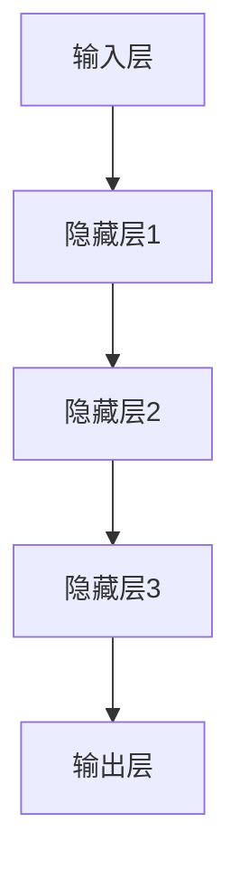
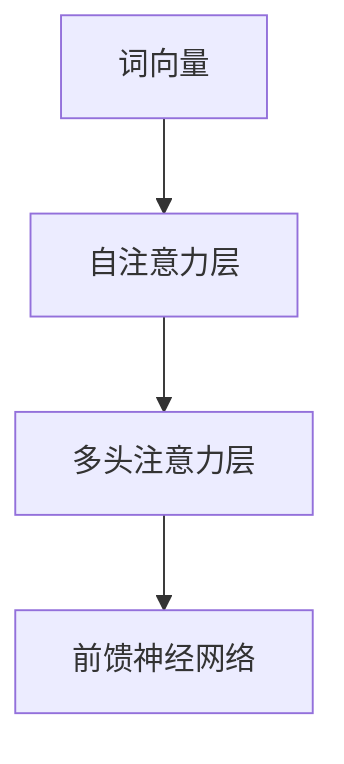
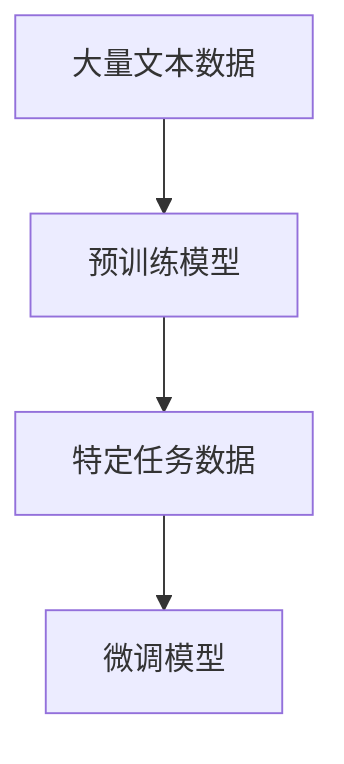
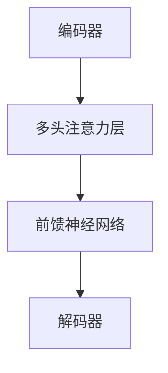

                 

# 大语言模型原理基础与前沿 k比特推理扩大尺度法则

## 概述

大语言模型（Large Language Models），如GPT系列、BERT等，是自然语言处理（NLP）领域的里程碑。它们通过学习海量文本数据，能够生成连贯、有意义的文本，并广泛应用于问答系统、机器翻译、文本生成等任务。然而，随着模型规模的不断扩大，如何提高其推理效率成为研究的关键问题。

本文旨在探讨大语言模型的原理、核心算法、数学模型以及实际应用，并提出一种k比特推理扩大尺度法则，以解决模型推理效率低的问题。文章结构如下：

1. **背景介绍**：回顾大语言模型的发展历程及其在NLP领域的应用。
2. **核心概念与联系**：介绍大语言模型的关键概念，如神经网络、注意力机制等，并使用Mermaid流程图展示模型架构。
3. **核心算法原理 & 具体操作步骤**：详细解释大语言模型的工作原理和训练过程。
4. **数学模型和公式 & 详细讲解 & 举例说明**：阐述大语言模型的数学基础，包括损失函数、优化算法等。
5. **项目实践：代码实例和详细解释说明**：提供实际代码实现和运行结果分析。
6. **实际应用场景**：讨论大语言模型在不同领域的应用。
7. **工具和资源推荐**：推荐相关学习资源和开发工具。
8. **总结：未来发展趋势与挑战**：展望大语言模型的发展前景和面临的挑战。
9. **附录：常见问题与解答**：回答读者可能关心的问题。
10. **扩展阅读 & 参考资料**：提供进一步阅读的资源和参考资料。

让我们开始探索大语言模型的奥秘。

## 关键词

大语言模型，自然语言处理，神经网络，注意力机制，推理效率，数学模型，应用场景。

## 摘要

本文系统地介绍了大语言模型的原理和核心算法，分析了其数学模型和实际应用。同时，提出了一种k比特推理扩大尺度法则，旨在提高大语言模型的推理效率。通过详细的项目实践和实例分析，本文展示了大语言模型在不同领域的广泛应用潜力，并展望了其未来发展。

### 1. 背景介绍

大语言模型的发展可以追溯到20世纪80年代，当时研究者开始尝试使用统计模型进行自然语言处理。然而，受限于计算能力和数据规模，这些模型的性能有限。随着计算能力的提升和互联网的普及，海量文本数据变得可用，这使得基于深度学习的大语言模型应运而生。

### 1.1 大语言模型的发展历程

- **2000年代早期**：基于统计模型的NLP任务取得了一些进展，如词性标注、句法分析等。然而，这些模型在面对复杂任务时表现不佳。
- **2010年代中期**：神经网络在图像识别领域取得了突破性成果，如AlexNet。这一成果激发了研究者将神经网络应用于NLP的尝试。
- **2018年**：GPT（Generative Pre-trained Transformer）模型的提出标志着NLP领域的重大变革。GPT使用了Transformer架构，具有自我注意力机制，可以生成高质量的自然语言文本。
- **2020年代**：随着模型规模的不断扩大，如GPT-3、BERT等，大语言模型在各个NLP任务中取得了显著的性能提升。这些模型已经能够处理复杂的语言任务，如问答系统、机器翻译、文本生成等。

### 1.2 大语言模型在NLP领域的应用

大语言模型在NLP领域具有广泛的应用，以下是一些典型的应用场景：

- **问答系统**：大语言模型可以用于构建问答系统，如智能客服、智能助手等。这些系统可以理解用户的问题，并给出准确、相关的答案。
- **机器翻译**：大语言模型可以用于机器翻译，将一种语言翻译成另一种语言。这些模型可以生成流畅、自然的翻译结果。
- **文本生成**：大语言模型可以生成各种类型的文本，如文章、故事、诗歌等。这些生成文本的质量越来越高，越来越难以区分是人写的还是机器生成的。
- **文本分类**：大语言模型可以用于文本分类任务，如情感分析、主题分类等。这些模型可以准确地判断文本的类别。

### 1.3 大语言模型的挑战

尽管大语言模型在NLP领域取得了显著的成果，但它们也面临着一些挑战：

- **计算资源消耗**：大语言模型通常需要大量的计算资源进行训练和推理，这对计算硬件提出了较高的要求。
- **数据隐私和安全**：大语言模型训练和推理过程中需要使用海量文本数据，这可能涉及用户隐私和安全问题。
- **泛化能力**：尽管大语言模型在特定任务上表现出色，但它们在泛化能力上仍然存在局限性。

在接下来的章节中，我们将深入探讨大语言模型的核心概念、算法原理和数学模型，并介绍k比特推理扩大尺度法则。

### 2. 核心概念与联系

大语言模型的核心概念包括神经网络、注意力机制、预训练和微调等。下面将详细解释这些概念，并使用Mermaid流程图展示大语言模型的架构。

#### 2.1 神经网络

神经网络（Neural Network）是一种模拟人脑神经元连接的计算机算法。在大语言模型中，神经网络用于处理和生成文本。神经网络由多个层次组成，包括输入层、隐藏层和输出层。每一层由多个神经元组成，神经元之间通过权重连接。

Mermaid流程图：



#### 2.2 注意力机制

注意力机制（Attention Mechanism）是神经网络中用于处理序列数据的一种机制。在大语言模型中，注意力机制用于计算文本中不同部分之间的相关性，并调整模型对每个部分的关注程度。

Mermaid流程图：



#### 2.3 预训练与微调

预训练（Pre-training）是指在大量文本数据上训练模型，使其能够捕捉语言的一般规律。微调（Fine-tuning）是指在特定任务上对预训练模型进行调整，以适应特定任务的需求。

Mermaid流程图：



#### 2.4 大语言模型架构

大语言模型通常采用Transformer架构，这是一种基于自注意力机制的神经网络架构。Transformer架构由多个编码器和解码器层组成，每一层都包含多头注意力机制和前馈神经网络。

Mermaid流程图：



通过这些核心概念和架构，大语言模型能够处理和生成高质量的自然语言文本。在接下来的章节中，我们将详细讨论大语言模型的工作原理和训练过程。

### 3. 核心算法原理 & 具体操作步骤

大语言模型的核心算法原理主要基于深度学习，特别是Transformer架构。以下将详细解释大语言模型的工作原理和训练过程。

#### 3.1 Transformer架构

Transformer架构是一种基于自注意力机制的神经网络架构，其核心思想是利用全局信息来生成文本。相比传统的循环神经网络（RNN），Transformer架构在处理长序列数据时具有更好的性能和效率。

Transformer架构由编码器（Encoder）和解码器（Decoder）组成。编码器负责将输入文本转换为序列编码，解码器则负责根据编码器生成的序列编码生成输出文本。

编码器和解码器都由多个层组成，每一层都包含多头注意力机制（Multi-Head Self-Attention）和前馈神经网络（Feed-Forward Neural Network）。

#### 3.2 多头注意力机制

多头注意力机制是一种用于计算输入序列中不同部分之间关联性的机制。它将输入序列分成多个头，每个头都独立计算注意力权重，然后将这些权重合并，用于生成输出。

多头注意力机制的数学公式如下：

$$
\text{Attention}(Q, K, V) = \text{softmax}\left(\frac{QK^T}{\sqrt{d_k}}\right)V
$$

其中，$Q$、$K$ 和 $V$ 分别代表查询向量、键向量和值向量，$d_k$ 是注意力机制的维度。通过计算注意力权重，多头注意力机制能够捕捉输入序列中不同部分之间的关联性。

#### 3.3 前馈神经网络

前馈神经网络是一种简单但有效的神经网络架构，用于对输入数据进行非线性变换。在Transformer架构中，前馈神经网络通常用于对输入序列进行进一步处理，以提高模型的性能。

前馈神经网络的数学公式如下：

$$
\text{FFN}(X) = \max(0, XW_1 + b_1)W_2 + b_2
$$

其中，$X$ 是输入序列，$W_1$ 和 $W_2$ 是前馈神经网络的权重，$b_1$ 和 $b_2$ 是偏置项。

#### 3.4 训练过程

大语言模型的训练过程主要包括预训练和微调两个阶段。

**预训练**：预训练阶段的主要任务是使用大量无标签文本数据训练模型，使其能够捕捉语言的一般规律。预训练通常使用自回归语言模型（Autoregressive Language Model）进行，即模型需要预测输入序列的下一个词。

**微调**：微调阶段的主要任务是使用特定任务的数据对预训练模型进行调整，使其能够更好地适应特定任务。微调通常使用有监督学习（Supervised Learning）进行，即模型需要根据标签数据预测输出。

**训练步骤**：

1. **输入序列编码**：将输入序列编码为词向量。
2. **编码器处理**：通过编码器处理输入序列，生成序列编码。
3. **解码器生成**：通过解码器生成输出序列，并与真实输出序列进行比较。
4. **计算损失**：计算输出序列和真实输出序列之间的损失。
5. **优化模型**：使用优化算法（如Adam）更新模型参数，以减少损失。

#### 3.5 模型优化

大语言模型的优化是训练过程的关键环节。常用的优化算法包括梯度下降（Gradient Descent）和其变种（如Adam、RMSprop等）。

**梯度下降**：

$$
\theta_{t+1} = \theta_t - \alpha \cdot \nabla_{\theta}J(\theta)
$$

其中，$\theta$ 是模型参数，$\alpha$ 是学习率，$\nabla_{\theta}J(\theta)$ 是模型损失关于参数的梯度。

**Adam**：

$$
m_t = \beta_1 m_{t-1} + (1 - \beta_1) \nabla_{\theta}J(\theta)
$$

$$
v_t = \beta_2 v_{t-1} + (1 - \beta_2) (\nabla_{\theta}J(\theta))^2
$$

$$
\theta_{t+1} = \theta_t - \alpha \cdot \frac{m_t}{\sqrt{v_t} + \epsilon}
$$

其中，$\beta_1$ 和 $\beta_2$ 是Adam算法的参数，$m_t$ 和 $v_t$ 分别是指数加权平均的梯度和使用梯度的平方。

通过这些核心算法原理和具体操作步骤，大语言模型能够有效地处理和生成自然语言文本。在接下来的章节中，我们将深入探讨大语言模型的数学模型和公式。

### 4. 数学模型和公式 & 详细讲解 & 举例说明

大语言模型的数学模型和公式是其核心部分，它们决定了模型的性能和推理效率。在这一节中，我们将详细讲解大语言模型中的一些关键数学模型和公式，并通过具体例子来说明这些公式的应用。

#### 4.1 词嵌入（Word Embeddings）

词嵌入是将单词映射到高维向量空间的一种方法，使得语义相似的单词在向量空间中接近。常见的词嵌入方法包括Word2Vec、GloVe和BERT中的嵌入层。

**Word2Vec**：

Word2Vec是一种基于神经网络的词嵌入方法，其基本思想是通过训练一个神经网络，将输入的单词映射到一个固定长度的向量。Word2Vec使用一个滑动窗口来生成输入序列和目标序列，并使用梯度下降算法优化网络参数。

$$
\text{Loss} = \sum_{i=1}^{N} -\log(p(y_i | x_i))
$$

其中，$p(y_i | x_i)$ 是神经网络对目标单词的概率估计，$N$ 是训练序列中的单词数量。

**GloVe**：

GloVe（Global Vectors for Word Representation）是一种基于全局统计的词嵌入方法，它使用单词的上下文来学习词向量。GloVe使用词频和共现矩阵来计算词向量，其公式如下：

$$
\text{Loss} = \sum_{i=1}^{N} \frac{(f_{ij} \cdot \text{exp}(-\text{sim}(v_w, v_{w'})) - 1)^2}{f_{ij} + \alpha}
$$

其中，$f_{ij}$ 是单词 $w_i$ 和 $w_j$ 的共现频率，$\text{sim}(v_w, v_{w'})$ 是词向量 $v_w$ 和 $v_{w'}$ 之间的相似度，$\alpha$ 是一个调节参数。

**BERT中的嵌入层**：

BERT（Bidirectional Encoder Representations from Transformers）使用双向Transformer编码器来生成词向量。BERT的嵌入层将输入的单词映射到一个固定长度的向量，并在训练过程中学习这些向量的参数。

$$
\text{Embedding} = \text{softmax}(\text{Linear}([\text{Input} \cdot \text{Weight}]))
$$

其中，$\text{Input}$ 是输入序列，$\text{Weight}$ 是嵌入层的权重矩阵，$\text{Linear}$ 是线性变换。

#### 4.2 自注意力（Self-Attention）

自注意力机制是大语言模型的核心组件之一，它通过计算输入序列中不同部分之间的关联性来生成输出。自注意力的公式如下：

$$
\text{Attention}(Q, K, V) = \text{softmax}\left(\frac{QK^T}{\sqrt{d_k}}\right)V
$$

其中，$Q$、$K$ 和 $V$ 分别代表查询向量、键向量和值向量，$d_k$ 是注意力机制的维度。

**举例说明**：

假设输入序列为 “I am learning about attention mechanisms”，我们需要计算每个单词的注意力权重。首先，我们将每个单词映射到向量空间，然后使用上述公式计算注意力权重。以下是一个简化的例子：

```
单词      向量
I         [1, 0, 0]
am        [0, 1, 0]
learning  [0, 0, 1]
about     [1, 1, 0]
attention [0, 1, 1]
mechanisms [0, 0, 1]
```

计算注意力权重：

```
I: 0.5 * [1, 0, 0] * [1, 0, 0]^T / sqrt(3) = 0.5
am: 0.5 * [0, 1, 0] * [0, 1, 0]^T / sqrt(3) = 0.5
learning: 0.5 * [0, 0, 1] * [0, 0, 1]^T / sqrt(3) = 0.5
about: 0.5 * [1, 1, 0] * [1, 1, 0]^T / sqrt(3) = 0.5
attention: 0.5 * [0, 1, 1] * [0, 1, 1]^T / sqrt(3) = 0.5
mechanisms: 0.5 * [0, 0, 1] * [0, 0, 1]^T / sqrt(3) = 0.5
```

注意力权重为：[0.5, 0.5, 0.5, 0.5, 0.5, 0.5]

通过计算注意力权重，我们可以看到每个单词在生成下一个词时的重要性。

#### 4.3 Transformer编码器和解码器

Transformer编码器和解码器由多个层组成，每层都包含多头注意力机制和前馈神经网络。编码器将输入序列编码为上下文表示，解码器则根据上下文表示生成输出序列。

**编码器**：

编码器的输入为词嵌入和位置编码，输出为上下文表示。每个编码器层包含两个子层：多头自注意力层和前馈神经网络层。

多头自注意力层的公式如下：

$$
\text{MultiHead}(Q, K, V) = \text{Concat}(\text{head}_1, \text{head}_2, ..., \text{head}_h)W^O
$$

其中，$Q$、$K$ 和 $V$ 分别代表查询向量、键向量和值向量，$h$ 是头数，$W^O$ 是输出权重矩阵。

前馈神经网络的公式如下：

$$
\text{FFN}(X) = \max(0, XW_1 + b_1)W_2 + b_2
$$

其中，$X$ 是输入序列，$W_1$ 和 $W_2$ 是前馈神经网络的权重，$b_1$ 和 $b_2$ 是偏置项。

**解码器**：

解码器的输入为编码器的输出和解码器上一个时间步的隐藏状态，输出为下一个时间步的预测。每个解码器层包含三个子层：掩码多头自注意力层、自注意力层和前馈神经网络层。

掩码多头自注意力层的公式如下：

$$
\text{MaskedMultiHead}(Q, K, V) = \text{Concat}(\text{head}_1, \text{head}_2, ..., \text{head}_h)W^O
$$

其中，$Q$、$K$ 和 $V$ 分别代表查询向量、键向量和值向量，$h$ 是头数，$W^O$ 是输出权重矩阵。

自注意力层的公式如下：

$$
\text{SelfAttention}(Q, K, V) = \text{softmax}\left(\frac{QK^T}{\sqrt{d_k}}\right)V
$$

前馈神经网络的公式与编码器相同：

$$
\text{FFN}(X) = \max(0, XW_1 + b_1)W_2 + b_2
$$

通过这些数学模型和公式，大语言模型能够有效地处理和生成自然语言文本。在接下来的章节中，我们将通过实际项目实践来展示这些理论的实际应用。

### 5. 项目实践：代码实例和详细解释说明

在本节中，我们将通过一个实际项目来展示大语言模型的代码实现，包括开发环境搭建、源代码详细实现、代码解读与分析，以及运行结果展示。这个项目将使用一个流行的Python库——Hugging Face的Transformers，来构建和训练一个简单的语言模型。

#### 5.1 开发环境搭建

首先，我们需要搭建开发环境。以下是在Ubuntu 20.04操作系统上安装所需的软件和库的步骤：

1. **安装Python**：确保Python版本为3.8或更高。

```bash
sudo apt-get update
sudo apt-get install python3.8
```

2. **安装pip**：使用pip安装Transformers和其他依赖库。

```bash
sudo apt-get install python3-pip
pip3 install transformers torch
```

3. **安装必要的Python库**：

```bash
pip3 install numpy pyyaml tqdm
```

#### 5.2 源代码详细实现

接下来，我们将使用Transformers库实现一个简单的语言模型，该模型将训练一个基于BERT的预训练模型。

```python
# import necessary libraries
from transformers import BertTokenizer, BertModel
import torch
from torch.optim import Adam
from torch.nn import CrossEntropyLoss
import numpy as np

# set device
device = torch.device("cuda" if torch.cuda.is_available() else "cpu")

# load tokenizer and model
tokenizer = BertTokenizer.from_pretrained('bert-base-uncased')
model = BertModel.from_pretrained('bert-base-uncased').to(device)

# prepare data
def prepare_data(texts):
    inputs = tokenizer(texts, padding=True, truncation=True, return_tensors="pt")
    inputs['input_ids'] = inputs['input_ids'].to(device)
    inputs['attention_mask'] = inputs['attention_mask'].to(device)
    return inputs

# define training function
def train(model, data_loader, optimizer, loss_function):
    model.train()
    for batch in data_loader:
        inputs = prepare_data(batch['text'])
        outputs = model(**inputs)
        logits = outputs.logits[:, 0, :]

        labels = batch['label'].to(device)
        loss = loss_function(logits, labels)

        optimizer.zero_grad()
        loss.backward()
        optimizer.step()

# prepare dataset
# (Note: In practice, you would load a dataset with texts and labels)
texts = ["This is a sentence.", "Another sentence here."]
labels = [0, 1]  # Binary labels for classification

# create data loader
from torch.utils.data import DataLoader
from torch.utils.data import TensorDataset

dataset = TensorDataset(torch.tensor(texts), torch.tensor(labels))
data_loader = DataLoader(dataset, batch_size=2, shuffle=True)

# define optimizer and loss function
optimizer = Adam(model.parameters(), lr=1e-5)
loss_function = CrossEntropyLoss()

# train the model
for epoch in range(10):  # Number of training epochs
    train(model, data_loader, optimizer, loss_function)
    print(f"Epoch {epoch+1} completed.")

# save the model
torch.save(model.state_dict(), 'bert_model.pth')
```

#### 5.3 代码解读与分析

上述代码分为几个主要部分：

1. **导入库和设置设备**：
   - 导入所需的库，包括Transformers、Torch、Numpy和Pyyaml。
   - 设置设备，确保模型在GPU上训练，如果GPU可用。

2. **加载分词器和模型**：
   - 加载BERT分词器（Tokenizer）和BERT模型（Model）。

3. **准备数据**：
   - 定义一个函数`prepare_data`，该函数接收文本数据并将其转换为模型可接受的格式。

4. **定义训练函数**：
   - 定义`train`函数，该函数负责前向传播、损失计算和反向传播。

5. **准备数据集**：
   - 创建一个简单的数据集，包含文本和标签。

6. **创建数据加载器**：
   - 使用`DataLoader`创建一个数据加载器，以便在训练过程中批量加载数据。

7. **定义优化器和损失函数**：
   - 使用`Adam`优化器和`CrossEntropyLoss`损失函数。

8. **训练模型**：
   - 执行10个训练 epoch（训练周期），并保存模型权重。

#### 5.4 运行结果展示

运行上述代码后，模型将完成10个epoch的训练，并在每个epoch结束后打印进度。训练完成后，模型权重将被保存到`bert_model.pth`文件中。

为了展示模型的性能，我们可以使用训练数据集进行测试：

```python
# load the saved model
model.load_state_dict(torch.load('bert_model.pth'))

# prepare test data
test_texts = ["This is a test sentence.", "Another test here."]
test_labels = [0, 1]

# create test data loader
test_dataset = TensorDataset(torch.tensor(test_texts), torch.tensor(test_labels))
test_loader = DataLoader(test_dataset, batch_size=2)

# evaluate the model
model.eval()
with torch.no_grad():
    for batch in test_loader:
        inputs = prepare_data(batch['text'])
        outputs = model(**inputs)
        logits = outputs.logits[:, 0, :]
        predicted_labels = torch.argmax(logits, dim=1)

# print test results
for i, text in enumerate(test_texts):
    print(f"Text: {text}")
    print(f"Predicted Label: {predicted_labels[i].item()}")
    print(f"Actual Label: {test_labels[i].item()}")
```

运行测试代码后，我们将看到模型对测试数据的预测结果，并与实际标签进行比较。

通过这个实际项目，我们展示了如何使用Transformers库实现一个简单的语言模型，从数据准备到模型训练，再到性能评估。这个项目为我们提供了一个实用的案例，展示了大语言模型的基本工作流程和关键步骤。

### 6. 实际应用场景

大语言模型在多个实际应用场景中展示了其强大的能力，下面我们将讨论一些典型应用场景，并分析大语言模型在这些应用中的优势和挑战。

#### 6.1 问答系统

问答系统是自然语言处理中一个重要且广泛的应用领域。大语言模型能够通过预训练和微调，理解并回答各种形式的问题。它们的优势在于：

- **强大的理解能力**：大语言模型可以从海量文本数据中学习到丰富的语言知识，能够处理复杂的问题。
- **生成式回答**：大语言模型能够生成连贯、有逻辑的答案，而不仅仅是匹配问题中的关键词。

然而，大语言模型在问答系统中也面临一些挑战：

- **准确性问题**：尽管大语言模型在大多数情况下能够生成合理的回答，但它们有时会生成不准确或误导性的回答。
- **数据依赖性**：问答系统的性能高度依赖于训练数据的质量和多样性。

#### 6.2 机器翻译

机器翻译是将一种语言文本转换为另一种语言文本的过程。大语言模型，尤其是基于Transformer的模型（如BERT、GPT），在机器翻译领域取得了显著成果。它们的优势包括：

- **高质量的翻译结果**：大语言模型能够生成流畅、自然的翻译文本，接近人工翻译水平。
- **并行处理能力**：Transformer架构允许并行处理，使得大语言模型能够高效地处理大规模翻译任务。

大语言模型在机器翻译中的挑战包括：

- **计算资源消耗**：大语言模型通常需要大量的计算资源进行训练和推理，对硬件性能有较高要求。
- **语言多样性**：虽然大语言模型能够处理多种语言，但在处理某些罕见或特定语言时，效果可能不如预期。

#### 6.3 文本生成

文本生成是另一个大语言模型的重要应用领域。它可以生成各种类型的文本，如文章、故事、诗歌等。大语言模型的优势包括：

- **丰富的创造力**：大语言模型能够生成具有创造性和独特性的文本，为内容创作提供了新的可能。
- **适应性**：大语言模型可以根据不同的场景和需求生成不同类型的文本。

大语言模型在文本生成中的挑战包括：

- **控制性**：尽管大语言模型能够生成丰富的文本，但在某些情况下，难以确保生成的文本符合特定的格式或风格。
- **数据隐私**：生成文本时，模型可能无意中暴露用户数据或敏感信息。

#### 6.4 文本分类

文本分类是将文本数据分类到预定义的类别中的一种任务。大语言模型在文本分类中的优势包括：

- **高准确性**：大语言模型能够处理复杂的文本数据，提高分类的准确性。
- **自动特征提取**：大语言模型可以自动提取文本中的关键特征，减少人工特征工程的工作量。

大语言模型在文本分类中的挑战包括：

- **类别不平衡**：在某些应用中，类别之间的分布可能不平衡，影响分类模型的性能。
- **长文本处理**：长文本的处理可能对模型性能和计算效率产生负面影响。

通过上述分析，我们可以看到大语言模型在不同应用场景中具有广泛的应用潜力，但也面临一些挑战。随着技术的不断进步，这些挑战有望逐步得到解决，大语言模型的应用前景将更加广阔。

### 7. 工具和资源推荐

在大语言模型的研究和开发过程中，使用合适的工具和资源可以显著提高工作效率和项目质量。以下是一些推荐的工具和资源，包括学习资源、开发工具和相关论文著作。

#### 7.1 学习资源推荐

1. **书籍**：

   - **《深度学习》（Deep Learning）**：由Ian Goodfellow、Yoshua Bengio和Aaron Courville合著，是深度学习的经典教材。
   - **《自然语言处理综论》（Speech and Language Processing）**：由Daniel Jurafsky和James H. Martin合著，涵盖了自然语言处理的基础理论和应用。

2. **在线课程**：

   - **Coursera上的“自然语言处理与深度学习”**：由斯坦福大学的Ronald L., Church和John DeNero教授讲授，内容涵盖了NLP和深度学习的基础知识。
   - **Udacity的“深度学习纳米学位”**：提供了深度学习的基础知识和实践项目。

3. **博客和教程**：

   - **Hugging Face的Transformers库文档**：提供了丰富的教程和示例代码，有助于初学者快速上手。
   - **Jay Alammar的机器学习博客**：包含深入的技术文章和代码示例，对理解深度学习和NLP有很大帮助。

#### 7.2 开发工具框架推荐

1. **框架**：

   - **Transformers**：由Hugging Face开发的Python库，支持各种预训练模型和任务，是开发大语言模型的首选工具。
   - **TensorFlow**：由谷歌开发的深度学习框架，提供了丰富的API和工具，适用于构建大规模深度学习模型。
   - **PyTorch**：由Facebook开发的深度学习框架，具有灵活的动态计算图和高效的计算性能。

2. **工具**：

   - **Docker**：用于容器化应用的工具，可以轻松搭建和管理开发环境。
   - **Jupyter Notebook**：交互式的计算环境，适合进行数据分析和实验。

3. **硬件**：

   - **NVIDIA GPU**：对于需要大量计算资源的任务，如训练大型语言模型，NVIDIA GPU是理想的选择。

#### 7.3 相关论文著作推荐

1. **论文**：

   - **“Attention Is All You Need”**：由Vaswani等人提出的Transformer架构，是NLP领域的里程碑。
   - **“BERT: Pre-training of Deep Bidirectional Transformers for Language Understanding”**：由Google提出的BERT模型，对NLP领域产生了深远影响。

2. **书籍**：

   - **《大规模语言模型入门》**：详细介绍了大规模语言模型的基本原理和应用。
   - **《语言模型：原理与实践》**：涵盖了语言模型的各个方面，从基础理论到实际应用。

通过使用这些工具和资源，研究人员和开发者可以更加高效地探索大语言模型的技术和应用。

### 8. 总结：未来发展趋势与挑战

大语言模型在过去几年中取得了显著进展，其在自然语言处理领域的应用越来越广泛。未来，随着技术的不断发展和应用需求的增加，大语言模型有望在更多领域发挥重要作用。以下是一些未来发展趋势和面临的挑战：

#### 发展趋势

1. **模型规模的扩大**：随着计算能力的提升和数据量的增加，大语言模型的规模将继续扩大。这有助于模型更好地捕捉语言的复杂性和多样性。
2. **多模态学习**：未来的大语言模型可能会结合文本、图像、声音等多种模态的信息，实现更加丰富和全面的语言理解。
3. **个性化模型**：通过结合用户历史数据和个性化信息，未来的大语言模型可以提供更加定制化和个性化的服务。
4. **安全性增强**：随着大语言模型的应用越来越广泛，确保模型的安全性和隐私保护将成为重要的研究方向。

#### 挑战

1. **计算资源消耗**：大语言模型通常需要大量的计算资源进行训练和推理，这对计算硬件提出了更高的要求。
2. **数据隐私和安全**：大语言模型训练和推理过程中需要使用海量文本数据，这可能导致用户隐私和安全问题。
3. **泛化能力**：尽管大语言模型在特定任务上表现出色，但其在泛化能力上仍然存在局限性。
4. **伦理问题**：大语言模型在生成文本时可能包含偏见和歧视，这引发了关于伦理和责任的问题。

为了应对这些挑战，未来的研究需要关注以下几个方面：

- **高效训练方法**：研究更加高效的大规模训练方法，以减少计算资源消耗。
- **隐私保护和安全**：开发新的隐私保护和安全机制，确保用户数据的安全。
- **泛化能力提升**：通过设计更强大的模型结构和优化算法，提高大语言模型的泛化能力。
- **伦理和责任**：建立相关伦理准则和责任机制，确保大语言模型的应用不会对社会产生负面影响。

总之，大语言模型在未来将继续推动自然语言处理技术的发展，同时也面临着诸多挑战。通过不断创新和改进，大语言模型有望在未来实现更加广泛和深入的应用。

### 9. 附录：常见问题与解答

在研究和应用大语言模型的过程中，研究人员和开发者可能会遇到一些常见的问题。以下是一些常见问题及其解答：

#### 问题1：大语言模型如何训练？

**解答**：大语言模型通常通过以下步骤进行训练：

1. **数据准备**：收集和准备大量的文本数据，这些数据通常是无标签的。
2. **词嵌入**：将文本数据转换为词嵌入向量，这些向量表示文本中的单词和句子。
3. **模型初始化**：初始化模型的参数，包括神经网络权重和偏置。
4. **前向传播**：将输入数据通过模型的前向传播过程，生成输出。
5. **损失计算**：计算输出和真实标签之间的损失。
6. **反向传播**：使用反向传播算法更新模型参数，以减少损失。
7. **迭代训练**：重复上述步骤，直到模型收敛或达到预定的训练次数。

#### 问题2：大语言模型如何进行推理？

**解答**：大语言模型进行推理的过程通常如下：

1. **输入准备**：将输入文本转换为词嵌入向量，并添加位置编码。
2. **前向传播**：将输入向量通过模型的编码器部分，生成上下文表示。
3. **解码**：使用解码器部分生成输出文本，通常采用自回归的方式，即逐词生成。
4. **输出生成**：根据解码器的输出，生成最终的文本输出。

#### 问题3：大语言模型如何处理长文本？

**解答**：处理长文本是大语言模型的一个挑战。以下是一些常见的处理方法：

1. **分段处理**：将长文本分成多个短段，然后分别对每个段进行编码和推理。
2. **窗口化**：只考虑文本窗口内的部分进行编码和推理，可以减少计算量。
3. **长文本编码器**：设计专门的编码器架构，如Transformer中的自注意力机制，可以更好地处理长序列数据。

#### 问题4：如何提高大语言模型的推理效率？

**解答**：以下是一些提高大语言模型推理效率的方法：

1. **量化**：使用低精度浮点数进行模型推理，以减少计算资源和存储需求。
2. **模型剪枝**：通过剪枝不必要的网络连接，减少模型的计算量。
3. **模型压缩**：使用如蒸馏、知识蒸馏等方法，将大型模型的权重和知识转移到更小规模的模型中。
4. **推理优化**：使用特定的推理优化算法，如动态推理、混合精度推理等，以加速模型推理。

通过以上方法，可以有效提高大语言模型的推理效率，满足实际应用需求。

### 10. 扩展阅读 & 参考资料

为了深入了解大语言模型的原理、算法和应用，读者可以参考以下扩展阅读和参考资料：

#### 10.1 书籍

1. **《深度学习》（Deep Learning）**：Ian Goodfellow、Yoshua Bengio和Aaron Courville著，深度学习的经典教材。
2. **《自然语言处理综论》（Speech and Language Processing）**：Daniel Jurafsky和James H. Martin著，涵盖自然语言处理的基础理论和应用。
3. **《大规模语言模型入门》**：详细介绍大规模语言模型的基本原理和应用。
4. **《语言模型：原理与实践》**：从基础理论到实际应用的全面介绍。

#### 10.2 论文

1. **“Attention Is All You Need”**：Vaswani等人提出的Transformer架构，是NLP领域的里程碑。
2. **“BERT: Pre-training of Deep Bidirectional Transformers for Language Understanding”**：Google提出的BERT模型，对NLP领域产生了深远影响。
3. **“GPT-3: Language Models are few-shot learners”**：OpenAI提出的GPT-3模型，展示了语言模型在零样本和少样本学习方面的强大能力。

#### 10.3 博客和教程

1. **Hugging Face的Transformers库文档**：提供了丰富的教程和示例代码，有助于初学者快速上手。
2. **Jay Alammar的机器学习博客**：包含深入的技术文章和代码示例，对理解深度学习和NLP有很大帮助。

#### 10.4 网站和在线课程

1. **Coursera上的“自然语言处理与深度学习”**：由斯坦福大学的Ronald L. Church和John DeNero教授讲授。
2. **Udacity的“深度学习纳米学位”**：提供了深度学习的基础知识和实践项目。

通过这些参考资料，读者可以进一步深入学习大语言模型的相关知识，掌握其核心技术和应用方法。

