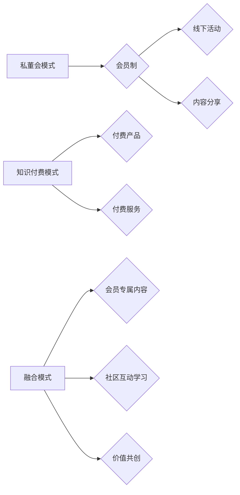

                 

## 如何打造知识付费的私董会模式

> 关键词：知识付费、私董会、社区运营、会员体系、内容生态、价值共创、技术赋能、数据驱动

## 1. 背景介绍

知识经济时代，知识成为最宝贵的资源。传统教育模式的局限性日益凸显，人们对个性化、深度学习的需求不断增长。知识付费作为一种新型的知识获取模式，迅速崛起，为知识生产者和消费者提供了新的平台和机会。

私董会，作为一种高端的会员制社交平台，以其独特的圈层属性和高价值内容，吸引了众多精英人士。将知识付费与私董会模式相结合，可以打造一个高品质、高价值的知识生态圈，满足用户对深度学习和社交互动的需求。

## 2. 核心概念与联系

### 2.1 私董会模式

私董会模式的核心在于打造一个封闭、高价值的会员社区，通过会员制、线下活动、内容分享等方式，为会员提供独家资源和服务。

* **会员制:** 私董会通常采用会员制，会员需缴纳一定的费用才能加入社区。会员制可以有效筛选用户，保证社区的质量和氛围。
* **线下活动:** 私董会定期举办线下活动，例如峰会、研讨会、聚会等，为会员提供交流学习和拓展人脉的机会。
* **内容分享:** 私董会提供丰富的专业内容，例如行业报告、专家讲座、案例分享等，帮助会员提升专业技能和视野。

### 2.2 知识付费模式

知识付费模式是指知识生产者通过线上平台，将知识、技能、经验等转化为付费产品或服务，并向用户提供付费获取的方式。

* **付费产品:** 包括线上课程、电子书、音频节目等。
* **付费服务:** 包括一对一咨询、定制化培训、会员服务等。

### 2.3 融合模式

将私董会模式与知识付费模式融合，可以打造一个高品质、高价值的知识生态圈。

* **会员专属内容:** 私董会会员可以获得独家付费内容，例如深度解析、专家访谈、线下活动录播等。
* **社区互动学习:** 会员可以参与社区讨论、分享学习心得，与专家和同领域人士交流学习。
* **价值共创:** 私董会可以鼓励会员参与内容创作，共同构建知识生态圈。

**Mermaid 流程图**



## 3. 核心算法原理 & 具体操作步骤

### 3.1 算法原理概述

私董会模式与知识付费模式的融合，需要基于一些核心算法原理，例如推荐算法、社区运营算法、内容分发算法等，来实现用户精准匹配、内容个性化推荐、社区活跃度提升等目标。

* **推荐算法:** 基于用户行为数据、兴趣偏好、知识背景等信息，推荐相关内容和活动，提高用户参与度和满意度。
* **社区运营算法:** 分析用户互动数据、社区活跃度、话题热度等，优化社区运营策略，促进用户交流和互动。
* **内容分发算法:** 根据内容质量、用户兴趣、时效性等因素，智能分发内容，提高内容曝光率和用户粘性。

### 3.2 算法步骤详解

**推荐算法步骤:**

1. **数据采集:** 收集用户行为数据、兴趣偏好、知识背景等信息。
2. **数据预处理:** 对数据进行清洗、转换、特征提取等处理，构建用户画像和内容特征向量。
3. **模型训练:** 选择合适的推荐算法模型，例如协同过滤、内容过滤、深度学习等，对数据进行训练，建立推荐模型。
4. **推荐结果生成:** 根据用户特征和内容特征，利用推荐模型生成推荐结果，并进行排序和展示。
5. **效果评估:** 评估推荐效果，例如点击率、转化率、用户满意度等，并根据评估结果进行模型优化和调整。

**社区运营算法步骤:**

1. **用户行为分析:** 分析用户参与度、互动频率、话题关注等数据，了解用户行为模式和兴趣偏好。
2. **社区活跃度监测:** 监测社区活跃度指标，例如帖子数量、评论数量、用户在线时长等，及时发现社区活跃度下降的趋势。
3. **话题热度分析:** 分析用户讨论的话题热度，挖掘用户关注的热点话题，并引导用户参与讨论。
4. **运营策略优化:** 根据数据分析结果，优化社区运营策略，例如活动策划、内容推荐、用户引导等，提高社区活跃度和用户粘性。

**内容分发算法步骤:**

1. **内容质量评估:** 对内容进行质量评估，例如原创性、准确性、实用性等，筛选优质内容。
2. **用户兴趣匹配:** 根据用户兴趣偏好、阅读历史、点赞记录等信息，匹配用户感兴趣的内容。
3. **时效性判断:** 考虑内容的时效性，优先推荐新鲜、热门的内容。
4. **分发策略制定:** 根据内容质量、用户兴趣、时效性等因素，制定内容分发策略，例如推荐位、推送频率、展示方式等。
5. **效果监测与优化:** 监测内容分发效果，例如阅读量、点赞量、评论量等，并根据效果进行策略优化。

### 3.3 算法优缺点

**推荐算法:**

* **优点:** 可以精准推荐用户感兴趣的内容，提高用户参与度和满意度。
* **缺点:** 需要大量数据进行训练，算法模型复杂，容易出现推荐偏差。

**社区运营算法:**

* **优点:** 可以有效监测社区活跃度，优化运营策略，促进用户交流和互动。
* **缺点:** 需要不断收集和分析用户数据，算法模型需要不断迭代更新。

**内容分发算法:**

* **优点:** 可以提高优质内容的曝光率，吸引更多用户阅读和参与。
* **缺点:** 需要平衡内容质量、用户兴趣、时效性等因素，算法模型需要不断优化。

### 3.4 算法应用领域

推荐算法、社区运营算法、内容分发算法广泛应用于各个领域，例如电商、社交媒体、教育、医疗等。

## 4. 数学模型和公式 & 详细讲解 & 举例说明

### 4.1 数学模型构建

**推荐算法数学模型:**

* **协同过滤:** 基于用户-物品交互矩阵，利用相似用户或相似物品的偏好进行推荐。
* **内容过滤:** 基于用户兴趣偏好和内容特征向量，计算内容与用户兴趣的匹配度进行推荐。
* **深度学习:** 利用神经网络模型，学习用户行为数据和内容特征之间的复杂关系，进行推荐。

**社区运营算法数学模型:**

* **活跃度指标:** 使用数学公式计算社区活跃度，例如帖子数量、评论数量、用户在线时长等。
* **话题热度分析:** 使用聚类算法或文本挖掘算法，分析用户讨论的话题热度。

**内容分发算法数学模型:**

* **内容质量评估:** 使用机器学习模型，评估内容的原创性、准确性、实用性等。
* **用户兴趣匹配:** 使用余弦相似度或其他相似度度量，计算用户兴趣与内容特征之间的匹配度。

### 4.2 公式推导过程

**协同过滤推荐算法公式:**

$$
r_{ui} = \frac{\sum_{j \in N(u)} s_{uj} \cdot r_{uj}}{\sum_{j \in N(u)} s_{uj}}
$$

其中:

* $r_{ui}$: 用户 $u$ 对物品 $i$ 的预测评分
* $N(u)$: 用户 $u$ 相似的用户集合
* $s_{uj}$: 用户 $u$ 和用户 $j$ 的相似度
* $r_{uj}$: 用户 $j$ 对物品 $i$ 的真实评分

**内容过滤推荐算法公式:**

$$
score(u, i) = \sum_{f \in F} w_f \cdot \text{similarity}(u, f) \cdot \text{feature}(i, f)
$$

其中:

* $score(u, i)$: 用户 $u$ 对物品 $i$ 的推荐得分
* $F$: 用户和物品的特征集合
* $w_f$: 特征 $f$ 的权重
* $\text{similarity}(u, f)$: 用户 $u$ 和特征 $f$ 的相似度
* $\text{feature}(i, f)$: 物品 $i$ 的特征 $f$ 的值

### 4.3 案例分析与讲解

**案例:**

假设一个私董会平台，想要推荐用户感兴趣的付费课程。

* **协同过滤:** 可以根据用户过去购买的课程和用户相似度，推荐用户可能感兴趣的课程。
* **内容过滤:** 可以根据用户兴趣偏好和课程内容特征，推荐用户可能感兴趣的课程。
* **深度学习:** 可以利用用户行为数据和课程特征，训练深度学习模型，进行更精准的课程推荐。

**讲解:**

通过以上算法模型和公式，私董会平台可以根据用户需求，选择合适的推荐算法，并不断优化算法模型，提高推荐效果。

## 5. 项目实践：代码实例和详细解释说明

### 5.1 开发环境搭建

* **操作系统:** Linux/macOS/Windows
* **编程语言:** Python
* **框架:** Django/Flask
* **数据库:** MySQL/PostgreSQL
* **工具:** Git、Docker

### 5.2 源代码详细实现

```python
# 推荐算法示例代码 (协同过滤)

import numpy as np

# 用户-物品交互矩阵
user_item_matrix = np.array([
    [1, 0, 1, 0],
    [0, 1, 1, 1],
    [1, 1, 0, 1],
    [0, 1, 0, 0],
])

# 计算用户相似度
def calculate_similarity(user1, user2):
    # 使用余弦相似度计算用户相似度
    return np.dot(user_item_matrix[user1], user_item_matrix[user2]) / (
        np.linalg.norm(user_item_matrix[user1]) * np.linalg.norm(user_item_matrix[user2])
    )

# 获取用户相似用户
def get_similar_users(user):
    # 计算用户与所有其他用户的相似度
    similarities = [calculate_similarity(user, i) for i in range(len(user_item_matrix))]
    # 返回相似度最高的k个用户
    return np.argsort(similarities)[::-1][:5]

# 推荐课程
def recommend_courses(user):
    # 获取用户相似用户
    similar_users = get_similar_users(user)
    # 计算用户对课程的预测评分
    predictions = []
    for similar_user in similar_users:
        # 预测用户对课程的评分
        prediction = np.mean(user_item_matrix[similar_user] * user_item_matrix[user])
        predictions.append(prediction)
    # 返回预测评分最高的课程
    return np.argsort(predictions)[::-1][:5]

# 示例使用
user = 0
recommended_courses = recommend_courses(user)
print(f"推荐给用户 {user} 的课程：{recommended_courses}")
```

### 5.3 代码解读与分析

* **用户-物品交互矩阵:** 存储用户对物品的评分或交互行为，例如观看、点赞、购买等。
* **协同过滤算法:** 基于用户-物品交互矩阵，计算用户之间的相似度，并根据相似用户的评分预测目标用户的评分。
* **相似度计算:** 使用余弦相似度计算用户之间的相似度，该度量衡量两个向量的夹角大小，夹角越小，相似度越高。
* **课程推荐:** 根据用户相似用户的评分，预测目标用户对课程的评分，并推荐评分最高的课程。

### 5.4 运行结果展示

运行以上代码，可以得到目标用户可能感兴趣的课程推荐结果。

## 6. 实际应用场景

### 6.1 私董会平台

私董会平台可以利用知识付费模式，提供独家付费内容，例如行业报告、专家讲座、案例分享等，并通过推荐算法、社区运营算法、内容分发算法等，提升用户体验和社区活跃度。

### 6.2 在线教育平台

在线教育平台可以利用私董会模式，打造高品质的学习社区，提供个性化学习路径、深度学习内容、专家指导等服务，提升用户学习效果和学习体验。

### 6.3 企业内部培训

企业可以利用私董会模式，打造内部知识共享平台，分享企业经验、技术知识、行业洞察等，提升员工技能水平和企业竞争力。

### 6.4 未来应用展望

私董会模式与知识付费模式的融合，未来将应用于更多领域，例如医疗、金融、艺术等，为用户提供更个性化、更深入的知识学习和交流体验。

## 7. 工具和资源推荐

### 7.1 学习资源推荐

* **书籍:**
    * 《The Lean Startup》
    * 《Zero to One》
    * 《The Innovator's Dilemma》
* **在线课程:**
    * Coursera
    * edX
    * Udemy

### 7.2 开发工具推荐

* **编程语言:** Python
* **框架:** Django/Flask
* **数据库:** MySQL/PostgreSQL
* **云平台:** AWS/Azure/GCP

### 7.3 相关论文推荐

* **Knowledge Sharing in Online Communities: A Survey**
* **The Impact of Social Capital on Knowledge Sharing in Online Communities**
* **Building Trust and Reputation in Online Communities**

## 8. 总结：未来发展趋势与挑战

### 8.1 研究成果总结

私董会模式与知识付费模式的融合，为用户提供了一种全新的知识获取和社交体验。通过推荐算法、社区运营算法、内容分发算法等技术手段，可以打造一个高品质、高价值的知识生态圈。

### 8.2 未来发展趋势

* **个性化定制:** 基于用户行为数据和兴趣偏好，提供更个性化的知识学习路径和内容推荐。
* **沉浸式体验:** 利用VR/AR等技术，打造更沉浸式的知识学习体验。
* **人工智能赋能:** 利用人工智能技术，自动生成内容、智能推荐、个性化辅导等，提升知识学习效率。

### 8.3 面临的挑战

* **数据安全和隐私保护:** 需要确保用户数据安全和隐私保护，避免数据泄露和滥用。
* **内容质量控制:** 需要建立有效的机制，保证内容质量和真实性，避免虚假信息和低质量内容的传播。
* **社区运营和用户粘性:** 需要持续优化社区运营策略，提升用户参与度和社区活跃度。

### 8.4 研究展望

未来，私董会模式与知识付费模式的融合将继续发展，并应用于更多领域，为用户提供更丰富、更便捷、更智能的知识学习和社交体验。


## 9. 附录：常见问题与解答

**常见问题:**

* **私董会模式与传统会员制有什么区别？**

私董会模式更注重打造一个高价值的圈层社区，提供独家资源和服务，并通过线下活动、内容分享等方式，促进用户交流和互动。

* **如何保证私董会平台的内容质量？**

可以通过建立严格的内容审核机制、邀请专家学者参与内容创作、鼓励用户参与内容评级等方式，保证内容质量。

* **如何提升私董会平台的用户粘性？**

可以通过提供个性化学习路径、组织线下活动、搭建用户交流平台、定期发布优质内容等方式，提升用户粘性。

**解答:**

* **私董会模式与传统会员制区别:** 私董会模式更注重打造一个高价值的圈层社区，提供独家资源和服务，并通过线下活动、内容分享等方式，促进用户交流和互动。传统会员制则更注重提供会员专属的折扣、优惠等服务。

* **保证内容质量:** 通过建立严格的内容审核机制、邀请专家学者参与内容创作、鼓励用户参与内容评级等方式，保证内容质量。

* **提升用户粘性:** 通过提供个性化学习路径、组织线下活动、搭建用户交流平台、定期发布优质内容等方式，提升用户粘性。


作者：禅与计算机程序设计艺术 / Zen and the Art of Computer Programming<end_of_turn>

