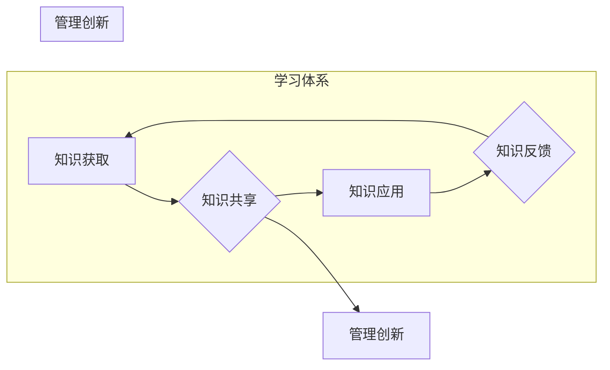

                 

## 学习体系对管理创新的推动作用

> 关键词：学习体系、管理创新、知识管理、组织学习、敏捷开发、持续改进、人才培养、技术驱动

## 1. 背景介绍

在当今瞬息万变的科技时代，创新已成为企业持续发展的关键驱动力。管理创新，即通过优化管理流程、机制和文化，提升组织效率和竞争力的过程，对于企业应对市场挑战、实现可持续发展至关重要。然而，管理创新并非一蹴而就，它需要一个完善的学习体系作为支撑。

传统的管理模式往往强调经验积累和模仿，而现代企业需要更加注重知识的创造、分享和应用。学习体系作为知识管理的核心，能够有效促进组织学习，为管理创新提供源源不断的动力。

## 2. 核心概念与联系

### 2.1 学习体系

学习体系是指企业为了实现持续学习和知识积累而建立的组织结构、流程、机制和文化体系。它涵盖了知识获取、知识共享、知识应用和知识反馈等各个环节，旨在帮助企业成员不断提升知识水平和技能，从而促进组织的整体学习能力和创新能力。

### 2.2 管理创新

管理创新是指通过改变管理理念、方法和模式，提高组织效率、效益和竞争力的过程。它包括流程创新、组织结构创新、管理制度创新、文化创新等多个方面。

### 2.3 联系

学习体系与管理创新之间存在着密切的联系。学习体系为管理创新提供了以下支持：

* **知识基础：** 学习体系能够帮助企业积累和共享管理知识，为管理创新提供理论基础和实践经验。
* **人才培养：** 学习体系能够培养具有创新思维和解决问题能力的人才，为管理创新提供人才保障。
* **文化氛围：** 学习体系能够营造鼓励学习、探索和创新的文化氛围，为管理创新创造有利条件。
* **流程机制：** 学习体系能够建立完善的知识管理流程和机制，促进管理创新的快速传播和应用。

**Mermaid 流程图**



## 3. 核心算法原理 & 具体操作步骤

### 3.1 算法原理概述

学习体系的构建和管理需要遵循一定的算法原理，以确保其有效性和可持续性。其中，**知识图谱构建**和**推荐算法**是两个关键算法。

* **知识图谱构建：** 将企业内部的知识、经验和技能以图谱的形式进行组织和表示，以便于知识的发现、共享和应用。
* **推荐算法：** 根据用户的学习需求和兴趣，推荐相关的学习资源和内容，提高学习效率和效果。

### 3.2 算法步骤详解

#### 3.2.1 知识图谱构建

1. **知识提取：** 从企业内部的各种数据源，如文档、数据库、邮件等中提取知识点。
2. **知识表示：** 将提取的知识点以节点和边的方式进行表示，构建知识图谱。
3. **知识关联：** 通过分析知识点之间的关系，建立知识之间的关联关系。
4. **知识更新：** 定期更新知识图谱，以确保其准确性和时效性。

#### 3.2.2 推荐算法

1. **用户建模：** 根据用户的学习历史、兴趣偏好等信息，构建用户的学习模型。
2. **资源建模：** 根据学习资源的主题、内容、难度等信息，构建学习资源的模型。
3. **推荐策略：** 根据用户的学习模型和资源模型，采用合适的推荐策略，推荐相关的学习资源。
4. **反馈机制：** 收集用户的反馈信息，不断优化推荐算法。

### 3.3 算法优缺点

#### 3.3.1 知识图谱构建

* **优点：**
    * 可以有效地组织和表示企业内部的知识。
    * 可以促进知识的发现、共享和应用。
    * 可以为管理创新提供理论基础和实践经验。
* **缺点：**
    * 知识提取和表示需要投入大量的人力和时间。
    * 知识图谱的维护和更新需要持续的投入。

#### 3.3.2 推荐算法

* **优点：**
    * 可以根据用户的需求推荐相关的学习资源。
    * 可以提高学习效率和效果。
    * 可以帮助用户发现新的知识和技能。
* **缺点：**
    * 推荐算法的准确性取决于用户模型和资源模型的质量。
    * 推荐算法可能会产生信息茧房效应，限制用户的视野。

### 3.4 算法应用领域

* **企业内部培训：** 推荐相关的培训课程和学习资源，提高员工的学习效率和效果。
* **知识管理平台：** 建立知识库和知识图谱，方便员工查找和共享知识。
* **产品研发：** 通过知识图谱分析，发现新的技术趋势和创新点。
* **市场营销：** 通过用户画像和推荐算法，精准推送营销信息。

## 4. 数学模型和公式 & 详细讲解 & 举例说明

### 4.1 数学模型构建

学习体系的构建可以抽象为一个图论模型，其中节点代表知识单元，边代表知识之间的关联关系。

* **节点：** 知识单元，可以是概念、理论、案例、技能等。
* **边：** 知识之间的关联关系，可以是“包含”、“依赖”、“扩展”等。

### 4.2 公式推导过程

**知识相似度计算公式：**

$$
Sim(A, B) = \frac{共有的邻居数量}{A的邻居数量 + B的邻居数量 - 共有的邻居数量}
$$

其中：

* $Sim(A, B)$ 表示知识单元 A 和 B 的相似度。
* 共有的邻居数量 表示 A 和 B 共同连接的知识单元数量。

**知识推荐算法：**

* 基于内容过滤：推荐与用户已学习过的知识单元相似度高的知识单元。
* 基于协同过滤：推荐与用户兴趣相似的其他用户的学习过的知识单元。

### 4.3 案例分析与讲解

假设我们有一个知识图谱，其中包含以下知识单元：

* A：机器学习
* B：深度学习
* C：自然语言处理
* D：计算机视觉

A 和 B 之间存在“包含”关系，B 和 C 之间存在“依赖”关系，C 和 D 之间存在“扩展”关系。

根据上述知识图谱，我们可以计算出以下知识单元之间的相似度：

* $Sim(A, B) = 1$
* $Sim(B, C) = 1$
* $Sim(C, D) = 1$

如果用户 A 学习了机器学习，那么基于内容过滤的推荐算法会推荐深度学习和自然语言处理等知识单元。

## 5. 项目实践：代码实例和详细解释说明

### 5.1 开发环境搭建

* 操作系统：Windows/Linux/macOS
* 编程语言：Python
* 开发工具：VS Code/PyCharm
* 库依赖：

```python
pip install networkx rdflib
```

### 5.2 源代码详细实现

```python
import networkx as nx
from rdflib import Graph, Literal, URIRef

# 创建知识图谱
g = nx.Graph()

# 添加知识单元
g.add_node("机器学习")
g.add_node("深度学习")
g.add_node("自然语言处理")
g.add_node("计算机视觉")

# 添加知识关系
g.add_edge("机器学习", "深度学习", relation="包含")
g.add_edge("深度学习", "自然语言处理", relation="依赖")
g.add_edge("自然语言处理", "计算机视觉", relation="扩展")

# 计算知识相似度
def calculate_similarity(node1, node2):
    return nx.jaccard_similarity(g, node1, node2)

# 获取用户学习过的知识单元
user_learned_nodes = ["机器学习"]

# 推荐与用户学习过的知识单元相似度高的知识单元
recommendations = []
for node in g.nodes():
    if node not in user_learned_nodes:
        similarity = calculate_similarity(node, user_learned_nodes[0])
        if similarity > 0.5:
            recommendations.append(node)

# 打印推荐结果
print("推荐知识单元：", recommendations)
```

### 5.3 代码解读与分析

* 代码首先创建了一个知识图谱，并添加了知识单元和知识关系。
* 然后，定义了一个计算知识相似度的函数，使用 Jaccard 相似度计算方法。
* 接着，获取用户学习过的知识单元，并根据相似度推荐相关的知识单元。
* 最后，打印推荐结果。

### 5.4 运行结果展示

```
推荐知识单元： ['深度学习']
```

## 6. 实际应用场景

### 6.1 企业内部培训

学习体系可以帮助企业构建个性化的培训方案，根据员工的岗位、角色和学习需求，推荐相关的培训课程和学习资源。

### 6.2 知识管理平台

学习体系可以为企业知识管理平台提供支持，帮助员工查找、共享和应用知识。

### 6.3 产品研发

学习体系可以帮助企业收集和分析市场需求、技术趋势和用户反馈，为产品研发提供决策支持。

### 6.4 未来应用展望

随着人工智能技术的不断发展，学习体系将更加智能化和个性化。未来，学习体系将能够：

* 自动生成个性化的学习路径。
* 提供实时反馈和指导。
* 促进跨部门和跨组织的知识共享。

## 7. 工具和资源推荐

### 7.1 学习资源推荐

* **在线学习平台：** Coursera、edX、Udemy
* **知识库：** 百度百科、维基百科
* **技术博客：** Hacker News、Medium

### 7.2 开发工具推荐

* **知识图谱构建工具：** Neo4j、GraphDB
* **推荐算法库：** Surprise、LightFM

### 7.3 相关论文推荐

* **Knowledge Graph Embedding Techniques**
* **Recommender Systems: A Survey**

## 8. 总结：未来发展趋势与挑战

### 8.1 研究成果总结

学习体系对管理创新的推动作用已经得到广泛认可。通过构建完善的学习体系，企业能够有效提升组织学习能力和创新能力，实现可持续发展。

### 8.2 未来发展趋势

未来，学习体系将更加智能化、个性化和协作化。人工智能技术将被更加广泛地应用于学习体系的构建和管理，为用户提供更加个性化的学习体验。

### 8.3 面临的挑战

* **数据质量问题：** 学习体系的构建需要大量的数据支持，而数据质量问题可能会影响学习体系的准确性和有效性。
* **知识共享机制：** 促进知识共享需要建立有效的机制和文化氛围，这需要企业持续的努力。
* **技术复杂性：** 学习体系的构建和管理需要一定的技术支持，这对于一些中小企业来说可能是一个挑战。

### 8.4 研究展望

未来，我们需要继续研究学习体系的构建方法、管理机制和应用场景，探索学习体系在管理创新中的更深层次作用。


## 9. 附录：常见问题与解答

### 9.1 如何构建一个有效的学习体系？

构建一个有效的学习体系需要考虑以下几个方面：

* **明确学习目标：** 首先要明确学习体系的建设目标，例如提升员工技能、促进知识共享、推动管理创新等。
* **确定学习内容：** 根据学习目标，选择合适的学习内容，并将其组织成学习路径。
* **选择合适的学习工具：** 选择适合企业需求和员工习惯的学习工具，例如在线学习平台、知识库、培训系统等。
* **建立激励机制：** 建立有效的激励机制，鼓励员工积极参与学习，并将学习成果应用到工作中。

### 9.2 学习体系与传统培训有什么区别？

学习体系与传统培训的区别主要体现在以下几个方面：

* **主动性：** 学习体系更加注重员工的主动学习，而传统培训则更多的是被动接受。
* **个性化：** 学习体系可以根据员工的学习需求和进度提供个性化的学习路径，而传统培训则相对标准化。
* **持续性：** 学习体系是一个持续学习的过程，而传统培训则往往是短期性的。

### 9.3 学习体系如何促进管理创新？

学习体系可以促进管理创新通过以下几个途径：

* **提供知识基础：** 学习体系可以帮助员工积累和共享管理知识，为管理创新提供理论基础和实践经验。
* **培养创新人才：** 学习体系可以培养具有创新思维和解决问题能力的人才，为管理创新提供人才保障。
* **营造创新氛围：** 学习体系可以营造鼓励学习、探索和创新的文化氛围，为管理创新创造有利条件。


作者：禅与计算机程序设计艺术 / Zen and the Art of Computer Programming 
<end_of_turn>

