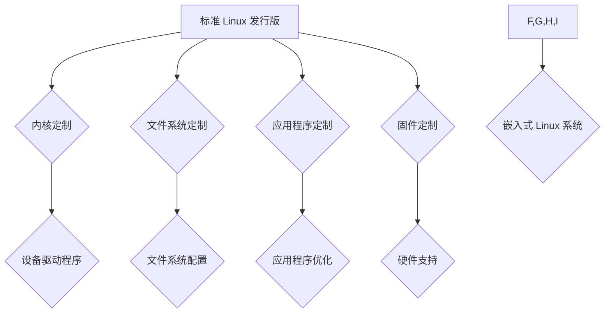

                 

## 嵌入式 Linux 定制：为设备优化 Linux

> 关键词：嵌入式 Linux, 定制, 设备优化, 驱动程序, 文件系统, 性能, 功耗

### 1. 背景介绍

嵌入式系统是指将计算机系统集成到更大的物理设备中，为特定任务提供专用功能的系统。这些系统通常具有严格的资源限制，例如内存、存储空间和处理能力，并且需要在有限的功耗下运行。Linux，作为一款开源、灵活且功能强大的操作系统，已成为嵌入式系统的首选平台。然而，标准的 Linux 发行版通常过于庞大，不适合所有嵌入式设备。因此，嵌入式 Linux 定制成为优化设备性能、功耗和功能的必要步骤。

### 2. 核心概念与联系

嵌入式 Linux 定制是指根据特定设备的需求，对标准的 Linux 发行版进行修改和调整，使其更适合运行在目标硬件平台上。

**核心概念:**

* **内核定制:** 移除不必要的内核模块，调整内核参数，并添加设备驱动程序，以支持目标硬件。
* **文件系统定制:** 选择合适的文件系统，例如 FAT、ext4 或 YAFFS2，并优化文件系统配置以节省空间和提高性能。
* **应用程序定制:** 移除不必要的应用程序，并优化应用程序代码以减少资源消耗。
* **固件定制:** 针对目标硬件平台，定制固件以支持 Linux 启动和运行。

**架构关系:**



### 3. 核心算法原理 & 具体操作步骤

#### 3.1  算法原理概述

嵌入式 Linux 定制的核心算法原理是基于设备需求进行系统资源优化和配置调整。

#### 3.2  算法步骤详解

1. **需求分析:** 首先，需要对目标设备进行详细的分析，了解其硬件平台、软件需求、性能要求和功耗限制。
2. **内核定制:** 根据需求，选择合适的 Linux 内核版本，并移除不必要的内核模块，例如图形驱动、网络协议栈等。
3. **设备驱动程序:** 开发或移植设备驱动程序，以支持目标硬件设备，例如传感器、显示器、存储器等。
4. **文件系统定制:** 选择合适的文件系统，并根据设备存储空间和性能需求进行配置调整。
5. **应用程序定制:** 移除不必要的应用程序，并优化应用程序代码以减少资源消耗。
6. **固件定制:** 针对目标硬件平台，定制固件以支持 Linux 启动和运行。
7. **测试和验证:** 对定制后的系统进行测试和验证，确保其稳定性、性能和功能满足需求。

#### 3.3  算法优缺点

**优点:**

* **资源优化:** 可以根据设备需求，移除不必要的组件和功能，从而节省资源。
* **性能提升:** 可以优化内核参数和应用程序代码，提高系统性能。
* **功耗降低:** 可以选择低功耗的组件和优化系统配置，降低功耗。
* **功能定制:** 可以根据需求添加或修改功能，满足特定应用场景。

**缺点:**

* **复杂性:** 嵌入式 Linux 定制过程较为复杂，需要对 Linux 系统和硬件平台有深入的了解。
* **时间成本:** 定制过程需要花费较长时间，需要进行大量的测试和验证。
* **维护成本:** 定制后的系统需要进行维护和更新，需要专门的技术人员进行支持。

#### 3.4  算法应用领域

嵌入式 Linux 定制广泛应用于各种嵌入式系统领域，例如：

* **物联网设备:** 智能家居、智能传感器、工业自动化设备等。
* **消费电子设备:** 智能手机、平板电脑、智能手表等。
* **工业控制系统:** 机器人、自动化生产线、电力系统等。
* **汽车电子系统:** 车载导航、车载娱乐系统、自动驾驶系统等。

### 4. 数学模型和公式 & 详细讲解 & 举例说明

#### 4.1  数学模型构建

嵌入式 Linux 定制过程涉及到许多数学模型，例如：

* **资源分配模型:** 用于分配系统资源，例如内存、CPU 时间和存储空间。
* **功耗模型:** 用于预测系统功耗，并优化系统配置以降低功耗。
* **性能模型:** 用于评估系统性能，并优化系统配置以提高性能。

#### 4.2  公式推导过程

例如，一个简单的资源分配模型可以采用以下公式：

$$
R = \frac{T}{N}
$$

其中：

* $R$ 表示分配给每个任务的资源量。
* $T$ 表示总资源量。
* $N$ 表示任务数量。

#### 4.3  案例分析与讲解

假设一个嵌入式系统有 100MB 的内存，需要运行 5 个任务。根据上述公式，每个任务可以分配 20MB 的内存 ($R = 100MB / 5 = 20MB$)。

### 5. 项目实践：代码实例和详细解释说明

#### 5.1  开发环境搭建

嵌入式 Linux 定制通常需要使用交叉编译工具链，例如 GCC 和 Binutils。

#### 5.2  源代码详细实现

以下是一个简单的设备驱动程序示例，用于控制一个模拟的 LED 灯：

```c
#include <linux/module.h>
#include <linux/kernel.h>
#include <linux/init.h>

static int led_init(void)
{
    printk(KERN_INFO "LED driver initialized\n");
    return 0;
}

static void led_exit(void)
{
    printk(KERN_INFO "LED driver removed\n");
}

module_init(led_init);
module_exit(led_exit);

MODULE_LICENSE("GPL");
MODULE_AUTHOR("Zen and the Art of Computer Programming");
MODULE_DESCRIPTION("A simple LED driver");
```

#### 5.3  代码解读与分析

该驱动程序定义了两个函数：

* `led_init()`: 在驱动程序加载时执行，用于初始化 LED 设备。
* `led_exit()`: 在驱动程序卸载时执行，用于释放 LED 设备资源。

#### 5.4  运行结果展示

当加载该驱动程序时，系统会打印一条信息 "LED driver initialized"。卸载驱动程序时，系统会打印一条信息 "LED driver removed"。

### 6. 实际应用场景

#### 6.1  智能家居设备

嵌入式 Linux 定制可以用于优化智能家居设备的性能和功耗，例如智能灯泡、智能插座和智能门锁等。

#### 6.2  工业自动化设备

嵌入式 Linux 定制可以用于开发工业自动化设备，例如机器人、自动化生产线和工业控制系统等。

#### 6.3  汽车电子系统

嵌入式 Linux 定制可以用于开发汽车电子系统，例如车载导航、车载娱乐系统和自动驾驶系统等。

#### 6.4  未来应用展望

随着物联网技术的快速发展，嵌入式 Linux 定制将在未来应用领域得到更广泛的应用，例如：

* **医疗设备:** 智能医疗设备、远程医疗系统等。
* **航空航天:** 飞行控制系统、卫星通信系统等。
* **能源管理:** 智能电网、可再生能源系统等。

### 7. 工具和资源推荐

#### 7.1  学习资源推荐

* **Linux Kernel Documentation:** https://www.kernel.org/doc/html/latest/
* **Embedded Linux Primer:** https://www.oreilly.com/library/view/embedded-linux-primer/9781449364519/
* **Yocto Project:** https://www.yoctoproject.org/

#### 7.2  开发工具推荐

* **Cross Compiler Toolchain:** https://gcc.gnu.org/
* **Buildroot:** https://buildroot.org/
* **OpenEmbedded:** https://www.openembedded.org/

#### 7.3  相关论文推荐

* **A Survey of Embedded Linux Customization Techniques:** https://ieeexplore.ieee.org/document/7957841
* **Optimizing Embedded Linux Systems for Performance and Power Efficiency:** https://www.researchgate.net/publication/330972032_Optimizing_Embedded_Linux_Systems_for_Performance_and_Power_Efficiency

### 8. 总结：未来发展趋势与挑战

#### 8.1  研究成果总结

嵌入式 Linux 定制技术已经取得了显著的成果，为嵌入式系统的发展提供了强大的支持。

#### 8.2  未来发展趋势

未来，嵌入式 Linux 定制技术将朝着以下方向发展：

* **更智能的定制:** 利用人工智能和机器学习技术，自动生成定制化的 Linux 系统。
* **更安全可靠的定制:** 加强安全机制，提高定制系统可靠性和安全性。
* **更易于使用的定制:** 提供更友好的定制工具和流程，降低定制门槛。

#### 8.3  面临的挑战

嵌入式 Linux 定制技术也面临着一些挑战：

* **硬件平台多样性:** 不同的硬件平台需要定制不同的驱动程序和系统配置。
* **资源限制:** 嵌入式系统通常具有有限的资源，需要进行精细的资源管理。
* **安全性和可靠性:** 嵌入式系统需要保证高安全性，并能够在恶劣环境下稳定运行。

#### 8.4  研究展望

未来，需要进一步研究和探索嵌入式 Linux 定制技术，以解决上述挑战，并推动嵌入式系统的发展。

### 9. 附录：常见问题与解答

#### 9.1  常见问题

* **如何选择合适的 Linux 发行版？**

* **如何开发设备驱动程序？**

* **如何优化系统性能和功耗？**

#### 9.2  解答

* 选择合适的 Linux 发行版需要根据目标设备的硬件平台、软件需求和性能要求进行考虑。

* 开发设备驱动程序需要了解 Linux 内核架构和驱动程序开发模型。

* 系统性能和功耗优化可以通过调整内核参数、优化应用程序代码和选择合适的硬件组件来实现。


作者：禅与计算机程序设计艺术 / Zen and the Art of Computer Programming 
<end_of_turn>

