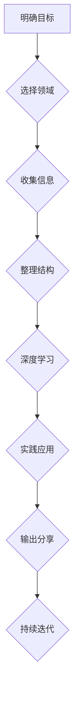

                 

## 开发个人品牌课程：系统化你的知识体系

> 关键词：个人品牌、知识体系、系统化、内容输出、技术博客、品牌建设、个人成长

### 1. 背景介绍

在当今信息爆炸的时代，个人品牌已成为个人职业发展和社会影响力的重要基石。拥有一个强大的个人品牌，能够帮助你脱颖而出，建立专业声誉，吸引更多机会。然而，打造个人品牌并非易事，需要系统化的规划和持续的努力。

对于技术领域从业者而言，个人品牌建设尤为重要。技术领域瞬息万变，新技术和新知识层出不穷。只有不断学习和提升，才能保持竞争力。同时，技术领域也更加注重实践和成果展示。通过构建个人品牌，你可以将你的技术能力和经验展示给更多人，获得认可和机会。

### 2. 核心概念与联系

**2.1 个人品牌是什么？**

个人品牌是指个人在特定领域或行业内所建立的独特形象和声誉。它包含了个人价值观、技能、经验、作品和人脉等多方面因素。

**2.2 知识体系的构建**

知识体系是指个人对某一领域或学科的知识结构化和系统化的组织方式。它可以帮助你更好地理解和掌握知识，并将其应用于实际工作中。

**2.3 个人品牌与知识体系的联系**

个人品牌和知识体系是相互促进、相互依存的关系。

* **知识体系为个人品牌提供基础：** 只有掌握扎实的知识，才能成为专业领域的专家，并建立起可信赖的个人品牌。
* **个人品牌提升知识体系的价值：** 通过个人品牌，你可以将你的知识分享给更多人，获得反馈和认可，从而提升知识体系的价值。

**2.4 知识体系构建的流程图**

### 3. 核心算法原理 & 具体操作步骤

**3.1 算法原理概述**

构建个人品牌和知识体系的“核心算法”并非一个具体的算法，而是指一种系统化的思维方式和操作步骤。

**3.2 算法步骤详解**

1. **明确目标：** 首先要明确你想要打造什么样的个人品牌，以及你希望通过个人品牌实现什么目标。
2. **选择领域：** 根据你的兴趣、技能和目标，选择一个你想要专注的领域。
3. **收集信息：** 广泛阅读相关书籍、文章、博客，参加行业活动，与专家交流，收集关于你所选择领域的知识和信息。
4. **整理结构：** 将收集到的信息进行整理和结构化，构建一个清晰的知识体系。
5. **深度学习：** 对你所选择的领域进行深入学习，掌握核心知识和技能。
6. **实践应用：** 将你的知识应用于实际项目或工作中，积累经验和成果。
7. **输出分享：** 将你的知识和经验通过博客、文章、视频、演讲等方式输出分享给更多人。
8. **持续迭代：** 不断学习、实践、输出，不断完善你的知识体系和个人品牌。

**3.3 算法优缺点**

* **优点：** 系统化、可操作、持续性强。
* **缺点：** 需要投入时间和精力，需要不断学习和更新。

**3.4 算法应用领域**

该算法适用于所有希望打造个人品牌的技术领域从业者。

### 4. 数学模型和公式 & 详细讲解 & 举例说明

构建个人品牌和知识体系的过程可以抽象为一个数学模型，其中涉及到以下几个关键因素：

* **个人能力 (C)：** 包括你的技术技能、沟通能力、创造力等。
* **知识积累 (K)：** 你所掌握的知识量和深度。
* **内容输出 (O)：** 你通过博客、文章、视频等方式分享的知识和经验。
* **网络影响力 (N)：** 你在行业内的知名度和人脉关系。

**4.1 数学模型构建**

个人品牌价值 (PV) 可以用以下公式表示：

$$PV = f(C, K, O, N)$$

其中，f() 是一个复杂的函数，代表个人品牌价值的计算公式。

**4.2 公式推导过程**

该公式的推导过程比较复杂，需要考虑多个因素之间的相互影响。

* **个人能力 (C) 对个人品牌价值的影响：** 能力越强，个人品牌价值越高。
* **知识积累 (K) 对个人品牌价值的影响：** 知识积累越多，个人品牌价值越高。
* **内容输出 (O) 对个人品牌价值的影响：** 内容输出越多，个人品牌价值越高。
* **网络影响力 (N) 对个人品牌价值的影响：** 网络影响力越大，个人品牌价值越高。

**4.3 案例分析与讲解**

例如，一位技术专家拥有强大的技术能力 (C) 和丰富的知识积累 (K)，但他没有进行内容输出 (O) 和建立网络关系 (N)，那么他的个人品牌价值 (PV) 可能会比较低。

如果他开始通过博客、文章、视频等方式输出知识，并积极参加行业活动，建立人脉关系，那么他的个人品牌价值 (PV) 会得到显著提升。

### 5. 项目实践：代码实例和详细解释说明

**5.1 开发环境搭建**

* 选择一个合适的博客平台，例如 WordPress、Medium、GitHub Pages 等。
* 安装必要的开发工具，例如文本编辑器、版本控制工具等。

**5.2 源代码详细实现**

由于个人品牌建设是一个持续的过程，没有固定的源代码实现。

**5.3 代码解读与分析**

个人品牌建设需要不断学习、实践、输出，并根据反馈进行调整。

**5.4 运行结果展示**

个人品牌建设的结果是建立起一个独特的个人形象和声誉，并获得更多机会和认可。

### 6. 实际应用场景

**6.1 个人职业发展**

个人品牌可以帮助你提升职业竞争力，获得更好的工作机会和薪酬。

**6.2 社会影响力**

个人品牌可以让你成为某个领域的专家，并通过你的知识和经验影响更多人。

**6.3 商业合作**

个人品牌可以帮助你建立商业合作关系，获得更多商业机会。

**6.4 未来应用展望**

随着互联网和社交媒体的发展，个人品牌将变得越来越重要。未来，个人品牌将更加个性化、多元化和智能化。

### 7. 工具和资源推荐

**7.1 学习资源推荐**

* 书籍：《打造个人品牌》、《个人品牌营销》、《内容营销》
* 网站：Medium、Hacker News、Stack Overflow
* 课程：Coursera、Udemy、edX

**7.2 开发工具推荐**

* 博客平台：WordPress、Medium、GitHub Pages
* 内容创作工具：Grammarly、Hemingway Editor
* 社交媒体平台：Twitter、LinkedIn、Facebook

**7.3 相关论文推荐**

* “The Impact of Personal Branding on Career Success”
* “Building a Personal Brand in the Digital Age”
* “The Role of Social Media in Personal Branding”

### 8. 总结：未来发展趋势与挑战

**8.1 研究成果总结**

构建个人品牌和知识体系是一个系统化的过程，需要不断学习、实践、输出和迭代。

**8.2 未来发展趋势**

个人品牌将更加个性化、多元化和智能化。

**8.3 面临的挑战**

* 信息爆炸和竞争加剧
* 个人品牌价值难以量化
* 内容创作和输出的持续性

**8.4 研究展望**

未来研究可以关注以下几个方面：

* 如何更好地量化个人品牌价值
* 如何利用人工智能技术提升个人品牌建设效率
* 如何应对信息爆炸和竞争加剧带来的挑战

### 9. 附录：常见问题与解答

**9.1 如何选择合适的领域？**

选择一个你真正感兴趣、擅长并且有发展潜力的领域。

**9.2 如何进行内容输出？**

可以通过博客、文章、视频、演讲等方式输出你的知识和经验。

**9.3 如何建立网络关系？**

可以通过参加行业活动、加入社群、积极参与线上讨论等方式建立人脉关系。

作者：禅与计算机程序设计艺术 / Zen and the Art of Computer Programming 
<end_of_turn>

