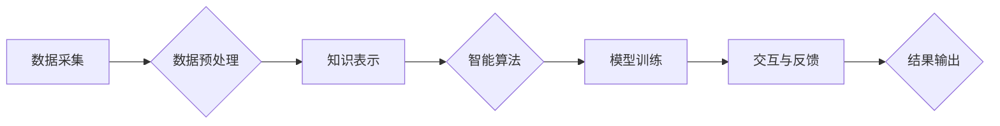

                 

## 开启无限可能：人类计算的新征程

> 关键词：人工智能、计算模型、人类计算、深度学习、自然语言处理、机器学习、算法优化

### 1. 背景介绍

人类文明的进步离不开对计算的不断探索和突破。从简单的算盘到复杂的超级计算机，计算一直是推动科技发展的重要引擎。而随着人工智能技术的飞速发展，计算正迎来一场新的革命——人类计算的新征程。

人类计算是指将人类的智慧和认知能力与计算机技术相结合，共同完成复杂的任务。它超越了传统的计算机程序设计范式，将人类的创造力、洞察力和判断力融入到计算过程中，从而赋予计算机更强大的智能和适应能力。

### 2. 核心概念与联系

**2.1 人类计算的本质**

人类计算的核心概念是将人类的认知能力与计算机的计算能力相融合。它不仅仅是简单的将数据输入计算机进行处理，而是更注重人类的参与和引导。

**2.2 人类计算的架构**

人类计算的架构通常包含以下几个关键部分：

* **数据采集与预处理:** 收集来自各种来源的数据，并进行清洗、转换和格式化，为后续的计算提供基础。
* **知识表示与推理:** 将人类的知识和经验以计算机可理解的形式表示出来，并构建推理机制，使计算机能够进行逻辑推理和知识发现。
* **智能算法与模型:** 利用深度学习、自然语言处理等人工智能算法，训练模型，使计算机能够学习和理解人类语言、图像、音频等信息。
* **交互与反馈:** 建立人机交互机制，允许人类与计算机进行实时沟通和反馈，引导计算过程，并获取计算结果。

**2.3 人类计算的流程图**



### 3. 核心算法原理 & 具体操作步骤

**3.1 算法原理概述**

人类计算的核心算法通常基于深度学习和自然语言处理等人工智能技术。深度学习算法能够从海量数据中自动学习特征和模式，而自然语言处理算法能够使计算机理解和处理人类语言。

**3.2 算法步骤详解**

1. **数据收集和预处理:** 收集相关数据，并进行清洗、转换和格式化，例如文本数据需要进行分词、词性标注等处理。
2. **模型构建:** 选择合适的深度学习模型架构，例如卷积神经网络（CNN）、循环神经网络（RNN）等，并根据任务需求进行调整。
3. **模型训练:** 利用训练数据训练模型，通过调整模型参数，使模型能够准确地预测或理解数据。
4. **模型评估:** 使用测试数据评估模型的性能，例如准确率、召回率等指标。
5. **模型部署:** 将训练好的模型部署到实际应用场景中，例如用于语音识别、图像识别、机器翻译等任务。

**3.3 算法优缺点**

**优点:**

* 能够处理复杂的数据模式，学习更深层次的特征。
* 自动学习能力强，无需人工特征工程。
* 性能优异，在许多任务上取得了突破性进展。

**缺点:**

* 数据需求量大，需要海量数据进行训练。
* 计算资源消耗大，训练时间长。
* 模型解释性差，难以理解模型的决策过程。

**3.4 算法应用领域**

* **自然语言处理:** 语音识别、机器翻译、文本摘要、情感分析等。
* **计算机视觉:** 图像识别、物体检测、图像分割、人脸识别等。
* **医疗诊断:** 病理图像分析、疾病预测、药物研发等。
* **金融分析:** 风险评估、欺诈检测、投资决策等。

### 4. 数学模型和公式 & 详细讲解 & 举例说明

**4.1 数学模型构建**

深度学习模型通常基于神经网络结构，其数学模型可以表示为一系列的矩阵运算和激活函数。

**4.2 公式推导过程**

例如，在卷积神经网络中，卷积层使用卷积核对输入数据进行卷积运算，其数学公式可以表示为：

$$
y = f(W * x + b)
$$

其中：

* $y$ 是卷积层的输出特征图。
* $x$ 是输入数据。
* $W$ 是卷积核。
* $b$ 是偏置项。
* $f$ 是激活函数。

**4.3 案例分析与讲解**

假设我们使用卷积神经网络进行图像分类任务，输入图像为一张猫的图片。卷积层会使用不同的卷积核提取图像中的特征，例如边缘、纹理等。这些特征会被传递到后续的层级，最终输出一个分类结果，例如“猫”。

### 5. 项目实践：代码实例和详细解释说明

**5.1 开发环境搭建**

可以使用Python语言和深度学习框架TensorFlow或PyTorch进行开发。需要安装相应的软件包，例如NumPy、Pandas、Matplotlib等。

**5.2 源代码详细实现**

```python
import tensorflow as tf

# 定义模型架构
model = tf.keras.models.Sequential([
    tf.keras.layers.Conv2D(32, (3, 3), activation='relu', input_shape=(28, 28, 1)),
    tf.keras.layers.MaxPooling2D((2, 2)),
    tf.keras.layers.Conv2D(64, (3, 3), activation='relu'),
    tf.keras.layers.MaxPooling2D((2, 2)),
    tf.keras.layers.Flatten(),
    tf.keras.layers.Dense(10, activation='softmax')
])

# 编译模型
model.compile(optimizer='adam',
              loss='sparse_categorical_crossentropy',
              metrics=['accuracy'])

# 训练模型
model.fit(x_train, y_train, epochs=5)

# 评估模型
loss, accuracy = model.evaluate(x_test, y_test)
print('Test loss:', loss)
print('Test accuracy:', accuracy)
```

**5.3 代码解读与分析**

这段代码定义了一个简单的卷积神经网络模型，用于手写数字识别任务。模型包含两层卷积层、两层最大池化层、一层全连接层和一层输出层。

**5.4 运行结果展示**

训练完成后，可以将模型应用于新的图像数据进行预测。例如，输入一张新的手写数字图片，模型可以输出该数字的类别。

### 6. 实际应用场景

**6.1 智能客服:** 人工智能聊天机器人可以模拟人类对话，为用户提供24小时在线服务，例如回答常见问题、处理订单等。

**6.2 个性化推荐:** 基于用户的行为数据和偏好，推荐个性化的商品、服务或内容，例如电商平台的商品推荐、音乐平台的歌曲推荐等。

**6.3 自动驾驶:** 利用计算机视觉和深度学习算法，使车辆能够感知周围环境，自动驾驶。

**6.4 医疗辅助诊断:** 帮助医生分析病理图像、预测疾病风险，提高诊断准确率。

**6.5 语言翻译:** 将一种语言自动翻译成另一种语言，打破语言障碍，促进跨文化交流。

**6.4 未来应用展望**

随着人工智能技术的不断发展，人类计算将在更多领域得到应用，例如：

* **科学研究:** 加速科学发现，解决复杂科学问题。
* **教育教学:** 个性化学习，提高教育效率。
* **艺术创作:** 辅助艺术家创作新的艺术作品。
* **社会治理:** 优化资源分配，提高社会效率。

### 7. 工具和资源推荐

**7.1 学习资源推荐**

* **书籍:**
    * 《深度学习》
    * 《人工智能：一种现代方法》
    * 《机器学习》
* **在线课程:**
    * Coursera
    * edX
    * Udacity

**7.2 开发工具推荐**

* **Python:** 广泛使用的编程语言，适合深度学习开发。
* **TensorFlow:** 开源深度学习框架，提供丰富的功能和工具。
* **PyTorch:** 开源深度学习框架，灵活易用，适合研究和开发。

**7.3 相关论文推荐**

* **《ImageNet Classification with Deep Convolutional Neural Networks》**
* **《Attention Is All You Need》**
* **《BERT: Pre-training of Deep Bidirectional Transformers for Language Understanding》**

### 8. 总结：未来发展趋势与挑战

**8.1 研究成果总结**

人类计算取得了显著的进展，在自然语言处理、计算机视觉、医疗诊断等领域取得了突破性成果。

**8.2 未来发展趋势**

* **模型规模和能力的提升:** 训练更大规模的模型，提高模型的性能和泛化能力。
* **算法效率的优化:** 开发更有效的算法，降低模型训练和推理的成本。
* **模型解释性和可信度的增强:** 提高模型的透明度和可解释性，增强用户对模型的信任。
* **跨模态计算:** 将不同模态的数据（例如文本、图像、音频）融合在一起，实现更智能的计算。

**8.3 面临的挑战**

* **数据获取和隐私保护:** 训练高质量的人类计算模型需要海量数据，如何获取和保护数据隐私是一个重要挑战。
* **算法偏见和公平性:** 人工智能算法可能存在偏见，导致不公平的结果，需要解决算法公平性问题。
* **伦理和社会影响:** 人类计算的应用可能带来伦理和社会问题，需要进行深入的思考和讨论。

**8.4 研究展望**

未来，人类计算将继续朝着更智能、更安全、更可持续的方向发展，为人类社会带来更多福祉。


### 9. 附录：常见问题与解答

**9.1 如何选择合适的深度学习模型？**

选择合适的深度学习模型需要根据具体的任务需求和数据特点进行选择。例如，对于图像分类任务，可以使用卷积神经网络；对于文本分类任务，可以使用循环神经网络或Transformer网络。

**9.2 如何解决模型过拟合问题？**

模型过拟合是指模型在训练数据上表现很好，但在测试数据上表现较差。解决模型过拟合问题的方法包括：

* 增加训练数据量。
* 使用正则化技术，例如L1正则化和L2正则化。
* 使用Dropout技术，随机丢弃一部分神经元。
* 使用交叉验证技术，将数据分成多个子集进行训练和验证。

**9.3 如何评估模型的性能？**

模型的性能可以通过多种指标进行评估，例如准确率、召回率、F1-score、AUC等。选择合适的评估指标需要根据具体的任务需求进行选择。


作者：禅与计算机程序设计艺术 / Zen and the Art of Computer Programming 
<end_of_turn>

