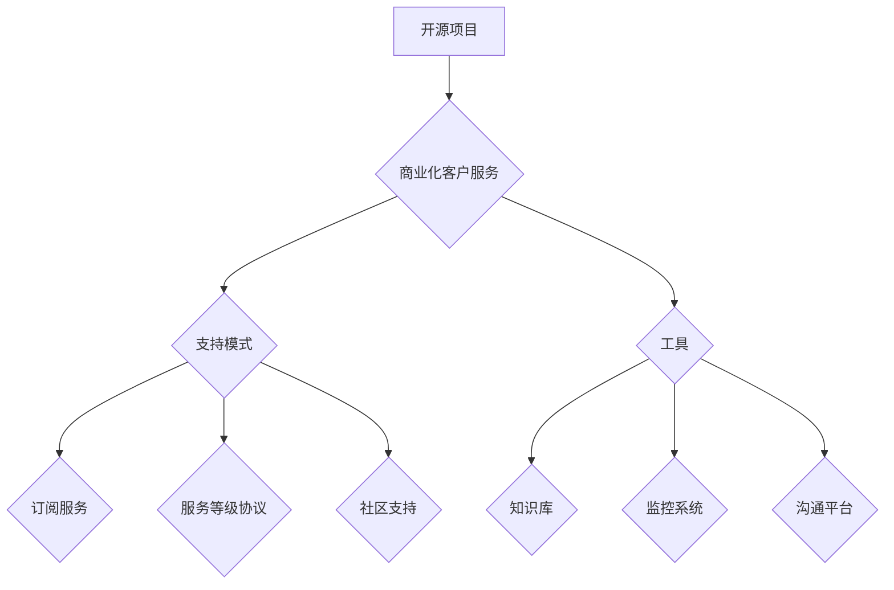

                 

## 开源项目的商业化客户服务：支持模式和工具

> 关键词：开源软件、商业化、客户服务、支持模式、工具、社区、订阅、服务等级协议

## 1. 背景介绍

开源软件在现代软件开发生态系统中扮演着越来越重要的角色。其灵活、可定制性和成本效益吸引了无数开发者和企业。然而，开源软件的商业化服务是一个充满挑战的领域。开源项目通常由志愿者驱动，缺乏专业的客户服务体系和商业运营模式。

随着开源软件在企业应用中的普及，对稳定性、安全性、性能和及时支持的需求日益增长。企业需要确保开源软件能够可靠地运行，并能够及时解决遇到的问题。这使得开源项目的商业化客户服务成为一个重要的议题。

## 2. 核心概念与联系

开源项目的商业化客户服务是指为使用开源软件的企业提供付费的客户支持服务。这包括但不限于：

* **技术支持:**  解答用户遇到的技术问题，提供代码调试和解决方案。
* **培训和咨询:**  为用户提供开源软件的使用培训和定制化咨询服务。
* **维护和更新:**  为用户提供软件维护和更新服务，确保软件的稳定性和安全性。
* **定制开发:**  根据用户的需求，对开源软件进行定制开发。

**支持模式与工具的联系:**

开源项目的商业化客户服务需要建立完善的支持模式和工具体系，以确保服务质量和效率。



## 3. 核心算法原理 & 具体操作步骤

### 3.1  算法原理概述

开源项目的商业化客户服务并不依赖于特定的算法，而是基于一系列的流程和策略。核心在于如何有效地组织资源，提供高质量的服务，并建立良好的客户关系。

### 3.2  算法步骤详解

1. **需求分析:** 了解用户的需求，包括技术水平、使用场景、预算和期望的服务水平。
2. **服务模式选择:** 根据用户的需求，选择合适的商业化客户服务模式，例如订阅服务、按需付费服务或定制服务。
3. **服务等级协议 (SLA):** 制定明确的服务等级协议，规定服务内容、响应时间、解决时间等关键指标。
4. **工具搭建:** 建立完善的客户服务工具体系，包括知识库、监控系统、沟通平台等。
5. **团队建设:** 组建专业的客户服务团队，具备丰富的技术经验和良好的沟通能力。
6. **服务流程优化:**  不断优化服务流程，提高服务效率和客户满意度。
7. **客户关系管理:** 建立有效的客户关系管理机制，及时收集客户反馈，并根据反馈进行改进。

### 3.3  算法优缺点

* **优点:** 
    * 能够为开源软件提供专业的客户支持，提高用户体验。
    * 为开源项目提供可持续的资金来源，支持项目的长期发展。
    * 促进开源软件的商业化应用，推动开源生态的繁荣发展。
* **缺点:** 
    * 需要投入一定的成本和资源，建立完善的客户服务体系。
    * 需要平衡开源项目的社区精神和商业利益，避免商业化过度影响开源项目的开放性。
    * 需要不断适应用户的需求变化，并及时更新服务内容和模式。

### 3.4  算法应用领域

开源项目的商业化客户服务适用于各种开源软件项目，例如：

* **企业级软件:**  例如数据库、中间件、云计算平台等。
* **开源社区项目:**  例如Linux、Apache、MySQL等。
* **特定行业软件:**  例如医疗软件、金融软件、教育软件等。

## 4. 数学模型和公式 & 详细讲解 & 举例说明

开源项目的商业化客户服务可以利用数学模型来分析和优化服务成本、服务质量和客户满意度。

### 4.1  数学模型构建

一个简单的数学模型可以用来评估客户服务成本和收益：

* **成本:**  包括人员成本、工具成本、运营成本等。
* **收益:**  包括订阅收入、咨询收入、定制开发收入等。

**成本模型:**

$$
Cost = Salary * Number of Employees + Tool Cost + Operation Cost
$$

**收益模型:**

$$
Revenue = Subscription Revenue + Consulting Revenue + Development Revenue
$$

### 4.2  公式推导过程

通过成本模型和收益模型，可以计算出项目的净利润：

$$
Profit = Revenue - Cost
$$

### 4.3  案例分析与讲解

假设一个开源项目拥有 5 名客户服务人员，每个人的年薪为 10 万美元，工具成本为 10,000 美元，运营成本为 5,000 美元。项目通过订阅服务获得 100 万美元的收入，咨询服务获得 20 万美元的收入，定制开发获得 30 万美元的收入。

根据上述模型，我们可以计算出项目的净利润：

$$
Cost = (100,000 * 5) + 10,000 + 5,000 = 515,000
$$

$$
Revenue = 1,000,000 + 200,000 + 300,000 = 1,500,000
$$

$$
Profit = 1,500,000 - 515,000 = 985,000
$$

因此，该项目的净利润为 985,000 美元。

## 5. 项目实践：代码实例和详细解释说明

### 5.1  开发环境搭建

开源项目的商业化客户服务通常需要搭建一个专门的客户服务平台。平台可以基于云计算平台或本地服务器搭建，并使用各种开源软件和工具进行开发。

### 5.2  源代码详细实现

由于开源项目的商业化客户服务涉及多个方面，例如知识库、监控系统、沟通平台等，因此源代码实现非常复杂。这里只提供一个简单的知识库示例代码，使用 Python 和 Flask 框架开发：

```python
from flask import Flask, render_template

app = Flask(__name__)

@app.route('/')
def index():
    return render_template('index.html')

if __name__ == '__main__':
    app.run(debug=True)
```

### 5.3  代码解读与分析

这段代码创建一个简单的 Flask 应用程序，用于展示一个知识库页面。

* `from flask import Flask, render_template`: 导入 Flask 框架的必要模块。
* `app = Flask(__name__)`: 创建一个 Flask 应用程序实例。
* `@app.route('/')`: 定义一个路由规则，当访问根路径 '/' 时，执行 `index()` 函数。
* `def index()`: 定义一个函数，用于渲染 `index.html` 模板文件。
* `if __name__ == '__main__':`: 确保代码只在脚本执行时运行。
* `app.run(debug=True)`: 启动 Flask 应用程序，并开启调试模式。

### 5.4  运行结果展示

运行这段代码后，访问 http://127.0.0.1:5000/，将会看到一个简单的知识库页面。

## 6. 实际应用场景

开源项目的商业化客户服务在各个行业都有广泛的应用场景。

### 6.1  企业级软件

企业级软件，例如数据库、中间件、云计算平台等，通常需要提供高可靠性、高可用性和高性能的服务。商业化客户服务可以帮助企业解决这些问题，并确保软件的稳定运行。

### 6.2  开源社区项目

开源社区项目，例如 Linux、Apache、MySQL 等，通常由志愿者驱动，缺乏专业的客户服务体系。商业化客户服务可以为这些项目提供资金支持，并帮助他们建立完善的客户服务体系。

### 6.3  特定行业软件

特定行业软件，例如医疗软件、金融软件、教育软件等，通常需要满足特定的行业需求和法规要求。商业化客户服务可以帮助这些软件项目提供定制化的服务，并确保软件的安全性、可靠性和合规性。

### 6.4  未来应用展望

随着开源软件在企业应用中的普及，开源项目的商业化客户服务将会越来越重要。未来，开源项目的商业化客户服务可能会朝着以下方向发展：

* **更个性化的服务:**  根据用户的具体需求，提供更个性化的服务，例如定制开发、个性化培训等。
* **更智能化的服务:**  利用人工智能技术，提供更智能化的客户服务，例如自动回复、智能诊断等。
* **更协作性的服务:**  建立更协作性的客户服务模式，例如社区支持、用户论坛等，让用户能够互相帮助，共同解决问题。

## 7. 工具和资源推荐

### 7.1  学习资源推荐

* **开源社区网站:**  例如 GitHub、GitLab、Bitbucket 等。
* **开源软件文档:**  例如 Apache 软件基金会、Linux 基金会等。
* **在线课程:**  例如 Coursera、Udemy、edX 等。

### 7.2  开发工具推荐

* **客户关系管理 (CRM) 系统:**  例如 Salesforce、Zoho CRM 等。
* **知识库系统:**  例如 Confluence、Read the Docs 等。
* **沟通平台:**  例如 Slack、Microsoft Teams 等。

### 7.3  相关论文推荐

* **The Economics of Open Source Software**
* **Open Source Software and the Business Model Innovation**
* **Building a Sustainable Business Model for Open Source Software**

## 8. 总结：未来发展趋势与挑战

### 8.1  研究成果总结

开源项目的商业化客户服务是一个不断发展的领域，已经取得了一些重要的成果。

* 建立了完善的支持模式和工具体系。
* 为开源项目提供了可持续的资金来源。
* 促进了开源软件的商业化应用。

### 8.2  未来发展趋势

开源项目的商业化客户服务将会朝着以下方向发展：

* 更个性化、更智能化、更协作性的服务。
* 更广泛的应用场景，例如物联网、人工智能等领域。
* 更深入的商业模式创新，例如订阅服务、平台服务等。

### 8.3  面临的挑战

开源项目的商业化客户服务也面临一些挑战：

* 如何平衡开源项目的社区精神和商业利益。
* 如何应对不断变化的用户需求和技术发展。
* 如何建立有效的客户关系管理机制。

### 8.4  研究展望

未来，需要进一步研究开源项目的商业化客户服务模式，探索更有效的商业模式和服务模式，并建立更完善的客户服务体系，以推动开源软件的持续发展和创新。

## 9. 附录：常见问题与解答

* **开源项目如何进行商业化客户服务？**

开源项目可以通过建立订阅服务、提供按需付费服务、进行定制开发等方式进行商业化客户服务。

* **开源项目的商业化客户服务有哪些模式？**

常见的开源项目商业化客户服务模式包括订阅服务、按需付费服务、定制开发服务、平台服务等。

* **开源项目的商业化客户服务有哪些工具？**

常用的开源项目商业化客户服务工具包括 CRM 系统、知识库系统、沟通平台等。

* **开源项目的商业化客户服务有哪些挑战？**

开源项目的商业化客户服务面临的挑战包括平衡开源项目的社区精神和商业利益、应对不断变化的用户需求和技术发展、建立有效的客户关系管理机制等。


作者：禅与计算机程序设计艺术 / Zen and the Art of Computer Programming 
<end_of_turn>

