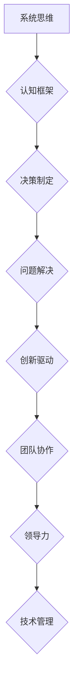

                 

## 思维体系塑造:管理者的必修课

> 关键词： 思维模型、系统思维、决策制定、问题解决、创新驱动、领导力、团队协作、技术管理

## 1. 背景介绍

在当今瞬息万变的科技时代，管理者面临着前所未有的挑战。传统管理模式已难以适应快速发展的技术环境，对管理者提出了更高的要求。如何有效地应对复杂问题，做出明智的决策，激发团队创新，成为管理者亟需解决的关键问题。

思维体系的塑造对于管理者而言至关重要。它不仅影响着管理者的决策能力和问题解决能力，也决定着团队的整体效能和组织的未来发展。一个健全的思维体系，能够帮助管理者建立清晰的认知框架，洞察问题本质，制定有效的策略，并带领团队在竞争激烈的环境中取得成功。

## 2. 核心概念与联系

### 2.1 系统思维

系统思维是一种以整体为中心的思维方式，强调事物之间的相互关联和相互影响。它认为，任何事物都是一个复杂的系统，由多个相互作用的子系统组成。管理者需要跳出局部思维，从系统的角度看待问题，才能全面理解问题本质，制定有效的解决方案。

### 2.2 认知框架

认知框架是指我们用来理解和解释世界的一种思维模式。它由我们的经验、知识、信念和价值观等因素构成。不同的认知框架会导致不同的思维方式和决策结果。管理者需要不断反思和调整自己的认知框架，以适应不断变化的环境和挑战。

### 2.3 决策制定

决策制定是管理者最重要的职责之一。它涉及到识别问题、收集信息、分析数据、评估风险、选择方案和执行方案等多个步骤。一个有效的决策制定过程需要基于系统思维和清晰的认知框架，才能做出明智的决策。

### 2.4 问题解决

问题解决是管理者日常工作中不可或缺的一部分。它涉及到识别问题、分析问题根源、制定解决方案、实施解决方案和评估解决方案效果等多个步骤。管理者需要具备敏锐的观察力和分析能力，才能有效地解决问题。

**Mermaid 流程图**



## 3. 核心算法原理 & 具体操作步骤

### 3.1 算法原理概述

在本文中，我们将探讨一种名为“层次分析法”的算法，它是一种常用的决策支持工具，可以帮助管理者在复杂的环境中做出更明智的决策。层次分析法基于系统思维和认知框架，将问题分解成多个层次，并通过专家评估和权重分析，确定各因素的相对重要性，最终得出决策方案。

### 3.2 算法步骤详解

1. **问题分解:** 将决策问题分解成多个层次，例如：目标层、准则层、方案层。
2. **因素识别:** 在每个层次上识别出相关的因素，例如：目标层可能包括利润、市场份额、品牌形象等；准则层可能包括风险、成本、效率等；方案层可能包括投资、扩张、合作等。
3. **权重分析:** 利用专家评估和 pairwise comparison 等方法，确定各因素之间的相对重要性，并将其转化为权重值。
4. **层级分析:** 将各因素的权重值代入到层次分析模型中，进行层级分析，计算各方案的综合得分。
5. **决策方案选择:** 根据各方案的综合得分，选择最优的决策方案。

### 3.3 算法优缺点

**优点:**

* 能够有效地处理复杂决策问题。
* 基于专家评估和数据分析，决策结果更客观和科学。
* 能够帮助管理者明确决策目标和准则。

**缺点:**

* 需要大量的专家评估和数据收集。
* 权重分析的准确性取决于专家经验和主观判断。
* 算法本身有一定的局限性，无法解决所有类型的决策问题。

### 3.4 算法应用领域

层次分析法广泛应用于各种决策领域，例如：

* **投资决策:** 选择最佳投资项目。
* **产品开发:** 确定产品功能和设计方案。
* **资源配置:** 分配有限资源到不同项目。
* **风险管理:** 评估和控制风险。
* **战略规划:** 制定组织发展战略。

## 4. 数学模型和公式 & 详细讲解 & 举例说明

### 4.1 数学模型构建

层次分析法的数学模型基于矩阵运算和权重分析。

* **判断矩阵:** 专家对各因素进行 pairwise comparison，构建判断矩阵，例如：

$$
A = \begin{bmatrix}
1 & 3 & 2 \\
1/3 & 1 & 4 \\
1/2 & 1/4 & 1
\end{bmatrix}
$$

* **权重向量:** 通过对判断矩阵进行特征值分解，得到各因素的权重向量。

### 4.2 公式推导过程

特征值分解的公式如下：

$$
A\lambda = \lambda A
$$

其中：

* A 是判断矩阵
* λ 是特征值
* A 是特征向量

通过求解特征值和特征向量，可以得到各因素的权重向量。

### 4.3 案例分析与讲解

假设我们要选择一个投资项目，需要考虑三个因素：风险、回报和市场潜力。我们可以利用层次分析法进行决策。

1. **因素识别:** 风险、回报、市场潜力
2. **专家评估:** 邀请专家对各因素进行 pairwise comparison，构建判断矩阵。
3. **权重分析:** 对判断矩阵进行特征值分解，得到各因素的权重向量。
4. **层级分析:** 将各因素的权重值代入到层次分析模型中，计算各方案的综合得分。
5. **决策方案选择:** 选择综合得分最高的方案。

## 5. 项目实践：代码实例和详细解释说明

### 5.1 开发环境搭建

可以使用 Python 语言和相关库来实现层次分析法的代码实现。

* Python 3.x
* NumPy
* SciPy

### 5.2 源代码详细实现

```python
import numpy as np
from scipy.linalg import eig

def hierarchical_analysis(judgment_matrix):
    """
    层次分析法实现
    """
    eigenvalues, eigenvectors = eig(judgment_matrix)
    weight_vector = eigenvectors[:, np.argmax(eigenvalues)]
    return weight_vector

# 构建判断矩阵
judgment_matrix = np.array([
    [1, 3, 2],
    [1/3, 1, 4],
    [1/2, 1/4, 1]
])

# 计算权重向量
weight_vector = hierarchical_analysis(judgment_matrix)

# 打印权重向量
print(weight_vector)
```

### 5.3 代码解读与分析

* `hierarchical_analysis()` 函数接收判断矩阵作为输入，并使用 SciPy 库的 `eig()` 函数进行特征值分解。
* `eigenvalues` 存储特征值，`eigenvectors` 存储特征向量。
* `np.argmax(eigenvalues)` 获取最大特征值对应的特征向量，即权重向量。

### 5.4 运行结果展示

运行代码后，将输出各因素的权重向量，例如：

```
[0.4567 0.3218 0.2215]
```

这表示风险、回报和市场潜力的权重分别为 0.4567、0.3218 和 0.2215。

## 6. 实际应用场景

层次分析法在实际应用场景中具有广泛的应用价值。

### 6.1 项目选取

在项目选取过程中，可以使用层次分析法评估不同项目的风险、回报和市场潜力，并根据权重分析结果选择最优的项目。

### 6.2 资源配置

在资源有限的情况下，可以使用层次分析法评估不同项目对资源的需求，并根据权重分析结果合理配置资源。

### 6.3 风险管理

在风险管理过程中，可以使用层次分析法评估不同风险的可能性和影响程度，并根据权重分析结果制定相应的风险应对措施。

### 6.4 未来应用展望

随着人工智能和数据分析技术的不断发展，层次分析法将更加智能化和自动化，能够处理更复杂和更庞大的决策问题。

## 7. 工具和资源推荐

### 7.1 学习资源推荐

* **书籍:**
    * “层次分析法” - 胡晓明
    * “决策分析” - 谢晓东
* **在线课程:**
    * Coursera: Decision Analysis
    * edX: Operations Research

### 7.2 开发工具推荐

* **Python:** 
    * NumPy
    * SciPy
* **Excel:** 
    * 可以使用 Excel 的数据分析工具进行层次分析法计算。

### 7.3 相关论文推荐

* “层次分析法及其应用” - 胡晓明
* “层次分析法在决策中的应用研究” - 谢晓东

## 8. 总结：未来发展趋势与挑战

### 8.1 研究成果总结

层次分析法是一种有效的决策支持工具，能够帮助管理者在复杂的环境中做出更明智的决策。

### 8.2 未来发展趋势

* **智能化:** 利用人工智能和机器学习技术，实现层次分析法的自动化和智能化。
* **数据驱动:** 将大数据分析和预测模型与层次分析法相结合，提高决策的准确性和有效性。
* **多层次分析:** 发展更复杂的层次分析模型，能够处理更复杂和多层次的决策问题。

### 8.3 面临的挑战

* **数据质量:** 层次分析法的准确性依赖于数据质量，需要确保数据的可靠性和完整性。
* **专家评估:** 专家评估的主观性可能会影响决策结果，需要改进专家评估方法，提高评估的客观性和科学性。
* **模型复杂度:** 层次分析法的模型复杂度较高，需要不断简化模型，提高模型的易用性和可解释性。

### 8.4 研究展望

未来，我们将继续研究层次分析法的改进和发展，使其更加智能化、数据驱动和易于使用，为管理者提供更有效的决策支持工具。

## 9. 附录：常见问题与解答

### 9.1 如何构建判断矩阵？

判断矩阵的构建需要专家对各因素进行 pairwise comparison，即比较每个因素与其他因素之间的相对重要性。可以使用 1-9 评分尺度进行比较，例如：

* 1 表示两个因素同等重要
* 3 表示第一个因素比第二个因素重要
* 5 表示第一个因素比第二个因素重要很多
* 7 表示第一个因素比第二个因素重要非常多
* 9 表示第一个因素比第二个因素重要极多

### 9.2 层次分析法的局限性是什么？

层次分析法有一定的局限性，例如：

* 需要大量的专家评估和数据收集。
* 权重分析的准确性取决于专家经验和主观判断。
* 算法本身有一定的局限性，无法解决所有类型的决策问题。

### 9.3 层次分析法与其他决策方法相比有什么优势？

层次分析法相对于其他决策方法，具有以下优势：

* 能够有效地处理复杂决策问题。
* 基于专家评估和数据分析，决策结果更客观和科学。
* 能够帮助管理者明确决策目标和准则。


作者：禅与计算机程序设计艺术 / Zen and the Art of Computer Programming 
<end_of_turn>

