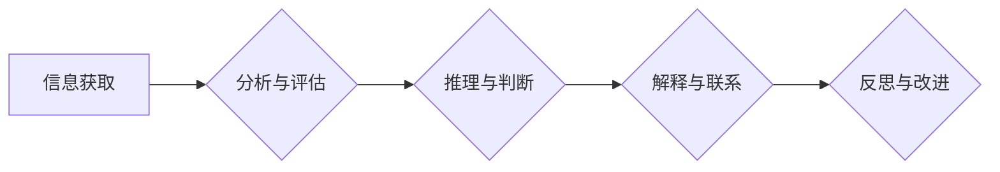

                 

## 批判性思维：提升洞察力的基石

> 关键词：批判性思维、洞察力、逻辑推理、问题解决、决策制定、算法、模型、实践应用

## 1. 背景介绍

在当今瞬息万变的科技时代，信息爆炸和复杂系统日益增长，对我们提出更高的要求，需要我们能够快速、准确地分析信息，做出明智的决策。批判性思维，作为一种高阶认知能力，在这样的背景下显得尤为重要。它不仅能帮助我们更好地理解世界，更能让我们在面对挑战时保持冷静，做出更有利于自身发展的选择。

批判性思维的核心在于质疑、分析和评估信息，而非盲目接受。它要求我们能够深入思考问题，识别潜在的偏差和假设，并基于证据进行合理的判断。对于技术领域而言，批判性思维是解决复杂问题、设计创新解决方案和推动技术进步的基石。

## 2. 核心概念与联系

批判性思维是一个多维度的概念，它包含了以下几个核心要素：

* **分析：** 将复杂的信息分解成更小的部分，以便更好地理解其结构和相互关系。
* **评估：** 对信息进行批判性评估，识别其可靠性、准确性和有效性。
* **推理：** 基于已有的信息和知识，进行逻辑推理，得出合理的结论。
* **解释：** 对信息进行解释和阐释，并将其与其他知识和经验联系起来。
* **反思：** 对自己的思维过程进行反思，识别潜在的偏差和盲点，并不断改进自己的思维方式。

这些要素相互关联，共同构成了批判性思维的框架。

**Mermaid 流程图：**



## 3. 核心算法原理 & 具体操作步骤

批判性思维并非一种固定的算法，它更像是一种思维方式和技能。然而，我们可以通过一些算法和模型来辅助我们进行批判性思维的训练和实践。

### 3.1  算法原理概述

**逻辑推理算法**是批判性思维的重要组成部分。它通过一系列逻辑规则，从已知的命题出发，推导出新的结论。常见的逻辑推理算法包括：

* **演绎推理：** 从一般性原理出发，推导出特例性结论。例如，所有哺乳动物都具有体温调节能力，狗是哺乳动物，所以狗具有体温调节能力。
* **归纳推理：** 从具体的实例出发，推导出一般性结论。例如，观察到许多鸟类都有羽毛，我们可以推断出所有鸟类都具有羽毛。
* ** Abductive Reasoning (演绎推理)：** 从观察到的现象出发，推导出最合理的解释。例如，看到地上有脚印，我们可以推断出有人经过这里。

### 3.2  算法步骤详解

**使用逻辑推理算法进行批判性思维的步骤如下：**

1. **识别问题：** 明确需要解决的问题或需要进行分析的信息。
2. **收集信息：** 收集与问题相关的各种信息，包括事实、数据、观点和证据。
3. **分析信息：** 将收集到的信息进行分析，识别其结构、关系和潜在的偏差。
4. **构建逻辑模型：** 根据问题和信息，构建一个逻辑模型，用以表示问题和信息之间的关系。
5. **进行推理：** 使用逻辑推理算法，从逻辑模型中推导出新的结论。
6. **评估结论：** 对推导出的结论进行评估，识别其可靠性、准确性和有效性。
7. **反思和改进：** 对自己的思维过程进行反思，识别潜在的偏差和盲点，并不断改进自己的思维方式。

### 3.3  算法优缺点

**逻辑推理算法的优点：**

* **严谨性：** 逻辑推理算法遵循严格的逻辑规则，可以帮助我们避免逻辑错误。
* **可重复性：** 逻辑推理过程是可重复的，其他人可以根据相同的逻辑规则和信息得出相同的结论。
* **可量化：** 逻辑推理算法可以量化分析信息和推理过程，帮助我们更好地理解问题和做出决策。

**逻辑推理算法的缺点：**

* **局限性：** 逻辑推理算法只能处理已知的知识和信息，无法处理未知或模糊的信息。
* **复杂性：** 对于复杂的问题，构建逻辑模型和进行推理可能非常复杂。
* **缺乏灵活性：** 逻辑推理算法缺乏灵活性，无法处理需要创造性思维和经验判断的问题。

### 3.4  算法应用领域

逻辑推理算法广泛应用于各种领域，例如：

* **人工智能：** 用于构建智能系统，例如聊天机器人、决策支持系统和自动推理系统。
* **自然语言处理：** 用于理解和分析自然语言文本，例如文本分类、情感分析和机器翻译。
* **数据库查询：** 用于处理复杂的数据库查询，例如关系型数据库和知识图谱。
* **医学诊断：** 用于辅助医生进行诊断，例如识别疾病模式和预测患者的病情发展。

## 4. 数学模型和公式 & 详细讲解 & 举例说明

批判性思维可以借助数学模型和公式进行量化分析和评估。例如，我们可以使用概率论和统计学来评估信息的可靠性和准确性。

### 4.1  数学模型构建

**贝叶斯定理**是概率论中的一个重要定理，它可以用来更新我们对事件发生的概率，基于新的证据。

$$P(A|B) = \frac{P(B|A)P(A)}{P(B)}$$

其中：

* $P(A|B)$ 是事件 A 在事件 B 发生的条件下的概率。
* $P(B|A)$ 是事件 B 在事件 A 发生的条件下的概率。
* $P(A)$ 是事件 A 的先验概率。
* $P(B)$ 是事件 B 的概率。

### 4.2  公式推导过程

贝叶斯定理的推导过程基于概率的基本定义和条件概率的性质。

### 4.3  案例分析与讲解

假设我们有一个疾病检测测试，该测试的准确率为 90%，即如果患者患有该疾病，测试结果为阳性的概率为 90%；如果患者没有患有该疾病，测试结果为阴性的概率为 90%。

如果我们随机抽取一个人进行测试，测试结果为阳性，那么这个人患有该疾病的概率是多少？

我们可以使用贝叶斯定理来计算：

* $P(A)$：患有该疾病的概率（假设为 1%）。
* $P(B|A)$：测试结果为阳性，且患有该疾病的概率（为 90%）。
* $P(B)$：测试结果为阳性的概率（需要计算）。

我们可以使用全概率公式计算 $P(B)$：

$$P(B) = P(B|A)P(A) + P(B|A^c)P(A^c)$$

其中：

* $A^c$ 表示患者没有患有该疾病。
* $P(B|A^c)$：测试结果为阳性，且没有患有该疾病的概率（为 10%）。
* $P(A^c)$：没有患有该疾病的概率（为 99%）。

计算得到 $P(B)$ 后，即可使用贝叶斯定理计算 $P(A|B)$，即患者患有该疾病的概率。

## 5. 项目实践：代码实例和详细解释说明

为了更好地理解批判性思维的应用，我们可以通过一个实际项目来进行实践。

### 5.1  开发环境搭建

我们可以使用 Python 语言和 Jupyter Notebook 环境进行开发。

### 5.2  源代码详细实现

```python
import numpy as np

# 假设我们有一个数据集，包含患者的症状和疾病诊断结果
data = np.array([
    [1, 0, 1, 0],  # 患者1：症状1、症状2、症状3、症状4，诊断结果为阴性
    [0, 1, 0, 1],  # 患者2：症状1、症状2、症状3、症状4，诊断结果为阳性
    [1, 0, 1, 0],  # 患者3：症状1、症状2、症状3、症状4，诊断结果为阴性
    [0, 1, 0, 1],  # 患者4：症状1、症状2、症状3、症状4，诊断结果为阳性
])

# 提取症状和诊断结果
symptoms = data[:, :3]
diagnosis = data[:, 3]

# 计算症状出现的频率
symptom_frequency = np.mean(symptoms, axis=0)

# 计算诊断结果的概率
positive_probability = np.mean(diagnosis)

# 使用贝叶斯定理计算患病概率
# ...
```

### 5.3  代码解读与分析

这段代码演示了如何使用贝叶斯定理来计算患病概率。

* 首先，我们定义了一个包含患者症状和诊断结果的数据集。
* 然后，我们提取症状和诊断结果，并计算症状出现的频率和诊断结果的概率。
* 最后，我们可以使用贝叶斯定理来计算患病概率。

### 5.4  运行结果展示

运行这段代码后，我们可以得到患者患病的概率。

## 6. 实际应用场景

批判性思维在各个领域都有广泛的应用场景，例如：

* **科学研究：** 科学家需要批判性地分析实验数据，识别潜在的偏差和误差，并得出合理的结论。
* **工程设计：** 工程师需要批判性地评估设计方案，识别潜在的风险和问题，并提出改进方案。
* **商业决策：** 商业人士需要批判性地分析市场趋势和竞争对手，做出明智的决策。
* **日常生活：** 在日常生活中，我们也需要批判性地思考问题，识别潜在的陷阱和误导，并做出明智的选择。

### 6.4  未来应用展望

随着人工智能和机器学习技术的不断发展，批判性思维将变得更加重要。人工智能系统可以帮助我们处理大量信息和进行数据分析，但它们仍然无法完全替代人类的批判性思维能力。

未来，批判性思维将与人工智能技术相结合，形成更强大的决策支持系统，帮助我们更好地应对复杂问题和挑战。

## 7. 工具和资源推荐

### 7.1  学习资源推荐

* **书籍：**
    * 《批判性思维：提升洞察力的基石》
    * 《思考，快与慢》
    * 《有效的阅读》
* **在线课程：**
    * Coursera 上的批判性思维课程
    * edX 上的逻辑推理课程

### 7.2  开发工具推荐

* **Python：** 作为一种通用的编程语言，Python 非常适合进行数据分析和机器学习。
* **Jupyter Notebook：** Jupyter Notebook 是一个交互式编程环境，可以方便地进行代码编写、数据分析和可视化。
* **NumPy：** NumPy 是 Python 的科学计算库，提供了高效的数组操作和数学函数。
* **Pandas：** Pandas 是 Python 的数据分析库，提供了强大的数据结构和数据处理功能。

### 7.3  相关论文推荐

* **"A Bayesian Approach to Critical Thinking"**
* **"The Role of Logic in Critical Thinking"**
* **"Critical Thinking and Artificial Intelligence"**

## 8. 总结：未来发展趋势与挑战

批判性思维是人类认知能力的重要组成部分，它将继续在未来发挥着重要的作用。随着科技的进步，批判性思维将与人工智能技术相结合，形成更强大的决策支持系统，帮助我们更好地应对复杂问题和挑战。

然而，批判性思维也面临着一些挑战，例如：

* **信息爆炸：** 随着信息的爆炸式增长，我们面临着信息过载的挑战，需要更加有效地筛选和评估信息。
* **认知偏差：** 人类思维存在着各种认知偏差，这些偏差可能会影响我们的判断和决策。
* **人工智能的局限性：** 尽管人工智能技术不断发展，但它仍然无法完全替代人类的批判性思维能力。

为了应对这些挑战，我们需要不断加强批判性思维的训练和实践，并积极探索新的方法和工具，以帮助我们更好地理解世界，做出明智的决策。

### 8.1  研究成果总结

近年来，对批判性思维的研究取得了显著进展，包括：

* **批判性思维模型的构建：** 研究者们提出了各种批判性思维模型，例如加州大学伯克利分校的批判性思维框架和哈佛大学的批判性思维能力模型。
* **批判性思维技能的评估方法：** 研究者们开发了各种批判性思维技能的评估方法，例如批判性思维测试和案例分析。
* **批判性思维的教育方法：** 研究者们探索了各种批判性思维的教育方法，例如辩论、案例研究和问题解决训练。

### 8.2  未来发展趋势

未来，批判性思维的研究将继续朝着以下几个方向发展：

* **更深入地理解批判性思维的机制：** 研究者们将继续探索批判性思维的认知机制，以更好地理解批判性思维是如何运作的。
* **开发更有效的批判性思维训练方法：** 研究者们将继续开发更有效的批判性思维训练方法，以帮助人们提高批判性思维能力。
* **将批判性思维与人工智能技术相结合：** 研究者们将探索将批判性思维与人工智能技术相结合，以开发更强大的决策支持系统。

### 8.3  面临的挑战

批判性思维的研究也面临着一些挑战：

* **批判性思维是一个复杂的概念：** 很难用简单的模型来描述批判性思维的全部内容。
* **批判性思维是一个多维度的能力：** 涉及到逻辑推理、分析、评估、解释和反思等多个方面。
* **批判性思维是一个动态的过程：** 需要不断地学习、反思和改进。

### 8.4  研究展望

尽管面临着挑战，但批判性思维的研究前景依然光明。随着科技的进步和人们对批判性思维重要性的认识不断提高，批判性思维的研究将取得更大的进展，为人类社会带来更多福祉。

## 9. 附录：常见问题与解答

**Q1：如何提高批判性思维能力？**

**A1：** 提高批判性思维能力需要不断地练习和训练。以下是一些建议：

* **多阅读：** 阅读不同类型的书籍和文章，可以帮助你接触到不同的观点和信息。
* **多思考：** 对你所阅读和听到的信息进行思考，质疑其真实性和可靠性。
* **多辩论：** 与他人进行辩论，可以帮助你锻炼逻辑推理和表达能力。
* **多练习：** 尝试解决各种问题，例如逻辑谜题、案例分析和决策问题。

**Q2：批判性思维与逻辑推理有什么区别？**

**A2：** 逻辑推理是批判性思维的一部分，但它并不等同于批判性思维。逻辑推理是指根据一定的逻辑规则，从已知信息推导出新的结论。而批判性思维则更广泛，它包括逻辑推理、分析、评估、解释和反思等多个方面。

**Q3：批判性思维在人工智能领域有什么应用？**

**A3：** 在人工智能领域，批判性思维可以用于：

* **数据分析：** 识别数据中的潜在偏差和误差。
* **模型评估：** 评估人工智能模型的准确性和可靠性。
* **决策支持：** 帮助人工智能系统做出更明智的决策。


作者：禅与计算机程序设计艺术 / Zen and the Art of Computer Programming<end_of_turn>

