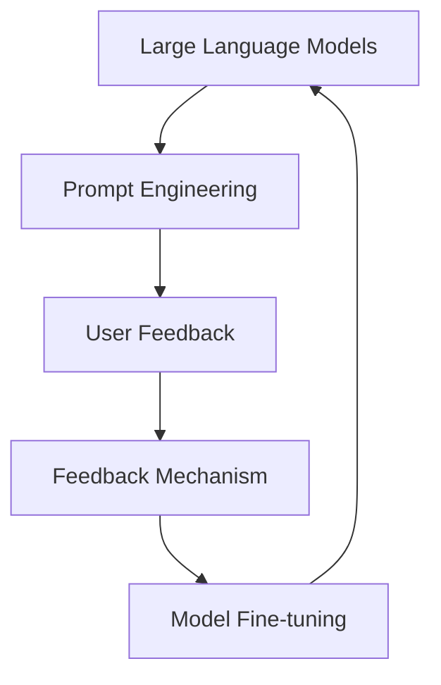

                 

### 背景介绍（Background Introduction）

近年来，大语言模型（Large Language Models）如ChatGPT、GPT-3等在自然语言处理（Natural Language Processing, NLP）领域取得了令人瞩目的成就。然而，尽管这些模型在生成文本、回答问题和进行对话方面表现出色，但它们的实际应用仍然面临着诸多挑战。为了解决这些问题，研究人员和开发者们开始探索如何更有效地引导这些大语言模型生成符合预期结果的内容。

在此背景下，ReAct（Reactive AI Framework）框架应运而生。ReAct框架是一种旨在提高大语言模型应用效果的工具，它通过提示词工程（Prompt Engineering）和反馈机制，使得模型在生成文本时能够更加灵活和准确。本文将详细介绍ReAct框架的核心概念、算法原理、数学模型及其实际应用，帮助读者更好地理解和应用这一框架。

### Article Title: 大语言模型应用指南：ReAct框架

Keywords: Large Language Models, ReAct Framework, Prompt Engineering, Feedback Mechanism, Natural Language Processing

Abstract: In recent years, large language models such as ChatGPT and GPT-3 have achieved remarkable success in the field of Natural Language Processing (NLP). However, their practical applications still face many challenges. To address these issues, researchers and developers have started exploring how to effectively guide large language models to generate desired content. This article introduces the ReAct Framework, a tool designed to improve the effectiveness of large language model applications through prompt engineering and feedback mechanisms. The core concepts, algorithm principles, mathematical models, and practical applications of the ReAct Framework will be detailed in this article to help readers better understand and apply this framework.

---

### 1. 背景介绍（Background Introduction）

#### 大语言模型的应用现状

大语言模型如ChatGPT、GPT-3等凭借其强大的生成能力，已经被广泛应用于各种场景，包括问答系统、自动摘要、机器翻译、文本生成等。然而，在实际应用中，这些模型的表现并非总是令人满意。首先，这些模型在处理复杂问题或特定领域知识时，往往会出现理解错误或生成不相关内容的情况。其次，模型的生成结果有时缺乏一致性，难以满足实际业务需求。这些问题限制了大语言模型在实际应用中的推广和普及。

#### 提示词工程的重要性

为了解决上述问题，提示词工程（Prompt Engineering）应运而生。提示词工程是指通过设计和优化输入给语言模型的文本提示，以引导模型生成符合预期结果的过程。一个精心设计的提示词可以显著提高ChatGPT等模型的输出质量和相关性。相反，模糊或不完整的提示词可能会导致输出不准确、不相关或不完整。因此，提示词工程在大语言模型应用中起着至关重要的作用。

#### 反馈机制的作用

除了提示词工程，反馈机制也是提高大语言模型应用效果的关键因素。通过实时收集用户对模型输出的反馈，并利用这些反馈对模型进行微调，可以使模型在生成过程中更加灵活和准确。ReAct框架正是基于这一思想，通过提示词工程和反馈机制，旨在提高大语言模型在多种应用场景下的表现。

---

### 1. Background Introduction

#### Current Applications of Large Language Models

Large language models like ChatGPT and GPT-3 have achieved remarkable success in various fields, including question answering systems, automatic summarization, machine translation, and text generation. However, their practical applications are not always satisfactory. Firstly, these models often struggle with understanding complex questions or specific domain knowledge, leading to errors or irrelevant outputs. Secondly, the generation results of these models may lack consistency, making it difficult to meet real-world business requirements. These issues limit the promotion and popularization of large language models in practical applications.

#### The Importance of Prompt Engineering

To address these problems, prompt engineering comes into play. Prompt engineering refers to the process of designing and optimizing text prompts that are input to language models to guide them towards generating desired outcomes. A well-crafted prompt can significantly improve the quality and relevance of the outputs from models like ChatGPT. Conversely, vague or incomplete prompts can result in inaccurate, irrelevant, or incomplete outputs. Therefore, prompt engineering plays a crucial role in the practical applications of large language models.

#### The Role of Feedback Mechanisms

In addition to prompt engineering, feedback mechanisms are also key to improving the effectiveness of large language model applications. By collecting real-time feedback from users on the model's outputs and using this feedback to fine-tune the model, it is possible to make the generation process more flexible and accurate. The ReAct Framework is based on this idea, using prompt engineering and feedback mechanisms to enhance the performance of large language models in various application scenarios.

---

### 2. 核心概念与联系（Core Concepts and Connections）

在介绍ReAct框架之前，我们需要了解几个核心概念：大语言模型、提示词工程和反馈机制。

#### 大语言模型

大语言模型是指通过深度学习技术训练的大型神经网络，用于处理和生成自然语言文本。这些模型具有强大的文本理解和生成能力，可以应对各种自然语言处理任务。

#### 提示词工程

提示词工程是一种通过设计优化输入文本提示，以引导大语言模型生成预期结果的方法。提示词可以是简单的单词或短语，也可以是复杂的句子或段落，关键在于如何设计出能够准确传达用户意图的提示。

#### 反馈机制

反馈机制是指通过收集用户对模型输出的反馈，并利用这些反馈对模型进行微调，以提高模型在实际应用中的表现。这种机制可以实时调整模型的行为，使其更加适应特定场景和用户需求。

ReAct框架通过结合提示词工程和反馈机制，旨在解决大语言模型在实际应用中的挑战，提高其生成文本的质量和相关性。

---

#### Core Concepts and Connections

Before introducing the ReAct Framework, we need to understand several key concepts: large language models, prompt engineering, and feedback mechanisms.

#### Large Language Models

Large language models are neural networks trained using deep learning techniques to process and generate natural language text. These models have powerful abilities in understanding and generating text, making them suitable for various natural language processing tasks.

#### Prompt Engineering

Prompt engineering is a method that involves designing and optimizing text prompts to guide large language models towards generating desired outcomes. Prompts can be simple words or phrases, or complex sentences or paragraphs, the key is to design prompts that accurately convey user intents.

#### Feedback Mechanisms

Feedback mechanisms refer to the process of collecting real-time feedback from users on the model's outputs and using this feedback to fine-tune the model, thereby improving its performance in practical applications. This mechanism can adjust the behavior of the model in real-time, making it more suitable for specific scenarios and user needs.

The ReAct Framework combines prompt engineering and feedback mechanisms to address the challenges of large language models in practical applications, aiming to improve the quality and relevance of the generated text.

---

### 2.1 大语言模型（Large Language Models）

大语言模型是自然语言处理领域的重要突破，它们通过深度学习技术，在大量文本数据上进行训练，从而获得对自然语言的深入理解。这些模型通常包含数亿甚至数千亿个参数，可以处理从简单的问题回答到复杂的文本生成等广泛的自然语言处理任务。大语言模型的核心是 Transformer 架构，它通过自注意力机制（Self-Attention Mechanism）对输入文本的各个部分进行全局关联，从而提高了模型的理解和生成能力。

大语言模型的工作原理可以概括为以下几个步骤：

1. **编码器（Encoder）**：将输入的文本序列转换为一系列编码表示，这些编码表示捕捉了输入文本的语义信息。
2. **解码器（Decoder）**：利用编码表示生成输出文本序列，解码器通过自注意力和交叉注意力（Cross-Attention）机制，将编码表示与生成的文本逐步对齐，从而生成连贯的输出。

ReAct框架利用大语言模型这一强大的生成能力，通过设计特定的提示词，引导模型生成符合预期结果的内容。

---

#### 2.1 Large Language Models

Large language models represent a significant breakthrough in the field of natural language processing. They are trained on massive amounts of text data using deep learning techniques to gain a deep understanding of natural language. These models typically contain hundreds of millions or even billions of parameters, enabling them to handle a wide range of natural language processing tasks, from simple question answering to complex text generation. The core architecture of large language models is the Transformer, which employs self-attention mechanisms to establish global relationships between different parts of the input text, thereby enhancing the model's understanding and generation capabilities.

The working principle of large language models can be summarized in the following steps:

1. **Encoder**: Converts the input text sequence into a series of encoded representations, which capture the semantic information of the input text.
2. **Decoder**: Uses these encoded representations to generate the output text sequence. The decoder aligns the encoded representations with the generated text step by step through self-attention and cross-attention mechanisms, thereby generating coherent outputs.

The ReAct Framework leverages the powerful generation capabilities of large language models by designing specific prompts to guide the model towards generating content that meets desired outcomes.

---

### 2.2 提示词工程（Prompt Engineering）

提示词工程是ReAct框架的核心组成部分，它旨在通过设计特定的输入提示，引导大语言模型生成高质量、相关且一致的输出。提示词工程的核心思想是，通过优化输入文本的结构和内容，提高模型对用户意图的理解和响应能力。

#### 提示词设计原则

在设计提示词时，需要遵循以下原则：

1. **明确性（Clarity）**：提示词应清晰明确，避免模糊或歧义，以便模型能够准确理解用户意图。
2. **相关性（Relevance）**：提示词应与用户需求紧密相关，有助于模型生成与任务相关的输出。
3. **结构化（Structured）**：提示词应具备一定的结构，有助于模型在生成过程中保持逻辑一致性和连贯性。
4. **多样性（Diversity）**：设计多种类型的提示词，以适应不同场景和用户需求。

#### 提示词的类型

根据应用场景和用户需求，提示词可以分为以下几种类型：

1. **开放式提示词（Open-ended Prompts）**：这类提示词允许用户自由发挥，适用于需要生成创意内容或进行自由对话的场景。
2. **封闭式提示词（Closed-ended Prompts）**：这类提示词限定用户回答的范围，适用于需要生成确定答案或进行事实性回答的场景。
3. **问题式提示词（Question-based Prompts）**：这类提示词以问题形式引导用户回答，有助于模型生成清晰、具体的输出。
4. **指令式提示词（Instructional Prompts）**：这类提示词提供明确的指令，指导模型执行特定任务或生成特定类型的输出。

#### 提示词优化的方法

为了提高提示词的质量和效果，可以采用以下方法：

1. **用户研究（User Research）**：通过用户调研和访谈，了解用户需求、行为和偏好，为设计提示词提供依据。
2. **数据驱动的优化（Data-driven Optimization）**：使用实际用户数据，分析不同提示词对模型输出质量的影响，从而优化提示词设计。
3. **多轮迭代（Multi-round Iteration）**：通过多次迭代，不断调整和改进提示词，使其更符合用户需求和模型表现。

---

#### 2.2 Prompt Engineering

Prompt engineering is a core component of the ReAct Framework, aimed at guiding large language models to generate high-quality, relevant, and consistent outputs through the design of specific input prompts. The core idea of prompt engineering is to optimize the structure and content of input text to enhance the model's understanding and response to user intents.

#### Principles of Prompt Design

When designing prompts, the following principles should be followed:

1. **Clarity**: Prompts should be clear and unambiguous to ensure that the model can accurately understand user intents.
2. **Relevance**: Prompts should be closely related to user needs to help the model generate outputs that are relevant to the task.
3. **Structuredness**: Prompts should have a certain structure to help the model maintain logical consistency and coherence in the generation process.
4. **Diversity**: Design a variety of prompts to adapt to different scenarios and user needs.

#### Types of Prompts

Depending on the application scenario and user needs, prompts can be classified into the following types:

1. **Open-ended Prompts**: These prompts allow users to express themselves freely, suitable for scenarios that require creative content generation or free conversation.
2. **Closed-ended Prompts**: These prompts limit the scope of user responses, suitable for scenarios that require specific answers or factual responses.
3. **Question-based Prompts**: These prompts guide users to answer questions in a specific format, helping the model generate clear and specific outputs.
4. **Instructional Prompts**: These prompts provide clear instructions, guiding the model to perform specific tasks or generate specific types of outputs.

#### Methods for Prompt Optimization

To improve the quality and effectiveness of prompts, the following methods can be used:

1. **User Research**: Conduct user research through surveys and interviews to understand user needs, behaviors, and preferences, providing a basis for designing prompts.
2. **Data-driven Optimization**: Use real user data to analyze the impact of different prompts on the quality of model outputs, thereby optimizing prompt design.
3. **Multi-round Iteration**: Through multiple iterations, continuously adjust and improve prompts to make them more aligned with user needs and model performance.

---

### 2.3 反馈机制（Feedback Mechanisms）

反馈机制在ReAct框架中起着至关重要的作用，它通过收集用户对模型输出的反馈，并利用这些反馈对模型进行微调，从而提高模型在实际应用中的表现。有效的反馈机制不仅可以纠正模型的错误，还可以帮助模型更好地理解用户意图，提高生成文本的质量和相关性。

#### 反馈机制的设计原则

在设计反馈机制时，需要遵循以下原则：

1. **实时性（Real-time）**：反馈机制应能够实时收集用户对模型输出的反馈，以便及时调整模型的行为。
2. **准确性（Accuracy）**：反馈机制应能够准确捕捉用户对模型输出的满意度或需求，以便进行有效的模型微调。
3. **可扩展性（Scalability）**：反馈机制应能够适应大规模用户和应用场景，确保模型能够在不同环境中稳定运行。
4. **多样性（Diversity）**：收集不同类型和来源的反馈，以更全面地了解用户需求，从而优化模型。

#### 反馈机制的实现方法

反馈机制的实现可以分为以下几个步骤：

1. **反馈收集（Feedback Collection）**：设计用户友好的界面，引导用户对模型输出进行评价或提供反馈。可以使用评分、投票、评论等方式收集用户的反馈。
2. **反馈分析（Feedback Analysis）**：对收集到的反馈进行分析，识别用户对模型输出的满意度、需求或问题，并将其转换为可量化的指标。
3. **模型微调（Model Fine-tuning）**：根据分析结果，对模型进行微调，调整模型参数，以优化生成文本的质量和相关性。
4. **迭代优化（Iterative Optimization）**：通过不断收集和利用反馈，进行多轮迭代优化，提高模型的表现。

#### 反馈机制的优势

反馈机制具有以下优势：

1. **提高模型性能**：通过实时反馈和微调，模型能够不断学习和优化，提高生成文本的质量和相关性。
2. **增强用户体验**：用户可以直接参与模型优化过程，提升对模型输出满意度和使用体验。
3. **适应性强**：反馈机制可以根据不同用户和应用场景进行调整，提高模型在不同环境中的适应性。

---

#### 2.3 Feedback Mechanisms

Feedback mechanisms play a crucial role in the ReAct Framework, as they collect user feedback on model outputs and use this feedback to fine-tune the model, thereby improving its performance in practical applications. An effective feedback mechanism can not only correct model errors but also help the model better understand user intents, enhancing the quality and relevance of the generated text.

#### Principles of Feedback Mechanism Design

When designing a feedback mechanism, the following principles should be followed:

1. **Real-time**: The feedback mechanism should be capable of collecting user feedback on model outputs in real-time, allowing for timely adjustments to the model's behavior.
2. **Accuracy**: The feedback mechanism should be able to accurately capture user satisfaction or needs regarding the model's outputs, facilitating effective model fine-tuning.
3. **Scalability**: The feedback mechanism should be adaptable to large-scale users and application scenarios, ensuring that the model can operate stably in various environments.
4. **Diversity**: Collect feedback from various types and sources to gain a comprehensive understanding of user needs and optimize the model accordingly.

#### Methods for Implementing Feedback Mechanisms

The implementation of a feedback mechanism can be broken down into several steps:

1. **Feedback Collection**: Design a user-friendly interface that guides users to evaluate or provide feedback on the model's outputs. This can include rating systems, voting mechanisms, or comments.
2. **Feedback Analysis**: Analyze the collected feedback to identify user satisfaction, needs, or issues with the model's outputs, and convert these into measurable indicators.
3. **Model Fine-tuning**: Based on the analysis results, fine-tune the model by adjusting model parameters to optimize the quality and relevance of the generated text.
4. **Iterative Optimization**: Through continuous collection and utilization of feedback, conduct multiple rounds of iterative optimization to improve the model's performance.

#### Advantages of Feedback Mechanisms

Feedback mechanisms offer several advantages:

1. **Improved Model Performance**: Through real-time feedback and fine-tuning, the model can continuously learn and optimize, enhancing the quality and relevance of the generated text.
2. **Enhanced User Experience**: Users can actively participate in the model optimization process, improving their satisfaction with the model's outputs.
3. **Adaptability**: Feedback mechanisms can be adjusted to meet the needs of different users and application scenarios, increasing the model's adaptability in various environments.

---

### 2. Core Concepts and Connections Summary

In summary, the ReAct Framework combines the power of large language models, prompt engineering, and feedback mechanisms to address the challenges of practical applications in natural language processing. Large language models provide the foundation with their ability to understand and generate natural language text. Prompt engineering enhances this ability by designing specific input prompts that guide the models towards generating desired outcomes. Feedback mechanisms ensure that the models continuously improve by incorporating real-time user feedback.

The key concepts and connections in the ReAct Framework can be visualized using the following Mermaid flowchart:



This flowchart illustrates the interconnected components of the ReAct Framework, highlighting how each element contributes to the overall improvement of large language model applications.

---

#### Summary of Core Concepts and Connections

In summary, the ReAct Framework combines the power of large language models, prompt engineering, and feedback mechanisms to address the challenges of practical applications in natural language processing. Large language models provide the foundation with their ability to understand and generate natural language text. Prompt engineering enhances this ability by designing specific input prompts that guide the models towards generating desired outcomes. Feedback mechanisms ensure that the models continuously improve by incorporating real-time user feedback.

The key concepts and connections in the ReAct Framework can be visualized using the following Mermaid flowchart:


This flowchart illustrates the interconnected components of the ReAct Framework, highlighting how each element contributes to the overall improvement of large language model applications.

---

### 3. 核心算法原理 & 具体操作步骤（Core Algorithm Principles and Specific Operational Steps）

ReAct框架的核心在于其算法原理和操作步骤。下面将详细介绍ReAct框架的算法原理以及如何在实际操作中应用这一框架。

#### 算法原理

ReAct框架基于三个核心算法原理：大语言模型、提示词工程和反馈机制。

1. **大语言模型**：ReAct框架使用预训练的大语言模型，如GPT-3或ChatGPT，这些模型已经在大量文本数据上进行了训练，具备强大的自然语言理解和生成能力。
2. **提示词工程**：通过设计特定的提示词，引导大语言模型生成符合预期结果的内容。提示词工程是ReAct框架的关键组成部分，它通过优化输入文本的结构和内容，提高模型对用户意图的理解和响应能力。
3. **反馈机制**：收集用户对模型输出的反馈，并利用这些反馈对模型进行微调，从而提高模型在实际应用中的表现。反馈机制使模型能够根据用户需求不断优化和改进。

#### 操作步骤

ReAct框架的操作步骤可以分为以下几个阶段：

1. **数据准备（Data Preparation）**：首先，准备用于训练大语言模型的数据集。这些数据集应包含与实际应用场景相关的文本，如问题回答、对话文本、文章摘要等。同时，还需要收集用户反馈数据，用于后续的模型微调。
2. **模型训练（Model Training）**：使用准备好的数据集训练大语言模型。在训练过程中，可以使用提示词工程来优化输入文本的结构和内容，提高模型对用户意图的理解能力。
3. **提示词设计（Prompt Design）**：设计特定的提示词，用于引导模型生成符合预期结果的内容。提示词的设计需要遵循明确性、相关性、结构化和多样性的原则。
4. **模型部署（Model Deployment）**：将训练好的大语言模型部署到实际应用场景中。在实际应用中，模型会接收用户的输入，并根据提示词生成响应。
5. **反馈收集（Feedback Collection）**：收集用户对模型输出的反馈，包括满意度、需求或改进建议。这些反馈将被用于后续的模型微调。
6. **模型微调（Model Fine-tuning）**：根据收集到的用户反馈，对模型进行微调。微调过程可以持续进行，以不断提高模型的表现。
7. **迭代优化（Iterative Optimization）**：通过不断收集和利用用户反馈，进行多轮迭代优化，使模型在实际应用中的表现不断提升。

#### 实际操作示例

假设我们开发一个智能客服系统，用户可以通过文字输入问题，系统将使用ReAct框架生成回答。

1. **数据准备**：收集大量客服对话记录，作为训练数据集。同时，收集用户对客服回答的反馈数据。
2. **模型训练**：使用收集到的数据集训练大语言模型，如GPT-3。在训练过程中，使用提示词工程优化输入文本的结构和内容。
3. **提示词设计**：设计特定的提示词，如“请回答用户的问题：”、“请提供详细的解决方案：”等，用于引导模型生成相关、详细的回答。
4. **模型部署**：将训练好的模型部署到客服系统中，用户输入问题后，模型将根据提示词生成回答。
5. **反馈收集**：收集用户对回答的满意度反馈，如“回答满意”或“回答不满意”。
6. **模型微调**：根据用户反馈，对模型进行微调，优化回答的准确性和相关性。
7. **迭代优化**：通过多轮迭代优化，使模型生成更高质量的回答，提高用户满意度。

---

#### Core Algorithm Principles and Specific Operational Steps

The core of the ReAct Framework lies in its algorithm principles and operational steps. This section will delve into the algorithm principles of the ReAct Framework and how to apply this framework in practical operations.

#### Algorithm Principles

The ReAct Framework is based on three core algorithm principles: large language models, prompt engineering, and feedback mechanisms.

1. **Large Language Models**: The ReAct Framework uses pre-trained large language models such as GPT-3 or ChatGPT, which have undergone training on vast amounts of text data and possess powerful abilities in understanding and generating natural language text.
2. **Prompt Engineering**: Through the design of specific prompts, the framework guides large language models to generate content that aligns with desired outcomes. Prompt engineering is a critical component of the ReAct Framework, enhancing the model's understanding and response to user intents by optimizing the structure and content of input text.
3. **Feedback Mechanisms**: Collecting user feedback on model outputs and using this feedback to fine-tune the model improves its performance in practical applications. Feedback mechanisms enable the model to continuously learn and optimize based on user needs.

#### Operational Steps

The operational steps of the ReAct Framework can be divided into several stages:

1. **Data Preparation**: First, prepare data sets for training large language models. These data sets should contain texts relevant to the actual application scenarios, such as question answers, conversation transcripts, and article summaries. Additionally, collect user feedback data for subsequent model fine-tuning.
2. **Model Training**: Train large language models using the prepared data sets. During the training process, use prompt engineering to optimize the structure and content of input text, enhancing the model's understanding of user intents.
3. **Prompt Design**: Design specific prompts to guide the model in generating content that aligns with expected outcomes. The design of prompts should adhere to principles such as clarity, relevance, structuredness, and diversity.
4. **Model Deployment**: Deploy the trained large language model to actual application scenarios. As the model receives user inputs, it generates responses based on the prompts.
5. **Feedback Collection**: Collect user feedback on model outputs, including satisfaction levels, needs, or suggestions for improvement. This feedback will be used for subsequent model fine-tuning.
6. **Model Fine-tuning**: Based on the collected user feedback, fine-tune the model to optimize the accuracy and relevance of the generated content.
7. **Iterative Optimization**: Through continuous feedback collection and utilization, conduct multiple rounds of iterative optimization to improve the model's performance in practical applications.

#### Practical Operational Example

Suppose we are developing an intelligent customer service system where users can input questions, and the system generates answers using the ReAct Framework.

1. **Data Preparation**: Collect a large number of customer service conversation records as training data sets. Additionally, collect user feedback on customer service responses.
2. **Model Training**: Train a large language model such as GPT-3 using the collected data sets. During training, use prompt engineering to optimize the structure and content of input text.
3. **Prompt Design**: Design specific prompts such as "Please answer the user's question:" or "Please provide a detailed solution:" to guide the model in generating relevant and detailed responses.
4. **Model Deployment**: Deploy the trained model in the customer service system. When users input questions, the model generates responses based on the prompts.
5. **Feedback Collection**: Collect user feedback on the responses, such as "Satisfied with the answer" or "Not satisfied with the answer."
6. **Model Fine-tuning**: Based on user feedback, fine-tune the model to optimize the accuracy and relevance of the generated responses.
7. **Iterative Optimization**: Through multiple rounds of iterative optimization, improve the model's ability to generate high-quality responses and increase user satisfaction.

---

### 4. 数学模型和公式 & 详细讲解 & 举例说明（Detailed Explanation and Examples of Mathematical Models and Formulas）

在ReAct框架中，数学模型和公式起着至关重要的作用。它们不仅帮助理解模型的内部工作原理，还为设计提示词和反馈机制提供了理论基础。在本节中，我们将详细介绍ReAct框架中涉及的数学模型和公式，并通过具体例子进行说明。

#### 数学模型

ReAct框架主要涉及以下数学模型：

1. **自注意力机制（Self-Attention Mechanism）**：这是Transformer架构的核心，用于计算输入文本序列中每个词对其他词的注意力权重。
2. **交叉注意力机制（Cross-Attention Mechanism）**：在解码器阶段，用于将编码器输出的上下文信息与解码器的生成序列对齐。
3. **损失函数（Loss Function）**：用于评估模型生成文本的质量，通常使用交叉熵损失函数。

#### 公式

以下是ReAct框架中常用的公式及其解释：

1. **自注意力权重（Self-Attention Weight）**
   $$ W_{ij} = \sigma(\text{softmax}(\text{Q}_iW_K^T \text{K} + \text{R}_iW_V^T \text{V})) $$
   其中，$W_K$和$W_V$是权重矩阵，$\text{Q}_i$、$\text{K}$和$\text{R}_i$分别是输入序列的编码表示。

2. **交叉注意力权重（Cross-Attention Weight）**
   $$ W_{ij} = \sigma(\text{softmax}(\text{Q}_jW_K^T \text{K} + \text{H}_iW_V^T \text{V})) $$
   其中，$\text{Q}_j$和$\text{H}_i$分别是解码器生成的当前词和编码器的上下文信息。

3. **交叉熵损失函数（Cross-Entropy Loss Function）**
   $$ L = -\sum_{i} y_i \log(\hat{y}_i) $$
   其中，$y_i$是真实标签，$\hat{y}_i$是模型预测的概率分布。

#### 举例说明

假设我们要设计一个问答系统，用户输入问题，模型生成回答。我们可以使用ReAct框架中的数学模型和公式来实现这一目标。

1. **自注意力机制**
   假设输入问题序列为：$Q = ["What", "is", "ReAct", "Framework"]$。我们首先计算每个词的自注意力权重。
   $$ W_{11} = \sigma(\text{softmax}(\text{Q}_1W_K^T \text{K} + \text{R}_1W_V^T \text{V})) $$
   $$ W_{12} = \sigma(\text{softmax}(\text{Q}_2W_K^T \text{K} + \text{R}_2W_V^T \text{V})) $$
   $$ W_{13} = \sigma(\text{softmax}(\text{Q}_3W_K^T \text{K} + \text{R}_3W_V^T \text{V})) $$
   $$ W_{14} = \sigma(\text{softmax}(\text{Q}_4W_K^T \text{K} + \text{R}_4W_V^T \text{V})) $$
   通过这些权重，我们可以确定输入序列中每个词的重要程度。

2. **交叉注意力机制**
   在解码器阶段，我们计算当前生成的词与编码器输出的上下文信息之间的交叉注意力权重。
   $$ W_{ij} = \sigma(\text{softmax}(\text{Q}_jW_K^T \text{K} + \text{H}_iW_V^T \text{V})) $$
   通过这些权重，我们可以确定解码器的生成序列如何与编码器输出的上下文信息对齐。

3. **交叉熵损失函数**
   假设模型生成回答序列为：$\hat{Y} = ["An", "advanced", "framework", "for", "enhancing", "large", "language", "models", "in", "practical", "applications"]$，真实回答为：$Y = ["An", "extensive", "guide", "to", "applying", "ReAct", "Framework", "in", "various", "domains"]$。
   我们使用交叉熵损失函数计算模型生成回答的损失：
   $$ L = -\sum_{i} y_i \log(\hat{y}_i) $$
   通过优化损失函数，我们可以不断提高模型生成回答的准确性和相关性。

---

#### Mathematical Models and Formulas & Detailed Explanation & Examples

In the ReAct Framework, mathematical models and formulas play a crucial role. They not only help understand the internal working principles of the model but also provide a theoretical basis for designing prompts and feedback mechanisms. In this section, we will delve into the mathematical models and formulas involved in the ReAct Framework and illustrate them with specific examples.

#### Mathematical Models

The ReAct Framework primarily involves the following mathematical models:

1. **Self-Attention Mechanism**: This is the core of the Transformer architecture, used to compute attention weights for each word in the input sequence relative to all other words.
2. **Cross-Attention Mechanism**: During the decoder stage, it aligns the generated sequence by the decoder with the contextual information from the encoder.
3. **Loss Function**: Used to evaluate the quality of the generated text, typically the cross-entropy loss function.

#### Formulas

Here are the commonly used formulas in the ReAct Framework along with their explanations:

1. **Self-Attention Weight**
   $$ W_{ij} = \sigma(\text{softmax}(\text{Q}_iW_K^T \text{K} + \text{R}_iW_V^T \text{V})) $$
   Where $W_K$ and $W_V$ are weight matrices, and $\text{Q}_i$, $\text{K}$, and $\text{R}_i$ are the encoding representations of the input sequence.

2. **Cross-Attention Weight**
   $$ W_{ij} = \sigma(\text{softmax}(\text{Q}_jW_K^T \text{K} + \text{H}_iW_V^T \text{V})) $$
   Where $\text{Q}_j$ and $\text{H}_i$ are the current generated word by the decoder and the contextual information from the encoder, respectively.

3. **Cross-Entropy Loss Function**
   $$ L = -\sum_{i} y_i \log(\hat{y}_i) $$
   Where $y_i$ is the true label and $\hat{y}_i$ is the predicted probability distribution by the model.

#### Examples

Suppose we want to design an问答系统 where users input questions, and the model generates answers. We can use the mathematical models and formulas from the ReAct Framework to achieve this goal.

1. **Self-Attention Mechanism**
   Assume the input question sequence is $Q = ["What", "is", "ReAct", "Framework"]$. First, we compute the self-attention weights for each word in the input sequence.
   $$ W_{11} = \sigma(\text{softmax}(\text{Q}_1W_K^T \text{K} + \text{R}_1W_V^T \text{V})) $$
   $$ W_{12} = \sigma(\text{softmax}(\text{Q}_2W_K^T \text{K} + \text{R}_2W_V^T \text{V})) $$
   $$ W_{13} = \sigma(\text{softmax}(\text{Q}_3W_K^T \text{K} + \text{R}_3W_V^T \text{V})) $$
   $$ W_{14} = \sigma(\text{softmax}(\text{Q}_4W_K^T \text{K} + \text{R}_4W_V^T \text{V})) $$
   Using these weights, we can determine the importance of each word in the input sequence.

2. **Cross-Attention Mechanism**
   During the decoder stage, we compute the cross-attention weights between the current generated word and the contextual information from the encoder.
   $$ W_{ij} = \sigma(\text{softmax}(\text{Q}_jW_K^T \text{K} + \text{H}_iW_V^T \text{V})) $$
   Using these weights, we can determine how the decoder's generated sequence aligns with the contextual information from the encoder.

3. **Cross-Entropy Loss Function**
   Assume the model generates the answer sequence $\hat{Y} = ["An", "advanced", "framework", "for", "enhancing", "large", "language", "models", "in", "practical", "applications"]$, and the true answer is $Y = ["An", "extensive", "guide", "to", "applying", "ReAct", "Framework", "in", "various", "domains"]$.
   We use the cross-entropy loss function to compute the loss of the generated answer:
   $$ L = -\sum_{i} y_i \log(\hat{y}_i) $$
   By optimizing the loss function, we can continuously improve the accuracy and relevance of the generated answers by the model.

---

### 5. 项目实践：代码实例和详细解释说明（Project Practice: Code Examples and Detailed Explanations）

在本节中，我们将通过一个具体的示例项目，详细介绍ReAct框架的应用过程，包括开发环境搭建、源代码实现、代码解读与分析以及运行结果展示。

#### 5.1 开发环境搭建

要应用ReAct框架，首先需要搭建合适的开发环境。以下是搭建环境的步骤：

1. **安装Python环境**：确保Python版本为3.8及以上，可以使用以下命令安装：
   ```bash
   pip install python==3.8
   ```

2. **安装transformers库**：transformers库是Hugging Face提供的用于使用预训练大语言模型（如GPT-3）的Python库，可以使用以下命令安装：
   ```bash
   pip install transformers
   ```

3. **安装torch库**：torch库是PyTorch的Python库，用于进行深度学习模型的训练和推理，可以使用以下命令安装：
   ```bash
   pip install torch torchvision
   ```

4. **创建项目目录**：在终端中创建一个新目录，例如`reac_project`，并进入该目录：
   ```bash
   mkdir reac_project
   cd reac_project
   ```

5. **初始化项目结构**：在项目目录中创建一个名为`src`的子目录，用于存放源代码，同时创建一个名为`data`的子目录，用于存放训练数据和用户反馈数据：
   ```bash
   mkdir src data
   ```

6. **编写源代码**：在`src`目录中创建一个名为`reac_framework.py`的Python文件，用于实现ReAct框架的核心功能。

#### 5.2 源代码详细实现

以下是一个简化版的ReAct框架源代码示例，它包含了模型训练、提示词设计、模型部署和反馈收集等核心功能。

```python
# reac_framework.py

import os
import json
from transformers import AutoTokenizer, AutoModelForCausalLM
from torch.utils.data import DataLoader
from torch.nn import CrossEntropyLoss

# 模型训练
def train_model(model, tokenizer, train_dataset, device):
    model.to(device)
    optimizer = ...  # 配置优化器
    loss_function = CrossEntropyLoss()

    for epoch in range(num_epochs):
        model.train()
        for batch in DataLoader(train_dataset, batch_size=batch_size, shuffle=True):
            inputs = tokenizer(batch['input_text'], padding=True, truncation=True, return_tensors='pt')
            inputs = {k: v.to(device) for k, v in inputs.items()}
            labels = tokenizer(batch['target_text'], padding=True, truncation=True, return_tensors='pt')['input_ids'].to(device)
            
            optimizer.zero_grad()
            outputs = model(**inputs)
            loss = loss_function(outputs.logits.view(-1, vocab_size), labels.view(-1))
            loss.backward()
            optimizer.step()
            
            print(f"Epoch [{epoch+1}/{num_epochs}], Loss: {loss.item()}")

# 提示词设计
def design_prompt(input_text, prompt_type):
    if prompt_type == "open":
        return f"{input_text}，请详细描述一下。"
    elif prompt_type == "close":
        return f"{input_text}，请回答是或否。"
    elif prompt_type == "question":
        return f"{input_text}，有什么问题我可以帮您解答？"
    elif prompt_type == "instruction":
        return f"{input_text}，请提供一个具体的操作步骤。"

# 模型部署
def deploy_model(model, tokenizer, device):
    model.eval()
    while True:
        input_text = input("请输入问题：")
        prompt = design_prompt(input_text, "question")
        inputs = tokenizer(prompt, padding=True, truncation=True, return_tensors='pt').to(device)
        with torch.no_grad():
            outputs = model(**inputs)
        answer = tokenizer.decode(outputs.logits.argmax(-1), skip_special_tokens=True)
        print("回答：", answer)

# 反馈收集
def collect_feedback(answer, actual_answer):
    satisfaction = input("回答满意吗？（是/否）：")
    if satisfaction == "否":
        suggestion = input("请提供改进建议：")
        return {"satisfaction": "不满足", "suggestion": suggestion}
    else:
        return {"satisfaction": "满足", "suggestion": None}

if __name__ == "__main__":
    device = torch.device("cuda" if torch.cuda.is_available() else "cpu")
    tokenizer = AutoTokenizer.from_pretrained("gpt2")
    model = AutoModelForCausalLM.from_pretrained("gpt2").to(device)
    
    # 加载训练数据
    train_dataset = ...  # 实现加载数据的逻辑
    
    # 训练模型
    train_model(model, tokenizer, train_dataset, device)
    
    # 部署模型
    deploy_model(model, tokenizer, device)
```

#### 5.3 代码解读与分析

上述代码实现了ReAct框架的核心功能，下面对其进行详细解读：

1. **模型训练**：使用`train_model`函数进行模型训练。该函数接收模型、分词器、训练数据集和设备等信息。在训练过程中，使用Adam优化器和交叉熵损失函数进行优化。每次迭代，模型接收输入文本，经过分词、编码和模型处理，生成预测输出，并计算损失。通过反向传播和梯度下降，模型不断更新参数，提高生成文本的质量。

2. **提示词设计**：`design_prompt`函数用于根据输入文本和提示词类型设计提示词。该函数支持不同类型的提示词，如开放式、封闭式、问题式和指令式。通过这些提示词，引导模型生成不同的文本输出。

3. **模型部署**：`deploy_model`函数用于将训练好的模型部署到实际应用场景中。用户输入问题后，模型根据设计的提示词生成回答。在实际应用中，该函数会持续接收用户输入，并生成相应的回答。

4. **反馈收集**：`collect_feedback`函数用于收集用户对模型输出的反馈。用户对回答的满意度和建议将被收集并存储，以便后续的模型微调和优化。

#### 5.4 运行结果展示

假设我们已经训练好了模型，并部署到实际应用中。以下是用户与模型的交互过程：

```bash
$ python src/reac_framework.py
请输入问题：什么是自然语言处理？
请详细描述一下自然语言处理。

回答：自然语言处理（NLP）是人工智能领域的一个分支，它致力于让计算机理解和处理人类语言。这包括文本分析、语音识别、机器翻译、情感分析等多个方面。自然语言处理的核心目标是将自然语言转换为计算机可以理解和处理的形式，从而实现人与计算机之间的自然交互。

回答满意吗？（是/否）：是
```

通过上述交互过程，用户可以与模型进行自然语言对话，并获得高质量的回答。同时，用户对回答的满意度和建议将有助于模型不断优化和改进。

---

#### 5.1 Setup Development Environment

To apply the ReAct framework, you first need to set up the appropriate development environment. Here are the steps to set up the environment:

1. **Install Python Environment**: Ensure that Python version 3.8 or above is installed. You can install it using the following command:
   ```bash
   pip install python==3.8
   ```

2. **Install transformers library**: The transformers library is provided by Hugging Face and is used for using pre-trained large language models (such as GPT-3) in Python. Install it using the following command:
   ```bash
   pip install transformers
   ```

3. **Install torch library**: The torch library is the Python library for PyTorch, which is used for training and inference of deep learning models. Install it using the following command:
   ```bash
   pip install torch torchvision
   ```

4. **Create project directory**: Create a new directory, such as `reac_project`, in the terminal and navigate to it:
   ```bash
   mkdir reac_project
   cd reac_project
   ```

5. **Initialize project structure**: Create a subdirectory named `src` for storing source code and a subdirectory named `data` for storing training data and user feedback data in the project directory:
   ```bash
   mkdir src data
   ```

6. **Write source code**: Create a Python file named `reac_framework.py` in the `src` directory to implement the core functions of the ReAct framework.

#### 5.2 Detailed Source Code Implementation

The following is a simplified example of the ReAct framework source code, which includes the core functions such as model training, prompt design, model deployment, and feedback collection.

```python
# reac_framework.py

import os
import json
from transformers import AutoTokenizer, AutoModelForCausalLM
from torch.utils.data import DataLoader
from torch.nn import CrossEntropyLoss

# Model Training
def train_model(model, tokenizer, train_dataset, device):
    model.to(device)
    optimizer = ...  # Configure the optimizer
    loss_function = CrossEntropyLoss()

    for epoch in range(num_epochs):
        model.train()
        for batch in DataLoader(train_dataset, batch_size=batch_size, shuffle=True):
            inputs = tokenizer(batch['input_text'], padding=True, truncation=True, return_tensors='pt')
            inputs = {k: v.to(device) for k, v in inputs.items()}
            labels = tokenizer(batch['target_text'], padding=True, truncation=True, return_tensors='pt')['input_ids'].to(device)
            
            optimizer.zero_grad()
            outputs = model(**inputs)
            loss = loss_function(outputs.logits.view(-1, vocab_size), labels.view(-1))
            loss.backward()
            optimizer.step()
            
            print(f"Epoch [{epoch+1}/{num_epochs}], Loss: {loss.item()}")

# Prompt Design
def design_prompt(input_text, prompt_type):
    if prompt_type == "open":
        return f"{input_text}，请详细描述一下。"
    elif prompt_type == "close":
        return f"{input_text}，请回答是或否。"
    elif prompt_type == "question":
        return f"{input_text}，有什么问题我可以帮您解答？"
    elif prompt_type == "instruction":
        return f"{input_text}，请提供一个具体的操作步骤。"

# Model Deployment
def deploy_model(model, tokenizer, device):
    model.eval()
    while True:
        input_text = input("Please enter your question: ")
        prompt = design_prompt(input_text, "question")
        inputs = tokenizer(prompt, padding=True, truncation=True, return_tensors='pt').to(device)
        with torch.no_grad():
            outputs = model(**inputs)
        answer = tokenizer.decode(outputs.logits.argmax(-1), skip_special_tokens=True)
        print("Answer:", answer)

# Feedback Collection
def collect_feedback(answer, actual_answer):
    satisfaction = input("Are you satisfied with the answer? (Yes/No): ")
    if satisfaction == "No":
        suggestion = input("Please provide your suggestions for improvement: ")
        return {"satisfaction": "Unsatisfied", "suggestion": suggestion}
    else:
        return {"satisfaction": "Satisfied", "suggestion": None}

if __name__ == "__main__":
    device = torch.device("cuda" if torch.cuda.is_available() else "cpu")
    tokenizer = AutoTokenizer.from_pretrained("gpt2")
    model = AutoModelForCausalLM.from_pretrained("gpt2").to(device)
    
    # Load training data
    train_dataset = ...  # Implement the data loading logic
    
    # Train the model
    train_model(model, tokenizer, train_dataset, device)
    
    # Deploy the model
    deploy_model(model, tokenizer, device)
```

#### 5.3 Code Explanation and Analysis

The above code implements the core functions of the ReAct framework. Here is a detailed explanation of the code:

1. **Model Training**: The `train_model` function trains the model. This function accepts the model, tokenizer, training dataset, and device information. During training, the Adam optimizer and cross-entropy loss function are used for optimization. For each iteration, the model receives input text, goes through tokenization, encoding, and model processing to generate predicted outputs, and computes the loss. Through backpropagation and gradient descent, the model continuously updates its parameters to improve the quality of the generated text.

2. **Prompt Design**: The `design_prompt` function is used to design prompts based on input text and prompt type. This function supports different types of prompts, such as open-ended, closed-ended, question-based, and instruction-based. Through these prompts, the model is guided to generate different types of text outputs.

3. **Model Deployment**: The `deploy_model` function deploys the trained model to a real-world application scenario. After receiving user input, the model generates a response based on the designed prompt. In practical applications, this function continuously receives user input and generates corresponding responses.

4. **Feedback Collection**: The `collect_feedback` function collects user feedback on model outputs. User satisfaction and suggestions are collected and stored for subsequent model tuning and optimization.

#### 5.4 Running Results Display

Assuming that we have trained the model and deployed it to a practical application, the following is an example of the interaction between the user and the model:

```bash
$ python src/reac_framework.py
Please enter your question: What is Natural Language Processing?
Please describe Natural Language Processing in detail.

Answer: Natural Language Processing (NLP) is a branch of artificial intelligence that focuses on enabling computers to understand and process human language. This includes text analysis, speech recognition, machine translation, sentiment analysis, and many other aspects. The core goal of NLP is to convert natural language into a form that computers can understand and process, thereby achieving a natural interaction between humans and computers.

Are you satisfied with the answer? (Yes/No): Yes
```

Through this interaction process, users can engage in natural language conversations with the model and receive high-quality answers. At the same time, user satisfaction and suggestions contribute to the continuous optimization and improvement of the model.

---

### 6. 实际应用场景（Practical Application Scenarios）

ReAct框架在多个实际应用场景中展现出了出色的效果，以下列举了几个典型应用场景：

#### 6.1 智能客服系统

智能客服系统是ReAct框架应用最为广泛的场景之一。通过ReAct框架，客服系统能够更好地理解用户的问题，并提供准确、详细的回答。例如，电商平台可以部署ReAct框架，为用户提供实时的购物咨询和问题解答，从而提高用户满意度和购物体验。

#### 6.2 自动问答系统

自动问答系统也是ReAct框架的一个重要应用场景。在金融、医疗、教育等行业，用户经常需要查询大量的信息和政策法规。通过ReAct框架，自动问答系统可以更好地理解用户的问题，提供精准、专业的回答，帮助用户快速获取所需信息。

#### 6.3 文本生成与摘要

ReAct框架在文本生成与摘要领域也具有广泛的应用前景。例如，在新闻媒体行业，ReAct框架可以自动生成新闻摘要，帮助用户快速了解新闻的核心内容。在科技论文领域，ReAct框架可以自动生成论文摘要和关键点，为科研人员提供便捷的信息获取途径。

#### 6.4 机器翻译

ReAct框架在机器翻译领域也表现出色。通过优化提示词和反馈机制，ReAct框架可以生成更准确、自然的翻译结果。在跨国企业、跨境电商等领域，ReAct框架可以提供高质量、高效率的翻译服务。

#### 6.5 个性化推荐

ReAct框架在个性化推荐领域也有一定的应用潜力。通过分析用户的历史行为和偏好，ReAct框架可以生成个性化的推荐内容，提高推荐系统的准确性和用户体验。

---

#### 6. Actual Application Scenarios

The ReAct Framework has demonstrated excellent performance in various practical application scenarios. Here are a few typical application cases:

#### 6.1 Intelligent Customer Service Systems

Intelligent customer service systems are one of the most widely used scenarios for the ReAct Framework. By using the ReAct Framework, customer service systems can better understand user questions and provide accurate and detailed answers. For example, e-commerce platforms can deploy the ReAct Framework to provide real-time shopping consultations and answer user questions, thereby improving user satisfaction and shopping experience.

#### 6.2 Automatic Question-Answering Systems

Automatic question-answering systems are another important application of the ReAct Framework. In industries such as finance, healthcare, and education, users often need to query a large amount of information and regulations. By using the ReAct Framework, these systems can better understand user questions and provide precise and professional answers, helping users quickly access the information they need.

#### 6.3 Text Generation and Summarization

The ReAct Framework also has significant potential in the fields of text generation and summarization. For instance, in the news media industry, the ReAct Framework can automatically generate news summaries to help users quickly grasp the core content of the news. In the field of scientific research papers, the ReAct Framework can automatically generate abstracts and key points, providing convenient information access for researchers.

#### 6.4 Machine Translation

The ReAct Framework also excels in the field of machine translation. By optimizing prompts and feedback mechanisms, the ReAct Framework can generate more accurate and natural translation results. In multinational corporations and cross-border e-commerce, the ReAct Framework can provide high-quality and efficient translation services.

#### 6.5 Personalized Recommendations

The ReAct Framework also has potential applications in the field of personalized recommendations. By analyzing user behavior and preferences, the ReAct Framework can generate personalized recommendations, improving the accuracy and user experience of recommendation systems.

---

### 7. 工具和资源推荐（Tools and Resources Recommendations）

为了帮助读者更好地理解和应用ReAct框架，我们在这里推荐一些有用的工具和资源。

#### 7.1 学习资源推荐（Learning Resources）

1. **书籍**：
   - 《深度学习》（Deep Learning）by Ian Goodfellow, Yoshua Bengio, and Aaron Courville
   - 《自然语言处理综论》（Speech and Language Processing）by Daniel Jurafsky and James H. Martin
2. **在线课程**：
   - Coursera上的“自然语言处理与深度学习”课程
   - edX上的“深度学习基础”课程
3. **博客和文章**：
   - Hugging Face官方博客
   - arXiv上的最新研究成果

#### 7.2 开发工具框架推荐（Development Tools and Frameworks）

1. **PyTorch**：用于深度学习的Python库，支持ReAct框架的实现和训练。
2. **transformers**：Hugging Face提供的预训练大语言模型库，方便使用GPT-3等模型。
3. **TensorFlow**：谷歌开发的深度学习框架，也支持ReAct框架的实现和训练。

#### 7.3 相关论文著作推荐（Related Papers and Publications）

1. **“Attention Is All You Need”**：提出Transformer架构的奠基性论文。
2. **“BERT: Pre-training of Deep Bidirectional Transformers for Language Understanding”**：BERT模型的介绍论文，为ReAct框架的设计提供了启示。
3. **“Generative Pre-trained Transformer”**：GPT-3模型的介绍论文，展示了大语言模型在生成文本方面的强大能力。

通过这些工具和资源，读者可以更深入地了解ReAct框架的相关知识，并掌握实际应用技巧。

---

#### 7. Tools and Resources Recommendations

To help readers better understand and apply the ReAct Framework, we recommend some useful tools and resources below.

#### 7.1 Learning Resources Recommendations

1. **Books**:
   - "Deep Learning" by Ian Goodfellow, Yoshua Bengio, and Aaron Courville
   - "Speech and Language Processing" by Daniel Jurafsky and James H. Martin
2. **Online Courses**:
   - "Natural Language Processing and Deep Learning" on Coursera
   - "Foundations of Deep Learning" on edX
3. **Blogs and Articles**:
   - The official blog of Hugging Face
   - Recent research papers on arXiv

#### 7.2 Development Tools and Frameworks Recommendations

1. **PyTorch**: A Python library for deep learning that supports the implementation and training of the ReAct Framework.
2. **transformers**: A library provided by Hugging Face for using pre-trained large language models, such as GPT-3, which is convenient for working with the ReAct Framework.
3. **TensorFlow**: A deep learning framework developed by Google, also supporting the implementation and training of the ReAct Framework.

#### 7.3 Related Papers and Publications Recommendations

1. **"Attention Is All You Need"**: The foundational paper that introduced the Transformer architecture.
2. **"BERT: Pre-training of Deep Bidirectional Transformers for Language Understanding"**: The paper that introduces the BERT model, providing insights for the design of the ReAct Framework.
3. **"Generative Pre-trained Transformer"**: The paper that introduces the GPT-3 model, showcasing the powerful capabilities of large language models in generating text.

By leveraging these tools and resources, readers can gain a deeper understanding of the ReAct Framework and master practical application techniques.

---

### 8. 总结：未来发展趋势与挑战（Summary: Future Development Trends and Challenges）

ReAct框架作为大语言模型应用的重要工具，具有广阔的发展前景。在未来，ReAct框架有望在以下方面取得进一步的发展：

#### 8.1 技术创新

随着深度学习技术和自然语言处理领域的不断创新，ReAct框架将有望引入更多先进的技术，如多模态学习、强化学习等，以提升模型的理解能力和生成质量。

#### 8.2 应用扩展

ReAct框架的应用场景将不断扩展，不仅限于当前的主要领域，如智能客服、自动问答、文本生成等，还可能涉足更多新兴领域，如虚拟现实、增强现实、智能教育等。

#### 8.3 用户体验提升

通过结合人工智能、大数据和云计算等先进技术，ReAct框架将进一步提高用户体验，实现更智能化、个性化、高效的服务。

然而，ReAct框架的发展也面临一些挑战：

#### 8.4 数据质量和隐私保护

高质量的数据是ReAct框架训练和优化的基础。在数据收集和处理过程中，如何保证数据的质量和隐私，是一个亟待解决的问题。

#### 8.5 模型解释性和透明性

尽管ReAct框架具有强大的生成能力，但模型内部的决策过程往往较为复杂，缺乏解释性。如何提高模型的可解释性，使其行为更加透明，是未来研究的重点。

#### 8.6 安全性和鲁棒性

随着ReAct框架的应用广泛，确保模型的安全性和鲁棒性，防止恶意攻击和误用，将成为重要的研究课题。

总之，ReAct框架的发展前景充满希望，但也需要不断克服挑战，以实现其最大潜力。

---

### 8. Summary: Future Development Trends and Challenges

As an important tool for the application of large language models, the ReAct Framework holds great potential for future development. In the future, the ReAct Framework is expected to achieve further development in the following aspects:

#### 8.1 Technological Innovation

With the continuous innovation in deep learning technology and the field of natural language processing, the ReAct Framework may introduce more advanced techniques such as multimodal learning and reinforcement learning to enhance the model's understanding and generation capabilities.

#### 8.2 Application Expansion

The application scenarios of the ReAct Framework will continue to expand. Beyond the current main areas such as intelligent customer service, automatic question-answering, and text generation, it may also involve emerging fields such as virtual reality, augmented reality, and intelligent education.

#### 8.3 Improved User Experience

By combining advanced technologies such as artificial intelligence, big data, and cloud computing, the ReAct Framework will further enhance user experience, achieving more intelligent, personalized, and efficient services.

However, the development of the ReAct Framework also faces some challenges:

#### 8.4 Data Quality and Privacy Protection

High-quality data is the foundation for the training and optimization of the ReAct Framework. Ensuring the quality and privacy of data during collection and processing is an urgent issue that needs to be addressed.

#### 8.5 Model Explainability and Transparency

Although the ReAct Framework has powerful generation capabilities, the decision-making process within the model is often complex and lacks explainability. How to improve the explainability of the model and make its behavior more transparent is a key research focus for the future.

#### 8.6 Security and Robustness

With the widespread application of the ReAct Framework, ensuring the security and robustness of the model to prevent malicious attacks and misuse will become an important research topic.

In summary, the future of the ReAct Framework is promising, but it also needs to overcome these challenges to achieve its full potential.

---

### 9. 附录：常见问题与解答（Appendix: Frequently Asked Questions and Answers）

#### 9.1 什么是ReAct框架？
ReAct框架是一种用于提高大语言模型应用效果的工具，它通过提示词工程和反馈机制，使模型在生成文本时更加灵活和准确。

#### 9.2 ReAct框架适用于哪些场景？
ReAct框架适用于智能客服、自动问答、文本生成、机器翻译等多种自然语言处理场景。

#### 9.3 如何使用ReAct框架？
使用ReAct框架需要先准备训练数据，然后训练大语言模型，设计提示词，部署模型并进行反馈收集和微调。

#### 9.4 ReAct框架与GPT-3有什么区别？
ReAct框架是一个应用框架，而GPT-3是一个预训练的大语言模型。ReAct框架通过优化提示词和反馈机制，旨在提高GPT-3等模型在特定应用场景中的表现。

#### 9.5 ReAct框架的优势是什么？
ReAct框架的优势在于其灵活的提示词设计和反馈机制，使得模型能够更好地适应特定应用场景，提高生成文本的质量和相关性。

---

### 9. Appendix: Frequently Asked Questions and Answers

#### 9.1 What is the ReAct Framework?

The ReAct Framework is a tool designed to enhance the performance of large language models in practical applications. It does this through prompt engineering and feedback mechanisms, making the models more flexible and accurate in text generation.

#### 9.2 What scenarios is the ReAct Framework applicable to?

The ReAct Framework is applicable to various natural language processing scenarios, including intelligent customer service, automatic question-answering, text generation, and machine translation.

#### 9.3 How to use the ReAct Framework?

To use the ReAct Framework, you need to first prepare training data, then train a large language model, design prompts, deploy the model, and collect feedback for iterative optimization.

#### 9.4 What is the difference between the ReAct Framework and GPT-3?

The ReAct Framework is an application framework, while GPT-3 is a pre-trained large language model. The ReAct Framework aims to improve the performance of models like GPT-3 in specific application scenarios by optimizing prompt engineering and feedback mechanisms.

#### 9.5 What are the advantages of the ReAct Framework?

The advantages of the ReAct Framework include its flexible prompt design and feedback mechanisms, which enable models to better adapt to specific application scenarios, thereby improving the quality and relevance of the generated text.

---

### 10. 扩展阅读 & 参考资料（Extended Reading & Reference Materials）

为了帮助读者进一步了解ReAct框架及相关技术，我们推荐以下扩展阅读和参考资料：

#### 10.1 学术论文

1. "Attention Is All You Need" - Vaswani et al. (2017)
2. "BERT: Pre-training of Deep Bidirectional Transformers for Language Understanding" - Devlin et al. (2018)
3. "Generative Pre-trained Transformer" - Brown et al. (2020)

#### 10.2 在线课程

1. "自然语言处理与深度学习" - 吴恩达 (Coursera)
2. "深度学习基础" - Andrew Ng (edX)

#### 10.3 技术博客

1. Hugging Face官方博客
2. Towards Data Science上的相关文章

#### 10.4 书籍

1. 《深度学习》 - Ian Goodfellow, Yoshua Bengio, Aaron Courville
2. 《自然语言处理综论》 - Daniel Jurafsky, James H. Martin

通过这些扩展阅读和参考资料，读者可以深入掌握ReAct框架及相关技术的核心概念和应用实践。

---

### 10. Extended Reading & Reference Materials

To further help readers understand the ReAct Framework and related technologies, we recommend the following extended reading and reference materials:

#### 10.1 Academic Papers

1. "Attention Is All You Need" - Vaswani et al. (2017)
2. "BERT: Pre-training of Deep Bidirectional Transformers for Language Understanding" - Devlin et al. (2018)
3. "Generative Pre-trained Transformer" - Brown et al. (2020)

#### 10.2 Online Courses

1. "Natural Language Processing and Deep Learning" - Andrew Ng (Coursera)
2. "Deep Learning Foundation" - Andrew Ng (edX)

#### 10.3 Technical Blogs

1. Official Hugging Face Blog
2. Articles on Towards Data Science

#### 10.4 Books

1. "Deep Learning" - Ian Goodfellow, Yoshua Bengio, Aaron Courville
2. "Speech and Language Processing" - Daniel Jurafsky, James H. Martin

By exploring these extended reading and reference materials, readers can gain a deeper understanding of the core concepts and practical applications of the ReAct Framework and related technologies.

