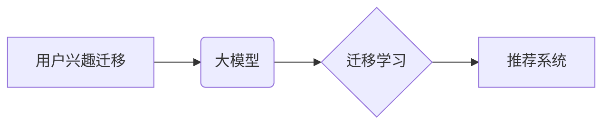

                 

## 推荐系统中的用户兴趣迁移：大模型的新见解

> 关键词：推荐系统、用户兴趣迁移、大模型、迁移学习、个性化推荐、冷启动问题

## 1. 背景介绍

推荐系统作为信息过滤和个性化服务的重要组成部分，在电商、社交媒体、视频平台等领域发挥着越来越重要的作用。传统的推荐系统主要依赖于用户的历史行为数据，例如点击、购买、评分等，来预测用户的兴趣偏好并提供个性化推荐。然而，随着用户行为的复杂性和多样性不断增加，传统的基于历史行为的推荐系统面临着越来越多的挑战。

其中一个关键挑战是**用户兴趣迁移**问题。用户兴趣并非静态不变的，随着时间推移，用户的兴趣会发生变化，新的兴趣爱好会涌现，而旧的兴趣爱好可能会逐渐淡化。传统的推荐系统难以捕捉到这种动态变化，导致推荐结果缺乏准确性和时效性。

大模型的出现为解决用户兴趣迁移问题提供了新的思路。大模型凭借其强大的学习能力和泛化能力，能够从海量数据中学习到更深层的用户兴趣特征，并更好地捕捉用户兴趣的动态变化。

## 2. 核心概念与联系

**用户兴趣迁移**是指用户兴趣偏好的动态变化，即用户对某些物品或内容的兴趣会随着时间推移而发生转移。这种迁移可能是由多种因素引起的，例如：

* **时间效应**: 用户的兴趣会随着时间的推移而发生变化，例如，年轻人可能对流行音乐更感兴趣，而老年人可能更喜欢古典音乐。
* **环境影响**: 用户的兴趣会受到周围环境的影响，例如，用户在旅行时可能会对当地的文化和美食更感兴趣。
* **社会影响**: 用户的兴趣会受到朋友、家人和社会潮流的影响，例如，用户可能会因为朋友的推荐而对某个新的产品或服务感兴趣。

**大模型**是指参数量巨大、训练数据量庞大的深度学习模型。大模型能够学习到更复杂的模式和特征，并具有更强的泛化能力。

**迁移学习**是一种机器学习的范式，它利用已训练好的模型在新的任务或领域上进行学习。迁移学习可以有效解决数据稀缺问题，并提高模型的学习效率。

**推荐系统**是一种利用用户历史行为数据和物品特征来预测用户对物品的兴趣并提供个性化推荐的系统。

**核心概念关系图:**



## 3. 核心算法原理 & 具体操作步骤

### 3.1  算法原理概述

大模型在推荐系统中的应用主要基于迁移学习的思想。通过在大量公共数据集上预训练大模型，使其学习到通用的语义理解和知识表示能力，然后将预训练模型迁移到特定领域的推荐任务中，利用少量领域数据进行微调，从而提高推荐系统的性能。

### 3.2  算法步骤详解

1. **预训练阶段**: 在公共数据集上预训练大模型，例如BERT、GPT等。预训练目标可以是语言建模、文本分类、问答等，目的是让大模型学习到丰富的语义知识和表示能力。
2. **迁移阶段**: 将预训练好的大模型迁移到推荐任务中。可以将大模型的某些层冻结，只微调最后一层，或者对整个模型进行微调。
3. **微调阶段**: 使用领域数据对迁移后的模型进行微调，优化模型在推荐任务上的性能。微调数据可以包括用户行为数据、物品特征数据等。
4. **预测阶段**: 使用微调后的模型对新的用户进行推荐。

### 3.3  算法优缺点

**优点**:

* **提升推荐性能**: 大模型的预训练能力可以有效提升推荐系统的性能，尤其是在数据稀缺的情况下。
* **降低训练成本**: 迁移学习可以减少模型训练所需的数据量和计算资源。
* **增强泛化能力**: 预训练模型具有较强的泛化能力，可以更好地适应不同的推荐场景。

**缺点**:

* **预训练模型规模庞大**: 大模型的参数量巨大，需要大量的计算资源进行训练和部署。
* **迁移过程需要精心设计**: 需要根据具体的推荐任务和数据特点选择合适的迁移策略。
* **数据安全和隐私问题**: 使用大模型进行推荐需要处理大量用户数据，需要关注数据安全和隐私问题。

### 3.4  算法应用领域

大模型在推荐系统中的应用领域非常广泛，例如：

* **电商推荐**: 为用户推荐商品、优惠券、促销活动等。
* **社交媒体推荐**: 为用户推荐好友、群组、内容等。
* **视频平台推荐**: 为用户推荐视频、直播、节目等。
* **音乐平台推荐**: 为用户推荐歌曲、专辑、歌手等。

## 4. 数学模型和公式 & 详细讲解 & 举例说明

### 4.1  数学模型构建

用户兴趣迁移可以建模为一个动态变化的概率分布。假设用户 $u$ 对物品 $i$ 的兴趣可以用一个概率 $p(u, i, t)$ 表示，其中 $t$ 是时间。

我们可以使用马尔可夫链模型来描述用户兴趣的动态变化：

$$p(u, i, t+1) = \sum_{j} p(u, j, t) * p(i | j, t)$$

其中，$p(u, j, t)$ 表示用户 $u$ 在时间 $t$ 对物品 $j$ 的兴趣概率，$p(i | j, t)$ 表示用户 $u$ 在时间 $t$ 对物品 $i$ 的兴趣概率，给定用户 $u$ 在时间 $t$ 对物品 $j$ 的兴趣。

### 4.2  公式推导过程

马尔可夫链模型假设用户兴趣在每个时间点只依赖于前一个时间点的兴趣状态。因此，我们可以用以下公式来更新用户兴趣概率：

$$p(u, i, t+1) = \alpha * p(u, i, t) + \beta * \sum_{j} p(u, j, t) * p(i | j, t)$$

其中，$\alpha$ 和 $\beta$ 是两个权重参数，用于控制历史兴趣和当前环境的影响。

### 4.3  案例分析与讲解

假设用户 $u$ 在时间 $t$ 对物品 $A$ 和 $B$ 的兴趣概率分别为 $0.6$ 和 $0.4$。在时间 $t+1$，用户 $u$ 可能会对物品 $C$ 感兴趣，并且 $p(C | A, t) = 0.3$，$p(C | B, t) = 0.7$。

根据公式，我们可以计算用户 $u$ 在时间 $t+1$ 对物品 $C$ 的兴趣概率：

$$p(u, C, t+1) = \alpha * p(u, C, t) + \beta * (0.6 * 0.3 + 0.4 * 0.7)$$

其中，$\alpha$ 和 $\beta$ 的取值取决于具体的场景和模型设计。

## 5. 项目实践：代码实例和详细解释说明

### 5.1  开发环境搭建

* Python 3.7+
* PyTorch 1.7+
* TensorFlow 2.0+
* CUDA 10.2+ (可选)

### 5.2  源代码详细实现

```python
import torch
import torch.nn as nn

class RecommenderModel(nn.Module):
    def __init__(self, embedding_dim, num_users, num_items):
        super(RecommenderModel, self).__init__()
        self.user_embedding = nn.Embedding(num_users, embedding_dim)
        self.item_embedding = nn.Embedding(num_items, embedding_dim)
        self.fc = nn.Linear(embedding_dim, 1)

    def forward(self, user_ids, item_ids):
        user_embeddings = self.user_embedding(user_ids)
        item_embeddings = self.item_embedding(item_ids)
        combined_embeddings = user_embeddings + item_embeddings
        scores = self.fc(combined_embeddings)
        return scores

# 实例化模型
model = RecommenderModel(embedding_dim=64, num_users=1000, num_items=10000)

# 定义损失函数和优化器
criterion = nn.BCEWithLogitsLoss()
optimizer = torch.optim.Adam(model.parameters(), lr=0.001)

# 训练模型
for epoch in range(10):
    # 训练数据
    user_ids = torch.randint(0, 1000, (1000,))
    item_ids = torch.randint(0, 10000, (1000,))
    # ...

    # 前向传播
    scores = model(user_ids, item_ids)

    # 计算损失
    loss = criterion(scores, target)

    # 反向传播
    optimizer.zero_grad()
    loss.backward()

    # 更新参数
    optimizer.step()

```

### 5.3  代码解读与分析

* **模型结构**: 代码中定义了一个简单的推荐模型，包含用户嵌入层、物品嵌入层和全连接层。
* **训练过程**: 模型使用BCEWithLogitsLoss损失函数和Adam优化器进行训练。
* **数据准备**: 训练数据需要包含用户ID和物品ID，以及用户对物品的评分或点击信息。

### 5.4  运行结果展示

训练完成后，可以使用模型对新的用户进行推荐。

## 6. 实际应用场景

### 6.1  电商推荐

大模型可以帮助电商平台更精准地推荐商品，例如：

* **个性化商品推荐**: 根据用户的历史购买记录、浏览记录和兴趣偏好，推荐个性化的商品。
* **跨界商品推荐**: 挖掘用户潜在的兴趣，推荐与用户以往购买商品相关的跨界商品。
* **新品推荐**: 利用大模型对新品的语义理解能力，推荐符合用户兴趣的新产品。

### 6.2  社交媒体推荐

大模型可以帮助社交媒体平台更有效地推荐内容，例如：

* **个性化内容推荐**: 根据用户的兴趣爱好、社交关系和行为模式，推荐个性化的内容。
* **话题推荐**: 利用大模型对用户语言的理解能力，推荐与用户当前关注的话题相关的最新信息。
* **好友推荐**: 根据用户的兴趣爱好和社交关系，推荐潜在的好友。

### 6.3  视频平台推荐

大模型可以帮助视频平台更精准地推荐视频，例如：

* **个性化视频推荐**: 根据用户的观看历史、点赞记录和评论内容，推荐个性化的视频。
* **内容分类推荐**: 利用大模型对视频内容的理解能力，将视频分类并推荐给感兴趣的用户。
* **直播推荐**: 根据用户的观看习惯和兴趣偏好，推荐相关的直播内容。

### 6.4  未来应用展望

随着大模型技术的不断发展，其在推荐系统中的应用场景将会更加广泛，例如：

* **多模态推荐**: 将文本、图像、音频等多模态数据融合，提供更丰富的推荐体验。
* **实时推荐**: 利用大模型的实时推理能力，提供更及时和精准的推荐。
* **个性化解释**: 利用大模型对推荐结果进行解释，帮助用户理解推荐背后的逻辑。

## 7. 工具和资源推荐

### 7.1  学习资源推荐

* **书籍**:
    * Deep Learning by Ian Goodfellow, Yoshua Bengio, and Aaron Courville
    * Natural Language Processing with PyTorch by Yoav Goldberg
* **课程**:
    * Stanford CS224N: Natural Language Processing with Deep Learning
    * DeepLearning.AI TensorFlow Specialization

### 7.2  开发工具推荐

* **PyTorch**: https://pytorch.org/
* **TensorFlow**: https://www.tensorflow.org/
* **Hugging Face Transformers**: https://huggingface.co/transformers/

### 7.3  相关论文推荐

* BERT: Pre-training of Deep Bidirectional Transformers for Language Understanding
* GPT-3: Language Models are Few-Shot Learners
* Transfer Learning for Recommender Systems: A Survey and Future Directions

## 8. 总结：未来发展趋势与挑战

### 8.1  研究成果总结

大模型在推荐系统中的应用取得了显著的成果，能够有效提升推荐性能，并为用户提供更个性化和精准的推荐体验。

### 8.2  未来发展趋势

* **模型规模和能力的提升**: 大模型的规模和能力将继续提升，能够学习到更复杂的模式和特征，提供更精准的推荐。
* **多模态融合**: 大模型将融合文本、图像、音频等多模态数据，提供更丰富的推荐体验。
* **个性化解释**: 大模型将能够对推荐结果进行解释，帮助用户理解推荐背后的逻辑。

### 8.3  面临的挑战

* **数据安全和隐私问题**: 使用大模型进行推荐需要处理大量用户数据，需要关注数据安全和隐私问题。
* **模型训练成本**: 大模型的训练成本很高，需要大量的计算资源和时间。
* **模型解释性**: 大模型的决策过程较为复杂，难以解释，这可能会导致用户对推荐结果的信任度降低。

### 8.4  研究展望

未来研究将重点关注以下几个方面：

* **开发更有效的迁移学习方法**: 降低大模型在推荐任务中的训练成本，并提高模型的泛化能力。
* **解决数据安全和隐私问题**: 开发新的技术和方法，保护用户数据安全和隐私。
* **提高模型的解释性**: 研究大模型的决策过程，并开发能够解释推荐结果的方法。

## 9. 附录：常见问题与解答

**Q1: 大模型的推荐效果真的比传统方法好吗？**

A1: 大模型在推荐效果方面确实有优势，尤其是在数据稀缺的情况下。但具体效果取决于具体的场景、数据和模型设计。

**Q2: 如何选择合适的迁移学习方法？**

A2: 选择合适的迁移学习方法需要根据具体的推荐任务和数据特点进行选择。常见的迁移学习方法包括特征迁移、参数迁移和知识迁移等。

**Q3: 如何解决大模型的训练成本问题？**

A3: 可以通过使用更小的模型、数据压缩技术、分布式训练等方法来降低大模型的训练成本。

**作者：禅与计算机程序设计艺术 / Zen and the Art of Computer Programming**<end_of_turn>

