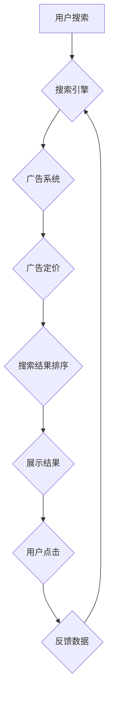

                 

## 搜索结果中的AI动态定价技术

> 关键词：AI动态定价、搜索结果排序、机器学习、深度学习、个性化推荐、广告收入优化

## 1. 背景介绍

随着互联网的蓬勃发展，搜索引擎已成为人们获取信息的主要途径。搜索引擎的商业模式主要依赖于广告收入，而广告收入的多少直接关系到搜索结果的排序。传统的搜索结果排序算法主要基于关键词匹配、网页权重等静态因素，难以满足用户日益多样化的需求和广告主的个性化投放需求。

近年来，人工智能（AI）技术的发展为搜索结果排序带来了新的机遇。AI动态定价技术利用机器学习和深度学习算法，根据用户的搜索行为、广告主的目标、实时市场情况等动态因素，对搜索结果进行个性化排序，从而提高用户体验、提升广告收入。

## 2. 核心概念与联系

### 2.1  核心概念

* **动态定价:**  根据实时市场情况和用户行为，对广告的展示价格进行动态调整。
* **搜索结果排序:**  根据算法规则，对搜索结果进行排名，决定用户看到的广告和有机结果的顺序。
* **机器学习:**  利用算法从数据中学习，不断优化搜索结果排序和广告定价模型。
* **深度学习:**  一种更高级的机器学习方法，利用多层神经网络模拟人类大脑的学习过程，能够处理更复杂的数据和任务。

### 2.2  架构



**流程说明:**

1. 用户输入搜索关键词。
2. 搜索引擎接收用户请求，并根据关键词匹配、网页权重等静态因素进行初步排序。
3. 广告系统根据用户搜索行为、广告主目标等信息，对广告进行定价。
4. 搜索结果排序算法根据广告定价、用户偏好等动态因素，对搜索结果进行最终排序。
5. 搜索引擎展示排序后的结果，包括广告和有机结果。
6. 用户点击广告或有机结果，产生反馈数据。
7. 搜索引擎收集反馈数据，并将其用于优化广告定价和搜索结果排序模型。

## 3. 核心算法原理 & 具体操作步骤

### 3.1  算法原理概述

AI动态定价技术主要基于以下核心算法原理：

* **机器学习模型:**  利用历史数据训练机器学习模型，预测用户点击广告的概率。
* **深度学习模型:**  利用深度神经网络，学习更复杂的特征，提高预测精度。
* **梯度下降算法:**  优化模型参数，降低预测误差。
* **强化学习:**  通过奖励机制，训练模型学习最优的广告定价策略。

### 3.2  算法步骤详解

1. **数据收集:**  收集用户搜索行为、广告点击行为、广告主目标等数据。
2. **数据预处理:**  清洗、转换和格式化数据，使其适合模型训练。
3. **模型选择:**  根据数据特点和业务需求，选择合适的机器学习或深度学习模型。
4. **模型训练:**  利用训练数据，训练模型参数，使其能够预测用户点击广告的概率。
5. **模型评估:**  使用测试数据评估模型性能，并进行模型调优。
6. **模型部署:**  将训练好的模型部署到生产环境中，用于实时广告定价和搜索结果排序。
7. **模型监控:**  持续监控模型性能，并根据需要进行模型更新和 retraining。

### 3.3  算法优缺点

**优点:**

* **个性化推荐:**  根据用户行为和偏好，提供更精准的广告推荐。
* **提高广告收入:**  通过动态定价，提高广告点击率和转化率，提升广告收入。
* **提升用户体验:**  提供更相关和有价值的搜索结果，提升用户体验。

**缺点:**

* **数据依赖:**  算法性能依赖于数据质量和数量。
* **模型复杂:**  训练和维护复杂的机器学习模型需要专业技术和资源。
* **公平性问题:**  算法可能存在偏见，导致某些用户或广告主获得不公平的待遇。

### 3.4  算法应用领域

* **搜索引擎广告:**  提高广告收入和用户体验。
* **电商平台:**  个性化推荐商品，提高转化率。
* **社交媒体:**  个性化推荐内容，提高用户粘性。
* **金融服务:**  个性化推荐金融产品，提高客户满意度。

## 4. 数学模型和公式 & 详细讲解 & 举例说明

### 4.1  数学模型构建

AI动态定价技术通常采用以下数学模型：

* **线性回归模型:**  用于预测用户点击广告的概率，根据用户特征和广告特征进行线性组合。
* **逻辑回归模型:**  用于预测用户点击广告的概率，将线性回归模型的结果映射到0到1之间的概率值。
* **支持向量机 (SVM):**  用于分类用户点击行为，将用户特征和广告特征映射到高维空间，找到最佳的分隔超平面。
* **深度神经网络:**  用于学习更复杂的特征，提高预测精度。

### 4.2  公式推导过程

**线性回归模型:**

假设用户点击广告的概率为 $p$, 则可以使用以下线性回归模型进行预测:

$$
p = \beta_0 + \beta_1 x_1 + \beta_2 x_2 + ... + \beta_n x_n
$$

其中:

* $p$: 用户点击广告的概率
* $\beta_0$: 截距
* $\beta_1, \beta_2, ..., \beta_n$: 模型参数
* $x_1, x_2, ..., x_n$: 用户特征和广告特征

**逻辑回归模型:**

逻辑回归模型将线性回归模型的结果映射到0到1之间的概率值，可以使用以下公式:

$$
p = \frac{1}{1 + e^{-( \beta_0 + \beta_1 x_1 + \beta_2 x_2 + ... + \beta_n x_n)}}
$$

其中:

* $p$: 用户点击广告的概率
* $\beta_0, \beta_1, \beta_2, ..., \beta_n$: 模型参数
* $x_1, x_2, ..., x_n$: 用户特征和广告特征

### 4.3  案例分析与讲解

假设我们想要预测用户点击某个广告的概率，我们可以使用以下特征:

* 用户年龄
* 用户性别
* 用户兴趣
* 广告价格
* 广告位置

我们可以使用线性回归模型或逻辑回归模型进行预测。

**线性回归模型:**

我们可以将上述特征作为输入，训练一个线性回归模型，预测用户点击广告的概率。

**逻辑回归模型:**

我们可以将上述特征作为输入，训练一个逻辑回归模型，预测用户点击广告的概率。

通过训练模型，我们可以得到模型参数，并使用这些参数预测新用户的点击概率。

## 5. 项目实践：代码实例和详细解释说明

### 5.1  开发环境搭建

* **操作系统:**  Linux 或 macOS
* **编程语言:**  Python
* **机器学习库:**  Scikit-learn 或 TensorFlow
* **数据存储:**  MySQL 或 PostgreSQL

### 5.2  源代码详细实现

```python
# 导入必要的库
import pandas as pd
from sklearn.linear_model import LogisticRegression

# 加载数据
data = pd.read_csv('advertising_data.csv')

# 划分训练集和测试集
X_train, X_test, y_train, y_test = train_test_split(data.drop('click', axis=1), data['click'], test_size=0.2)

# 创建逻辑回归模型
model = LogisticRegression()

# 训练模型
model.fit(X_train, y_train)

# 评估模型性能
accuracy = model.score(X_test, y_test)
print('模型准确率:', accuracy)

# 使用模型预测新用户的点击概率
new_user_data = pd.DataFrame({
    'age': [25],
    'gender': ['male'],
    'interest': ['technology'],
    'price': [10],
    'position': [1]
})
predicted_click_probability = model.predict_proba(new_user_data)[:, 1]
print('新用户的点击概率:', predicted_click_probability)
```

### 5.3  代码解读与分析

* **数据加载:**  使用 pandas 库加载广告数据。
* **数据划分:**  将数据划分为训练集和测试集，用于训练和评估模型。
* **模型创建:**  使用 scikit-learn 库创建逻辑回归模型。
* **模型训练:**  使用训练集训练模型，学习用户点击广告的概率。
* **模型评估:**  使用测试集评估模型性能，计算模型准确率。
* **模型预测:**  使用训练好的模型预测新用户的点击概率。

### 5.4  运行结果展示

运行代码后，会输出模型的准确率和新用户的点击概率。

## 6. 实际应用场景

### 6.1  搜索引擎广告

搜索引擎广告是 AI 动态定价技术最常见的应用场景之一。搜索引擎会根据用户的搜索关键词、浏览历史、地理位置等信息，以及广告主的目标、预算等因素，对广告进行动态定价，并将其展示在搜索结果页面中。

### 6.2  电商平台

电商平台可以使用 AI 动态定价技术，根据用户的购买历史、浏览记录、购物车内容等信息，对商品进行个性化推荐，并根据用户的购买意愿和市场竞争情况，对商品价格进行动态调整。

### 6.3  社交媒体

社交媒体平台可以使用 AI 动态定价技术，根据用户的兴趣爱好、社交关系、浏览行为等信息，对广告进行个性化推荐，并根据用户的互动行为和广告主的目标，对广告价格进行动态调整。

### 6.4  未来应用展望

AI 动态定价技术在未来将有更广泛的应用场景，例如：

* **个性化教育:**  根据学生的学习进度和学习风格，对教育资源进行个性化定价。
* **医疗保健:**  根据患者的病情和需求，对医疗服务进行个性化定价。
* **旅游业:**  根据游客的旅行偏好和市场情况，对旅游产品进行个性化定价。

## 7. 工具和资源推荐

### 7.1  学习资源推荐

* **书籍:**
    * 《深度学习》
    * 《机器学习实战》
* **在线课程:**
    * Coursera: 深度学习
    * Udacity: 机器学习工程师
* **博客和网站:**
    * Towards Data Science
    * Machine Learning Mastery

### 7.2  开发工具推荐

* **Python:**  机器学习和深度学习的常用编程语言。
* **Scikit-learn:**  机器学习库，提供各种算法和工具。
* **TensorFlow:**  深度学习框架，用于构建和训练深度神经网络。
* **PyTorch:**  深度学习框架，与 TensorFlow 类似。

### 7.3  相关论文推荐

* **Attention Is All You Need:**  Transformer 模型的开创性论文。
* **BERT: Pre-training of Deep Bidirectional Transformers for Language Understanding:**  BERT 模型的论文。
* **Deep Reinforcement Learning for Dynamic Pricing:**  强化学习在动态定价中的应用论文。

## 8. 总结：未来发展趋势与挑战

### 8.1  研究成果总结

AI 动态定价技术在过去几年取得了显著进展，能够根据用户行为和市场情况，对广告进行精准定价，提高广告收入和用户体验。

### 8.2  未来发展趋势

* **更精准的预测:**  利用更先进的机器学习和深度学习算法，提高对用户点击行为的预测精度。
* **更个性化的推荐:**  根据用户的细粒度特征，提供更个性化的广告推荐。
* **更公平的定价:**  解决 AI 动态定价技术可能带来的公平性问题，确保所有用户和广告主获得公平的待遇。
* **更透明的算法:**  提高 AI 动态定价算法的透明度，让用户了解如何进行定价决策。

### 8.3  面临的挑战

* **数据隐私:**  AI 动态定价技术依赖于大量用户数据，如何保护用户隐私是一个重要的挑战。
* **算法解释性:**  AI 算法的决策过程往往难以解释，如何提高算法的解释性是一个重要的研究方向。
* **监管政策:**  随着 AI 技术的发展，各国政府正在制定相关的监管政策，如何应对这些政策挑战也是一个重要的课题。

### 8.4  研究展望

未来，AI 动态定价技术将继续朝着更精准、更个性化、更公平的方向发展，并将在更多领域得到应用。


## 9. 附录：常见问题与解答

**Q1: AI 动态定价技术会损害用户的利益吗？**

A1: AI 动态定价技术本身不会损害用户的利益，但如果算法设计不当，可能会导致某些用户被过度收费或无法获得公平的待遇。因此，我们需要确保 AI 动态定价算法的公平性和透明性。

**Q2: 如何保护用户隐私在 AI 动态定价技术中？**

A2: 在使用 AI 动态定价技术时，需要采取措施保护用户隐私，例如：

* **匿名化数据:**  将用户数据匿名化，避免直接识别用户身份。
* **数据加密:**  对用户数据进行加密，防止数据泄露。
* **最小化数据收集:**  只收集必要的用户数据，避免过度收集用户隐私信息。

**Q3: AI 动态定价技术如何确保公平性？**

A3: 确保 AI 动态定价技术的公平性需要从以下几个方面入手：

* **算法设计:**  设计公平的算法，避免算法对特定用户或广告主产生偏见。
* **数据质量:**  使用高质量的数据训练模型，避免算法受到数据偏差的影响。
* **模型评估:**  定期评估模型的公平性，并进行必要的调整。
* **监管政策:**  制定相关的监管政策，规范 AI 动态定价技术的应用。


作者：禅与计算机程序设计艺术 / Zen and the Art of Computer Programming<end_of_turn>

