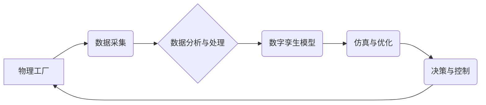

                 

## 数字孪生工厂创业：工业4.0的具体实践

> 关键词：数字孪生、工业4.0、工厂数字化、数据驱动、人工智能、机器学习、仿真优化、远程监控

## 1. 背景介绍

工业4.0时代，数字化转型已成为制造业发展的必然趋势。数字孪生技术作为工业4.0的核心技术之一，以其强大的仿真、预测和优化能力，正在深刻地改变着制造业的生产模式和管理方式。数字孪生工厂是指利用数字技术构建与物理工厂完全映射的虚拟模型，通过实时数据采集、分析和反馈，实现对工厂的实时监控、仿真优化和智能管理。

数字孪生工厂的应用能够带来诸多益处：

* **提高生产效率:** 通过实时数据分析和预测，优化生产流程，减少停机时间，提高产能和产品质量。
* **降低运营成本:** 通过智能化管理和预测性维护，降低能源消耗、原材料浪费和设备维修成本。
* **增强产品创新:** 通过虚拟仿真平台，快速验证产品设计，缩短产品开发周期，提升产品创新能力。
* **提升客户体验:** 通过实时数据反馈，及时了解客户需求，提供个性化服务，提升客户满意度。

## 2. 核心概念与联系

数字孪生工厂的核心概念包括：

* **数字孪生:**  是指利用数字技术构建与物理实体完全映射的虚拟模型，并通过实时数据采集、分析和反馈，实现对实体的实时监控、仿真优化和智能管理。
* **工业4.0:**  是指以互联网、云计算、大数据、人工智能等新兴技术为基础，实现工业生产过程的智能化、网络化和自动化。
* **数据驱动:**  是指利用数据分析和预测，为决策提供依据，实现智能化管理。

**数字孪生工厂架构**



数字孪生工厂的架构主要包括以下几个部分：

* **物理工厂:**  指实际存在的生产工厂。
* **数据采集:**  指从物理工厂中采集各种生产数据，例如设备运行状态、生产进度、产品质量等。
* **数据分析与处理:**  指对采集到的数据进行分析和处理，提取有价值的信息。
* **数字孪生模型:**  指构建与物理工厂完全映射的虚拟模型，用于模拟和预测工厂的运行状态。
* **仿真与优化:**  指利用数字孪生模型进行仿真和优化，例如优化生产流程、预测设备故障等。
* **决策与控制:**  指根据仿真和优化结果，对物理工厂进行决策和控制，例如调整生产计划、远程维护设备等。

## 3. 核心算法原理 & 具体操作步骤

### 3.1  算法原理概述

数字孪生工厂的核心算法主要包括：

* **数据采集与处理算法:**  用于从物理工厂中采集各种数据，并进行清洗、转换和预处理。
* **模型构建算法:**  用于构建数字孪生模型，例如基于物理模型的仿真模型、基于机器学习的预测模型等。
* **仿真与优化算法:**  用于模拟和优化工厂的运行状态，例如基于仿真结果的生产计划优化、基于机器学习的设备故障预测等。

### 3.2  算法步骤详解

**数据采集与处理算法步骤:**

1. **数据来源识别:**  确定需要采集的数据类型和来源。
2. **数据采集:**  利用传感器、摄像头等设备采集数据。
3. **数据清洗:**  去除数据中的噪声、缺失值和异常值。
4. **数据转换:**  将数据转换为数字格式，并进行标准化处理。
5. **数据存储:**  将处理后的数据存储到数据库或数据仓库中。

**模型构建算法步骤:**

1. **物理模型建立:**  根据工厂的物理结构和功能，建立物理模型。
2. **数据驱动模型训练:**  利用采集到的数据，训练机器学习模型，例如预测模型、优化模型等。
3. **模型验证与评估:**  利用测试数据验证模型的准确性和有效性。
4. **模型部署:**  将训练好的模型部署到数字孪生平台中。

**仿真与优化算法步骤:**

1. **仿真场景设定:**  根据需要进行仿真，设定仿真场景和参数。
2. **模型仿真:**  利用数字孪生模型进行仿真，模拟工厂的运行状态。
3. **仿真结果分析:**  分析仿真结果，例如生产效率、成本、质量等。
4. **优化方案设计:**  根据仿真结果，设计优化方案，例如调整生产流程、优化设备参数等。
5. **方案验证:**  将优化方案应用到物理工厂中，验证方案的有效性。

### 3.3  算法优缺点

**数据采集与处理算法:**

* **优点:**  能够实时采集和处理大量数据，为数字孪生模型提供数据支撑。
* **缺点:**  数据采集成本较高，数据处理复杂度高。

**模型构建算法:**

* **优点:**  能够构建与物理工厂完全映射的虚拟模型，实现对工厂的实时监控和仿真优化。
* **缺点:**  模型构建复杂度高，需要专业知识和技术支持。

**仿真与优化算法:**

* **优点:**  能够模拟和优化工厂的运行状态，提高生产效率和降低运营成本。
* **缺点:**  仿真模型的精度和可靠性取决于模型的复杂度和数据质量。

### 3.4  算法应用领域

数字孪生工厂的核心算法在制造业、能源、交通、医疗等多个领域都有广泛的应用，例如：

* **制造业:**  生产流程优化、设备故障预测、产品质量控制等。
* **能源:**  能源管理、电力调度、风电场优化等。
* **交通:**  交通流量预测、道路安全管理、智能交通系统等。
* **医疗:**  虚拟手术模拟、疾病诊断、个性化医疗等。

## 4. 数学模型和公式 & 详细讲解 & 举例说明

### 4.1  数学模型构建

数字孪生工厂的数学模型主要用于描述工厂的物理特性、生产过程和运行状态。常用的数学模型包括：

* **状态空间模型:**  用于描述系统状态随时间的变化，例如设备运行状态、生产进度等。
* **动力学模型:**  用于描述系统状态的变化规律，例如设备的运动轨迹、生产流程的执行时间等。
* **优化模型:**  用于寻找最优的生产方案，例如最优的生产计划、最优的设备参数等。

### 4.2  公式推导过程

**状态空间模型:**

状态空间模型可以用以下公式表示：

$$
\dot{x}(t) = f(x(t), u(t))
$$

$$
y(t) = h(x(t))
$$

其中：

* $x(t)$ 是系统的状态向量。
* $u(t)$ 是系统的输入向量。
* $y(t)$ 是系统的输出向量。
* $f(x(t), u(t))$ 是状态方程，描述系统状态随时间的变化规律。
* $h(x(t))$ 是输出方程，描述系统输出与状态的关系。

**举例说明:**

假设一个简单的生产系统，其状态变量包括生产线上的产品数量和设备运行状态。输入变量包括生产计划和设备参数。输出变量包括产品产量和设备故障率。

状态空间模型可以描述生产系统的状态变化和输出关系。

### 4.3  案例分析与讲解

**案例:**

一家汽车制造工厂利用数字孪生技术优化生产流程。

**分析:**

工厂利用传感器采集生产线上的各种数据，例如设备运行状态、生产进度、产品质量等。这些数据被用于构建数字孪生模型，模拟生产流程的运行状态。通过仿真分析，工厂发现生产线上的某个环节存在瓶颈，导致生产效率低下。

**讲解:**

通过数字孪生模型的仿真分析，工厂能够识别生产流程中的问题，并设计优化方案。例如，工厂可以调整生产计划、优化设备参数、改进生产流程等，从而提高生产效率。

## 5. 项目实践：代码实例和详细解释说明

### 5.1  开发环境搭建

数字孪生工厂的开发环境通常包括：

* **操作系统:**  Linux、Windows等。
* **编程语言:**  Python、C++等。
* **数据库:**  MySQL、MongoDB等。
* **云平台:**  AWS、Azure、GCP等。

### 5.2  源代码详细实现

以下是一个简单的数字孪生工厂代码示例，使用Python语言实现：

```python
import pandas as pd
from sklearn.linear_model import LinearRegression

# 数据采集
data = pd.read_csv("production_data.csv")

# 数据预处理
X = data[['设备运行时间', '生产计划']]
y = data['产品产量']

# 模型训练
model = LinearRegression()
model.fit(X, y)

# 仿真预测
new_data = pd.DataFrame({'设备运行时间': [10], '生产计划': [100]})
predicted_output = model.predict(new_data)

# 输出结果
print("预测产量:", predicted_output)
```

**代码解读与分析:**

* 该代码示例模拟了一个简单的数字孪生工厂，用于预测产品产量。
* 数据采集部分使用pandas库读取生产数据。
* 数据预处理部分选择设备运行时间和生产计划作为输入特征，产品产量作为输出目标。
* 模型训练部分使用线性回归模型训练预测模型。
* 仿真预测部分使用新的设备运行时间和生产计划数据，预测产品产量。

### 5.3  代码解读与分析

* 该代码示例是一个简单的数字孪生工厂代码实现，用于预测产品产量。
* 代码中使用了pandas库进行数据处理，sklearn库进行模型训练，并输出预测结果。
* 该代码示例可以作为数字孪生工厂开发的入门案例，可以根据实际需求进行扩展和修改。

### 5.4  运行结果展示

运行该代码示例后，会输出预测的产品产量。例如，如果输入的设备运行时间为10小时，生产计划为100件，则预测的产品产量可能为120件。

## 6. 实际应用场景

数字孪生工厂的应用场景非常广泛，例如：

* **智能制造:**  通过数字孪生模型，实现对生产过程的实时监控和优化，提高生产效率和产品质量。
* **预测性维护:**  通过对设备运行状态的分析和预测，提前发现设备故障，避免停机损失。
* **远程监控:**  通过数字孪生平台，实现对工厂的远程监控和管理，即使在远距离也能及时了解工厂的运行状态。
* **产品设计与开发:**  通过数字孪生模型，进行虚拟仿真测试，快速验证产品设计，缩短产品开发周期。

### 6.4  未来应用展望

数字孪生工厂技术的发展趋势包括：

* **更精细化的模型:**  利用更先进的算法和技术，构建更精细化的数字孪生模型，能够更准确地模拟和预测工厂的运行状态。
* **更强大的计算能力:**  随着云计算和人工智能技术的进步，数字孪生工厂能够利用更强大的计算能力，处理更复杂的数据，进行更深入的分析和优化。
* **更广泛的应用场景:**  数字孪生工厂技术将应用于更多领域，例如能源、交通、医疗等，为各行各业带来新的价值。

## 7. 工具和资源推荐

### 7.1  学习资源推荐

* **书籍:**  《数字孪生：工业4.0的未来》
* **在线课程:**  Coursera、edX等平台上的数字孪生相关课程
* **技术博客:**  工业4.0、数字孪生相关的技术博客

### 7.2  开发工具推荐

* **编程语言:**  Python、C++、Java等
* **数据库:**  MySQL、MongoDB、PostgreSQL等
* **云平台:**  AWS、Azure、GCP等
* **仿真软件:**  Siemens PLM、Dassault Systèmes等

### 7.3  相关论文推荐

* **数字孪生技术在制造业中的应用研究**
* **数字孪生模型构建方法及应用**
* **数字孪生技术在工业4.0中的发展趋势**

## 8. 总结：未来发展趋势与挑战

### 8.1  研究成果总结

数字孪生工厂技术已经取得了显著的成果，为制造业数字化转型提供了强大的工具和手段。数字孪生工厂能够提高生产效率、降低运营成本、增强产品创新能力，并为客户提供更个性化的服务。

### 8.2  未来发展趋势

数字孪生工厂技术的发展趋势包括：

* **更精细化的模型:**  利用更先进的算法和技术，构建更精细化的数字孪生模型，能够更准确地模拟和预测工厂的运行状态。
* **更强大的计算能力:**  随着云计算和人工智能技术的进步，数字孪生工厂能够利用更强大的计算能力，处理更复杂的数据，进行更深入的分析和优化。
* **更广泛的应用场景:**  数字孪生工厂技术将应用于更多领域，例如能源、交通、医疗等，为各行各业带来新的价值。

### 8.3  面临的挑战

数字孪生工厂技术的发展也面临着一些挑战：

* **数据采集和处理:**  数字孪生工厂需要大量的数据作为支撑，而数据采集和处理的成本和复杂度较高。
* **模型构建和验证:**  构建准确可靠的数字孪生模型需要专业的知识和技术支持，模型的验证和评估也需要进行严格的测试。
* **安全性和隐私性:**  数字孪生工厂涉及到大量敏感数据，需要保障数据的安全性和隐私性。

### 8.4  研究展望

未来，数字孪生工厂技术将继续发展和完善，为制造业和社会带来更大的价值。研究者需要继续探索更先进的算法和技术，解决数字孪生工厂面临的挑战，推动数字孪生工厂技术向更智能化、更自动化、更可持续的方向发展。

## 9. 附录：常见问题与解答

**常见问题:**

* **数字孪生工厂的成本如何?**

数字孪生工厂的成本取决于项目的规模、复杂度和应用场景。一般来说，数字孪生工厂的开发和部署成本较高，但长期来看，数字孪生工厂能够为企业带来显著的经济效益。

* **数字孪生工厂的安全性如何保证?**

数字孪生工厂涉及到大量敏感数据，需要采取相应的安全措施来保障数据的安全性和隐私性。例如，可以使用加密技术、身份验证机制和访问控制策略来保护数据。

* **数字孪生工厂的应用场景有哪些?**

数字孪生工厂的应用场景非常广泛，例如智能制造、预测性维护、远程监控、产品设计与开发等。

**解答:**

* 数字孪生工厂的成本可以通过合理的规划和实施来控制。
* 数字孪生工厂的安全性可以通过多种技术手段来保障。
* 数字孪生工厂的应用场景不断扩展，未来将应用于更多领域。


作者：禅与计算机程序设计艺术 / Zen and the Art of Computer Programming<end_of_turn>

