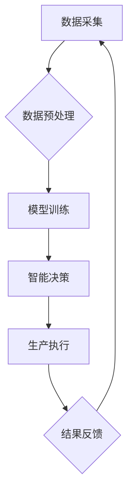

                 

## 未来的智慧农业：2050年的农业AI大脑与精准农业

> 关键词：农业AI、精准农业、机器学习、深度学习、物联网、数据分析、智能决策、可持续发展

## 1. 背景介绍

全球人口持续增长，粮食需求不断攀升，而气候变化、资源短缺等挑战也给农业生产带来巨大压力。传统农业模式面临着效率低下、资源浪费、环境污染等问题。为了应对这些挑战，智慧农业应运而生，并逐渐成为全球农业发展的重要趋势。

智慧农业的核心是利用信息技术和人工智能技术，实现农业生产的智能化、数字化和可持续化。其中，人工智能（AI）作为智慧农业的关键驱动力，正在深刻地改变着农业生产方式。

## 2. 核心概念与联系

**2.1 农业AI大脑**

农业AI大脑是一个集成了多种人工智能技术，并面向农业生产场景设计的智能决策系统。它通过收集、分析和处理来自各种传感器、卫星、无人机等设备的数据，对农业生产过程进行实时监控、诊断和预测，并为农民提供精准的决策建议。

**2.2 精准农业**

精准农业是指利用信息技术和数据分析技术，对农业生产进行细化管理，实现资源的优化配置和生产效率的提升。它强调根据不同作物、土壤、气候等条件，制定个性化的生产方案，从而提高产量、降低成本、减少环境污染。

**2.3 核心架构**

农业AI大脑与精准农业之间存在着密切的联系。农业AI大脑为精准农业提供了智能决策支持，而精准农业为农业AI大脑提供了数据支撑。两者共同构成了智慧农业的智能化体系。



## 3. 核心算法原理 & 具体操作步骤

**3.1 算法原理概述**

农业AI大脑的核心算法主要包括机器学习、深度学习、自然语言处理等。

* **机器学习**：通过训练模型，让机器从数据中学习规律，并对新的数据进行预测或分类。
* **深度学习**：一种更高级的机器学习方法，利用多层神经网络模拟人类大脑的学习过程，能够处理更复杂的数据和任务。
* **自然语言处理**：能够理解和处理人类语言，例如分析农民的语音或文本信息，提取其需求和意图。

**3.2 算法步骤详解**

1. **数据采集**: 从各种传感器、卫星、无人机等设备收集农业生产数据，例如土壤湿度、温度、光照、作物生长状况等。
2. **数据预处理**: 对收集到的数据进行清洗、转换、归一化等处理，使其能够被模型所接受。
3. **模型训练**: 选择合适的机器学习或深度学习算法，并利用预处理后的数据对模型进行训练，使其能够学习农业生产的规律。
4. **模型评估**: 对训练好的模型进行评估，测试其预测或分类的准确率，并根据评估结果进行模型调优。
5. **智能决策**: 将训练好的模型部署到农业AI大脑中，并根据实时采集到的数据，对农业生产进行智能决策，例如灌溉、施肥、病虫害防治等。
6. **结果反馈**: 收集智能决策的结果，并将其反馈到模型训练环节，不断优化模型的性能。

**3.3 算法优缺点**

* **优点**: 能够提高农业生产效率、降低成本、减少环境污染，并为农民提供精准的决策支持。
* **缺点**: 需要大量的训练数据，模型训练过程复杂，算法解释性较差，对数据质量要求较高。

**3.4 算法应用领域**

* **作物生长预测**: 根据作物生长数据，预测作物的产量、成熟时间等信息。
* **病虫害监测**: 利用图像识别技术，识别作物病虫害，并提供防治建议。
* **精准灌溉**: 根据土壤湿度和作物需求，精准控制灌溉量，提高水资源利用效率。
* **精准施肥**: 根据土壤肥力状况和作物需求，精准施加肥料，提高肥料利用率，减少环境污染。

## 4. 数学模型和公式 & 详细讲解 & 举例说明

**4.1 数学模型构建**

农业AI大脑的决策过程通常基于数学模型，例如线性回归、逻辑回归、支持向量机等。这些模型通过建立变量之间的关系，预测或分类目标变量。

**4.2 公式推导过程**

例如，利用线性回归模型预测作物产量，其公式如下：

$$
y = \beta_0 + \beta_1x_1 + \beta_2x_2 + ... + \beta_nx_n + \epsilon
$$

其中：

* $y$：作物产量
* $x_1, x_2, ..., x_n$：影响作物产量的因素，例如土壤湿度、温度、光照等
* $\beta_0, \beta_1, ..., \beta_n$：模型参数，需要通过训练数据进行估计
* $\epsilon$：随机误差

**4.3 案例分析与讲解**

假设我们想要预测小麦的产量，并收集了土壤湿度、温度、光照等数据。我们可以利用线性回归模型，将这些数据作为输入变量，并将小麦产量作为输出变量。通过训练模型，我们可以得到模型参数，并利用这些参数预测不同条件下小麦的产量。

## 5. 项目实践：代码实例和详细解释说明

**5.1 开发环境搭建**

* 操作系统：Linux/Windows/macOS
* Python版本：3.6+
* 必要的库：TensorFlow/PyTorch/Scikit-learn

**5.2 源代码详细实现**

```python
# 导入必要的库
import pandas as pd
from sklearn.linear_model import LinearRegression

# 加载数据
data = pd.read_csv("wheat_yield_data.csv")

# 选择特征变量和目标变量
features = ["soil_moisture", "temperature", "light"]
target = "yield"

# 训练模型
model = LinearRegression()
model.fit(data[features], data[target])

# 预测产量
new_data = pd.DataFrame({"soil_moisture": [0.6], "temperature": [25], "light": [8]})
predicted_yield = model.predict(new_data)

# 打印预测结果
print(f"Predicted yield: {predicted_yield[0]}")
```

**5.3 代码解读与分析**

* 首先，我们导入必要的库，并加载数据。
* 然后，我们选择特征变量和目标变量。
* 接着，我们训练线性回归模型，并利用训练好的模型预测新的数据。
* 最后，我们打印预测结果。

**5.4 运行结果展示**

运行代码后，会输出预测的产量值。

## 6. 实际应用场景

**6.1 农业生产管理**

* **精准灌溉**: 根据土壤湿度和作物需求，精准控制灌溉量，提高水资源利用效率。
* **精准施肥**: 根据土壤肥力状况和作物需求，精准施加肥料，提高肥料利用率，减少环境污染。
* **病虫害防治**: 利用图像识别技术，识别作物病虫害，并提供防治建议。

**6.2 农业资源管理**

* **土地利用规划**: 根据土壤类型、地形等信息，规划土地利用，提高土地利用效率。
* **水资源管理**: 利用传感器数据，监测水资源状况，优化灌溉方案，提高水资源利用效率。
* **农产品质量控制**: 利用传感器数据，监测农产品生长状况，确保农产品质量。

**6.3 农业市场预测**

* **作物产量预测**: 根据作物生长数据，预测作物的产量，帮助农民制定种植计划。
* **农产品价格预测**: 利用市场数据和天气预报等信息，预测农产品价格，帮助农民制定销售策略。

**6.4 未来应用展望**

随着人工智能技术的不断发展，农业AI大脑将在未来发挥更重要的作用。例如：

* **无人化农业**: 利用无人机、机器人等设备，实现农业生产的无人化操作。
* **个性化农业**: 根据不同作物、土壤、气候等条件，制定个性化的生产方案。
* **可持续农业**: 利用人工智能技术，提高农业生产的资源利用效率，减少环境污染。

## 7. 工具和资源推荐

**7.1 学习资源推荐**

* **在线课程**: Coursera, edX, Udacity 等平台提供人工智能、机器学习等方面的在线课程。
* **书籍**: 《深度学习》、《机器学习实战》等书籍可以帮助你深入了解人工智能相关知识。
* **开源项目**: TensorFlow, PyTorch 等开源项目可以帮助你实践人工智能技术。

**7.2 开发工具推荐**

* **Python**: 作为人工智能开发的主要语言，Python拥有丰富的库和工具，例如TensorFlow, PyTorch, Scikit-learn等。
* **Jupyter Notebook**: 用于编写和运行Python代码的交互式环境，方便进行数据分析和模型开发。
* **云计算平台**: AWS, Azure, GCP 等云计算平台提供强大的计算资源和服务，可以帮助你进行大规模数据处理和模型训练。

**7.3 相关论文推荐**

* **《ImageNet Classification with Deep Convolutional Neural Networks》**: 介绍了深度卷积神经网络在图像分类领域的应用。
* **《Attention Is All You Need》**: 介绍了Transformer模型，一种新的序列建模方法，在自然语言处理领域取得了突破性进展。
* **《Deep Reinforcement Learning》**: 介绍了深度强化学习，一种能够学习复杂决策策略的机器学习方法。

## 8. 总结：未来发展趋势与挑战

**8.1 研究成果总结**

近年来，人工智能技术在农业领域的应用取得了显著进展，例如作物生长预测、病虫害监测、精准灌溉等。这些应用能够提高农业生产效率、降低成本、减少环境污染，为实现可持续农业发展提供了新的思路。

**8.2 未来发展趋势**

* **更智能的决策系统**: 未来，农业AI大脑将更加智能化，能够根据更复杂的数据和更复杂的场景，提供更精准的决策建议。
* **更广泛的应用场景**: 农业AI技术的应用将扩展到更多领域，例如农业资源管理、农业市场预测等。
* **更强的解释性**: 未来，农业AI模型的解释性将得到加强，能够更好地帮助农民理解模型的决策过程。

**8.3 面临的挑战**

* **数据质量**: 农业数据通常具有复杂性、不完整性和噪声性，这给模型训练和应用带来了挑战。
* **模型解释性**: 许多人工智能模型的决策过程难以解释，这使得农民难以信任模型的建议。
* **技术普及**: 农业AI技术的普及需要克服技术门槛和成本问题。

**8.4 研究展望**

未来，我们需要继续加强农业AI技术的研发，解决数据质量、模型解释性和技术普及等挑战，推动农业AI技术更好地服务于农业生产和可持续发展。


## 9. 附录：常见问题与解答

**9.1 如何获取农业数据？**

农业数据可以从多种渠道获取，例如：

* **传感器数据**: 利用土壤湿度传感器、温度传感器、光照传感器等设备采集数据。
* **卫星遥感数据**: 利用卫星遥感技术获取作物生长状况、土地利用状况等信息。
* **无人机遥感数据**: 利用无人机搭载摄像头等设备采集作物生长状况、病虫害信息等数据。
* **农业数据库**: 许多国家和地区拥有农业数据库，包含作物产量、天气预报、土壤信息等数据。

**9.2 如何选择合适的农业AI模型？**

选择合适的农业AI模型需要根据具体的应用场景和数据特点进行选择。例如：

* **作物生长预测**: 可以选择线性回归、支持向量机、神经网络等模型。
* **病虫害监测**: 可以选择图像识别、深度学习等模型。
* **精准灌溉**: 可以选择基于规则的模型、机器学习模型、深度学习模型等。

**9.3 如何部署农业AI模型？**

农业AI模型可以部署到各种平台，例如：

* **云计算平台**: AWS, Azure, GCP 等云计算平台提供强大的计算资源和服务，可以方便地部署和管理农业AI模型。
* **边缘计算设备**: 可以将农业AI模型部署到无人机、机器人等边缘计算设备上，实现实时决策和控制。
* **本地服务器**: 可以将农业AI模型部署到本地服务器上，用于离线数据分析和决策。


作者：禅与计算机程序设计艺术 / Zen and the Art of Computer Programming 
<end_of_turn>

