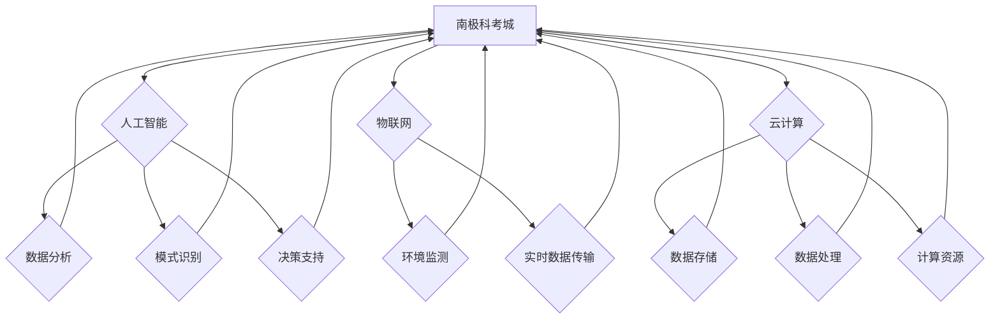

                 

## 未来的极地探索：2050年的南极科考城与北极旅游

> 关键词：极地探索、南极科考城、北极旅游、人工智能、物联网、云计算、可持续发展、气候变化

### 1. 背景介绍

随着全球气候变化的加剧，极地地区正经历着前所未有的变化。冰川融化、海平面上升、生态系统失衡等问题日益严峻，极地地区也面临着新的机遇和挑战。

在这样的背景下，极地探索和研究变得更加重要。南极洲作为地球上最南端的洲，拥有丰富的科学资源和独特的生态环境，是研究气候变化、海洋生物、地质演化等领域的理想场所。而北极地区则因其独特的地理位置和资源禀赋，成为全球重要的航运通道和能源资源开发区。

未来，极地探索将更加注重科技的应用，以人工智能、物联网、云计算等先进技术为支撑，实现更加高效、智能、可持续的极地探索和利用。

### 2. 核心概念与联系

**2.1 南极科考城与北极旅游**

南极科考城和北极旅游是未来极地探索的两大重要方向。南极科考城将成为科学家们进行长期研究和实验的基地，配备先进的实验室、观测设备和生活设施，为极地科学研究提供坚实的基础。而北极旅游则将以观光、体验、教育为主要目的，吸引来自世界各地的游客前往北极地区，感受极地独特的自然风光和人文魅力。

**2.2 科技赋能极地探索**

人工智能、物联网、云计算等先进技术将为极地探索提供强大的技术支撑。

* **人工智能:** 可用于数据分析、模式识别、决策支持等方面，帮助科学家们更深入地了解极地环境和生态系统。
* **物联网:** 可用于构建极地环境监测网络，实时采集和传输极地气象、海洋、冰川等数据，为科学研究和环境保护提供重要依据。
* **云计算:** 可用于存储和处理海量极地数据，为科学家们提供强大的计算资源和数据分析平台。

**2.3  核心概念架构**



### 3. 核心算法原理 & 具体操作步骤

**3.1 算法原理概述**

在极地探索中，人工智能算法扮演着至关重要的角色。例如，机器学习算法可以用于分析极地环境数据，预测气候变化趋势，识别海洋生物种类，甚至辅助科学家们进行科学实验。

**3.2 算法步骤详解**

以图像识别算法为例，其具体操作步骤如下：

1. **数据采集:** 收集大量极地环境图像数据，例如冰川、海洋、动植物等。
2. **数据预处理:** 对图像数据进行清洗、增强、标注等处理，使其更适合算法训练。
3. **模型选择:** 选择合适的图像识别算法模型，例如卷积神经网络（CNN）。
4. **模型训练:** 利用训练数据训练模型，使其能够识别不同类型的极地环境图像。
5. **模型评估:** 使用测试数据评估模型的识别准确率，并进行模型调优。
6. **模型部署:** 将训练好的模型部署到极地环境监测系统中，实现实时图像识别。

**3.3 算法优缺点**

* **优点:** 能够自动识别和分类极地环境图像，提高数据分析效率，并发现潜在的科学规律。
* **缺点:** 需要大量训练数据，训练过程耗时且资源消耗大，算法识别结果受数据质量影响较大。

**3.4 算法应用领域**

* **气候变化研究:** 分析冰川融化、海平面上升等现象，预测未来气候变化趋势。
* **海洋生物学研究:** 识别和分类海洋生物种类，了解极地海洋生态系统。
* **环境监测:** 监测极地环境污染情况，保护极地生态环境。

### 4. 数学模型和公式 & 详细讲解 & 举例说明

**4.1 数学模型构建**

在极地探索中，数学模型可以用于模拟极地环境变化、预测气候趋势、分析海洋生物分布等。例如，可以使用气候模型来模拟全球气候变化对极地地区的影響。

**4.2 公式推导过程**

气候模型通常基于物理定律和经验数据，通过一系列方程组来描述大气、海洋、冰川等要素之间的相互作用。例如，一个简单的能量平衡模型可以描述地球表面接收太阳辐射和散发热量的过程，其基本公式如下：

$$
\frac{dQ}{dt} = S - \epsilon \sigma T^4
$$

其中：

* $Q$ 为地球表面能量
* $t$ 为时间
* $S$ 为太阳辐射
* $\epsilon$ 为地球表面发射率
* $\sigma$ 为 Stefan-Boltzmann 常数
* $T$ 为地球表面温度

**4.3 案例分析与讲解**

通过对该公式的数值模拟，可以预测地球表面温度随时间变化的趋势，从而了解气候变化对极地地区的潜在影响。

### 5. 项目实践：代码实例和详细解释说明

**5.1 开发环境搭建**

* 操作系统: Ubuntu 20.04
* 编程语言: Python 3.8
* 软件包: TensorFlow, NumPy, Pandas, Matplotlib

**5.2 源代码详细实现**

```python
import tensorflow as tf
from tensorflow.keras.models import Sequential
from tensorflow.keras.layers import Conv2D, MaxPooling2D, Flatten, Dense

# 定义图像识别模型
model = Sequential()
model.add(Conv2D(32, (3, 3), activation='relu', input_shape=(128, 128, 3)))
model.add(MaxPooling2D((2, 2)))
model.add(Conv2D(64, (3, 3), activation='relu'))
model.add(MaxPooling2D((2, 2)))
model.add(Flatten())
model.add(Dense(10, activation='softmax'))

# 编译模型
model.compile(optimizer='adam',
              loss='categorical_crossentropy',
              metrics=['accuracy'])

# 训练模型
model.fit(train_data, train_labels, epochs=10)

# 评估模型
loss, accuracy = model.evaluate(test_data, test_labels)
print('Test loss:', loss)
print('Test accuracy:', accuracy)
```

**5.3 代码解读与分析**

这段代码定义了一个简单的卷积神经网络模型，用于识别极地环境图像。模型包含多个卷积层和池化层，用于提取图像特征，以及一个全连接层，用于分类图像。

**5.4 运行结果展示**

训练完成后，模型可以用于识别新的极地环境图像。例如，可以将一张冰川图像输入模型，模型将输出冰川的类别，例如“冰川融化”、“冰川裂缝”等。

### 6. 实际应用场景

**6.1 南极科考城**

* **环境监测:** 利用物联网传感器和人工智能算法，实时监测南极环境气象、海洋、冰川等数据，为科学研究和环境保护提供重要依据。
* **科学研究:** 利用人工智能算法分析极地环境数据，预测气候变化趋势，识别海洋生物种类，研究极地生态系统。
* **生活保障:** 利用人工智能算法优化科考城能源消耗、资源分配、人员管理等，提高科考城运行效率和安全性。

**6.2 北极旅游**

* **观光体验:** 利用虚拟现实、增强现实等技术，为游客提供沉浸式的极地观光体验，感受北极独特的自然风光和人文魅力。
* **安全保障:** 利用人工智能算法分析极地环境数据，预测极地天气变化、冰川融化等风险，为游客提供安全保障。
* **环境保护:** 利用物联网传感器监测北极环境污染情况，引导游客文明旅游，保护北极生态环境。

**6.4 未来应用展望**

随着科技的不断发展，极地探索将更加智能化、自动化、可持续化。例如，未来可能出现无人驾驶极地探测器、自动化的极地环境监测系统、基于人工智能的极地资源开发平台等。

### 7. 工具和资源推荐

**7.1 学习资源推荐**

* **书籍:**
    * 《极地科学》
    * 《人工智能导论》
    * 《云计算原理》
* **在线课程:**
    * Coursera: 极地科学、人工智能、云计算
    * edX: 极地环境变化、数据科学

**7.2 开发工具推荐**

* **编程语言:** Python
* **机器学习框架:** TensorFlow, PyTorch
* **云计算平台:** AWS, Azure, Google Cloud

**7.3 相关论文推荐**

* **气候变化:** IPCC报告
* **人工智能:** Nature, Science等期刊
* **极地科学:** Polar Research, Cryosphere等期刊

### 8. 总结：未来发展趋势与挑战

**8.1 研究成果总结**

未来极地探索将更加注重科技的应用，以人工智能、物联网、云计算等先进技术为支撑，实现更加高效、智能、可持续的极地探索和利用。

**8.2 未来发展趋势**

* **智能化:** 利用人工智能算法，实现极地环境监测、科学研究、资源开发等方面的自动化和智能化。
* **自动化:** 利用无人驾驶技术，开发无人驾驶极地探测器，进行更深入的极地探索。
* **可持续化:** 利用清洁能源技术，减少极地探索对环境的影响，实现可持续发展。

**8.3 面临的挑战**

* **技术难题:** 极地环境恶劣，需要开发更加可靠、耐用的极地探测设备和算法。
* **数据获取:** 极地数据获取难度大，需要开发更加高效的数据采集和传输技术。
* **伦理问题:** 极地探索涉及到环境保护、文化传承等伦理问题，需要制定更加完善的伦理规范。

**8.4 研究展望**

未来极地探索将是一个充满机遇和挑战的领域，需要多学科交叉合作，不断探索新的技术和方法，为人类更好地了解和保护极地环境做出贡献。

### 9. 附录：常见问题与解答

**9.1 极地探索的安全性如何保障？**

极地环境恶劣，探险风险较高。为了保障探险安全，需要采取以下措施：

* **人员选拔:** 选择身体素质好、经验丰富、具备应急处理能力的探险队员。
* **装备准备:** 准备充足的探险装备，包括防寒衣物、通讯设备、医疗用品等。
* **路线规划:** 提前规划好探险路线，并做好风险评估。
* **应急预案:** 制定完善的应急预案，并进行演练。

**9.2 极地探索对环境的影响如何控制？**

极地环境脆弱，需要采取措施控制探险对环境的影响：

* **减轻碳排放:** 使用清洁能源，减少碳排放。
* **垃圾分类:** 将垃圾分类处理，避免污染环境。
* **保护野生动物:** 保持安全距离，避免干扰野生动物。
* **恢复生态:** 离开探险区域后，进行生态恢复工作。


作者：禅与计算机程序设计艺术 / Zen and the Art of Computer Programming 
<end_of_turn>

