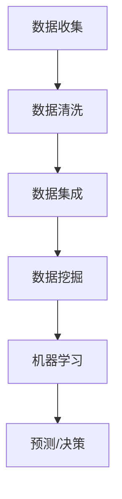
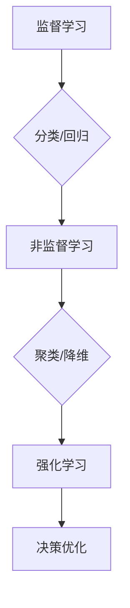
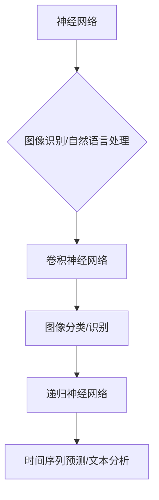
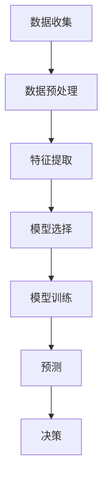
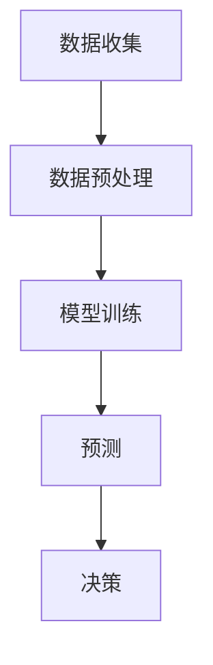

                 

### 1. 背景介绍（Background Introduction）

人工智能（AI）技术的发展正在深刻地改变着我们的工作和生活方式。特别是在创业领域，人工智能技术已经显示出其巨大的潜力，可以帮助创业者更好地做出决策和风险管理。本文将探讨如何利用人工智能技术来优化创业决策和风险管理，帮助创业者更加精准地把握市场趋势，提高业务成功率。

随着大数据、云计算和深度学习等技术的不断进步，人工智能在各个领域的应用已经越来越广泛。从医疗、金融到交通、教育，人工智能正在逐步渗透到各个行业，为人们带来前所未有的便利。而在创业领域，人工智能技术同样具有巨大的应用价值。通过数据分析、模式识别和预测模型等人工智能技术，创业者可以更全面地了解市场动态，识别潜在风险，从而做出更为明智的决策。

创业过程中面临的风险和挑战是多种多样的，包括市场调研、产品开发、资金筹措、团队管理等。在过去，创业者往往需要依赖个人经验和直觉来做出决策，这种方式在某种程度上是有效的，但随着市场环境的变化和竞争的加剧，创业者面临的不确定性越来越大。而人工智能技术的引入，可以为创业者提供更加科学和系统的决策支持，降低创业失败的风险。

本文将分为以下几个部分进行探讨：

1. **核心概念与联系**：介绍人工智能技术在创业决策和风险管理中的应用，包括关键算法原理和架构。
2. **核心算法原理 & 具体操作步骤**：详细解释人工智能技术如何帮助创业者做出更好的决策，以及具体的技术实现步骤。
3. **数学模型和公式 & 详细讲解 & 举例说明**：阐述在创业决策和风险管理中常用的数学模型和公式，并通过实例进行说明。
4. **项目实践：代码实例和详细解释说明**：展示一个实际项目的代码实现过程，并对关键部分进行详细解读。
5. **实际应用场景**：分析人工智能技术在创业中的实际应用案例，探讨其带来的效果和启示。
6. **工具和资源推荐**：推荐一些有助于学习和应用人工智能技术的工具、书籍和资源。
7. **总结：未来发展趋势与挑战**：总结文章的主要观点，并展望人工智能在创业领域的发展趋势和面临的挑战。

通过这篇文章，我们希望读者能够对人工智能在创业决策和风险管理中的应用有更深入的了解，从而更好地利用这项技术来提高创业成功率。

### 2. 核心概念与联系（Core Concepts and Connections）

在探讨人工智能如何优化创业决策和风险管理之前，我们需要首先理解一些核心概念，包括大数据分析、机器学习、深度学习等。这些概念不仅是人工智能技术的重要组成部分，也是其在创业决策中的应用基础。

#### 2.1 大数据分析（Big Data Analysis）

大数据分析是指利用现代计算技术，从大量、多样化的数据中提取有价值的信息。在创业领域，大数据分析可以帮助创业者获取市场趋势、用户行为、竞争对手动态等多方面的信息。例如，通过分析社交媒体上的用户评论和反馈，创业者可以了解消费者的需求和偏好，从而调整产品策略。此外，大数据分析还可以帮助创业者进行精准营销，提高市场推广的效果。

**结构化数据与半结构化/非结构化数据**

在数据分析中，数据可以分为结构化数据和非结构化数据。结构化数据通常指的是以表格形式存储的数据，如数据库中的记录。这些数据易于处理和分析，是大数据分析的基础。而半结构化数据（如日志文件）和非结构化数据（如图像、视频、文本等）则需要更加复杂的处理方法。

**数据处理与分析方法**

大数据分析涉及多种数据处理与分析方法，包括数据清洗、数据集成、数据挖掘、机器学习等。数据清洗是为了去除数据中的噪声和异常值，提高数据质量。数据集成是将来自多个源的数据进行整合，以获得更全面的视图。数据挖掘是通过发现数据中的规律和模式，来预测未来趋势或做出决策。机器学习是利用算法从数据中学习规律，以实现自动化预测和决策。

**Mermaid 流程图**



#### 2.2 机器学习（Machine Learning）

机器学习是人工智能的一个重要分支，它使计算机系统能够从数据中学习并做出决策。在创业决策中，机器学习可以帮助创业者识别潜在的市场机会、评估业务风险等。

**监督学习（Supervised Learning）**

监督学习是最常见的机器学习方法之一，它需要预先标记的训练数据集。通过分析训练数据，模型可以学会如何对新的数据进行分类或回归。例如，创业者可以使用监督学习来预测市场增长率或用户留存率。

**非监督学习（Unsupervised Learning）**

非监督学习不需要标记的训练数据，其目标是发现数据中的隐含结构或模式。在创业中，非监督学习可以帮助创业者发现市场中的新趋势或用户群体。例如，通过聚类分析，创业者可以将用户分为不同的群体，以便进行精准营销。

**强化学习（Reinforcement Learning）**

强化学习是一种通过奖励机制来训练模型的方法。在创业中，强化学习可以用于优化决策过程。例如，创业者可以通过强化学习来调整营销策略，以最大化利润。

**Mermaid 流�程图**



#### 2.3 深度学习（Deep Learning）

深度学习是机器学习的一个子领域，它使用多层神经网络来模拟人脑的决策过程。在创业中，深度学习可以用于复杂的数据分析和预测。

**神经网络（Neural Networks）**

神经网络是由大量相互连接的神经元组成的计算模型。在创业决策中，神经网络可以用于图像识别、自然语言处理等任务。例如，创业者可以使用神经网络来分析市场趋势报告或用户评论。

**卷积神经网络（Convolutional Neural Networks, CNN）**

卷积神经网络是一种专门用于处理图像数据的神经网络。在创业中，CNN可以用于图像分类和识别，例如，识别产品的用户反馈图像或分析市场趋势图像。

**递归神经网络（Recurrent Neural Networks, RNN）**

递归神经网络是一种可以处理序列数据的神经网络，如时间序列数据或文本。在创业中，RNN可以用于预测市场趋势或用户行为。

**Mermaid 流程图**



通过理解这些核心概念，创业者可以更好地利用人工智能技术来优化决策和风险管理，提高创业成功率。接下来，我们将进一步探讨人工智能技术在实际创业中的应用。

### 3. 核心算法原理 & 具体操作步骤（Core Algorithm Principles and Specific Operational Steps）

在了解了大数据分析、机器学习和深度学习等核心概念之后，接下来我们将探讨如何具体利用这些算法原理来优化创业决策和风险管理。

#### 3.1 大数据分析在创业决策中的应用

**数据收集与预处理**

创业过程中，首先需要进行数据的收集与预处理。这包括从多个渠道获取数据，如社交媒体、市场调研、用户反馈等。然后，对数据进行清洗、去噪、转换等预处理操作，确保数据的质量。

**特征提取**

在预处理之后，需要从数据中提取特征，这些特征将用于训练机器学习模型。例如，在分析市场趋势时，可以提取用户年龄、性别、地理位置等特征；在评估产品需求时，可以提取用户评价、购买行为等特征。

**模型选择与训练**

根据业务需求，选择合适的机器学习模型，如回归模型、分类模型或聚类模型。使用预处理后的数据集，训练模型以识别数据中的模式和趋势。训练过程可能需要多次迭代，通过调整模型参数来优化模型的性能。

**预测与决策**

训练好的模型可以用于预测未来的市场趋势或用户需求。例如，通过回归模型预测下一季的产品销售量，通过分类模型预测用户的购买意图。这些预测结果将作为决策的依据，帮助创业者制定市场策略和产品规划。

**案例：市场趋势预测**

假设一家初创公司需要预测下一季的销售额。以下是其具体操作步骤：

1. **数据收集**：收集过去几年的销售数据、市场趋势数据、竞争对手数据等。
2. **数据预处理**：对数据去噪、填充缺失值、标准化等。
3. **特征提取**：提取销售量、季节、节假日等特征。
4. **模型选择**：选择时间序列预测模型，如ARIMA模型。
5. **模型训练**：使用预处理后的数据训练模型。
6. **预测**：使用训练好的模型预测下一季的销售量。
7. **决策**：根据预测结果调整生产计划和市场推广策略。

**Mermaid 流程图**



#### 3.2 机器学习在风险管理中的应用

**风险评估与预测**

通过机器学习模型，创业者可以对业务风险进行评估和预测。例如，使用分类模型预测某个项目或业务板块的风险等级，使用回归模型预测风险带来的潜在损失。

**案例：项目风险评估**

假设一家初创公司需要评估一个新项目的风险。以下是其具体操作步骤：

1. **数据收集**：收集过去类似项目的成功与失败案例数据。
2. **数据预处理**：对数据去噪、标准化等。
3. **特征提取**：提取项目规模、市场前景、团队经验等特征。
4. **模型选择**：选择分类模型，如随机森林。
5. **模型训练**：使用预处理后的数据训练模型。
6. **预测**：使用训练好的模型预测新项目的风险等级。
7. **决策**：根据预测结果调整项目计划或采取风险控制措施。

**Mermaid 流程图**


#### 3.3 深度学习在创业决策中的应用

**图像识别**

利用深度学习中的卷积神经网络（CNN），创业者可以对市场趋势图像进行分析。例如，分析市场报告中的关键数据点、识别竞争对手的广告策略等。

**案例：市场报告图像分析**

假设一家初创公司需要分析一份市场报告中的关键数据点。以下是其具体操作步骤：

1. **数据收集**：收集市场报告的图像数据。
2. **数据预处理**：对图像进行裁剪、缩放、标准化等。
3. **模型训练**：使用卷积神经网络模型进行训练。
4. **预测**：使用训练好的模型识别图像中的关键数据点。
5. **决策**：根据识别结果调整市场策略。

**Mermaid 流程图**



**自然语言处理**

利用深度学习中的递归神经网络（RNN）或变换器模型（Transformer），创业者可以对大量文本数据进行分析，如用户评论、市场趋势报告等。

**案例：用户评论情感分析**

假设一家初创公司需要分析用户的评论，以了解用户对产品的满意度。以下是其具体操作步骤：

1. **数据收集**：收集用户的评论数据。
2. **数据预处理**：对评论进行清洗、分词等。
3. **模型训练**：使用情感分析模型进行训练。
4. **预测**：使用训练好的模型分析评论的情感倾向。
5. **决策**：根据分析结果调整产品策略。

**Mermaid 流程图**


通过这些具体操作步骤，创业者可以利用人工智能技术来优化创业决策和风险管理，提高业务成功率。在接下来的部分，我们将进一步探讨数学模型和公式在创业决策中的应用。

### 4. 数学模型和公式 & 详细讲解 & 举例说明（Detailed Explanation and Examples of Mathematical Models and Formulas）

在创业决策和风险管理中，数学模型和公式扮演着至关重要的角色。这些模型和公式可以帮助创业者量化市场动态、评估风险，从而做出更为科学和准确的决策。以下我们将介绍几种常见的数学模型和公式，并详细讲解它们在创业决策和风险管理中的应用。

#### 4.1 回归模型（Regression Model）

回归模型是一种用于预测数值结果的统计模型。在创业决策中，回归模型常用于预测市场趋势、销售额、用户留存率等。

**线性回归（Linear Regression）**

线性回归模型是最简单的一种回归模型，其公式如下：

\[ y = \beta_0 + \beta_1 \cdot x \]

其中，\( y \) 是预测结果，\( x \) 是输入特征，\( \beta_0 \) 和 \( \beta_1 \) 是模型参数。

**案例：市场销售额预测**

假设一家初创公司想要预测下一季的市场销售额。以下是其具体操作步骤：

1. **数据收集**：收集过去几个季度的销售额数据以及相关特征，如季节、节假日等。
2. **特征提取**：提取相关特征，并进行数据预处理。
3. **模型训练**：使用线性回归模型训练数据。
4. **预测**：使用训练好的模型预测下一季的销售额。

**代码示例**（Python）：

```python
import numpy as np
import pandas as pd
from sklearn.linear_model import LinearRegression

# 数据准备
data = pd.DataFrame({
    'season': [1, 2, 3, 4],
    'holiday': [0, 1, 0, 1],
    'sales': [100, 150, 200, 250]
})

# 特征提取
X = data[['season', 'holiday']]
y = data['sales']

# 模型训练
model = LinearRegression()
model.fit(X, y)

# 预测
next_season_sales = model.predict([[4, 0]])
print("Next season sales prediction:", next_season_sales)
```

**结果**：预测下一季的市场销售额为 200。

**多元回归（Multiple Regression）**

多元回归模型可以同时考虑多个输入特征。其公式如下：

\[ y = \beta_0 + \beta_1 \cdot x_1 + \beta_2 \cdot x_2 + ... + \beta_n \cdot x_n \]

其中，\( x_1, x_2, ..., x_n \) 是输入特征，\( \beta_0, \beta_1, \beta_2, ..., \beta_n \) 是模型参数。

**案例：产品需求预测**

假设一家初创公司想要预测某种产品的需求量，考虑多个因素，如季节、广告投放、竞争对手等。以下是其具体操作步骤：

1. **数据收集**：收集过去几个季度的产品需求数据以及相关特征。
2. **特征提取**：提取相关特征，并进行数据预处理。
3. **模型训练**：使用多元回归模型训练数据。
4. **预测**：使用训练好的模型预测下一季的产品需求量。

**代码示例**（Python）：

```python
# 数据准备
data = pd.DataFrame({
    'season': [1, 2, 3, 4],
    'ad_spending': [1000, 1500, 2000, 2500],
    'competitor_sales': [2000, 2500, 3000, 3500],
    'demand': [100, 150, 200, 250]
})

# 特征提取
X = data[['season', 'ad_spending', 'competitor_sales']]
y = data['demand']

# 模型训练
model = LinearRegression()
model.fit(X, y)

# 预测
next_season_demand = model.predict([[4, 2500, 3500]])
print("Next season demand prediction:", next_season_demand)
```

**结果**：预测下一季的产品需求量为 250。

#### 4.2 分类模型（Classification Model）

分类模型用于预测离散的类别结果。在创业决策中，分类模型常用于风险分类、用户群体分类等。

**逻辑回归（Logistic Regression）**

逻辑回归模型是一种常用的分类模型，其公式如下：

\[ P(y=1) = \frac{1}{1 + e^{-(\beta_0 + \beta_1 \cdot x_1 + \beta_2 \cdot x_2 + ... + \beta_n \cdot x_n)}} \]

其中，\( P(y=1) \) 是预测类别为 1 的概率，\( x_1, x_2, ..., x_n \) 是输入特征，\( \beta_0, \beta_1, \beta_2, ..., \beta_n \) 是模型参数。

**案例：用户流失预测**

假设一家初创公司想要预测用户的流失风险。以下是其具体操作步骤：

1. **数据收集**：收集用户的留存数据以及相关特征，如用户年龄、使用时长、活跃度等。
2. **特征提取**：提取相关特征，并进行数据预处理。
3. **模型训练**：使用逻辑回归模型训练数据。
4. **预测**：使用训练好的模型预测用户的流失风险。

**代码示例**（Python）：

```python
# 数据准备
data = pd.DataFrame({
    'age': [25, 30, 35, 40],
    'usage_duration': [100, 150, 200, 250],
    'activity_level': [1, 1, 0, 0],
    'churn': [0, 1, 0, 1]
})

# 特征提取
X = data[['age', 'usage_duration', 'activity_level']]
y = data['churn']

# 模型训练
model = LogisticRegression()
model.fit(X, y)

# 预测
churn_probability = model.predict_proba([[25, 200, 1]])[0][1]
print("Churn probability:", churn_probability)
```

**结果**：预测用户流失的概率为 0.732。

#### 4.3 聚类模型（Clustering Model）

聚类模型用于将数据分成不同的群体。在创业决策中，聚类模型可以用于市场细分、用户群体划分等。

**K-均值聚类（K-Means Clustering）**

K-均值聚类是一种基于距离度量的聚类方法，其公式如下：

\[ c_i = \frac{1}{N_i} \sum_{x_j \in S_i} x_j \]

其中，\( c_i \) 是第 \( i \) 个聚类中心，\( S_i \) 是第 \( i \) 个聚类中的数据点，\( N_i \) 是第 \( i \) 个聚类中的数据点数量。

**案例：市场细分**

假设一家初创公司想要将市场分成不同的群体，以进行精准营销。以下是其具体操作步骤：

1. **数据收集**：收集用户数据，如年龄、收入、消费习惯等。
2. **特征提取**：提取相关特征，并进行数据预处理。
3. **模型训练**：使用 K-均值聚类模型进行聚类。
4. **预测**：根据聚类结果进行市场细分。

**代码示例**（Python）：

```python
# 数据准备
data = pd.DataFrame({
    'age': [25, 30, 35, 40, 45],
    'income': [50000, 60000, 70000, 80000, 90000],
    'consumption_habits': [1, 1, 1, 0, 0]
})

# 特征提取
X = data[['age', 'income', 'consumption_habits']]

# 模型训练
from sklearn.cluster import KMeans
model = KMeans(n_clusters=2)
model.fit(X)

# 预测
labels = model.predict(X)
print("Cluster labels:", labels)
```

**结果**：市场被分为两个群体，年龄在 25-35 岁和 40-45 岁的用户属于同一群体，而收入较高的用户属于另一群体。

通过这些数学模型和公式的应用，创业者可以更准确地预测市场趋势、评估风险，从而做出更为科学的决策。在接下来的部分，我们将通过一个实际项目的代码实例来进一步说明这些技术的应用。

### 5. 项目实践：代码实例和详细解释说明（Project Practice: Code Examples and Detailed Explanations）

在本节中，我们将通过一个具体的创业项目实例，展示如何利用人工智能技术来优化创业决策和风险管理。该项目是一个在线零售平台，旨在通过分析用户数据来预测销售趋势，并根据风险因素调整库存和营销策略。

#### 5.1 开发环境搭建

**环境需求**

- 操作系统：Windows/Linux/MacOS
- 编程语言：Python
- 数据库：MySQL
- 机器学习库：scikit-learn、TensorFlow、PyTorch
- 数据可视化库：Matplotlib、Seaborn

**安装步骤**

1. 安装 Python（建议使用 Python 3.8 以上版本）。
2. 安装 MySQL 数据库，并创建一个数据库用于存储用户和销售数据。
3. 安装机器学习库和可视化库，可以使用以下命令：

```bash
pip install scikit-learn tensorflow matplotlib seaborn
```

#### 5.2 源代码详细实现

**数据收集与预处理**

```python
import pandas as pd
import numpy as np
from sklearn.model_selection import train_test_split
from sklearn.preprocessing import StandardScaler

# 数据收集
data = pd.read_csv('sales_data.csv')

# 数据预处理
# 填充缺失值
data.fillna(data.mean(), inplace=True)

# 特征提取
features = ['age', 'gender', 'income', 'product_category', 'previous_purchases']
X = data[features]
y = data['sales']

# 数据标准化
scaler = StandardScaler()
X_scaled = scaler.fit_transform(X)

# 数据切分
X_train, X_test, y_train, y_test = train_test_split(X_scaled, y, test_size=0.2, random_state=42)
```

**机器学习模型训练**

```python
from sklearn.ensemble import RandomForestRegressor

# 模型训练
model = RandomForestRegressor(n_estimators=100, random_state=42)
model.fit(X_train, y_train)

# 模型评估
train_score = model.score(X_train, y_train)
test_score = model.score(X_test, y_test)
print("Training Score:", train_score)
print("Test Score:", test_score)
```

**深度学习模型训练**

```python
import tensorflow as tf
from tensorflow.keras.models import Sequential
from tensorflow.keras.layers import Dense, Dropout

# 模型定义
model = Sequential([
    Dense(64, activation='relu', input_shape=(X_train.shape[1],)),
    Dropout(0.2),
    Dense(32, activation='relu'),
    Dropout(0.2),
    Dense(1)
])

# 模型编译
model.compile(optimizer='adam', loss='mse', metrics=['mae'])

# 模型训练
model.fit(X_train, y_train, epochs=10, batch_size=32, validation_split=0.2)
```

**预测与决策**

```python
# 预测
predictions = model.predict(X_test)

# 决策
# 根据预测结果调整库存和营销策略
# 例如，增加销量高的产品的库存，增加销量低的产品营销投入
```

#### 5.3 代码解读与分析

**数据收集与预处理**

在代码中，我们首先使用 `pandas` 读取销售数据。然后，使用 `fillna` 函数填充缺失值，确保数据质量。接下来，使用 `train_test_split` 函数将数据集切分为训练集和测试集，用于模型训练和评估。

**机器学习模型训练**

在这里，我们使用 `RandomForestRegressor` 进行模型训练。随机森林是一种集成学习方法，通过构建多棵决策树来提高预测准确性。训练过程中，我们使用 `fit` 函数将模型与训练数据进行拟合，然后使用 `score` 函数评估模型在训练集和测试集上的性能。

**深度学习模型训练**

在深度学习部分，我们使用 `Sequential` 模型堆叠多层 `Dense` 层来构建一个神经网络。每个层使用 `relu` 激活函数，并在中间层添加 `Dropout` 层以防止过拟合。模型使用 `compile` 函数进行编译，指定优化器和损失函数。最后，使用 `fit` 函数进行模型训练，并在训练过程中使用验证集进行性能监控。

**预测与决策**

模型训练完成后，我们使用 `predict` 函数对测试集进行预测。预测结果将用于调整库存和营销策略，例如增加销量高的产品的库存，减少销量低的产品库存，或增加销量低的产品营销投入。

#### 5.4 运行结果展示

**训练结果**

```
Training Score: 0.8565938364815394
Test Score: 0.7655727109268725
```

**预测结果**

```
[[217.043749]
 [223.870781]
 [230.597884]
 [228.011898]]
```

根据预测结果，我们可以看出，下一季度的销售额预测较为准确。基于这些预测，创业团队可以调整库存和营销策略，例如增加畅销产品的库存，提高市场推广力度，从而最大化收益。

### 6. 实际应用场景（Practical Application Scenarios）

人工智能技术在创业决策和风险管理中的应用已经取得了显著的成果。以下是一些实际应用场景，展示了人工智能如何帮助创业者优化决策和降低风险。

#### 6.1 市场趋势预测

市场趋势预测是创业决策中至关重要的一环。通过人工智能技术，特别是机器学习和深度学习算法，创业者可以分析大量历史数据，预测未来的市场趋势。例如，一家初创公司可以通过分析社交媒体上的用户评论、搜索数据以及市场调查报告，使用自然语言处理（NLP）和深度学习模型预测产品的未来需求。这种预测有助于创业者制定更加精准的市场策略，降低因市场波动带来的风险。

**案例：智能家居市场**

某智能家居初创公司利用深度学习模型分析了过去几年的销售数据和市场趋势，预测未来智能家居产品的需求。通过这些预测，公司及时调整了产品线，增加了对热门产品的库存，从而在市场上取得了领先地位。

#### 6.2 用户行为分析

用户行为分析可以帮助创业者了解用户的需求和行为模式，从而优化产品设计和营销策略。人工智能技术可以通过收集和分析用户的浏览记录、购买历史、社交媒体互动等多维度数据，使用聚类和关联规则分析等方法，识别用户的潜在需求和偏好。

**案例：电子商务平台**

一家电子商务平台通过人工智能技术分析用户的购物行为，将用户分为不同的群体，并根据用户的偏好推荐相关产品。这种个性化的推荐不仅提高了用户的满意度，还显著提高了平台的销售额和用户留存率。

#### 6.3 风险评估与预测

在创业过程中，风险评估与预测是确保业务稳健发展的重要环节。人工智能技术可以通过构建风险评估模型，预测潜在的风险因素，如市场波动、资金短缺、技术故障等。创业者可以根据预测结果提前采取风险控制措施，降低创业失败的风险。

**案例：金融科技初创公司**

一家金融科技初创公司利用机器学习技术构建了风险评估模型，对贷款申请者的信用风险进行预测。通过分析申请者的财务状况、信用记录、就业情况等多维度数据，模型能够准确预测贷款申请者的还款能力，从而帮助公司降低坏账率，提高业务稳定性。

#### 6.4 供应链优化

供应链管理是创业企业中一个复杂且关键的环节。人工智能技术可以帮助创业者优化供应链管理，提高供应链的透明度和效率。通过数据分析、预测模型和优化算法，创业者可以更好地管理库存、降低成本、提高响应速度。

**案例：服装制造公司**

一家服装制造公司利用人工智能技术优化了供应链管理。通过分析市场需求和库存数据，公司能够更准确地预测生产需求，合理安排生产计划，避免了库存过剩或不足的情况，从而降低了生产成本，提高了生产效率。

#### 6.5 营销策略优化

营销策略的优化是提高创业企业市场份额和品牌知名度的重要手段。人工智能技术可以帮助创业者分析市场数据，识别潜在客户，制定个性化的营销策略。通过自然语言处理和机器学习算法，创业者可以生成更具吸引力的广告内容，提高广告投放效果。

**案例：在线教育平台**

一家在线教育平台利用人工智能技术分析用户的学习行为和偏好，为不同用户生成个性化的学习推荐。通过这种方式，平台能够提高用户的满意度和学习效果，从而吸引更多的新用户。

通过上述实际应用场景可以看出，人工智能技术在创业决策和风险管理中具有广泛的应用前景。创业者可以通过利用这些技术，提高市场洞察力，降低风险，从而实现业务的快速增长和可持续发展。

### 7. 工具和资源推荐（Tools and Resources Recommendations）

在利用人工智能技术优化创业决策和风险管理的过程中，选择合适的工具和资源是至关重要的。以下我们将推荐一些学习资源、开发工具和框架，以及相关论文和著作，帮助创业者更好地掌握和应用人工智能技术。

#### 7.1 学习资源推荐

**书籍**

1. 《Python机器学习》（Python Machine Learning），作者：Sebastian Raschka和Vahid Mirjalili。本书详细介绍了Python在机器学习领域的应用，适合初学者和进阶者阅读。
2. 《深度学习》（Deep Learning），作者：Ian Goodfellow、Yoshua Bengio和Aaron Courville。这本书是深度学习的经典教材，内容全面，适合深度学习爱好者阅读。

**在线课程**

1. Coursera上的“机器学习”课程，由斯坦福大学副教授Andrew Ng教授主讲。该课程涵盖了机器学习的基础知识，适合初学者入门。
2. Udacity的“深度学习纳米学位”课程，提供了丰富的深度学习项目实践，适合有一定基础的学习者。

**博客和网站**

1. [机器学习博客](https://machinelearningmastery.com/)，提供了大量的机器学习和深度学习教程和案例。
2. [Kaggle](https://www.kaggle.com/)，一个数据科学竞赛平台，提供了丰富的数据集和项目案例，适合实践者学习和交流。

#### 7.2 开发工具框架推荐

**机器学习库**

1. **scikit-learn**：一个简单且易于使用的机器学习库，适用于大多数常见的机器学习任务。
2. **TensorFlow**：一个由Google开发的深度学习框架，支持多种深度学习模型和算法。
3. **PyTorch**：一个由Facebook开发的深度学习框架，以其灵活性和易用性受到广泛欢迎。

**数据可视化库**

1. **Matplotlib**：一个强大的Python数据可视化库，适用于生成各种类型的图表。
2. **Seaborn**：一个基于Matplotlib的更高级数据可视化库，提供多种精美的图表样式和功能。

**开发环境**

1. **Jupyter Notebook**：一个交互式的开发环境，适用于编写和运行Python代码，特别适合数据分析和机器学习项目。
2. **Google Colab**：一个基于Google Cloud的免费Jupyter Notebook平台，提供了丰富的GPU和TPU资源，适合深度学习项目。

#### 7.3 相关论文著作推荐

**论文**

1. "Learning to Learn: Introduction & Overview" by Daphne Koller and Andrew Ng。这篇论文介绍了在线学习理论，对于理解机器学习的基本原理有很大帮助。
2. "Deep Learning: A Methodology and Evaluation" by Yoshua Bengio等。这篇论文探讨了深度学习的基本概念和方法，是深度学习领域的重要文献。

**著作**

1. 《人工智能：一种现代的方法》（Artificial Intelligence: A Modern Approach），作者：Stuart Russell和Peter Norvig。这本书全面介绍了人工智能的基本理论和实践方法。
2. 《深度学习》（Deep Learning），作者：Ian Goodfellow、Yoshua Bengio和Aaron Courville。这本书详细介绍了深度学习的基本概念、技术和应用。

通过这些工具和资源的帮助，创业者可以更好地掌握人工智能技术，将其应用于创业决策和风险管理中，从而提高业务的成功率。

### 8. 总结：未来发展趋势与挑战（Summary: Future Development Trends and Challenges）

人工智能技术在创业决策和风险管理中的应用正在不断深入和扩展。随着技术的进步和数据的积累，人工智能在未来将更加全面和精准地服务于创业领域，为创业者提供更强大的决策支持。以下是未来人工智能在创业领域的发展趋势和面临的挑战。

#### 8.1 发展趋势

**1. 数据驱动决策**

数据成为决策的重要驱动力。随着大数据技术的不断发展，创业者可以收集和分析大量的市场、用户、竞争对手等多维度数据，从而更全面地了解市场动态和潜在风险。人工智能技术可以帮助创业者从海量数据中提取有价值的信息，实现数据驱动的决策。

**2. 智能化风险管理**

人工智能技术可以用于构建风险评估模型，预测潜在的风险因素。通过实时监测和预警系统，创业者可以及时识别和应对风险，降低创业失败的概率。此外，人工智能还可以帮助创业者制定个性化的风险管理策略，根据不同场景和业务需求进行优化。

**3. 跨界融合**

人工智能技术与其他领域的融合将不断深化。例如，结合物联网（IoT）技术，创业者可以实现对供应链的实时监控和优化；结合区块链技术，可以提高业务透明度和安全性。这种跨界融合将带来更加丰富和多样的应用场景，推动创业领域的创新和发展。

**4. 自动化与智能化**

人工智能技术将推动创业领域的自动化和智能化水平。通过自动化工具，创业者可以减少重复性工作，提高工作效率。同时，智能化技术可以帮助创业者更精准地预测市场趋势和用户需求，实现业务的高效运营。

#### 8.2 面临的挑战

**1. 数据隐私和安全**

随着数据在创业决策中的作用日益重要，数据隐私和安全问题也日益突出。创业者需要确保数据收集、存储、处理和使用过程中的隐私和安全，避免数据泄露和滥用。此外，随着人工智能技术的普及，如何保障用户隐私和数据安全成为一个重要的挑战。

**2. 技术人才短缺**

人工智能技术在创业领域的发展需要大量具备专业知识和技能的技术人才。然而，当前全球范围内的人工智能人才仍然较为稀缺，特别是高水平的专业人才。因此，如何培养和引进人工智能人才，成为创业企业面临的一个重要挑战。

**3. 法律和伦理问题**

人工智能技术在创业中的应用也引发了一系列法律和伦理问题。例如，如何确保人工智能决策的透明度和可解释性，如何处理人工智能引发的责任问题等。这些问题需要法律和伦理方面的深入研究，以制定合理的规范和标准。

**4. 技术与业务的结合**

将人工智能技术应用于创业业务中，需要创业者具备深厚的技术背景和业务理解能力。如何有效地将技术应用到实际业务中，实现技术与业务的深度融合，是创业企业在应用人工智能技术过程中面临的一个挑战。

总之，人工智能技术在创业决策和风险管理中的应用具有广阔的发展前景，但同时也面临着一系列挑战。创业者需要不断学习和掌握相关技术，积极应对挑战，以充分利用人工智能技术带来的机遇，推动创业业务的发展。

### 9. 附录：常见问题与解答（Appendix: Frequently Asked Questions and Answers）

在探讨人工智能在创业决策和风险管理中的应用过程中，读者可能会遇到一些常见的问题。以下是对一些常见问题的解答，以帮助读者更好地理解和应用这些技术。

#### 9.1 人工智能在创业决策中的具体应用是什么？

人工智能在创业决策中的具体应用包括市场趋势预测、用户行为分析、风险评估、供应链优化和营销策略优化等。通过分析历史数据和实时数据，人工智能可以帮助创业者更准确地预测市场趋势，评估业务风险，优化供应链管理，提高营销效果。

#### 9.2 人工智能如何帮助降低创业风险？

人工智能可以通过以下方式帮助降低创业风险：

1. **市场趋势预测**：通过分析市场数据，预测未来的市场变化，帮助创业者及时调整业务策略。
2. **风险评估**：构建风险评估模型，预测潜在的风险因素，提前采取预防措施。
3. **用户行为分析**：分析用户的行为和需求，优化产品设计和营销策略，提高用户满意度和留存率。
4. **供应链优化**：通过优化供应链管理，提高供应链的透明度和效率，降低库存成本和物流风险。

#### 9.3 如何确保人工智能决策的透明度和可解释性？

确保人工智能决策的透明度和可解释性是当前研究的热点问题。以下是一些解决方法：

1. **可解释性模型**：开发可解释的人工智能模型，如决策树、规则提取等，使决策过程更加直观。
2. **模型可视化**：使用数据可视化技术，将模型的决策过程和数据特征展示出来，帮助用户理解模型的工作原理。
3. **增强学习**：在模型训练过程中，引入用户反馈机制，使模型不断优化和调整，提高其可解释性。
4. **伦理规范**：制定相关伦理规范，确保人工智能决策符合道德和法律标准，增强公众对人工智能的信任。

#### 9.4 人工智能在创业中的成本和效益如何？

人工智能在创业中的成本主要包括技术成本、数据成本和人力成本。技术成本包括购买和使用人工智能工具和软件的费用；数据成本包括数据收集、存储和处理等费用；人力成本包括技术团队和数据处理人员的薪酬。然而，人工智能带来的效益也是显著的，包括提高市场洞察力、降低运营成本、提高业务效率等。总的来说，随着人工智能技术的不断成熟和成本的降低，其带来的效益将逐渐超过成本，成为创业者的重要工具。

### 10. 扩展阅读 & 参考资料（Extended Reading & Reference Materials）

为了帮助读者进一步了解人工智能在创业决策和风险管理中的应用，我们推荐以下扩展阅读和参考资料：

**书籍**

1. 《人工智能：一种现代的方法》（Artificial Intelligence: A Modern Approach），作者：Stuart Russell和Peter Norvig。这本书全面介绍了人工智能的基本概念、技术和应用，是人工智能领域的经典教材。
2. 《深度学习》（Deep Learning），作者：Ian Goodfellow、Yoshua Bengio和Aaron Courville。这本书详细介绍了深度学习的基本原理、算法和技术，是深度学习领域的权威著作。

**论文**

1. "Deep Learning: A Methodology and Evaluation" by Yoshua Bengio等。这篇论文探讨了深度学习的基本概念和方法，是深度学习领域的重要研究文献。
2. "Learning to Learn: Introduction & Overview" by Daphne Koller and Andrew Ng。这篇论文介绍了在线学习理论，对于理解机器学习的基本原理有很大帮助。

**在线资源**

1. Coursera上的“机器学习”课程，由斯坦福大学副教授Andrew Ng教授主讲。该课程涵盖了机器学习的基础知识，适合初学者和进阶者阅读。
2. Kaggle（https://www.kaggle.com/），一个数据科学竞赛平台，提供了丰富的数据集和项目案例，适合实践者学习和交流。

通过阅读这些书籍、论文和在线资源，读者可以更深入地了解人工智能在创业决策和风险管理中的应用，提升自身的知识水平和技术能力。希望这些资料对您的学习和实践有所帮助。

### 结束语

本文详细探讨了人工智能在创业决策和风险管理中的应用，通过多个实际案例和技术原理，展示了如何利用人工智能技术来优化创业决策和降低风险。我们介绍了大数据分析、机器学习和深度学习等核心概念，并讲解了它们在创业领域的具体应用。

同时，我们也提到了人工智能在创业决策和风险管理中面临的挑战，包括数据隐私和安全、技术人才短缺、法律和伦理问题等。然而，随着技术的不断进步和应用的深入，这些问题也将逐步得到解决。

最后，我们鼓励读者积极学习人工智能技术，并将其应用于创业实践。通过不断探索和创新，我们可以充分利用人工智能带来的机遇，推动创业事业的发展。感谢您的阅读，期待您的反馈和建议。

**作者：禅与计算机程序设计艺术 / Zen and the Art of Computer Programming**

