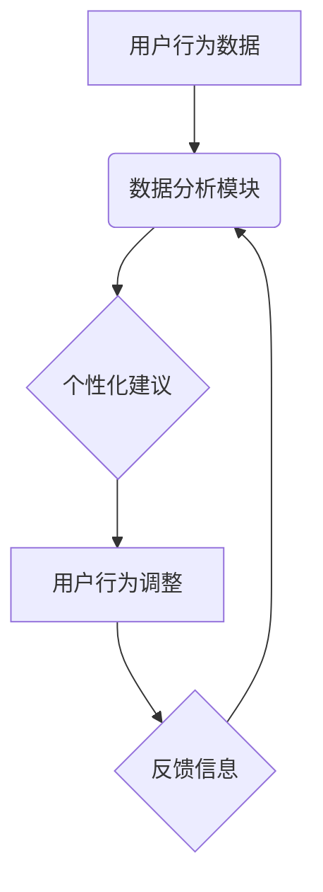

                 

## 欲望的智能调节：AI辅助的自我管理

> 关键词：人工智能、自我管理、欲望调节、行为分析、机器学习、个性化推荐、伦理问题

### 1. 背景介绍

在当今信息爆炸的时代，我们面临着前所未有的诱惑和选择。社交媒体、电商平台、娱乐应用无处不在，不断地刺激着我们的欲望，让我们难以专注于自身目标，陷入无尽的消费和娱乐循环。这种状态不仅影响着我们的效率和幸福感，也可能导致一系列负面后果，如焦虑、抑郁、物质依赖等。

如何有效地管理欲望，保持理性思考和自律行为，已成为当今社会面临的重要挑战。传统的心理咨询和自我调节方法虽然有一定效果，但往往难以针对性地解决问题，且需要较长时间的投入和坚持。

近年来，人工智能技术的发展为自我管理提供了新的可能性。AI算法能够对海量数据进行分析，识别个人行为模式和欲望触发因素，并提供个性化的建议和干预措施，帮助人们更好地理解和控制自己的欲望。

### 2. 核心概念与联系

**2.1 欲望的本质**

欲望是一种内在的驱动力，促使我们追求满足感和幸福。它可以是生理需求，如饥饿、疲劳；也可以是心理需求，如归属感、成就感。欲望本身并非坏事，它驱动着我们的行动，让我们不断探索和进步。然而，当欲望失控，成为我们生活的中心，就会带来一系列问题。

**2.2 AI辅助自我管理**

AI辅助自我管理是指利用人工智能技术，帮助人们更好地理解和控制自己的欲望，从而实现自我提升和幸福生活。

**2.3 系统架构**

AI辅助自我管理系统通常由以下几个模块组成：

* **数据采集模块:** 收集用户行为数据，如浏览记录、消费记录、社交互动等。
* **数据分析模块:** 利用机器学习算法，分析用户行为数据，识别欲望触发因素和行为模式。
* **个性化推荐模块:** 根据用户数据分析结果，提供个性化的建议和干预措施，帮助用户控制欲望。
* **反馈机制模块:** 收集用户反馈，不断优化系统算法和建议策略。



### 3. 核心算法原理 & 具体操作步骤

**3.1 算法原理概述**

AI辅助自我管理系统通常采用以下几种核心算法：

* **强化学习:** 通过奖励和惩罚机制，训练模型学习最优的行为策略，帮助用户控制欲望。
* **深度学习:** 利用多层神经网络，从海量数据中学习复杂的模式，识别用户欲望的触发因素。
* **自然语言处理:** 分析用户文本数据，理解用户的意图和情绪，提供更精准的建议。

**3.2 算法步骤详解**

以强化学习为例，其具体操作步骤如下：

1. **环境设定:** 定义用户行为空间和奖励机制。
2. **代理训练:** 利用强化学习算法，训练一个代理模型，学习控制用户行为以获得最大奖励。
3. **数据收集:** 收集用户行为数据，作为代理模型的训练数据。
4. **模型更新:** 根据收集到的数据，更新代理模型的参数，使其学习更有效的行为策略。
5. **个性化建议:** 根据训练好的代理模型，为用户提供个性化的建议和干预措施。

**3.3 算法优缺点**

**优点:**

* **个性化:** 可以根据用户的具体情况提供个性化的建议。
* **主动性:** 可以主动提醒用户，帮助他们控制欲望。
* **数据驱动:** 基于数据分析，提供更精准的建议。

**缺点:**

* **数据依赖:** 需要大量用户数据进行训练，否则效果不佳。
* **伦理问题:** 存在隐私泄露和算法操控的风险。
* **技术复杂:** 需要专业的技术人员进行开发和维护。

**3.4 算法应用领域**

AI辅助自我管理算法可以应用于以下领域:

* **健康管理:** 控制饮食、运动、睡眠等习惯。
* **情绪调节:** 识别和缓解焦虑、抑郁等负面情绪。
* **学习效率:** 提高学习专注力和记忆力。
* **财务管理:** 控制消费、理财投资等行为。

### 4. 数学模型和公式 & 详细讲解 & 举例说明

**4.1 数学模型构建**

我们可以用马尔可夫决策过程 (MDP) 来建模 AI 辅助自我管理系统。

* **状态空间:** 用户的行为状态，例如是否正在浏览社交媒体、是否正在进行学习活动等。
* **动作空间:** 用户可以采取的行动，例如关闭社交媒体、开始学习、进行运动等。
* **奖励函数:** 根据用户的行为和状态，给予相应的奖励或惩罚。

**4.2 公式推导过程**

强化学习算法的目标是找到一个最优策略，使得用户在长期的互动过程中获得最大的总奖励。

最优策略可以通过 Bellman 方程来推导：

$$
V^*(s) = \max_a \sum_{s'} P(s'|s,a) [R(s,a,s') + \gamma V^*(s')]
$$

其中：

* $V^*(s)$ 是状态 $s$ 的最优价值函数。
* $a$ 是用户可以采取的动作。
* $s'$ 是状态 $s$ 采取动作 $a$ 后可能进入的下一个状态。
* $P(s'|s,a)$ 是从状态 $s$ 采取动作 $a$ 进入状态 $s'$ 的概率。
* $R(s,a,s')$ 是从状态 $s$ 采取动作 $a$ 进入状态 $s'$ 得到的奖励。
* $\gamma$ 是折扣因子，控制未来奖励的权重。

**4.3 案例分析与讲解**

假设我们想要训练一个 AI 助手来帮助用户控制手机使用时间。

* 状态空间可以是用户手机使用时间，例如 0 分钟、15 分钟、30 分钟等。
* 动作空间可以是用户可以采取的行动，例如继续使用手机、关闭手机、进行其他活动等。
* 奖励函数可以设计为，用户关闭手机或进行其他活动时获得奖励，用户继续使用手机时扣除奖励。

通过训练强化学习模型，我们可以找到一个最优策略，使得用户在长期的互动过程中，手机使用时间逐渐减少，从而达到控制欲望的目的。

### 5. 项目实践：代码实例和详细解释说明

**5.1 开发环境搭建**

* Python 3.x
* TensorFlow 或 PyTorch 深度学习框架
* Jupyter Notebook 或 VS Code 代码编辑器

**5.2 源代码详细实现**

```python
import tensorflow as tf

# 定义神经网络模型
model = tf.keras.models.Sequential([
    tf.keras.layers.Dense(64, activation='relu', input_shape=(10,)),
    tf.keras.layers.Dense(32, activation='relu'),
    tf.keras.layers.Dense(1)
])

# 定义损失函数和优化器
model.compile(loss='mse', optimizer='adam')

# 训练模型
model.fit(X_train, y_train, epochs=10)

# 预测用户行为
predictions = model.predict(X_test)
```

**5.3 代码解读与分析**

* 该代码示例展示了使用 TensorFlow 框架训练一个简单的深度学习模型，用于预测用户的行为。
* 模型输入是用户行为数据，输出是用户行为的预测结果。
* 训练过程使用均方误差 (MSE) 作为损失函数，Adam 作为优化器。
* 训练完成后，模型可以用于预测用户的行为，并提供相应的建议。

**5.4 运行结果展示**

训练结果可以展示在图表中，例如训练损失随迭代次数的变化趋势。

### 6. 实际应用场景

**6.1 健康管理**

AI 辅助自我管理系统可以帮助用户控制饮食、运动、睡眠等习惯，实现健康生活目标。例如，可以根据用户的饮食记录，推荐健康的食谱和运动计划，并提醒用户按时进行锻炼和休息。

**6.2 情绪调节**

AI 辅助自我管理系统可以识别和缓解用户的焦虑、抑郁等负面情绪。例如，可以根据用户的文本和语音数据，识别用户的负面情绪，并提供相应的放松技巧和心理咨询建议。

**6.3 学习效率**

AI 辅助自我管理系统可以帮助用户提高学习专注力和记忆力。例如，可以根据用户的学习习惯和知识点掌握情况，推荐个性化的学习资源和学习计划，并提醒用户及时复习和巩固知识。

**6.4 未来应用展望**

随着人工智能技术的不断发展，AI 辅助自我管理系统将应用于更多领域，例如：

* **财务管理:** 控制消费、理财投资等行为。
* **人际关系:** 提升沟通技巧、建立健康的人际关系。
* **职业发展:** 规划职业目标、提升职业技能。

### 7. 工具和资源推荐

**7.1 学习资源推荐**

* **书籍:**

    * 《深度学习》
    * 《强化学习：原理、算法和应用》
    * 《人工智能：一种现代方法》

* **在线课程:**

    * Coursera: 深度学习、强化学习
    * edX: 人工智能、机器学习

**7.2 开发工具推荐**

* **Python:** 广泛应用于人工智能开发，拥有丰富的库和框架。
* **TensorFlow:** Google 开发的开源深度学习框架。
* **PyTorch:** Facebook 开发的开源深度学习框架。
* **Jupyter Notebook:** 用于代码编写和可视化分析的交互式环境。

**7.3 相关论文推荐**

* **Deep Reinforcement Learning for Personalized Education**
* **A Survey of Reinforcement Learning for Human Behavior Modeling**
* **Towards Personalized AI Assistants: A Survey of Techniques and Challenges**

### 8. 总结：未来发展趋势与挑战

**8.1 研究成果总结**

AI 辅助自我管理技术取得了显著进展，能够有效地识别用户欲望的触发因素，并提供个性化的建议和干预措施。

**8.2 未来发展趋势**

* **更精准的个性化推荐:** 利用更先进的机器学习算法，对用户数据进行更深入的分析，提供更精准的个性化建议。
* **更丰富的交互方式:** 除了文本和语音，还可以利用其他交互方式，例如表情、手势等，提高用户体验。
* **更强大的解释性:** 增强 AI 模型的解释性，让用户更好地理解模型的决策过程，提高用户信任度。

**8.3 面临的挑战**

* **数据隐私和安全:** 需要确保用户数据的隐私和安全，避免数据泄露和滥用。
* **算法公平性和可解释性:** 需要确保 AI 模型的公平性和可解释性，避免算法歧视和误判。
* **伦理问题:** 需要认真思考 AI 辅助自我管理技术的伦理问题，避免过度干预用户自由意志。

**8.4 研究展望**

未来，AI 辅助自我管理技术将继续发展，为人们提供更有效的自我管理工具，帮助他们更好地理解和控制自己的欲望，实现更幸福、更充实的生活。

### 9. 附录：常见问题与解答

**9.1 如何保证 AI 系统的安全性？**

* 使用加密技术保护用户数据。
* 定期进行安全漏洞扫描和修复。
* 建立完善的隐私政策和数据使用协议。

**9.2 AI 系统会取代人类的自我管理能力吗？**

AI 系统可以作为辅助工具，帮助人们更好地管理自我，但不会取代人类的自主决策能力。

**9.3 如何避免 AI 系统的算法歧视？**

* 使用多元化的训练数据，避免算法偏向特定群体。
* 定期评估算法的公平性，并进行必要的调整。
* 鼓励算法透明度，让用户了解算法的决策过程。


作者：禅与计算机程序设计艺术 / Zen and the Art of Computer Programming 
<end_of_turn>

