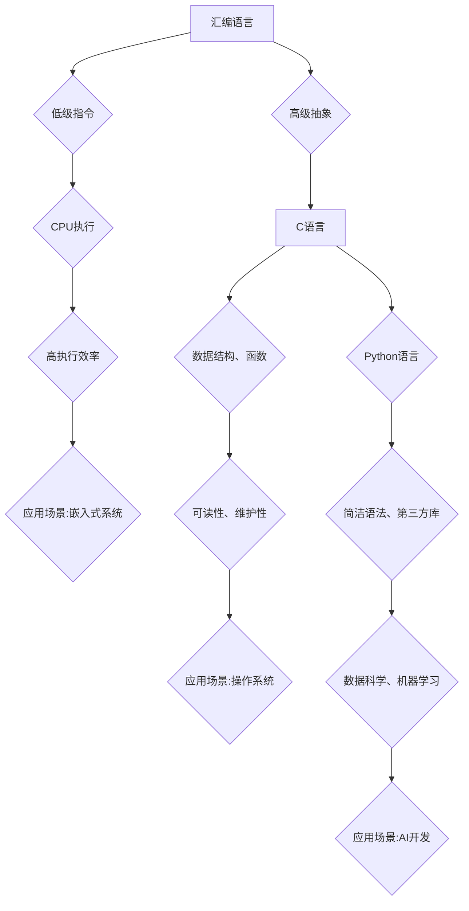

                 

## 汇编、C、Python：AI开发的语言基础

> 关键词：汇编语言、C语言、Python语言、人工智能、算法、数据结构、机器学习、深度学习

## 1. 背景介绍

人工智能（AI）正以惊人的速度发展，它正在改变着我们生活的方方面面。从自动驾驶汽车到医疗诊断，从个性化推荐到语音助手，AI技术的应用无处不在。然而，想要开发出强大的AI应用程序，就需要掌握扎实的编程基础。

本文将探讨汇编语言、C语言和Python语言这三种编程语言在AI开发中的应用，并深入分析它们的优缺点，帮助读者了解如何选择合适的语言来构建自己的AI项目。

## 2. 核心概念与联系

### 2.1 汇编语言

汇编语言是计算机硬件最直接的指令集语言，它与计算机的CPU指令一一对应。汇编语言的程序非常接近机器码，因此执行效率极高，但代码编写难度大，可读性和维护性差。

### 2.2 C语言

C语言是一种结构化编程语言，它提供了更高级的抽象概念，如数据类型、函数、结构体等，使得代码编写更加简洁易读。C语言的执行效率也相对较高，并且广泛应用于操作系统、嵌入式系统等领域。

### 2.3 Python语言

Python语言是一种解释型脚本语言，它以其简洁易懂的语法和丰富的第三方库而闻名。Python语言在数据科学、机器学习和深度学习领域有着广泛的应用，因为它提供了许多专门的AI库和框架，如TensorFlow、PyTorch等。

**核心概念与联系流程图:**



## 3. 核心算法原理 & 具体操作步骤

### 3.1 算法原理概述

算法是解决特定问题的指令序列，是计算机程序的核心。AI开发中常用的算法包括：

* **线性回归:** 用于预测连续值，例如房价、股票价格等。
* **逻辑回归:** 用于分类问题，例如判断邮件是否为垃圾邮件。
* **决策树:** 用于分类和回归问题，通过一系列的判断条件来预测结果。
* **支持向量机:** 用于分类问题，通过寻找最佳的分隔超平面来将数据点分类。
* **神经网络:** 能够学习复杂模式的算法，广泛应用于图像识别、自然语言处理等领域。

### 3.2 算法步骤详解

以线性回归为例，其步骤如下：

1. **收集数据:** 收集包含输入特征和目标变量的数据集。
2. **数据预处理:** 对数据进行清洗、转换和特征工程等操作，以提高模型的性能。
3. **模型训练:** 使用训练数据训练线性回归模型，学习输入特征和目标变量之间的关系。
4. **模型评估:** 使用测试数据评估模型的性能，例如计算均方误差（MSE）或R-squared值。
5. **模型调优:** 根据评估结果，调整模型参数以提高性能。
6. **模型部署:** 将训练好的模型部署到实际应用场景中，用于预测新的数据。

### 3.3 算法优缺点

不同的算法具有不同的优缺点，需要根据具体应用场景选择合适的算法。

* **线性回归:** 优点：简单易懂，易于实现；缺点：对非线性关系的拟合能力较差。
* **逻辑回归:** 优点：适用于分类问题，易于解释；缺点：对复杂分类问题的拟合能力较差。
* **决策树:** 优点：易于理解和解释，可以处理非线性关系；缺点：容易过拟合，对数据噪声敏感。
* **支持向量机:** 优点：对高维数据具有较好的泛化能力；缺点：训练时间较长，参数选择较复杂。
* **神经网络:** 优点：能够学习复杂模式，性能优异；缺点：训练时间长，参数众多，易于过拟合。

### 3.4 算法应用领域

不同的算法适用于不同的应用领域。例如：

* **线性回归:** 房价预测、股票价格预测等。
* **逻辑回归:** 垃圾邮件分类、欺诈检测等。
* **决策树:** 医疗诊断、客户流失预测等。
* **支持向量机:** 手写数字识别、图像分类等。
* **神经网络:** 语音识别、图像识别、自然语言处理等。

## 4. 数学模型和公式 & 详细讲解 & 举例说明

### 4.1 数学模型构建

在AI开发中，数学模型是描述算法逻辑和关系的核心。例如，线性回归模型的数学表达式为：

$$y = w_0 + w_1x_1 + w_2x_2 + ... + w_nx_n + \epsilon$$

其中：

* $y$ 是目标变量
* $w_0, w_1, w_2, ..., w_n$ 是模型参数
* $x_1, x_2, ..., x_n$ 是输入特征
* $\epsilon$ 是误差项

### 4.2 公式推导过程

模型参数的学习过程通常使用最小二乘法，其目标是找到使误差平方和最小的参数值。

最小二乘法的公式为：

$$\min_{w} \sum_{i=1}^{n}(y_i - \hat{y}_i)^2$$

其中：

* $w$ 是模型参数向量
* $y_i$ 是第 $i$ 个样本的目标变量
* $\hat{y}_i$ 是第 $i$ 个样本的预测值

通过求解该公式，可以得到模型参数的最佳值。

### 4.3 案例分析与讲解

假设我们想要预测房屋价格，输入特征包括房屋面积、房间数量、地理位置等。我们可以使用线性回归模型来构建预测模型。

通过收集房屋数据并训练线性回归模型，我们可以得到模型参数，例如：

* $w_0 = 100000$
* $w_1 = 500$ (每平方米面积增加500元)
* $w_2 = 10000$ (每增加一个房间价格增加10000元)

根据这些参数，我们可以预测新房子的价格。例如，如果新房子的面积为100平方米，房间数量为3个，地理位置为市中心，那么预测价格为：

$$y = 100000 + 500 * 100 + 10000 * 3 = 200000$$

## 5. 项目实践：代码实例和详细解释说明

### 5.1 开发环境搭建

为了开发AI项目，我们需要搭建合适的开发环境。常用的开发环境包括：

* **Python环境:** 使用Anaconda或Miniconda创建Python虚拟环境，安装必要的Python库，例如NumPy、Pandas、Scikit-learn等。
* **深度学习框架环境:** 使用TensorFlow、PyTorch等深度学习框架，安装相应的库和依赖。

### 5.2 源代码详细实现

以使用Python和Scikit-learn库实现线性回归为例，代码如下：

```python
import numpy as np
from sklearn.linear_model import LinearRegression
from sklearn.model_selection import train_test_split

# 生成示例数据
X = np.array([[1, 2], [3, 4], [5, 6], [7, 8]])
y = np.array([3, 7, 11, 15])

# 将数据分为训练集和测试集
X_train, X_test, y_train, y_test = train_test_split(X, y, test_size=0.2, random_state=42)

# 创建线性回归模型
model = LinearRegression()

# 训练模型
model.fit(X_train, y_train)

# 预测测试集数据
y_pred = model.predict(X_test)

# 评估模型性能
print('Coefficients:', model.coef_)
print('Intercept:', model.intercept_)
print('R-squared:', model.score(X_test, y_test))
```

### 5.3 代码解读与分析

* 首先，我们使用NumPy库生成示例数据，包括输入特征X和目标变量y。
* 然后，我们使用Scikit-learn库的`train_test_split`函数将数据分为训练集和测试集。
* 接下来，我们创建线性回归模型，并使用`fit`方法训练模型。
* 训练完成后，我们可以使用`predict`方法预测测试集数据。
* 最后，我们使用`coef_`、`intercept_`和`score`方法评估模型的性能。

### 5.4 运行结果展示

运行上述代码，可以得到模型的系数、截距和R-squared值，这些指标可以用来评估模型的性能。

## 6. 实际应用场景

### 6.1 医疗诊断

AI技术在医疗诊断领域有着广泛的应用，例如：

* **图像识别:** 使用卷积神经网络识别病变区域，辅助医生诊断癌症、心血管疾病等。
* **疾病预测:** 使用机器学习算法分析患者的医疗记录和基因信息，预测疾病风险。
* **药物研发:** 使用AI算法加速药物研发过程，例如预测药物的活性、副作用等。

### 6.2 金融风险管理

AI技术可以帮助金融机构识别和管理风险，例如：

* **欺诈检测:** 使用机器学习算法分析交易数据，识别异常交易行为，防止欺诈。
* **信用评分:** 使用AI算法分析客户的信用历史和财务状况，评估客户的信用风险。
* **投资决策:** 使用AI算法分析市场数据，预测股票价格走势，辅助投资决策。

### 6.3 自动驾驶

AI技术是自动驾驶的核心，例如：

* **环境感知:** 使用计算机视觉和传感器数据，感知周围环境，识别道路、车辆、行人等。
* **路径规划:** 使用机器学习算法规划行驶路径，避开障碍物，安全到达目的地。
* **决策控制:** 使用AI算法控制车辆的加速、减速、转向等动作，实现自动驾驶。

### 6.4 未来应用展望

AI技术的应用场景还在不断扩展，未来将有更多新的应用场景出现，例如：

* **个性化教育:** 使用AI算法分析学生的学习情况，提供个性化的学习方案。
* **智能家居:** 使用AI算法控制家居设备，实现智能家居功能。
* **机器人服务:** 使用AI算法开发智能机器人，提供服务和陪伴。

## 7. 工具和资源推荐

### 7.1 学习资源推荐

* **在线课程:** Coursera、edX、Udacity等平台提供丰富的AI课程。
* **书籍:** 《深度学习》、《机器学习实战》等书籍是AI学习的经典教材。
* **博客和论坛:** Kaggle、Towards Data Science等平台提供大量的AI博客文章和论坛讨论。

### 7.2 开发工具推荐

* **Python:** 作为AI开发的主要语言，Python拥有丰富的库和框架，例如NumPy、Pandas、Scikit-learn、TensorFlow、PyTorch等。
* **Jupyter Notebook:** 用于交互式编程和数据可视化的工具，方便AI开发和调试。
* **Git:** 用于代码版本控制的工具，方便团队协作开发。

### 7.3 相关论文推荐

* **《ImageNet Classification with Deep Convolutional Neural Networks》:** 介绍了AlexNet模型，开启了深度学习的时代。
* **《Attention Is All You Need》:** 介绍了Transformer模型，在自然语言处理领域取得了突破性进展。
* **《Generative Adversarial Networks》:** 介绍了GAN模型，在图像生成领域取得了显著成果。

## 8. 总结：未来发展趋势与挑战

### 8.1 研究成果总结

近年来，AI技术取得了长足的进步，在各个领域都得到了广泛应用。深度学习算法的突破，使得AI模型能够学习更复杂的数据模式，取得了令人瞩目的成果。

### 8.2 未来发展趋势

* **模型规模和效率:** 未来AI模型将更加庞大，并朝着更高效的方向发展，例如模型压缩、量化等技术。
* **数据安全和隐私:** 随着AI模型对数据的依赖性越来越高，数据安全和隐私保护将成为越来越重要的研究方向。
* **AI伦理和社会影响:** AI技术的快速发展也带来了伦理和社会影响问题，需要加强伦理规范和社会治理。

### 8.3 面临的挑战

* **算法解释性和可信度:** 许多AI模型是黑箱模型，难以解释其决策过程，这限制了其在一些关键领域应用的推广。
* **数据获取和标注:** 训练高质量的AI模型需要大量的标注数据，数据获取和标注成本高昂。
* **计算资源需求:** 训练大型AI模型需要大量的计算资源，这限制了其在资源有限的场景中的应用。

### 8.4 研究展望

未来AI研究将继续朝着更智能、更安全、更可解释的方向发展，并与其他领域交叉融合，例如生物学、物理学、哲学等，推动科技进步和社会发展。

## 9. 附录：常见问题与解答

### 9.1 什么是AI？

人工智能（AI）是指模拟人类智能的计算机系统。

### 9.2 汇编语言和C语言有什么区别？

汇编语言是机器指令的直接映射，执行效率高，但代码编写难度大。C语言是高级编程语言，提供了更抽象的语法和数据结构，代码编写更易于理解和维护。

### 9.3 Python语言为什么适合AI开发？

Python语言简洁易懂，拥有丰富的第三方库和框架，例如NumPy、Pandas、Scikit-learn、TensorFlow、PyTorch等，这些库和框架提供了强大的数据处理、机器学习和深度学习功能，使得Python成为AI开发的首选语言之一。


作者：禅与计算机程序设计艺术 / Zen and the Art of Computer Programming<end_of_turn>

