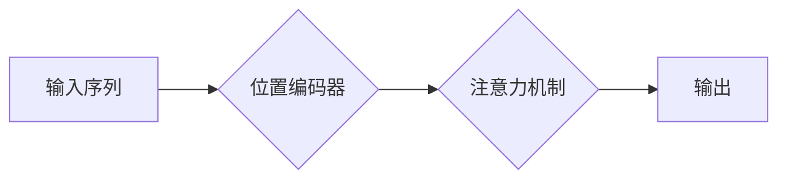
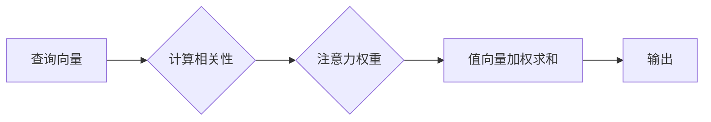

                 

## 1. 背景介绍

深度学习的蓬勃发展离不开各种创新性的架构和机制。其中，注意力机制 (Attention Mechanism) 作为一种重要的突破，在自然语言处理 (NLP)、计算机视觉 (CV) 等领域取得了显著的成果。注意力机制的核心思想是让模型关注输入序列中与当前任务最相关的部分，从而提高模型的理解能力和预测精度。

传统的循环神经网络 (RNN) 在处理长序列数据时存在梯度消失和梯度爆炸的问题，难以捕捉长距离依赖关系。注意力机制通过赋予不同输入元素不同的权重，有效地解决了这个问题。它允许模型在处理序列数据时，根据上下文信息动态地选择关注哪些部分，从而更好地理解序列的整体结构和语义。

## 2. 核心概念与联系

### 2.1  softmax函数

softmax函数是注意力机制中不可或缺的一部分，它将输入向量映射到一个概率分布，每个元素代表了模型对相应输入元素的关注程度。

**原理：** softmax函数将输入向量中的每个元素进行指数运算，然后对所有元素进行归一化，使得所有元素的和为1。

**公式：**

$$
softmax(x_i) = \frac{e^{x_i}}{\sum_{j=1}^{n} e^{x_j}}
$$

其中，$x_i$ 是输入向量中的第 i 个元素，n 是输入向量的长度。

### 2.2  位置编码器

在处理序列数据时，模型需要了解每个元素在序列中的位置信息。位置编码器 (Positional Encoder) 负责将位置信息编码到输入向量中，使模型能够区分不同位置的元素。

**原理：** 位置编码器通常使用 sinusoidal 函数将位置信息编码到向量中，每个位置对应一个独特的向量。

**Mermaid 流程图：**



### 2.3  注意力机制

注意力机制的核心是计算每个输入元素与当前输出元素之间的相关性，并根据相关性分配不同的权重。

**原理：** 注意力机制通常使用一个查询 (Query)、键 (Key) 和值 (Value) 三个向量来计算相关性。查询向量代表当前输出元素，键向量代表输入元素，值向量代表输入元素的特征信息。

**Mermaid 流程图：**



## 3. 核心算法原理 & 具体操作步骤

### 3.1  算法原理概述

注意力机制的具体实现方式有很多种，其中最常见的包括自注意力 (Self-Attention) 和多头注意力 (Multi-Head Attention)。

**自注意力：** 自注意力机制用于处理一个序列中的元素之间的关系，它将查询、键和值向量都从同一个序列中获取。

**多头注意力：** 多头注意力机制通过使用多个自注意力头，并对每个头的输出进行拼接，来捕捉不同层次的语义信息。

### 3.2  算法步骤详解

**自注意力机制的步骤：**

1. 将输入序列中的每个元素映射到查询 (Query)、键 (Key) 和值 (Value) 向量。
2. 计算每个查询向量与所有键向量的相关性。
3. 使用 softmax 函数将相关性转换为注意力权重。
4. 将注意力权重与值向量进行加权求和，得到输出向量。

**多头注意力的步骤：**

1. 将输入序列映射到多个查询、键和值向量。
2. 对每个头进行自注意力计算。
3. 将所有头的输出进行拼接。
4. 使用线性变换和激活函数得到最终的输出。

### 3.3  算法优缺点

**优点：**

* 能够捕捉长距离依赖关系。
* 能够学习到不同层次的语义信息。
* 在 NLP、CV 等领域取得了显著的成果。

**缺点：**

* 计算复杂度较高。
* 训练数据量较大。
* 容易过拟合。

### 3.4  算法应用领域

注意力机制广泛应用于以下领域：

* **自然语言处理 (NLP)：** 机器翻译、文本摘要、问答系统、情感分析等。
* **计算机视觉 (CV)：** 图像分类、目标检测、图像 captioning 等。
* **语音识别 (ASR)：** 语音转文本、语音合成等。
* **推荐系统：** 用户个性化推荐、商品推荐等。

## 4. 数学模型和公式 & 详细讲解 & 举例说明

### 4.1  数学模型构建

**自注意力机制的数学模型：**

$$
Attention(Q, K, V) = softmax(\frac{QK^T}{\sqrt{d_k}})V
$$

其中，Q、K、V 分别代表查询向量、键向量和值向量，$d_k$ 是键向量的维度。

**多头注意力的数学模型：**

$$
MultiHead(Q, K, V) = Concat(head_1, head_2, ..., head_h)W^O
$$

其中，$head_i$ 代表第 i 个自注意力头的输出，h 是注意力头的数量，$W^O$ 是一个线性变换矩阵。

### 4.2  公式推导过程

**softmax 函数的推导：**

softmax 函数的目的是将输入向量映射到一个概率分布，每个元素代表了模型对相应输入元素的关注程度。

* 将输入向量中的每个元素进行指数运算，可以放大差异，使得每个元素的相对大小更加明显。
* 对所有元素进行归一化，可以保证所有元素的和为1，从而构成一个概率分布。

**注意力权重的计算：**

注意力权重代表了模型对每个输入元素的关注程度。

* 计算每个查询向量与所有键向量的相关性，可以衡量每个输入元素与当前输出元素之间的相关性。
* 使用 softmax 函数将相关性转换为注意力权重，可以使得注意力权重构成一个概率分布，并保证所有权重的和为1。

### 4.3  案例分析与讲解

**机器翻译：**

在机器翻译任务中，注意力机制可以帮助模型关注源语言中与目标语言单词相关的部分，从而提高翻译的准确性和流畅度。

**图像 captioning：**

在图像 captioning 任务中，注意力机制可以帮助模型关注图像中与文本描述相关的部分，从而生成更准确和相关的文本描述。

## 5. 项目实践：代码实例和详细解释说明

### 5.1  开发环境搭建

* Python 3.6+
* TensorFlow 或 PyTorch

### 5.2  源代码详细实现

```python
import tensorflow as tf

# 定义自注意力机制
def self_attention(query, key, value, mask=None):
    # 计算相关性
    scores = tf.matmul(query, key, transpose_b=True) / tf.math.sqrt(tf.shape(key)[-1])
    # 应用掩码
    if mask is not None:
        scores += (mask * -1e9)
    # 计算注意力权重
    attention_weights = tf.nn.softmax(scores, axis=-1)
    # 加权求和
    context = tf.matmul(attention_weights, value)
    return context, attention_weights

# 定义多头注意力机制
def multi_head_attention(query, key, value, num_heads):
    # 将查询、键和值向量拆分成多个头
    query = tf.reshape(query, shape=[-1, num_heads, query.shape[-1] // num_heads])
    key = tf.reshape(key, shape=[-1, num_heads, key.shape[-1] // num_heads])
    value = tf.reshape(value, shape=[-1, num_heads, value.shape[-1] // num_heads])
    # 对每个头进行自注意力计算
    attention_outputs = [self_attention(q, k, v) for q, k, v in zip(query, key, value)]
    # 拼接所有头的输出
    concat_output = tf.concat(attention_outputs, axis=-1)
    # 应用线性变换
    output = tf.matmul(concat_output, tf.get_variable("output_weight"))
    return output

```

### 5.3  代码解读与分析

* `self_attention` 函数实现了一个自注意力头，计算每个查询向量与所有键向量的相关性，并使用 softmax 函数将其转换为注意力权重。
* `multi_head_attention` 函数实现了一个多头注意力机制，通过使用多个自注意力头，并对每个头的输出进行拼接，来捕捉不同层次的语义信息。

### 5.4  运行结果展示

运行上述代码，可以得到注意力权重矩阵，以及注意力机制的输出向量。

## 6. 实际应用场景

### 6.1  机器翻译

注意力机制在机器翻译中可以帮助模型关注源语言中与目标语言单词相关的部分，从而提高翻译的准确性和流畅度。例如，在翻译句子 "The cat sat on the mat" 时，注意力机制可以帮助模型关注 "cat" 和 "sat" 这两个词，并将其翻译为 "猫坐在"。

### 6.2  文本摘要

注意力机制在文本摘要中可以帮助模型关注文本中最重要的部分，并生成简洁准确的摘要。例如，在对一篇新闻文章进行摘要时，注意力机制可以帮助模型关注文章的标题、关键人物和事件，并将其总结成一个简短的摘要。

### 6.3  问答系统

注意力机制在问答系统中可以帮助模型关注问题和答案中相关的部分，从而提高回答的准确性和相关性。例如，在回答问题 "What is the capital of France?" 时，注意力机制可以帮助模型关注 "France" 这个词，并将其与答案 "Paris" 联系起来。

### 6.4  未来应用展望

注意力机制在未来将有更广泛的应用，例如：

* **自动驾驶：** 帮助模型关注道路上的重要信息，例如行人、车辆和交通信号。
* **医疗诊断：** 帮助模型关注病人的症状和检查结果，并进行诊断。
* **金融预测：** 帮助模型关注市场数据和经济指标，并进行预测。

## 7. 工具和资源推荐

### 7.1  学习资源推荐

* **论文：**
    * "Attention Is All You Need" (Vaswani et al., 2017)
    * "BERT: Pre-training of Deep Bidirectional Transformers for Language Understanding" (Devlin et al., 2018)
* **博客文章：**
    * "Attention Is All You Need: A Deep Dive" (Jay Alammar)
    * "The Illustrated Transformer" (Jay Alammar)

### 7.2  开发工具推荐

* **TensorFlow:** https://www.tensorflow.org/
* **PyTorch:** https://pytorch.org/

### 7.3  相关论文推荐

* "Transformer-XL: Attentive Language Models Beyond a Fixed-Length Context" (Dai et al., 2019)
* "Longformer: The Long-Document Transformer" (Beltagy et al., 2020)
* "Reformer: The Efficient Transformer" (Kitaev et al., 2020)

## 8. 总结：未来发展趋势与挑战

### 8.1  研究成果总结

注意力机制在深度学习领域取得了显著的成果，并在 NLP、CV 等领域取得了突破性进展。

### 8.2  未来发展趋势

* **效率提升：** 研究更有效的注意力机制，降低计算复杂度，提高训练效率。
* **可解释性增强：** 研究更可解释的注意力机制，帮助理解模型的决策过程。
* **跨模态应用：** 将注意力机制应用于跨模态任务，例如图像-文本对齐、视频理解等。

### 8.3  面临的挑战

* **数据依赖性：** 注意力机制通常需要大量的训练数据才能达到最佳性能。
* **过拟合问题：** 注意力机制容易过拟合，需要采取相应的正则化策略。
* **计算资源需求：** 训练大型注意力模型需要大量的计算资源。

### 8.4  研究展望

未来，注意力机制的研究将继续深入，探索更有效的、更可解释的、更广泛应用的注意力机制，推动深度学习技术的进一步发展。

## 9. 附录：常见问题与解答

* **Q：注意力机制的计算复杂度很高吗？**

A：是的，注意力机制的计算复杂度较高，特别是对于长序列数据。

* **Q：如何解决注意力机制的过拟合问题？**

A：可以使用正则化策略，例如 dropout 和 weight decay，来解决注意力机制的过拟合问题。

* **Q：注意力机制只能用于 NLP 吗？**

A：不，注意力机制也可以用于其他领域，例如计算机视觉、语音识别等。


作者：禅与计算机程序设计艺术 / Zen and the Art of Computer Programming<end_of_turn>

