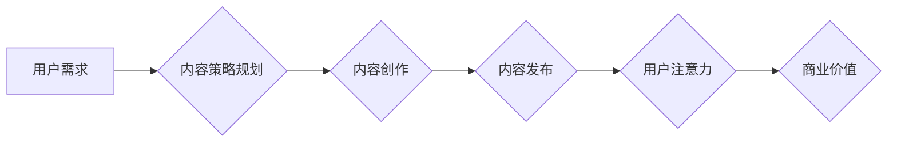

                 

## 1. 背景介绍

在当今信息爆炸的时代，人们每天接触的海量信息令人眼花缭乱。如何才能在众多信息中脱颖而出，吸引用户的注意力，并将其转化为忠实受众，成为了内容创作者和企业面临的重大挑战。 

注意力经济的概念应运而生，它强调了注意力是稀缺资源，而获取和保持用户注意力是至关重要的商业价值。 

内容策略规划与实施，则是为了在注意力经济中取得成功的关键。它涉及到深入了解目标受众，制定吸引人的内容计划，并通过多种渠道有效传播和推广内容，最终实现商业目标。

## 2. 核心概念与联系

### 2.1 注意力经济

注意力经济的核心概念是：注意力是稀缺资源，而获取和保持用户注意力是至关重要的商业价值。

在信息爆炸的时代，人们每天接触的海量信息，使得注意力变得越来越稀缺。用户需要花费大量时间和精力来筛选信息，并决定哪些信息值得关注。因此，吸引用户的注意力，并将其转化为忠实受众，成为了内容创作者和企业面临的重大挑战。

**注意力经济的本质是：**

* **注意力是稀缺资源：** 人类有有限的注意力，无法同时关注所有信息。
* **注意力是可交易的：** 企业可以通过提供有价值的内容，吸引用户的注意力，并将其转化为商业价值。
* **注意力是可培养的：** 通过有效的策略和方法，可以提高用户的注意力集中度和持续时间。

### 2.2 内容策略

内容策略是指企业或个人为了实现特定目标，而制定和执行的关于内容创作、传播和管理的整体计划。

**内容策略的核心要素包括：**

* **目标受众：** 明确目标受众的特征、需求和兴趣。
* **内容类型：** 根据目标受众和业务目标，选择合适的类型和形式的内容。
* **内容主题：** 确定内容的主题和方向，并确保其与目标受众的兴趣相关。
* **内容发布渠道：** 选择合适的渠道，将内容传播给目标受众。
* **内容推广策略：** 制定有效的推广策略，提高内容的曝光率和影响力。
* **内容评估和优化：** 定期评估内容的性能，并根据数据进行优化。

### 2.3 内容策略与注意力经济的关系

注意力经济为内容策略提供了重要的理论基础和实践指导。

* **用户注意力是内容策略的核心：** 内容策略的目标是吸引和留住用户的注意力，并将其转化为商业价值。
* **内容质量是吸引注意力的关键：** 在信息爆炸的时代，只有高质量、有价值的内容才能吸引用户的注意力。
* **内容形式和渠道需要与用户习惯相匹配：** 为了吸引用户的注意力，内容形式和渠道需要与用户的习惯和偏好相匹配。
* **内容推广需要精准化：** 在注意力经济中，内容推广需要更加精准化，才能有效地吸引目标受众。

**Mermaid 流程图：**



## 3. 核心算法原理 & 具体操作步骤

### 3.1 算法原理概述

在内容策略规划与实施中，算法可以帮助我们分析用户数据，预测用户兴趣，并优化内容推荐。

常见的算法包括：

* **协同过滤算法：** 基于用户的历史行为数据，推荐与用户兴趣相似的其他用户或内容。
* **内容基准算法：** 基于内容的主题、标签和关键词，推荐与用户搜索词或浏览历史相似的其他内容。
* **深度学习算法：** 利用深度神经网络，从海量用户数据中学习用户兴趣模式，并进行更精准的内容推荐。

### 3.2 算法步骤详解

**以协同过滤算法为例，其具体步骤如下：**

1. **数据收集：** 收集用户行为数据，例如用户浏览历史、评分、评论等。
2. **数据预处理：** 对数据进行清洗、转换和特征提取，例如将用户行为数据转换为用户-物品交互矩阵。
3. **模型训练：** 利用协同过滤算法，训练模型，学习用户兴趣模式。
4. **预测推荐：** 根据用户的历史行为数据，预测用户可能感兴趣的其他内容。
5. **结果评估：** 通过评估推荐结果的准确性和用户满意度，不断优化算法模型。

### 3.3 算法优缺点

**协同过滤算法的优点：**

* 可以发现用户之间的隐性关联，推荐个性化内容。
* 不需要明确的物品特征，可以处理文本等复杂数据。

**协同过滤算法的缺点：**

* 数据稀疏性问题：当用户行为数据较少时，算法效果会下降。
* 冷启动问题：对于新用户或新物品，算法难以进行推荐。

### 3.4 算法应用领域

协同过滤算法广泛应用于：

* **电子商务：** 商品推荐、用户画像
* **社交媒体：** 朋友推荐、内容推荐
* **音乐流媒体：** 歌曲推荐、音乐发现
* **视频网站：** 视频推荐、用户兴趣分析

## 4. 数学模型和公式 & 详细讲解 & 举例说明

### 4.1 数学模型构建

协同过滤算法的核心是用户-物品交互矩阵，该矩阵表示用户对物品的评分或行为。

**用户-物品交互矩阵：**

```
用户1  物品1  物品2  物品3
用户2  评分1  评分2  评分3
用户3  评分4  评分5  评分6
```

其中，每个单元格代表用户对物品的评分或行为，例如：

* 1 表示用户喜欢该物品
* 0 表示用户不喜欢该物品
* 0.5 表示用户对该物品持中立态度

### 4.2 公式推导过程

协同过滤算法的推导过程较为复杂，涉及到矩阵分解、相似度计算等数学概念。

**常用的协同过滤算法包括：**

* **基于用户的协同过滤：** 根据用户的相似度，推荐用户喜欢的物品。
* **基于物品的协同过滤：** 根据物品的相似度，推荐用户可能喜欢的物品。

**相似度计算公式：**

* **余弦相似度：**

$$
\text{相似度} = \frac{\mathbf{u} \cdot \mathbf{v}}{\|\mathbf{u}\| \|\mathbf{v}\|}
$$

其中，$\mathbf{u}$ 和 $\mathbf{v}$ 是两个用户的向量表示，$\cdot$ 表示点积，$\|\mathbf{u}\|$ 和 $\|\mathbf{v}\|$ 表示向量的模长。

### 4.3 案例分析与讲解

**举例说明：**

假设有两个用户，用户 A 和用户 B，他们对三部电影的评分如下：

| 电影 | 用户 A | 用户 B |
|---|---|---|
| 电影 1 | 5 | 4 |
| 电影 2 | 3 | 2 |
| 电影 3 | 4 | 5 |

我们可以计算用户 A 和用户 B 的余弦相似度，例如：

$$
\text{相似度} = \frac{(5 \times 4) + (3 \times 2) + (4 \times 5)}{\sqrt{5^2 + 3^2 + 4^2} \sqrt{4^2 + 2^2 + 5^2}}
$$

通过计算，我们可以得到用户 A 和用户 B 的相似度，从而判断他们是否具有相似的电影口味。

## 5. 项目实践：代码实例和详细解释说明

### 5.1 开发环境搭建

* **编程语言：** Python
* **库依赖：** pandas, numpy, scikit-learn

### 5.2 源代码详细实现

```python
import pandas as pd
from sklearn.metrics.pairwise import cosine_similarity

# 加载用户-物品交互数据
data = pd.read_csv('user_item_data.csv')

# 构建用户-物品交互矩阵
user_item_matrix = data.pivot_table(index='user_id', columns='item_id', values='rating')

# 计算用户之间的余弦相似度
user_similarity = cosine_similarity(user_item_matrix)

# 获取用户 A 和用户 B 的相似度
user_a_id = 1
user_b_id = 2
similarity = user_similarity[user_a_id - 1][user_b_id - 1]

# 打印相似度
print(f'用户 {user_a_id} 和用户 {user_b_id} 的相似度为：{similarity}')
```

### 5.3 代码解读与分析

* **数据加载：** 使用 pandas 库加载用户-物品交互数据。
* **矩阵构建：** 使用 pivot_table 方法构建用户-物品交互矩阵。
* **相似度计算：** 使用 scikit-learn 库的 cosine_similarity 函数计算用户之间的余弦相似度。
* **相似度获取：** 根据用户 ID 获取用户之间的相似度。
* **输出结果：** 打印用户之间的相似度。

### 5.4 运行结果展示

运行代码后，会输出用户 A 和用户 B 的余弦相似度。

## 6. 实际应用场景

### 6.1 内容推荐系统

在内容推荐系统中，协同过滤算法可以根据用户的历史浏览记录、点赞行为等数据，推荐用户可能感兴趣的其他内容。

例如，在视频网站中，协同过滤算法可以推荐用户可能喜欢的视频，在新闻网站中，可以推荐用户可能感兴趣的新闻文章。

### 6.2 个性化营销

协同过滤算法可以帮助企业进行个性化营销，例如：

* **推荐产品：** 根据用户的购买历史和浏览记录，推荐用户可能感兴趣的产品。
* **发送个性化邮件：** 根据用户的兴趣爱好，发送个性化的邮件营销。
* **定制广告：** 根据用户的兴趣爱好，定制个性化的广告。

### 6.3 社交关系分析

协同过滤算法可以用于分析用户之间的社交关系，例如：

* **推荐朋友：** 根据用户的兴趣爱好和社交行为，推荐用户可能认识的朋友。
* **发现社群：** 根据用户的兴趣爱好和社交行为，发现用户可能感兴趣的社群。

### 6.4 未来应用展望

随着人工智能技术的不断发展，协同过滤算法在未来将有更广泛的应用场景，例如：

* **医疗保健：** 根据患者的病史和症状，推荐合适的治疗方案。
* **教育：** 根据学生的学习情况，推荐合适的学习资源。
* **金融：** 根据用户的投资习惯，推荐合适的投资产品。

## 7. 工具和资源推荐

### 7.1 学习资源推荐

* **书籍：**
    * 《推荐系统》
    * 《机器学习》
* **在线课程：**
    * Coursera 上的推荐系统课程
    * edX 上的机器学习课程

### 7.2 开发工具推荐

* **Python：** 广泛用于机器学习和数据分析。
* **scikit-learn：** Python 的机器学习库，包含协同过滤算法的实现。
* **pandas：** Python 的数据分析库，用于处理用户-物品交互数据。
* **numpy：** Python 的数值计算库，用于矩阵运算。

### 7.3 相关论文推荐

* **协同过滤算法的经典论文：**
    * "Collaborative Filtering: A User-Based Approach"
    * "Memory-Based Collaborative Filtering"
* **深度学习推荐系统的论文：**
    * "Deep Learning for Recommender Systems"
    * "Neural Collaborative Filtering"

## 8. 总结：未来发展趋势与挑战

### 8.1 研究成果总结

注意力经济与内容策略规划与实施是当今信息时代的重要议题。协同过滤算法等机器学习算法为内容推荐、个性化营销等领域提供了有效的解决方案。

### 8.2 未来发展趋势

* **个性化推荐的提升：** 利用深度学习等先进算法，实现更精准、更个性化的内容推荐。
* **跨平台内容整合：** 将不同平台的内容整合在一起，提供更丰富的用户体验。
* **内容生成与推荐的结合：** 利用人工智能技术，生成个性化内容，并进行推荐。
* **注意力经济的伦理问题：** 关注注意力经济对用户隐私、信息安全等方面的潜在影响，并制定相应的伦理规范。

### 8.3 面临的挑战

* **数据稀疏性问题：** 对于新用户或新物品，数据稀疏性问题会影响算法效果。
* **冷启动问题：** 如何快速为新用户和新物品进行推荐，是一个重要的挑战。
* **算法解释性问题：** 深度学习算法的“黑箱”特性，使得算法的决策过程难以解释，这可能会影响用户信任。
* **用户隐私保护问题：** 如何保护用户隐私，同时实现个性化推荐，是一个需要认真考虑的问题。

### 8.4 研究展望

未来，注意力经济与内容策略规划与实施领域将继续发展，并与其他领域，例如人工智能、大数据、区块链等技术融合，带来更多创新和突破。


## 9. 附录：常见问题与解答

**常见问题：**

* **协同过滤算法的适用场景有哪些？**

协同过滤算法适用于用户-物品交互数据分析，例如：

* 内容推荐
* 个性化营销
* 社交关系分析

* **协同过滤算法有哪些优缺点？**

**优点：**

* 可以发现用户之间的隐性关联，推荐个性化内容。
* 不需要明确的物品特征，可以处理文本等复杂数据。

**缺点：**

* 数据稀疏性问题：当用户行为数据较少时，算法效果会下降。
* 冷启动问题：对于新用户或新物品，算法难以进行推荐。

* **如何解决协同过滤算法的冷启动问题？**

一些方法可以解决协同过滤算法的冷启动问题，例如：

* 利用用户画像信息进行推荐
* 利用物品特征信息进行推荐
* 使用混合推荐算法，结合协同过滤算法和其他推荐算法

* **如何评估协同过滤算法的性能？**

常用的评估指标包括：

* 准确率
* 召回率
* NDCG (Normalized Discounted Cumulative Gain)


作者：禅与计算机程序设计艺术 / Zen and the Art of Computer Programming<end_of_turn>

