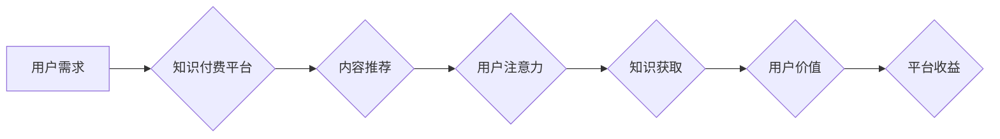

                 

## 1. 背景介绍

在当今信息爆炸的时代，人们面临着前所未有的信息过载。注意力，作为人类认知的核心资源，变得越来越稀缺。同时，随着互联网的发展和知识经济的兴起，知识付费模式也逐渐成为一种主流的商业模式。

**1.1 信息过载与注意力经济**

互联网的普及和移动互联网的兴起，使得信息获取变得更加便捷，但也带来了信息过载的挑战。人们每天需要处理海量的资讯，这使得注意力成为一种宝贵的资源。注意力经济的概念应运而生，它强调了注意力在信息时代的重要性，并指出，获取和保持用户注意力是企业和个人竞争的关键。

**1.2 知识付费模式的崛起**

知识付费模式是指通过付费的方式获取知识和技能的商业模式。随着人们对知识的需求不断增长，以及互联网平台的快速发展，知识付费模式得到了蓬勃发展。从在线课程、付费咨询到知识分享平台，各种形式的知识付费产品层出不穷。

**1.3 结合点与挑战**

注意力经济与知识付费模式的结合，为知识传播和商业模式创新提供了新的机遇。通过利用注意力机制，知识付费平台可以更精准地推送内容，提高用户粘性和转化率。然而，也面临着一些挑战：

* **用户注意力分散:** 用户在互联网上面临着来自各方的信息干扰，注意力难以集中。
* **内容质量参差不齐:** 知识付费市场存在着内容质量参差不齐的问题，用户难以辨别真伪。
* **商业模式可持续性:** 知识付费模式的商业模式需要不断创新，才能实现可持续发展。

## 2. 核心概念与联系

**2.1 注意力经济**

注意力经济的核心概念是，注意力是人类最宝贵的资源之一，而信息时代，注意力资源变得更加稀缺。企业和个人需要通过各种方式获取和保持用户的注意力，才能在竞争中脱颖而出。

**2.2 知识付费**

知识付费是指通过付费的方式获取知识和技能的商业模式。它可以分为以下几种类型：

* **在线课程:** 提供各种主题的在线课程，用户可以通过付费的方式学习。
* **付费咨询:** 用户可以付费咨询专家，获取专业知识和建议。
* **知识分享平台:** 平台提供各种知识付费内容，用户可以通过订阅或购买的方式获取。

**2.3 结合关系**

注意力经济与知识付费模式的结合，可以更好地满足用户对知识的需求，同时也能为知识创作者提供新的商业模式。

**2.4 流程图**



## 3. 核心算法原理 & 具体操作步骤

**3.1 算法原理概述**

注意力机制是一种模仿人类注意力机制的算法，它可以帮助模型更好地理解和处理信息。在知识付费场景中，注意力机制可以用于以下方面：

* **内容推荐:** 根据用户的兴趣和行为，推荐相关的知识付费内容。
* **学习效果评估:** 评估用户对知识的理解程度，并提供个性化的学习建议。
* **知识图谱构建:** 建立知识之间的关联关系，帮助用户更深入地理解知识。

**3.2 算法步骤详解**

1. **输入数据:** 将用户行为数据、知识内容数据等输入到注意力机制模型中。
2. **特征提取:** 使用深度学习模型提取用户行为特征和知识内容特征。
3. **注意力计算:** 计算用户对不同知识内容的注意力权重。
4. **输出结果:** 根据注意力权重，输出推荐内容、学习效果评估结果等。

**3.3 算法优缺点**

**优点:**

* 可以提高模型对信息的理解能力。
* 可以更好地个性化推荐内容。
* 可以提高学习效果和用户体验。

**缺点:**

* 计算复杂度较高。
* 需要大量的训练数据。
* 难以解释模型的决策过程。

**3.4 算法应用领域**

注意力机制在知识付费场景中的应用领域非常广泛，包括：

* 在线教育平台
* 知识分享平台
* 个人知识管理工具
* 内容推荐系统

## 4. 数学模型和公式 & 详细讲解 & 举例说明

**4.1 数学模型构建**

注意力机制的核心是计算用户对不同知识内容的注意力权重。常用的注意力机制模型包括：

* **Soft Attention:** 使用softmax函数将知识内容映射到注意力权重向量。
* **Hard Attention:** 选择一个最相关的知识内容作为注意力焦点。

**4.2 公式推导过程**

**Soft Attention:**

假设有N个知识内容，每个内容的特征向量为$x_i$，用户对每个内容的注意力权重为$a_i$。则注意力权重向量为：

$$
a = softmax(\frac{x_i \cdot u}{d})
$$

其中，$u$是用户特征向量，$d$是特征向量的维度。

**4.3 案例分析与讲解**

假设用户对编程语言的学习兴趣较高，平台推荐了Python、Java和C++三个编程语言的课程。

* 用户对Python的兴趣较高，对Java和C++的兴趣较低。
* 用户的注意力权重向量为：[0.6, 0.2, 0.2]，表示用户对Python的注意力最高。

## 5. 项目实践：代码实例和详细解释说明

**5.1 开发环境搭建**

* Python 3.x
* TensorFlow/PyTorch

**5.2 源代码详细实现**

```python
import tensorflow as tf

# 定义注意力机制模型
class Attention(tf.keras.layers.Layer):
    def __init__(self, units):
        super(Attention, self).__init__()
        self.W1 = tf.keras.layers.Dense(units)
        self.W2 = tf.keras.layers.Dense(units)
        self.V = tf.keras.layers.Dense(1)

    def call(self, inputs):
        # inputs: [batch_size, sequence_length, embedding_dim]
        context = self.W1(inputs)
        query = self.W2(inputs)
        scores = self.V(tf.nn.tanh(context + query))
        attention_weights = tf.nn.softmax(scores, axis=1)
        return attention_weights

# 使用注意力机制模型
model = tf.keras.Sequential([
    tf.keras.layers.Embedding(input_dim=vocab_size, output_dim=embedding_dim),
    Attention(units=embedding_dim),
    tf.keras.layers.Dense(units=num_classes, activation='softmax')
])

# 训练模型
model.compile(optimizer='adam', loss='sparse_categorical_crossentropy', metrics=['accuracy'])
model.fit(x_train, y_train, epochs=10)

```

**5.3 代码解读与分析**

* `Attention`类定义了注意力机制模型，包含三个Dense层：`W1`、`W2`和`V`。
* `call`方法计算注意力权重，使用`softmax`函数将注意力权重归一化。
* `model`实例化了注意力机制模型，并使用`Adam`优化器训练模型。

**5.4 运行结果展示**

训练完成后，可以评估模型的性能，例如准确率等。

## 6. 实际应用场景

**6.1 在线教育平台**

* **个性化推荐:** 根据用户的学习兴趣和进度，推荐相关的课程和学习资源。
* **学习效果评估:** 评估用户对知识的理解程度，并提供个性化的学习建议。

**6.2 知识分享平台**

* **内容推荐:** 根据用户的兴趣和行为，推荐相关的知识付费内容。
* **社区互动:** 利用注意力机制，提高用户参与社区讨论的积极性。

**6.3 个人知识管理工具**

* **知识提取:** 从文本中提取关键信息，并生成知识图谱。
* **知识关联:** 建立知识之间的关联关系，帮助用户更深入地理解知识。

**6.4 未来应用展望**

注意力机制在知识付费场景中的应用前景广阔，未来可能应用于以下领域：

* **虚拟现实/增强现实学习:** 利用注意力机制，打造沉浸式的学习体验。
* **人工智能辅助学习:** 利用人工智能，个性化推荐学习内容和学习策略。
* **跨学科知识融合:** 利用注意力机制，帮助用户理解不同学科之间的知识关联。

## 7. 工具和资源推荐

**7.1 学习资源推荐**

* **书籍:**
    * 《深度学习》
    * 《Attention Is All You Need》
* **在线课程:**
    * Coursera: 深度学习
    * Udacity: 自然语言处理

**7.2 开发工具推荐**

* **TensorFlow:** 开源深度学习框架
* **PyTorch:** 开源深度学习框架
* **HuggingFace:** 自然语言处理模型库

**7.3 相关论文推荐**

* 《Attention Is All You Need》
* 《BERT: Pre-training of Deep Bidirectional Transformers for Language Understanding》
* 《Transformer-XL: Attentive Language Models Beyond a Fixed-Length Context》

## 8. 总结：未来发展趋势与挑战

**8.1 研究成果总结**

注意力机制在知识付费场景中的应用取得了显著成果，例如提高了内容推荐的精准度、学习效果的评估准确度等。

**8.2 未来发展趋势**

未来，注意力机制在知识付费场景中的应用将朝着以下方向发展：

* **更精准的个性化推荐:** 利用更先进的注意力机制模型，更好地理解用户的兴趣和需求。
* **更智能的学习辅助:** 利用人工智能，提供更个性化的学习建议和学习策略。
* **更沉浸式的学习体验:** 利用虚拟现实/增强现实技术，打造更沉浸式的学习体验。

**8.3 面临的挑战**

注意力机制在知识付费场景中的应用也面临着一些挑战：

* **数据隐私保护:** 需要确保用户数据的安全和隐私。
* **算法可解释性:** 需要提高注意力机制模型的解释性，让用户更好地理解模型的决策过程。
* **商业模式可持续性:** 需要探索新的商业模式，确保知识付费平台的长期发展。

**8.4 研究展望**

未来，需要进一步研究注意力机制在知识付费场景中的应用，探索更精准、更智能、更沉浸式的学习体验。


## 9. 附录：常见问题与解答

**9.1 如何提高注意力机制模型的准确性？**

可以通过以下方式提高注意力机制模型的准确性：

* 使用更大的数据集进行训练。
* 使用更复杂的注意力机制模型。
* 使用更有效的训练方法。

**9.2 如何解决注意力机制模型的计算复杂度问题？**

可以通过以下方式解决注意力机制模型的计算复杂度问题：

* 使用更轻量级的注意力机制模型。
* 使用并行计算技术加速模型训练。
* 使用硬件加速器，例如GPU。


作者：禅与计算机程序设计艺术 / Zen and the Art of Computer Programming 
<end_of_turn>

