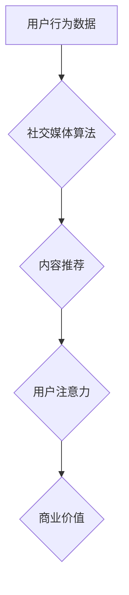

                 

## 注意力经济与社交媒体算法的共生

> 关键词：注意力经济、社交媒体算法、推荐系统、深度学习、用户行为、信息过滤、网络效应

### 1. 背景介绍

在数字时代，信息爆炸式增长，人们面临着前所未有的信息过载。如何有效地获取和处理信息成为了一个关键问题。在这个背景下，“注意力经济”应运而生，它强调了注意力作为一种稀缺资源，并探讨了如何获取、分配和利用注意力。社交媒体平台作为信息获取和传播的主要渠道，在注意力经济中扮演着至关重要的角色。它们通过复杂的算法，精准地推送内容，试图抓住用户的注意力，并将其转化为商业价值。

社交媒体算法的本质是通过对用户行为数据的分析和预测，推荐用户感兴趣的内容，并引导用户持续使用平台。这些算法通常基于深度学习技术，能够从海量用户数据中学习用户偏好，并不断优化推荐策略。然而，社交媒体算法也引发了一些争议，例如信息茧房、算法歧视、虚假信息传播等问题。

### 2. 核心概念与联系

#### 2.1 注意力经济

注意力经济是指在信息过载的时代，注意力作为一种稀缺资源，其获取、分配和利用成为重要的经济活动。

#### 2.2 社交媒体算法

社交媒体算法是指用于推荐内容、过滤信息、引导用户行为的计算机程序。它们通过分析用户行为数据，预测用户兴趣，并精准地推送内容，以吸引用户注意力并提高用户粘性。

#### 2.3 核心概念联系

注意力经济与社交媒体算法之间存在着密切的联系。社交媒体平台通过算法获取用户的注意力，并将注意力转化为商业价值。用户在社交媒体平台上花费的时间和精力，就成为了平台的注意力资源。

**Mermaid 流程图**



### 3. 核心算法原理 & 具体操作步骤

#### 3.1 算法原理概述

社交媒体算法通常基于以下几个核心原理：

* **协同过滤:** 根据用户的历史行为数据，推荐与相似用户喜欢的内容。
* **内容特征提取:** 利用自然语言处理等技术，提取内容的主题、关键词等特征，进行内容匹配和推荐。
* **深度学习:** 利用深度神经网络，从海量用户数据中学习用户偏好，并进行个性化推荐。
* **强化学习:** 通过奖励机制，引导用户行为，提高用户参与度和平台粘性。

#### 3.2 算法步骤详解

1. **数据收集:** 收集用户行为数据，包括浏览记录、点赞、评论、分享等行为。
2. **数据预处理:** 对收集到的数据进行清洗、转换和特征提取。
3. **模型训练:** 利用深度学习等技术，训练推荐模型。
4. **内容推荐:** 根据用户的特征和历史行为，预测用户可能感兴趣的内容，并进行推荐。
5. **反馈机制:** 收集用户对推荐内容的反馈，并将其用于模型优化。

#### 3.3 算法优缺点

**优点:**

* **个性化推荐:** 能够根据用户的兴趣和偏好，推荐更精准的内容。
* **提高用户粘性:** 通过精准推荐，提高用户在平台上的停留时间和参与度。
* **商业价值:** 通过广告投放等方式，将用户注意力转化为商业价值。

**缺点:**

* **信息茧房:** 算法可能会将用户困在自己的兴趣圈内，导致信息单一化和认知偏差。
* **算法歧视:** 算法可能会存在偏见，导致某些用户受到不公平的对待。
* **虚假信息传播:** 算法可能会被用于传播虚假信息，损害用户利益。

#### 3.4 算法应用领域

社交媒体算法广泛应用于以下领域:

* **内容推荐:** 推荐新闻、视频、音乐、商品等内容。
* **广告投放:** 根据用户兴趣，精准投放广告。
* **用户匹配:** 匹配用户之间的兴趣和关系。
* **社区管理:** 识别和过滤恶意内容，维护社区秩序。

### 4. 数学模型和公式 & 详细讲解 & 举例说明

#### 4.1 数学模型构建

社交媒体算法的数学模型通常基于概率论和统计学，例如：

* **贝叶斯网络:** 用于建模用户行为和内容之间的关系。
* **马尔科夫链:** 用于预测用户未来的行为。
* **协方差矩阵:** 用于度量用户之间的相似性。

#### 4.2 公式推导过程

例如，协同过滤算法中常用的**余弦相似度**公式如下：

$$
\text{相似度} = \frac{\mathbf{u} \cdot \mathbf{v}}{\|\mathbf{u}\| \|\mathbf{v}\|}
$$

其中：

* $\mathbf{u}$ 和 $\mathbf{v}$ 是两个用户的特征向量。
* $\cdot$ 表示向量的点积。
* $\|\mathbf{u}\|$ 和 $\|\mathbf{v}\|$ 分别表示向量 $\mathbf{u}$ 和 $\mathbf{v}$ 的模长。

#### 4.3 案例分析与讲解

假设有两个用户 A 和 B，他们的特征向量分别为：

* $\mathbf{u} = [1, 2, 3]$
* $\mathbf{v} = [2, 3, 1]$

则它们的余弦相似度为：

$$
\text{相似度} = \frac{(1 \times 2) + (2 \times 3) + (3 \times 1)}{\sqrt{1^2 + 2^2 + 3^2} \sqrt{2^2 + 3^2 + 1^2}} = \frac{2 + 6 + 3}{\sqrt{14} \sqrt{14}} = \frac{11}{14}
$$

该结果表明，用户 A 和 B 的兴趣相似度为 0.79，说明他们有一定的共同兴趣。

### 5. 项目实践：代码实例和详细解释说明

#### 5.1 开发环境搭建

* 操作系统：Windows/macOS/Linux
* Python 版本：3.6+
* 必要的库：pandas, numpy, scikit-learn, tensorflow/pytorch

#### 5.2 源代码详细实现

```python
import pandas as pd
from sklearn.metrics.pairwise import cosine_similarity

# 加载用户行为数据
data = pd.read_csv('user_behavior.csv')

# 提取用户特征
user_features = data[['user_id', 'genre1', 'genre2', 'genre3']].groupby('user_id').mean().reset_index()

# 计算用户之间的余弦相似度
similarity_matrix = cosine_similarity(user_features[['genre1', 'genre2', 'genre3']])

# 打印相似度矩阵
print(similarity_matrix)
```

#### 5.3 代码解读与分析

* 该代码首先加载用户行为数据，并提取用户特征。
* 然后，使用 scikit-learn 库中的 `cosine_similarity` 函数计算用户之间的余弦相似度。
* 最后，打印出相似度矩阵，其中每个元素代表两个用户之间的相似度。

#### 5.4 运行结果展示

运行该代码后，会输出一个相似度矩阵，其中每个元素代表两个用户之间的相似度。

### 6. 实际应用场景

#### 6.1 内容推荐

社交媒体平台利用算法推荐用户可能感兴趣的内容，例如新闻、视频、音乐、商品等。

#### 6.2 广告投放

广告商利用算法精准投放广告，将广告展示给最有可能点击和购买的用户。

#### 6.3 用户匹配

社交媒体平台利用算法匹配用户之间的兴趣和关系，例如推荐朋友、组织群组等。

#### 6.4 未来应用展望

随着人工智能技术的不断发展，社交媒体算法将更加智能化和个性化。未来，社交媒体算法可能应用于以下领域：

* **个性化教育:** 根据用户的学习风格和兴趣，推荐个性化的学习内容。
* **医疗保健:** 根据用户的健康状况和需求，推荐个性化的医疗服务。
* **城市规划:** 根据用户的出行习惯和需求，优化城市交通和公共服务。

### 7. 工具和资源推荐

#### 7.1 学习资源推荐

* **书籍:**
    * 《深度学习》
    * 《推荐系统》
    * 《算法导论》
* **在线课程:**
    * Coursera: 深度学习
    * edX: 推荐系统
    * Udacity: 机器学习工程师

#### 7.2 开发工具推荐

* **Python:** 
    * pandas
    * numpy
    * scikit-learn
    * tensorflow/pytorch
* **Spark:** 大数据处理框架
* **Hadoop:** 分布式存储和计算框架

#### 7.3 相关论文推荐

* **Collaborative Filtering for Implicit Feedback Datasets**
* **Deep Learning for Recommender Systems**
* **Attention Is All You Need**

### 8. 总结：未来发展趋势与挑战

#### 8.1 研究成果总结

注意力经济与社交媒体算法的共生，推动了信息获取和传播的效率提升，但也带来了新的挑战。

#### 8.2 未来发展趋势

未来，社交媒体算法将更加智能化、个性化和透明化。

* **智能化:** 利用更先进的人工智能技术，例如强化学习和迁移学习，提高算法的推荐精度和用户体验。
* **个性化:** 更加细粒度地分析用户的兴趣和偏好，提供更加个性化的内容推荐和服务。
* **透明化:** 提高算法的透明度和可解释性，让用户更好地理解算法是如何工作的，并增强用户对算法的信任。

#### 8.3 面临的挑战

* **信息茧房:** 算法可能会将用户困在自己的兴趣圈内，导致信息单一化和认知偏差。
* **算法歧视:** 算法可能会存在偏见，导致某些用户受到不公平的对待。
* **虚假信息传播:** 算法可能会被用于传播虚假信息，损害用户利益。

#### 8.4 研究展望

未来研究需要关注以下几个方面:

* **开发更公平、更透明的算法:** 减少算法的偏见和歧视，提高算法的可解释性。
* **解决信息茧房问题:** 设计算法，帮助用户接触更多元的观点和信息。
* **应对虚假信息传播:** 开发算法，识别和过滤虚假信息，保护用户利益。

### 9. 附录：常见问题与解答

#### 9.1 如何避免信息茧房？

* 关注不同领域的媒体和观点。
* 积极与不同背景的人交流。
* 尝试使用不同的搜索引擎和推荐系统。

#### 9.2 如何保护自己免受算法歧视？

* 了解算法的潜在偏见。
* 关注算法的透明度和可解释性。
* 反馈算法的歧视行为。

#### 9.3 如何识别虚假信息？

* 核实信息来源的可靠性。
* 关注信息内容的逻辑性和真实性。
* 多方求证，不要轻易相信单一的信息来源。


作者：禅与计算机程序设计艺术 / Zen and the Art of Computer Programming 
<end_of_turn>

