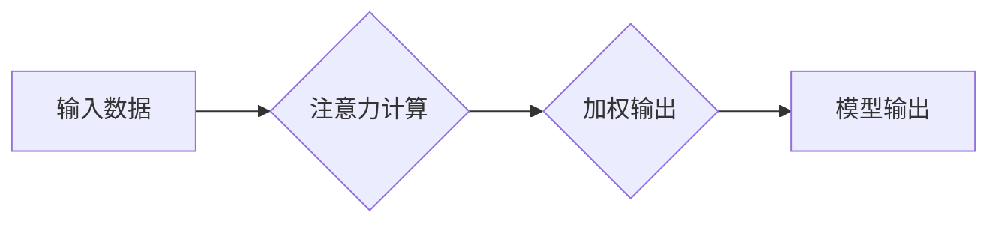

                 

## 1. 背景介绍

在当今信息爆炸的时代，注意力已成为至关重要的认知能力。我们每天都被来自各种渠道的信息轰炸，想要有效地学习、工作和生活，必须学会集中注意力，过滤无关信息，并专注于当下。然而，现代人的注意力却日益涣散，容易被干扰，这严重影响了我们的学习效率、工作成果和生活质量。

越来越多的研究表明，注意力并非是固定的，而是可以通过训练和练习来增强。大脑具有强大的可塑性，这意味着我们可以通过改变我们的思维模式和行为习惯，来重塑大脑的结构和功能，从而提升注意力能力。

## 2. 核心概念与联系

### 2.1 注意力机制

注意力机制是机器学习领域近年来发展迅速的热点技术之一。它模拟了人类大脑对重要信息进行选择性关注的机制，能够有效地提高模型的学习效率和性能。

注意力机制的核心思想是赋予模型“注意力”的能力，使其能够在处理信息时，对重要信息给予更多的关注，而对无关信息则给予较少的关注。

**Mermaid 流程图**



### 2.2 大脑可塑性

大脑可塑性是指大脑结构和功能在经历学习、训练和环境刺激后，能够发生改变的能力。这种可塑性使得我们能够适应不断变化的环境，学习新的知识和技能，并不断提升认知能力。

大脑可塑性主要体现在以下几个方面：

* **神经元连接的改变:** 学习和训练会改变神经元之间的连接强度，形成新的连接或削弱旧的连接。
* **神经元的生长和分化:** 新的学习和经验可以促进神经元的生长和分化，增加大脑的容量和功能。
* **脑区功能的重塑:** 通过学习和训练，大脑不同区域的功能可以发生重塑，例如，学习新的语言可以增强大脑语言处理区域的功能。

## 3. 核心算法原理 & 具体操作步骤

### 3.1 算法原理概述

注意力机制的核心算法是**注意力权重计算**。通过计算每个输入元素与输出元素之间的相关性，来确定每个元素的重要性，并赋予不同的权重。

常用的注意力机制算法包括：

* **自注意力机制 (Self-Attention):**  用于处理序列数据，计算每个元素与序列中所有其他元素之间的相关性。
* **交叉注意力机制 (Cross-Attention):** 用于处理多个序列数据，计算每个序列元素与另一个序列元素之间的相关性。

### 3.2 算法步骤详解

**自注意力机制的具体操作步骤如下:**

1. **计算查询 (Query)、键 (Key) 和值 (Value) 向量:** 将输入序列中的每个元素映射到查询、键和值向量。
2. **计算注意力权重:** 使用查询向量和键向量之间的点积计算注意力权重。
3. **对权重进行归一化:** 使用softmax函数对注意力权重进行归一化，使其总和为1。
4. **计算加权输出:** 将值向量与归一化后的注意力权重相乘，得到加权输出。

### 3.3 算法优缺点

**优点:**

* **能够捕捉长距离依赖关系:** 自注意力机制能够有效地捕捉序列中不同元素之间的长距离依赖关系。
* **并行计算能力强:** 注意力机制的计算过程可以并行化，提高计算效率。

**缺点:**

* **计算复杂度高:** 自注意力机制的计算复杂度较高，对于长序列数据，计算量会变得很大。
* **参数量大:** 自注意力机制需要大量的参数，训练成本较高。

### 3.4 算法应用领域

注意力机制在机器学习领域有着广泛的应用，例如：

* **自然语言处理:** 机器翻译、文本摘要、问答系统等。
* **计算机视觉:** 图像分类、目标检测、图像 captioning 等。
* **语音识别:** 语音转文本、语音合成等。

## 4. 数学模型和公式 & 详细讲解 & 举例说明

### 4.1 数学模型构建

**自注意力机制的数学模型可以表示为:**

$$
\text{Attention}(Q, K, V) = \text{softmax}\left(\frac{Q K^T}{\sqrt{d_k}}\right) V
$$

其中:

* $Q$ 是查询矩阵
* $K$ 是键矩阵
* $V$ 是值矩阵
* $d_k$ 是键向量的维度
* $\text{softmax}$ 是归一化函数

### 4.2 公式推导过程

注意力权重计算公式的推导过程如下:

1. 计算查询向量 $q$ 和键向量 $k$ 之间的点积:

$$
\text{score}(q, k) = q \cdot k
$$

2. 对所有键向量计算点积，得到一个得分矩阵:

$$
\text{scores} = Q K^T
$$

3. 对得分矩阵进行归一化，得到注意力权重矩阵:

$$
\text{attention} = \text{softmax}(\text{scores})
$$

4. 将注意力权重矩阵与值矩阵相乘，得到加权输出:

$$
\text{output} = \text{attention} V
$$

### 4.3 案例分析与讲解

**举例说明:**

假设我们有一个句子 "The cat sat on the mat"，将其转换为词向量表示，得到查询矩阵 $Q$、键矩阵 $K$ 和值矩阵 $V$。

通过计算注意力权重矩阵，我们可以发现，对于词 "sat"，其与 "cat" 和 "on" 的注意力权重较高，而与其他词的注意力权重较低。这表明，"sat" 与 "cat" 和 "on" 相关性较高，它们共同构成一个语义单元。

## 5. 项目实践：代码实例和详细解释说明

### 5.1 开发环境搭建

* Python 3.6+
* TensorFlow 或 PyTorch

### 5.2 源代码详细实现

```python
import tensorflow as tf

# 定义自注意力机制
def self_attention(query, key, value, mask=None):
    # 计算注意力权重
    scores = tf.matmul(query, key, transpose_b=True) / tf.math.sqrt(tf.shape(key)[-1])
    if mask is not None:
        scores += (mask * -1e9)
    attention_weights = tf.nn.softmax(scores, axis=-1)
    # 计算加权输出
    output = tf.matmul(attention_weights, value)
    return output, attention_weights

# 示例代码
# 定义输入数据
query = tf.random.normal([3, 4, 64])
key = tf.random.normal([3, 4, 64])
value = tf.random.normal([3, 4, 64])

# 计算自注意力输出
output, attention_weights = self_attention(query, key, value)

# 打印输出
print(output.shape)
print(attention_weights.shape)
```

### 5.3 代码解读与分析

* `self_attention` 函数实现了一个基本的自注意力机制。
* `scores` 计算了查询向量和键向量之间的点积，作为注意力权重的基础。
* `attention_weights` 使用 softmax 函数对得分矩阵进行归一化，得到注意力权重矩阵。
* `output` 通过将注意力权重矩阵与值矩阵相乘，得到加权输出。

### 5.4 运行结果展示

运行上述代码，会输出注意力机制的输出结果和注意力权重矩阵。

## 6. 实际应用场景

### 6.1  注意力训练与认知能力提升

注意力训练可以通过以下方式来提升认知能力:

* **冥想:** 冥想可以帮助我们训练专注力，提高对当下体验的觉察能力。
* **正念练习:** 正念练习可以帮助我们培养对当下思绪和感受的觉察，并学会不评判地观察它们。
* **专注力训练游戏:** 一些专注力训练游戏可以帮助我们锻炼注意力，提高信息处理能力。

### 6.2  注意力机制在教育领域的应用

注意力机制可以应用于教育领域，例如:

* **个性化学习:** 根据学生的注意力模式，提供个性化的学习内容和学习方式。
* **学习效率提升:** 通过注意力机制，帮助学生更好地理解和记忆学习内容。
* **学生行为分析:** 分析学生的注意力模式，了解他们的学习状态和学习习惯。

### 6.3  注意力机制在医疗领域的应用

注意力机制可以应用于医疗领域，例如:

* **疾病诊断:** 通过分析患者的医疗影像和病历数据，提高疾病诊断的准确性。
* **药物研发:** 通过分析药物分子结构和生物活性数据，加速药物研发过程。
* **患者监测:** 通过分析患者的生理数据，及时发现异常情况，并进行预警。

### 6.4  未来应用展望

注意力机制在未来将有更广泛的应用，例如:

* **人工智能的通用性:** 提升人工智能的通用性，使其能够更好地理解和处理复杂的任务。
* **人机交互:** 增强人机交互的自然性和流畅性。
* **脑机接口:** 开发更先进的脑机接口技术，实现人脑与机器的直接连接。

## 7. 工具和资源推荐

### 7.1 学习资源推荐

* **书籍:**
    * 《深度学习》
    * 《Attention Is All You Need》
* **在线课程:**
    * Coursera: 深度学习
    * Udacity: 自然语言处理
* **博客:**
    * Jay Alammar's Blog
    * Distill.pub

### 7.2 开发工具推荐

* **TensorFlow:** 开源深度学习框架
* **PyTorch:** 开源深度学习框架
* **Keras:** 高级深度学习API

### 7.3 相关论文推荐

* 《Attention Is All You Need》
* 《BERT: Pre-training of Deep Bidirectional Transformers for Language Understanding》
* 《Transformer-XL: Attentive Language Models Beyond a Fixed-Length Context》

## 8. 总结：未来发展趋势与挑战

### 8.1 研究成果总结

注意力机制在机器学习领域取得了显著的成果，并在自然语言处理、计算机视觉等领域取得了突破性进展。

### 8.2 未来发展趋势

* **更强大的注意力机制:** 研究更强大的注意力机制，例如长距离依赖关系的处理、多模态注意力机制等。
* **注意力机制的解释性:** 研究注意力机制的解释性，使其能够更好地理解和解释模型的决策过程。
* **注意力机制的应用拓展:** 将注意力机制应用于更多领域，例如机器人、自动驾驶等。

### 8.3 面临的挑战

* **计算复杂度:** 现有注意力机制的计算复杂度较高，难以处理长序列数据。
* **参数量大:** 注意力机制需要大量的参数，训练成本较高。
* **可解释性:** 注意力机制的决策过程难以解释，这限制了其在一些应用场景中的应用。

### 8.4 研究展望

未来，注意力机制的研究将继续深入，探索更强大的、更可解释的注意力机制，并将其应用于更多领域，推动人工智能技术的发展。

## 9. 附录：常见问题与解答

**Q1: 注意力机制和深度学习的关系是什么？**

**A1:** 注意力机制是一种深度学习中的重要技术，它可以帮助模型更好地理解和处理序列数据。

**Q2: 注意力机制的应用场景有哪些？**

**A2:** 注意力机制的应用场景非常广泛，例如自然语言处理、计算机视觉、语音识别等。

**Q3: 如何训练注意力机制？**

**A3:** 注意力机制可以通过监督学习的方式进行训练，例如使用标注数据训练模型。


作者：禅与计算机程序设计艺术 / Zen and the Art of Computer Programming 
<end_of_turn>

