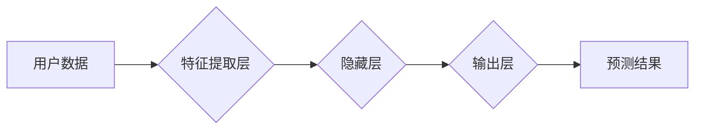

                 

## 深度学习在用户生命周期阶段预测中的新方法

> 关键词：用户生命周期，深度学习，预测模型，用户行为分析，客户关系管理

## 1. 背景介绍

在当今数据驱动的时代，理解和预测用户的行为模式已成为企业发展和竞争的关键。用户生命周期 (Customer Lifecycle) 是指用户与企业从最初接触到最终流失的整个旅程，涵盖了多个阶段，例如获取、激活、参与、留存和退订。准确预测用户在不同生命周期阶段的行为，可以帮助企业制定更有效的营销策略、提供个性化服务，并提升客户忠诚度和收入。

传统的用户生命周期预测方法主要依赖于统计模型和规则引擎，这些方法往往难以捕捉用户行为的复杂性和非线性关系。随着深度学习技术的快速发展，其强大的特征提取和模式识别能力为用户生命周期预测提供了新的机遇。深度学习模型能够从海量用户数据中自动学习特征，并建立更精准的预测模型。

## 2. 核心概念与联系

### 2.1 用户生命周期阶段

用户生命周期通常被划分为以下几个阶段：

* **获取 (Acquisition):** 用户首次接触企业，例如访问网站、下载应用程序或注册账号。
* **激活 (Activation):** 用户开始积极使用产品或服务，例如完成注册流程、进行首次购买或参与互动活动。
* **参与 (Engagement):** 用户持续使用产品或服务，并与企业进行互动，例如浏览产品页面、阅读文章、评论或分享内容。
* **留存 (Retention):** 用户持续使用产品或服务，并保持活跃状态，例如定期登录、进行购买或参与活动。
* **退订 (Churn):** 用户停止使用产品或服务，例如删除账号、取消订阅或不再访问网站。

### 2.2 深度学习模型

深度学习模型是一种基于多层神经网络的机器学习模型，能够从数据中自动学习特征和模式。常用的深度学习模型包括：

* **卷积神经网络 (CNN):** 擅长处理图像和文本数据，能够提取图像和文本中的特征。
* **循环神经网络 (RNN):** 擅长处理序列数据，例如文本和时间序列数据，能够捕捉序列中的依赖关系。
* **深度信念网络 (DBN):** 是一种多层无监督学习模型，能够学习数据的层次结构。

### 2.3 预测模型架构

深度学习在用户生命周期预测中的应用通常采用以下架构：



**特征提取层:** 从原始用户数据中提取特征，例如用户 demographics、行为数据、产品使用数据等。

**隐藏层:** 多层神经网络，用于学习用户行为的复杂模式和关系。

**输出层:** 预测用户在不同生命周期阶段的行为，例如留存率、转化率、流失概率等。

## 3. 核心算法原理 & 具体操作步骤

### 3.1 算法原理概述

深度学习在用户生命周期预测中的核心算法原理是利用深度神经网络学习用户行为的复杂模式和关系，并根据学习到的知识预测用户在不同生命周期阶段的行为。

### 3.2 算法步骤详解

1. **数据收集和预处理:** 收集用户数据，包括用户 demographics、行为数据、产品使用数据等。对数据进行清洗、转换和特征工程，以便于深度学习模型的训练。
2. **模型选择和架构设计:** 选择合适的深度学习模型，例如 CNN、RNN 或 DBN，并根据具体任务设计模型的架构，包括隐藏层数量、神经元数量等。
3. **模型训练:** 使用训练数据训练深度学习模型，调整模型参数，使模型能够准确预测用户行为。
4. **模型评估:** 使用测试数据评估模型的性能，例如准确率、召回率、F1-score 等。
5. **模型部署和应用:** 将训练好的模型部署到生产环境中，用于预测用户在不同生命周期阶段的行为，并根据预测结果制定相应的策略。

### 3.3 算法优缺点

**优点:**

* 能够捕捉用户行为的复杂性和非线性关系。
* 自动学习特征，无需人工特征工程。
* 预测精度高，能够提供更精准的用户行为预测。

**缺点:**

* 需要大量的训练数据。
* 模型训练时间长，计算资源消耗大。
* 模型解释性差，难以理解模型的决策过程。

### 3.4 算法应用领域

深度学习在用户生命周期预测中的应用领域广泛，例如：

* **客户关系管理 (CRM):** 预测客户流失概率，制定客户挽留策略。
* **营销推广:** 预测用户对不同营销活动的响应，优化营销策略。
* **产品开发:** 预测用户对新产品的需求，指导产品开发方向。
* **个性化推荐:** 预测用户对不同产品的兴趣，提供个性化推荐。

## 4. 数学模型和公式 & 详细讲解 & 举例说明

### 4.1 数学模型构建

深度学习模型的数学基础是神经网络，其核心是通过多层神经元进行信息传递和处理。每个神经元接收多个输入信号，并通过激活函数进行非线性变换，输出一个信号。神经网络的输出结果是多个神经元的输出值组合。

用户生命周期预测模型通常采用多层感知机 (MLP) 或循环神经网络 (RNN) 作为基础模型。MLP 模型适用于预测离散型用户行为，例如用户流失或转化。RNN 模型适用于预测时间序列型用户行为，例如用户活跃度或购买频率。

### 4.2 公式推导过程

MLP 模型的输出层采用 softmax 函数，用于将多个神经元的输出值转换为概率分布，表示用户在不同生命周期阶段的行为概率。

$$
P(y_i|x) = \frac{e^{z_i}}{\sum_{j=1}^{K} e^{z_j}}
$$

其中：

* $P(y_i|x)$ 是用户在第 $i$ 个生命周期阶段的行为概率。
* $x$ 是用户特征向量。
* $z_i$ 是第 $i$ 个神经元的输出值。
* $K$ 是生命周期阶段的数量。

RNN 模型的输出层通常采用线性函数或其他回归函数，用于预测连续型用户行为，例如用户活跃度或购买频率。

$$
\hat{y} = W_o \cdot h_t + b_o
$$

其中：

* $\hat{y}$ 是预测的用户行为值。
* $W_o$ 是输出层的权重矩阵。
* $h_t$ 是隐藏层的输出向量。
* $b_o$ 是输出层的偏置项。

### 4.3 案例分析与讲解

假设我们想要预测用户的流失概率，可以使用 MLP 模型。

* 用户特征向量 $x$ 包括用户的年龄、性别、购买频率、活跃度等信息。
* 模型输出 $P(y_i|x)$ 表示用户在流失阶段的概率。

通过训练数据，模型可以学习到用户特征与流失概率之间的关系，并预测新用户的流失概率。

## 5. 项目实践：代码实例和详细解释说明

### 5.1 开发环境搭建

* Python 3.x
* TensorFlow 或 PyTorch 深度学习框架
* Jupyter Notebook 或 VS Code 开发环境

### 5.2 源代码详细实现

```python
import tensorflow as tf

# 定义模型架构
model = tf.keras.models.Sequential([
    tf.keras.layers.Dense(64, activation='relu', input_shape=(num_features,)),
    tf.keras.layers.Dense(32, activation='relu'),
    tf.keras.layers.Dense(1, activation='sigmoid')
])

# 编译模型
model.compile(optimizer='adam',
              loss='binary_crossentropy',
              metrics=['accuracy'])

# 训练模型
model.fit(X_train, y_train, epochs=10, batch_size=32)

# 评估模型
loss, accuracy = model.evaluate(X_test, y_test)
print('Loss:', loss)
print('Accuracy:', accuracy)
```

### 5.3 代码解读与分析

* **模型架构:** 使用了三层全连接神经网络，第一层输入层有 `num_features` 个神经元，对应用户特征的数量。
* **激活函数:** 使用了 ReLU 激活函数，可以提高模型的表达能力。
* **输出层:** 使用了 sigmoid 激活函数，将输出值映射到 0 到 1 之间，表示用户流失概率。
* **编译模型:** 使用 Adam 优化器，Binary Crossentropy 损失函数，以及 Accuracy 作为评估指标。
* **训练模型:** 使用训练数据训练模型，设置训练轮数 `epochs` 和批处理大小 `batch_size`。
* **评估模型:** 使用测试数据评估模型的性能，输出损失值和准确率。

### 5.4 运行结果展示

运行代码后，会输出模型的损失值和准确率。

## 6. 实际应用场景

### 6.1 客户流失预测

利用深度学习模型预测客户流失概率，可以帮助企业提前识别高风险客户，并采取措施挽留他们。例如，可以发送个性化优惠信息、提供更优质的客户服务等。

### 6.2 营销活动效果评估

深度学习模型可以分析用户对不同营销活动的响应，评估营销活动的有效性，并优化营销策略。例如，可以根据用户的行为数据，预测他们对特定产品的兴趣，并进行精准的广告投放。

### 6.3 产品推荐

深度学习模型可以学习用户过去的购买行为和浏览记录，并推荐他们可能感兴趣的产品。例如，电商平台可以根据用户的购买历史，推荐他们可能喜欢的商品。

### 6.4 未来应用展望

随着深度学习技术的不断发展，其在用户生命周期预测中的应用场景将会更加广泛。例如，可以利用深度学习模型预测用户的生命周期长度，制定更精准的客户管理策略。

## 7. 工具和资源推荐

### 7.1 学习资源推荐

* **书籍:**
    * Deep Learning by Ian Goodfellow, Yoshua Bengio, and Aaron Courville
    * Hands-On Machine Learning with Scikit-Learn, Keras & TensorFlow by Aurélien Géron
* **在线课程:**
    * TensorFlow Tutorials: https://www.tensorflow.org/tutorials
    * PyTorch Tutorials: https://pytorch.org/tutorials/

### 7.2 开发工具推荐

* **Python:** https://www.python.org/
* **TensorFlow:** https://www.tensorflow.org/
* **PyTorch:** https://pytorch.org/
* **Jupyter Notebook:** https://jupyter.org/
* **VS Code:** https://code.visualstudio.com/

### 7.3 相关论文推荐

* **Recurrent Neural Network for Sequence Prediction:** https://arxiv.org/abs/1506.00019
* **Deep Learning for Customer Lifetime Value Prediction:** https://arxiv.org/abs/1803.03497

## 8. 总结：未来发展趋势与挑战

### 8.1 研究成果总结

深度学习在用户生命周期预测领域取得了显著的成果，能够提供更精准的用户行为预测，帮助企业制定更有效的策略。

### 8.2 未来发展趋势

* **模型复杂度提升:** 研究更复杂的深度学习模型，例如 Transformer 和 Graph Neural Network，以更好地捕捉用户行为的复杂模式。
* **数据融合:** 将来自不同来源的数据融合在一起，例如用户行为数据、社交网络数据、传感器数据等，以获得更全面的用户画像。
* **解释性增强:** 研究更具解释性的深度学习模型，以便更好地理解模型的决策过程。

### 8.3 面临的挑战

* **数据质量:** 深度学习模型对数据质量要求较高，需要高质量、丰富的数据进行训练。
* **模型训练成本:** 深度学习模型的训练成本较高，需要强大的计算资源。
* **隐私保护:** 深度学习模型的训练和应用可能涉及用户隐私数据，需要采取措施保护用户隐私。

### 8.4 研究展望

未来，深度学习在用户生命周期预测领域将继续发展，并应用于更多场景。研究者将继续探索更有效的模型架构、数据融合方法和隐私保护技术，以推动该领域的进步。

## 9. 附录：常见问题与解答

**Q1: 深度学习模型的训练需要多少数据？**

A1: 深度学习模型对数据的需求量很大，一般需要百万甚至数百万条数据才能达到较好的效果。

**Q2: 深度学习模型的训练时间有多长？**

A2: 深度学习模型的训练时间取决于模型复杂度、数据量和计算资源等因素，通常需要数小时甚至数天。

**Q3: 如何评估深度学习模型的性能？**

A3: 可以使用准确率、召回率、F1-score 等指标来评估深度学习模型的性能。

**作者：禅与计算机程序设计艺术 / Zen and the Art of Computer Programming**<end_of_turn>

