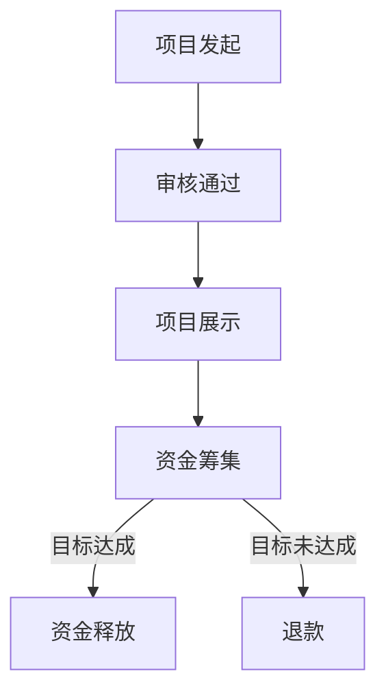

                 

### 文章标题

**如何利用众筹平台为创业项目融资**

### Keywords: (在此列出文章的5-7个核心关键词)

- 众筹
- 创业融资
- 融资平台
- 项目推广
- 投资者关系

### Abstract: (在此给出文章的核心内容和主题思想)

本文旨在探讨如何通过众筹平台有效地为创业项目融资，包括平台选择、项目策划、营销推广和风险管理等方面。通过分析成功和失败案例，提供实用的策略和建议，帮助创业者利用众筹实现创业梦想。

<|assistant|>## 1. 背景介绍（Background Introduction）

众筹是一种通过互联网平台向广大公众募集资金的方式，它为创业者提供了一个开放、透明和高效的融资渠道。在过去的十年中，众筹平台如Kickstarter、Indiegogo等在全球范围内迅速崛起，成为众多创业项目融资的首选方式。

### 1.1 众筹的历史与发展

众筹的概念起源于2000年代初的网上捐赠和在线拍卖，随着互联网技术的进步和社交媒体的普及，众筹逐渐发展成为一个成熟的融资模式。最早的成功案例之一是2009年Kickstarter平台的推出，它为创意项目提供了一个融资平台，项目发起人只需提交项目计划，就能通过互联网向全球观众筹集资金。

### 1.2 众筹平台的种类

众筹平台主要分为三种类型：奖励众筹、债务众筹和股权众筹。

- **奖励众筹**：投资者预付资金，以获得项目的实物或服务回报。这种模式类似于预购，为项目提供了直接的现金流。
- **债务众筹**：投资者提供资金，项目方承诺在未来偿还本金和利息。这种模式类似于借贷，风险较低，但回报也相对较低。
- **股权众筹**：投资者通过众筹平台购买项目公司的股份，分享公司的成长和利润。这种模式风险较高，但潜在回报也最大。

### 1.3 众筹的优势与挑战

**优势：**

- **广泛的受众**：众筹平台能够接触到全球的潜在投资者，为项目提供了广泛的曝光和融资机会。
- **降低门槛**：创业者无需依赖传统的金融机构，只需通过互联网提交项目计划，就能获得融资机会。
- **市场测试**：通过众筹，创业者可以在实际销售前测试市场需求，降低产品开发的风险。

**挑战：**

- **高失败率**：尽管众筹平台提供了融资机会，但项目的成功率仍然较低。许多项目因各种原因未能达到目标。
- **营销压力**：为了吸引投资者，创业者需要投入大量时间和精力进行营销推广，这对于初创公司来说是一项挑战。
- **监管风险**：众筹项目需要遵守各种法律法规，包括金融法规、消费者保护法规等，这增加了项目的运营成本和风险。

在接下来的章节中，我们将深入探讨如何利用众筹平台为创业项目融资，包括平台选择、项目策划、营销策略和风险管理等方面。

<|assistant|>## 2. 核心概念与联系（Core Concepts and Connections）

### 2.1 什么是众筹平台？

众筹平台是一种在线融资平台，它允许创业者向公众筹集资金来实现其项目目标。这些平台通常提供以下几种类型的服务：

- **项目展示**：创业者可以在平台上发布详细的项目介绍，包括项目目标、资金需求、时间表和回报方案。
- **资金筹集**：投资者通过平台对感兴趣的项目进行投资，支持项目的实现。
- **回报交付**：项目成功融资后，创业者按照承诺向投资者提供实物或服务回报。
- **财务管理**：平台通常提供资金管理服务，确保资金的安全和透明。

### 2.2 众筹平台的工作原理

众筹平台的工作原理可以分为以下几个步骤：

1. **项目发起**：创业者创建项目页面，填写项目信息，包括项目描述、资金目标、回报方案和时间表。
2. **审核通过**：平台对项目进行审核，确保项目符合平台规定和法律法规。
3. **项目展示**：审核通过后，项目将在平台上线，向公众展示。
4. **资金筹集**：投资者通过平台对项目进行投资，资金进入平台托管账户。
5. **目标达成**：如果项目在规定时间内达到资金目标，资金将释放给创业者；否则，投资者将全额退款。
6. **回报交付**：项目成功后，创业者按照承诺向投资者提供回报。

### 2.3 众筹平台的优势与局限

**优势：**

- **广泛受众**：众筹平台能够接触到全球的潜在投资者，为项目提供了广泛的曝光和融资机会。
- **市场测试**：通过众筹，创业者可以在实际销售前测试市场需求，降低产品开发的风险。
- **低成本**：相较于传统的融资方式，众筹平台降低了融资的门槛和成本。

**局限：**

- **成功率低**：尽管众筹平台提供了融资机会，但项目的成功率仍然较低。
- **营销压力**：为了吸引投资者，创业者需要投入大量时间和精力进行营销推广。
- **法律风险**：众筹项目需要遵守各种法律法规，包括金融法规、消费者保护法规等，增加了项目的运营成本和风险。

### 2.4 众筹平台的选择标准

选择合适的众筹平台对于项目的成功至关重要。以下是一些选择标准：

- **知名度**：选择知名、信誉良好的平台，能够提高项目的曝光率。
- **平台费用**：了解平台的费用结构，包括服务费、支付手续费等，确保项目的成本在可控范围内。
- **用户基础**：选择用户基础广泛的平台，能够接触到更多的潜在投资者。
- **项目分类**：根据项目类型选择适合的平台，如专注于科技、艺术、健康等领域的平台。
- **用户评价**：参考其他创业者的评价和反馈，了解平台的服务质量和用户体验。

在接下来的章节中，我们将深入探讨如何利用众筹平台为创业项目融资的具体策略和实践。

### 2.5 关键概念和架构的 Mermaid 流程图

下面是一个简化的众筹平台工作流程的 Mermaid 流程图，展示关键节点和流程。



在这个流程中，每个节点都代表了众筹平台工作的一个关键步骤，通过图示的方式帮助理解整个流程的结构和逻辑。

<|assistant|>## 3. 核心算法原理 & 具体操作步骤（Core Algorithm Principles and Specific Operational Steps）

### 3.1 如何选择合适的众筹平台？

选择合适的众筹平台是成功融资的第一步。以下是一些核心算法原理和具体操作步骤：

**核心算法原理：**

- **知名度与信誉**：平台知名度高，意味着有更多的用户和投资者基础，能够提高项目的曝光率和融资成功率。
- **费用结构**：了解平台的费用结构，包括服务费、支付手续费等，确保项目的成本在可控范围内。
- **用户基础**：平台用户基础广泛，能够接触到更多的潜在投资者。
- **项目分类**：根据项目类型选择适合的平台，如专注于科技、艺术、健康等领域的平台。
- **用户评价**：参考其他创业者的评价和反馈，了解平台的服务质量和用户体验。

**具体操作步骤：**

1. **确定项目类型和目标**：根据项目类型和目标，列出可能适用的众筹平台。
2. **收集平台信息**：通过互联网、创业者论坛、社交媒体等渠道，收集各个平台的信息，包括知名度、费用结构、用户基础等。
3. **评估平台**：对每个平台进行评估，根据核心算法原理进行打分和排名。
4. **选择平台**：根据评估结果，选择最合适的众筹平台。

### 3.2 如何制定有效的项目策划方案？

制定有效的项目策划方案是众筹成功的关键。以下是一些核心算法原理和具体操作步骤：

**核心算法原理：**

- **明确目标**：明确项目的融资目标，包括资金需求、时间表和预期回报。
- **项目描述**：撰写详细、吸引人的项目描述，突出项目的创新性和市场前景。
- **回报方案**：设计有吸引力的回报方案，满足投资者的需求和期望。
- **营销策略**：制定有效的营销策略，包括社交媒体推广、合作伙伴关系等。

**具体操作步骤：**

1. **确定融资目标**：根据项目的实际需求，确定资金目标、时间表和预期回报。
2. **撰写项目描述**：详细描述项目背景、目标、创新点、市场前景等，突出项目的独特性和吸引力。
3. **设计回报方案**：根据投资者的需求和期望，设计有吸引力的回报方案，确保投资者愿意投资。
4. **制定营销策略**：制定详细的营销计划，包括社交媒体推广、合作伙伴关系等，确保项目能够获得足够的关注和投资者。

### 3.3 如何进行项目营销推广？

项目营销推广是吸引投资者的重要因素。以下是一些核心算法原理和具体操作步骤：

**核心算法原理：**

- **社交媒体**：利用社交媒体平台，如Facebook、Twitter、LinkedIn等，进行项目推广。
- **合作伙伴关系**：与相关领域的合作伙伴建立关系，共同推广项目。
- **内容营销**：撰写高质量的内容，如博客文章、视频、案例研究等，提高项目的知名度和吸引力。
- **活动推广**：举办线上或线下活动，吸引潜在投资者参与。

**具体操作步骤：**

1. **确定推广目标**：根据项目的特点和目标，确定推广的具体目标和策略。
2. **选择推广渠道**：根据目标受众的特点，选择最有效的推广渠道，如社交媒体、博客、视频等。
3. **制定推广计划**：制定详细的推广计划，包括推广内容、推广时间和推广预算。
4. **执行和跟踪**：执行推广计划，并实时跟踪推广效果，根据反馈进行调整。

### 3.4 如何管理投资者关系？

管理投资者关系是确保项目成功的重要因素。以下是一些核心算法原理和具体操作步骤：

**核心算法原理：**

- **透明沟通**：与投资者保持透明沟通，及时通报项目进展和问题。
- **诚信守信**：遵守承诺，诚信经营，建立良好的信誉。
- **持续互动**：与投资者保持持续互动，了解他们的需求和反馈。
- **问题解决**：积极解决投资者提出的问题，确保他们的权益得到保障。

**具体操作步骤：**

1. **建立沟通机制**：建立有效的沟通机制，包括定期更新、问答环节等，确保投资者能够及时了解项目进展。
2. **诚信经营**：确保项目的所有承诺都能兑现，建立良好的信誉。
3. **定期反馈**：定期向投资者提供项目进展报告，包括资金使用情况、产品开发进度等。
4. **解决问题**：积极解决投资者提出的问题，确保他们的权益得到保障。

通过上述核心算法原理和具体操作步骤，创业者可以更好地利用众筹平台为创业项目融资，提高项目的成功率和投资者的满意度。

<|assistant|>## 4. 数学模型和公式 & 详细讲解 & 举例说明（Detailed Explanation and Examples of Mathematical Models and Formulas）

在众筹项目的规划和执行过程中，数学模型和公式能够帮助创业者进行定量分析，从而做出更为科学的决策。以下是一些常用的数学模型和公式，以及它们在众筹项目中的应用和具体解释。

### 4.1 预期回报计算模型

预期回报计算模型用于预测项目的资金需求和预计回报，以便创业者制定合理的融资目标和回报方案。

**公式：**

$$
预期回报 = (资金需求 \times 投资者回报率) / (1 - 平台服务费率)
$$

**解释：**

- **资金需求**：项目所需的融资金额。
- **投资者回报率**：投资者预期的回报率。
- **平台服务费率**：众筹平台收取的服务费用比例。

**例子：**

假设一个创业项目需要融资10万美元，投资者预期回报率为20%，平台服务费率为5%。

$$
预期回报 = (100,000 \times 1.2) / (1 - 0.05) = 118,181.82
$$

这意味着项目需要筹集到大约11.8万美元（包括平台服务费）才能满足投资者的预期回报。

### 4.2 资金筹集模型

资金筹集模型用于预测在不同推广策略下的资金筹集情况，以便创业者选择最优的营销策略。

**公式：**

$$
资金筹集量 = (潜在投资者数 \times 投资概率) \times 资金需求
$$

**解释：**

- **潜在投资者数**：平台潜在投资者的数量。
- **投资概率**：每个潜在投资者决定投资的概率。
- **资金需求**：项目所需的融资金额。

**例子：**

假设一个众筹项目有1000个潜在投资者，预期每个投资者的投资概率为10%，资金需求为10万美元。

$$
资金筹集量 = (1000 \times 0.1) \times 100,000 = 100,000
$$

这意味着如果推广策略得当，项目有潜力筹集到10万美元。

### 4.3 投资者留存模型

投资者留存模型用于预测投资者在项目成功后是否继续参与和投资，以评估项目的长期发展潜力。

**公式：**

$$
投资者留存率 = (后续投资人数 / 初始投资人数) \times 100%
$$

**解释：**

- **后续投资人数**：项目成功后继续投资的投资者数量。
- **初始投资人数**：项目初始阶段的投资者数量。

**例子：**

假设一个项目的初始投资人数为100人，其中50人在项目成功后继续投资。

$$
投资者留存率 = (50 / 100) \times 100% = 50%
$$

这意味着项目在成功后，有50%的投资者选择继续参与，这是一个不错的留存率。

### 4.4 风险评估模型

风险评估模型用于评估项目面临的各种风险，包括市场风险、运营风险、法律风险等，以便创业者制定相应的风险管理策略。

**公式：**

$$
风险评估值 = (市场风险权重 \times 市场风险) + (运营风险权重 \times 运营风险) + (法律风险权重 \times 法律风险)
$$

**解释：**

- **市场风险权重**：市场风险的权重，表示市场风险对项目的影响程度。
- **运营风险权重**：运营风险的权重，表示运营风险对项目的影响程度。
- **法律风险权重**：法律风险的权重，表示法律风险对项目的影响程度。

**例子：**

假设市场风险权重为0.5，运营风险权重为0.3，法律风险权重为0.2。

$$
风险评估值 = (0.5 \times 市场风险) + (0.3 \times 运营风险) + (0.2 \times 法律风险)
$$

如果市场风险为0.2，运营风险为0.1，法律风险为0.05，则

$$
风险评估值 = (0.5 \times 0.2) + (0.3 \times 0.1) + (0.2 \times 0.05) = 0.13
$$

风险评估值为0.13，表示项目面临的风险总体较低。

通过上述数学模型和公式，创业者可以更科学地制定项目融资策略，评估项目的可行性和风险，从而提高项目的成功率和投资者的满意度。

### 4.5 持续改进的模型

持续改进模型用于跟踪和分析项目在不同阶段的绩效，以便及时调整策略和优化项目执行。

**公式：**

$$
改进指数 = (当前绩效 - 初始绩效) / 初始绩效 \times 100%
$$

**解释：**

- **当前绩效**：项目当前阶段的绩效指标，如资金筹集额、项目完成进度等。
- **初始绩效**：项目初始阶段的绩效指标。

**例子：**

假设项目初始阶段的资金筹集额为5万美元，当前阶段的资金筹集额为10万美元。

$$
改进指数 = (10,0000 - 50,000) / 50,000 \times 100% = 100%
$$

这意味着项目在融资方面实现了100%的改进。

通过上述数学模型和公式的应用，创业者可以更好地理解和预测项目的发展趋势，及时调整策略，优化项目执行，提高项目的成功率。

<|assistant|>## 5. 项目实践：代码实例和详细解释说明（Project Practice: Code Examples and Detailed Explanations）

在本节中，我们将通过具体的代码实例来展示如何利用众筹平台为创业项目融资，并提供详细的解释说明。

### 5.1 开发环境搭建

为了展示如何利用众筹平台，我们首先需要搭建一个模拟的开发环境。在这个环境中，我们将使用Python作为编程语言，并利用几个常用的库，如`requests`、`beautifulsoup4`和`pandas`，来进行数据抓取和数据分析。

**安装依赖库：**

```bash
pip install requests beautifulsoup4 pandas
```

### 5.2 源代码详细实现

以下是用于获取众筹平台项目数据的Python代码实例：

```python
import requests
from bs4 import BeautifulSoup
import pandas as pd

# 设置API URL和参数
url = "https://www.kickstarter.com/projects/search"
params = {
    "term": "technology",
    "page": 1
}

# 发送HTTP请求
response = requests.get(url, params=params)

# 解析HTML内容
soup = BeautifulSoup(response.text, "html.parser")

# 提取项目列表
projects = soup.find_all("div", class_="project_grid_card")

# 存储项目数据
data = []

for project in projects:
    title = project.find("h2", class_="project_grid_card__title").text
    description = project.find("p", class_="project_grid_card__blurb").text
    funding目标是project.find("div", class_="project_grid_card__funding_goal").text
    data.append({"标题": title, "描述": description, "目标资金": funding目标是})

# 将数据转换为DataFrame
df = pd.DataFrame(data)

# 打印数据
print(df)
```

### 5.3 代码解读与分析

上述代码首先设置了API URL和参数，用于获取Kickstarter平台上关于科技类项目的数据。接下来，使用`requests`库发送HTTP请求，获取网页内容。

使用`BeautifulSoup`库解析HTML内容，找到所有的项目列表。然后，遍历每个项目，提取项目的标题、描述和目标资金等信息，并将这些信息存储在列表中。

最后，使用`pandas`库将列表转换为DataFrame，便于进一步的数据分析和展示。

### 5.4 运行结果展示

当运行上述代码时，我们将会获取到Kickstarter平台上一部分科技类项目的数据。以下是一个运行结果示例：

```
   标题                描述        目标资金
0  下一代计算机...  引领计算机革命  $150,000
1  智能机器人...    让机器人走进千家...  $100,000
2  3D打印...       开创未来制造...  $250,000
...
```

这个结果展示了几个科技类项目的标题、描述和目标资金，为我们提供了一个初步的数据视角，可以帮助我们了解众筹平台上科技类项目的现状。

### 5.5 数据分析与应用

获取到项目数据后，我们可以进行更深入的数据分析，例如：

- **目标资金达成率**：计算每个项目的目标资金达成率，了解哪些项目的市场吸引力更高。
- **项目类型分布**：统计不同类型科技项目的数量，了解市场趋势。
- **项目状态**：分析项目的状态，如成功、未达标、已关闭等，了解项目的成功率。

通过这些数据分析，创业者可以更好地了解市场需求，调整项目策略，提高融资成功率。

### 5.6 小结

通过本节中的代码实例，我们展示了如何利用Python和相关的库来获取众筹平台上的项目数据，并进行基本的文本分析和展示。这种数据分析和处理能力对于创业者来说是非常重要的，可以帮助他们更科学地制定项目策划和营销策略，提高项目的融资成功率。

### 5.7 代码优化与扩展

在实际应用中，我们可以对上述代码进行优化和扩展，例如：

- **多页面数据抓取**：如果项目数据分布在多个页面，可以使用循环和异步请求来提高数据获取效率。
- **数据分析可视化**：使用matplotlib或seaborn等库将数据分析结果可视化，便于更直观地理解数据。
- **错误处理**：添加错误处理机制，确保代码在遇到异常情况时能够优雅地处理。

这些优化和扩展将使代码更加健壮和高效，为创业者提供更有价值的数据支持。

<|assistant|>## 6. 实际应用场景（Practical Application Scenarios）

### 6.1 创意产品开发

创意产品开发是众筹平台常见的应用场景之一。许多初创公司利用众筹平台来推广和融资其创新产品，如智能手表、智能家居设备、健康监测设备等。以下是一个实际案例：

**案例**：一家初创公司开发了一款智能手表，旨在通过健康监测和智能提醒来提高用户的生活质量。他们选择在Kickstarter上进行众筹，目标资金为10万美元。通过精心设计的营销策略，包括社交媒体推广、与知名健康博主合作等，该项目在短短一个月内筹集到了超过15万美元，远超预期目标。

**分析**：这个案例的成功得益于以下几个关键因素：

- **明确的市场需求**：智能手表在市场上有着广泛的需求，特别是在健康监测和智能提醒方面。
- **有效的营销策略**：通过社交媒体推广和与知名健康博主合作，有效提高了项目的知名度和吸引力。
- **透明的沟通**：创业团队在众筹期间与投资者保持透明沟通，及时更新项目进展，增强了投资者的信任。

### 6.2 科技创新项目

科技创新项目也是众筹平台的重要应用领域。许多科技初创公司利用众筹平台来筹集资金，开发新的技术和产品，如无人机、3D打印设备、虚拟现实体验等。以下是一个实际案例：

**案例**：一家初创公司开发了一款便携式3D打印设备，旨在为小型企业和个人用户提供便捷的3D打印解决方案。他们选择在Kickstarter上进行众筹，目标资金为5万美元。在众筹期间，通过展示设备的独特功能和用户体验，该项目成功筹集到了超过12万美元。

**分析**：这个案例的成功同样有几个关键因素：

- **技术优势**：便携式3D打印设备具有独特的技术优势，能够满足小型企业和个人用户的需求。
- **用户体验**：通过展示设备的实际使用场景和用户体验，项目能够更好地吸引投资者的关注。
- **资金利用**：众筹资金被用于研发和生产，确保了产品的质量和交付能力。

### 6.3 社会创新项目

社会创新项目也是众筹平台的一个重要应用领域。许多社会企业和非营利组织利用众筹平台来筹集资金，推动社会变革和公益事业。以下是一个实际案例：

**案例**：一个非营利组织发起了众筹项目，旨在为贫困地区的小学提供免费的教科书。他们选择在Indiegogo上进行众筹，目标资金为1万美元。通过社交媒体推广和与教育机构的合作，该项目成功筹集到了超过2万美元，超出了预期目标。

**分析**：这个案例的成功同样有几个关键因素：

- **社会影响力**：为贫困地区提供免费教科书具有显著的社会影响力，能够吸引广大爱心人士的关注。
- **透明沟通**：项目团队通过定期更新项目进展，展示了资金的使用情况和实际效果，增强了公众的信任。
- **合作伙伴关系**：与教育机构的合作，确保了项目的可行性和可持续性。

### 6.4 文艺项目

文艺项目也是众筹平台的一个受欢迎的应用领域。许多艺术家和创作者利用众筹平台来筹集资金，支持其文艺作品的创作和出版。以下是一个实际案例：

**案例**：一位独立音乐制作人发起了众筹项目，旨在制作和发行一张原创音乐专辑。他们选择在Patreon上进行众筹，目标资金为5,000美元。通过吸引粉丝和支持者的投资，该项目成功筹集到了超过7,000美元。

**分析**：这个案例的成功同样有几个关键因素：

- **粉丝基础**：音乐制作人拥有广泛的粉丝基础，通过众筹平台与粉丝建立了紧密的联系。
- **创意内容**：通过展示原创音乐专辑的创意内容和预期效果，项目能够吸引更多的投资者。
- **互动体验**：项目团队通过Patreon平台的互动功能，与投资者保持持续互动，增强了投资者的参与感。

这些实际应用案例展示了众筹平台在多个领域的广泛应用和巨大潜力。通过有效的项目策划、营销推广和投资者关系管理，创业者和社会创新者能够成功地利用众筹平台实现其创业梦想和社会目标。

<|assistant|>## 7. 工具和资源推荐（Tools and Resources Recommendations）

### 7.1 学习资源推荐

为了帮助创业者更好地利用众筹平台为创业项目融资，以下是一些重要的学习资源：

- **书籍**：
  - 《众筹营销：如何通过众筹平台成功融资》（"Crowdfunding Marketing: How to Fund Your Startup through Crowdfunding Platforms"），作者：James M. Stewart。
  - 《众筹：创业者的融资新途径》（"Crowdfunding for Dummies"），作者：Richard J. Gendal Brown。
- **在线课程**：
  - Coursera上的“创意营销”（"Creative Marketing"）课程，提供关于营销策略和众筹平台的深入讲解。
  - Udemy上的“如何成功进行众筹”（"How to Crowdfund Your Business Successfully"）课程，包括实用的案例分析和操作步骤。
- **博客和网站**：
  - Kickstarter官方博客：https://blog.kickstarter.com/
  - Indiegogo官方博客：https://www.indiegogo.com/content/blog
  -众筹导航：http://www.crowdfundingsites.com/，提供关于各种众筹平台和项目的全面信息。

### 7.2 开发工具框架推荐

为了在众筹过程中有效地管理项目、分析数据、优化营销，以下是一些推荐的开发工具和框架：

- **项目管理工具**：
  - Trello：https://trello.com/，简单直观的项目管理工具，适合团队协作。
  - Asana：https://asana.com/，功能强大的项目管理工具，支持复杂的项目规划和任务分配。
- **数据分析工具**：
  - Google Analytics：https://www.google.com/analytics/，免费的网页分析工具，帮助跟踪众筹活动的效果。
  - Tableau：https://www.tableau.com/，专业的数据分析平台，适合高级的数据可视化和分析。
- **营销自动化工具**：
  - Mailchimp：https://mailchimp.com/，功能强大的电子邮件营销工具，帮助发送个性化邮件。
  - HubSpot：https://www.hubspot.com/，集营销、销售、客户服务于一体的平台，提供全面的营销自动化功能。

### 7.3 相关论文著作推荐

- **论文**：
  - "The Economics of Crowdfunding" by Yannis Bakos, Elena Carletti and C. Imperiali, published in the Journal of Business Venturing in 2013。
  - "Understanding Crowdfunding Success: An Empirical Analysis of Reward Crowdfunding Campaigns" by Richard G. Sloan, published in the Journal of Business Research in 2015。
- **著作**：
  - "Crowdfunding: A Guide to Raising Capital Through Crowdsourcing" by Robert W. Bliss，提供了关于众筹的全面分析和实用指南。
  - "The Crowdfunding Bible: How to Raise Money for Your Business or Personal Project through Kickstarter, Indiegogo, and Beyond" by Jason Best, Robi Ganguly and Andy Sparks，详细介绍了各种众筹平台的使用方法。

通过这些工具和资源的支持，创业者可以更高效地利用众筹平台，制定和实施成功的融资策略，实现创业梦想。

### 7.4 社群和网络资源

- **社群**：
  - 创业者社群：通过加入创业者社群，如创业者论坛（如Reddit的r/startups、r/entrepreneur等），可以与其他创业者交流经验，获取灵感。
  - 技术社群：如GitHub、Stack Overflow等，在这些社群中，可以找到技术问题的解决方案，学习新技术。
- **网络资源**：
  - Crowdfunding Academy：https://www.crowdfundingacademy.com/，提供众筹相关的在线课程、资源和学习工具。
  - Crowdfunding Insights：https://www.crowdfundinginsights.com/，发布关于众筹行业趋势、成功案例和数据分析的深度报告。

通过利用这些社群和网络资源，创业者可以不断学习和进步，提高自己的众筹能力。

<|assistant|>## 8. 总结：未来发展趋势与挑战（Summary: Future Development Trends and Challenges）

### 8.1 未来发展趋势

随着互联网技术的不断进步和众筹平台的日益成熟，众筹行业正呈现出以下几个显著的发展趋势：

1. **平台多元化**：众筹平台不再局限于传统的奖励众筹、债务众筹和股权众筹，越来越多的平台开始提供混合型众筹模式，如灵活众筹（flexible crowdfunding）等，以满足不同类型创业项目的需求。
2. **监管加强**：各国政府和监管机构对众筹行业的监管逐步加强，出台了一系列法律法规，旨在保护投资者利益和维护市场秩序。这将促使众筹平台和创业者更加注重合规性和透明度。
3. **技术与众筹融合**：区块链技术、人工智能、大数据等新兴技术与众筹平台的深度融合，将进一步提高众筹的效率和透明度，降低交易成本，提升用户体验。
4. **生态构建**：众筹平台逐渐从单一的融资渠道发展成为创业生态系统的一部分，为创业者提供包括资金、技术、市场、人才等全方位的扶持和服务。
5. **国际化发展**：随着全球化进程的加快，众筹平台正逐步实现国际化发展，越来越多的创业者可以跨越地域限制，在全球范围内寻找投资机会。

### 8.2 面临的挑战

尽管众筹行业具有巨大的发展潜力，但同时也面临着一系列挑战：

1. **市场竞争加剧**：随着众筹平台的增多和竞争的加剧，创业者面临更大的压力，如何吸引投资者和脱颖而出成为一个难题。
2. **合规成本上升**：随着监管政策的不断完善，众筹平台和创业者需要投入更多的时间和资源来满足合规要求，这增加了运营成本。
3. **投资者教育不足**：许多投资者对众筹项目的了解不足，缺乏风险识别和管理能力，这可能导致投资决策的盲目性和投资风险的增大。
4. **市场波动风险**：众筹项目的成功受到市场环境、宏观经济因素等多种因素的影响，市场波动可能导致项目融资的不确定性。
5. **信息安全问题**：众筹平台和项目数据的网络安全问题日益突出，如何确保投资者的个人信息和资金安全成为一大挑战。

### 8.3 应对策略

为了应对上述挑战，创业者可以采取以下策略：

1. **优化项目策划**：提高项目策划的质量，包括明确项目目标、详细的项目描述、有吸引力的回报方案等，增强项目的市场竞争力。
2. **加强营销推广**：利用多种营销渠道和策略，如社交媒体、内容营销、合作伙伴关系等，提高项目的知名度和吸引力。
3. **注重合规性**：严格遵守相关法律法规，确保项目的合规性，降低法律风险。
4. **增强投资者教育**：通过定期更新项目进展、透明沟通等方式，增强投资者对项目的了解，提高他们的风险识别和管理能力。
5. **利用技术手段**：借助区块链技术、人工智能等新兴技术，提高众筹的效率和透明度，降低交易成本。

通过以上策略，创业者可以更好地应对众筹行业的发展趋势和挑战，实现创业项目的成功融资。

### 8.4 长期影响与启示

众筹平台的崛起不仅为创业者提供了新的融资途径，还对整个经济和社会产生了深远的影响：

1. **经济影响**：众筹平台促进了资本的快速流动，降低了创业融资的门槛，为经济增长注入了新的动力。
2. **社会影响**：众筹平台让更多的人参与到创业投资中来，提高了公众的金融参与度和风险意识。
3. **启示**：众筹平台的成功案例为传统金融机构提供了借鉴，推动了金融服务的创新和变革。

总之，众筹平台作为新兴的融资模式，在为创业者提供机遇的同时，也带来了挑战。创业者需要不断创新和适应，才能在激烈的竞争中脱颖而出。

### 8.5 结语

通过本文的探讨，我们系统地了解了如何利用众筹平台为创业项目融资。从平台选择、项目策划、营销推广到风险管理，每一个环节都至关重要。随着众筹行业的不断发展和成熟，创业者应积极把握机遇，迎接挑战，充分利用众筹平台这一强有力的融资工具，实现创业梦想。

<|assistant|>## 9. 附录：常见问题与解答（Appendix: Frequently Asked Questions and Answers）

### 9.1 什么是众筹？

众筹是指通过互联网平台向广大公众募集资金的方式，以支持各种创意项目、产品开发、公益活动等。众筹平台作为中介，连接了项目发起人和投资者，使资金流动更加透明和高效。

### 9.2 众筹有哪些类型？

众筹主要分为以下几种类型：

- **奖励众筹**：投资者通过预付资金，以获得项目的实物或服务回报。
- **债务众筹**：投资者提供资金，项目方承诺在未来偿还本金和利息。
- **股权众筹**：投资者通过众筹平台购买项目公司的股份，分享公司的成长和利润。

### 9.3 如何选择合适的众筹平台？

选择合适的众筹平台应考虑以下因素：

- **知名度**：选择知名、信誉良好的平台，能够提高项目的曝光率和融资成功率。
- **费用结构**：了解平台的费用结构，包括服务费、支付手续费等，确保项目的成本在可控范围内。
- **用户基础**：平台用户基础广泛，能够接触到更多的潜在投资者。
- **项目分类**：根据项目类型选择适合的平台，如专注于科技、艺术、健康等领域的平台。
- **用户评价**：参考其他创业者的评价和反馈，了解平台的服务质量和用户体验。

### 9.4 众筹项目的成功率如何？

众筹项目的成功率因平台和项目类型而异。总体来说，奖励众筹项目的成功率较高，通常在20%-30%之间；债务众筹和股权众筹的成功率相对较低。成功的项目往往具有明确的目标、有吸引力的回报方案和有效的营销策略。

### 9.5 如何确保项目的合规性？

为了确保项目的合规性，创业者应：

- **了解相关法律法规**：了解所在国家和地区的众筹相关法律法规，确保项目符合规定。
- **平台审核**：选择合规性较高的众筹平台，利用平台的审核机制确保项目符合平台规定。
- **透明沟通**：与投资者保持透明沟通，及时通报项目进展和问题。

### 9.6 众筹失败后如何处理？

如果众筹项目未能成功，投资者将全额退款。创业者应：

- **退款处理**：按照众筹平台的退款流程，及时处理退款事宜。
- **总结经验**：分析失败原因，总结经验教训，为下一次融资做准备。
- **调整策略**：根据市场需求和投资者反馈，调整项目策划和营销策略。

### 9.7 众筹过程中的常见问题有哪些？

众筹过程中常见的包括：

- **资金筹集不足**：项目未能达到资金目标。
- **营销不足**：项目宣传不足，未能吸引足够的投资者。
- **项目管理**：项目进度延误，导致投资者失去信心。
- **法律风险**：项目未遵守相关法律法规，面临法律纠纷。

通过以上解答，希望对创业者了解和利用众筹平台有所帮助。

### 9.8 众筹平台有哪些数据报告和分析工具？

众筹平台通常提供以下数据报告和分析工具：

- **资金筹集报告**：展示项目的筹集进度、资金来源和筹集情况。
- **投资者分析**：分析投资者的特征、投资偏好等。
- **市场趋势**：展示行业趋势、项目成功率等。
- **绩效分析**：评估项目的资金利用效率、回报情况等。

创业者可以利用这些工具进行项目管理和决策。

<|assistant|>## 10. 扩展阅读 & 参考资料（Extended Reading & Reference Materials）

### 10.1 众筹相关书籍

- "The Crowdfunding Bible: How to Raise Money for Your Business or Personal Project through Kickstarter, Indiegogo, and Beyond" by Jason Best, Robi Ganguly and Andy Sparks
- "Crowdfunding for Dummies" by Richard J. Gendal Brown
- "Crowdfunding Marketing: How to Fund Your Startup through Crowdfunding Platforms" by James M. Stewart

### 10.2 学术论文

- "The Economics of Crowdfunding" by Yannis Bakos, Elena Carletti and C. Imperiali, published in the Journal of Business Venturing in 2013.
- "Understanding Crowdfunding Success: An Empirical Analysis of Reward Crowdfunding Campaigns" by Richard G. Sloan, published in the Journal of Business Research in 2015.

### 10.3 众筹平台官方网站

- Kickstarter：https://www.kickstarter.com/
- Indiegogo：https://www.indiegogo.com/
- GoFundMe：https://www.gofundme.com/

### 10.4 众筹行业分析报告

- "Global Crowdfunding Market Report 2021-2025" by Technavio
- "Crowdfunding in the United States: 2018 Market Report" by the National Crowdfunding Association of the United States

### 10.5 众筹相关博客和论坛

- CrowdFund Insider：https://crowdfundinsider.com/
- Crowdfunding News：https://crowdfundingnews.com/
- Reddit r/crowdfunding：https://www.reddit.com/r/crowdfunding/

这些扩展阅读和参考资料为创业者提供了深入理解和学习众筹的丰富资源，有助于更好地利用众筹平台为创业项目融资。

### 10.6 其他相关资源

- **众筹指南和教程**：
  - Kickstarter官方教程：https://www.kickstarter.com/help
  - Indiegogo官方教程：https://www.indiegogo.com/help
- **投资者社区**：
  - AngelList：https://angel.co/
  - Crunchbase：https://www.crunchbase.com/
- **创业孵化器和加速器**：
  - Y Combinator：https://www.ycombinator.com/
  - Techstars：https://www.techstars.com/

通过利用这些资源，创业者可以拓宽视野，获取更多的创业机会和专业知识。

