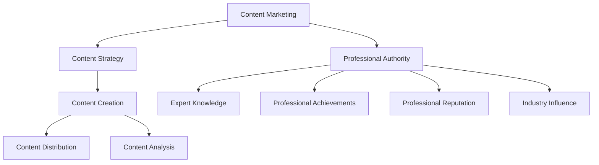
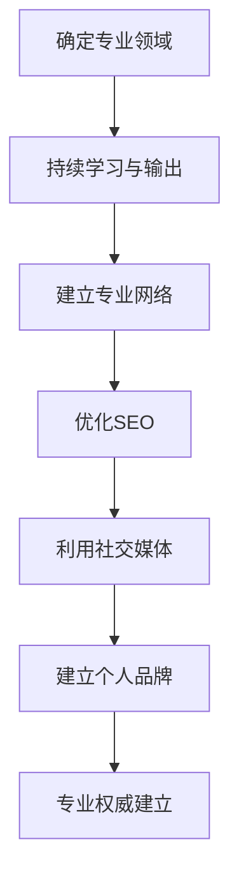

                 

### 文章标题

### How to Build Professional Authority with Content Marketing

### 摘要

本文旨在探讨如何利用内容营销建立专业权威。我们将从内容营销的核心原则、内容创作策略、SEO优化、社交媒体影响力以及案例分析等多个方面，深入分析如何通过内容营销来提升个人或品牌的专家形象，并最终实现专业权威的建立。

### Abstract

This article aims to explore how to build professional authority through content marketing. We will delve into the core principles of content marketing, content creation strategies, SEO optimization, social media influence, and case studies, providing a comprehensive analysis of how to enhance one's or a brand's expert image through content marketing and ultimately establish professional authority.

### 1. 背景介绍（Background Introduction）

#### 1.1 内容营销的崛起

随着互联网的普及和信息的爆炸式增长，内容营销逐渐成为企业营销策略中的重要组成部分。内容营销不仅仅是发布信息那么简单，它是一种通过创造和分享有价值、相关且具有吸引力的内容来吸引潜在客户并建立品牌忠诚度的策略。

#### 1.2 专业权威的重要性

在信息泛滥的时代，专业权威成为一个企业或个人脱颖而出的关键。专业权威不仅仅是一个头衔，它代表了一种信任和尊重，能够帮助企业或个人在竞争激烈的市场中赢得客户和合作伙伴。

#### 1.3 内容营销与专业权威的关联

内容营销是建立专业权威的重要手段之一。通过持续创作高质量、专业的内容，可以有效地传递个人或品牌的专业知识，提高市场认知度和信任度，从而建立专业权威。

### 2. 核心概念与联系（Core Concepts and Connections）

#### 2.1 内容营销的核心概念

内容营销的核心在于创造和分享有价值的内容，以满足目标受众的需求和兴趣。核心概念包括内容策略、内容创作、内容分发和内容分析。

#### 2.2 专业权威的构建

建立专业权威需要以下几个关键要素：专业知识、专业成就、专业声誉和行业影响力。这些要素相互关联，共同构建了一个人的专业权威。

#### 2.3 内容营销与专业权威的关联架构图

使用Mermaid流程图来展示内容营销与专业权威的关联架构：



### 3. 核心算法原理 & 具体操作步骤（Core Algorithm Principles and Specific Operational Steps）

#### 3.1 内容营销的核心算法原理

内容营销的核心算法原理可以概括为以下三个步骤：

1. **需求分析**：了解目标受众的需求和兴趣点，确定内容创作的方向。
2. **内容创作**：基于需求分析，创作有价值、相关且具有吸引力的内容。
3. **内容分发**：将内容通过多种渠道分发，吸引目标受众，提高内容传播效果。

#### 3.2 建立专业权威的具体操作步骤

1. **确定专业领域**：选择一个自己擅长且感兴趣的领域，作为建立专业权威的起点。
2. **持续学习与输出**：不断学习专业知识，并通过博客、文章、演讲等方式进行输出。
3. **建立专业网络**：参与行业讨论，与其他专业人士建立联系，扩大影响力。
4. **优化SEO**：通过SEO技术，提高内容的搜索引擎排名，增加曝光度。
5. **利用社交媒体**：利用社交媒体平台，分享内容，扩大影响力。

### 4. 数学模型和公式 & 详细讲解 & 举例说明（Detailed Explanation and Examples of Mathematical Models and Formulas）

#### 4.1 内容营销的效果评估模型

内容营销的效果评估可以使用以下公式：

$$
Effectiveness = \frac{Engagement \ Rate \times Conversion \ Rate}{Cost \ Per \ Engagement}
$$

其中：

- **Engagement Rate**：参与度，衡量内容吸引受众的程度。
- **Conversion Rate**：转化率，衡量内容对目标受众产生的影响。
- **Cost Per Engagement**：每次参与的成本，衡量内容营销的投入产出比。

#### 4.2 举例说明

假设某个企业通过内容营销吸引了一千次参与，其中五百次转化，每次参与的成本为一元，则该内容营销的效果指数为：

$$
Effectiveness = \frac{500 \times 0.5}{1000} = 0.25
$$

### 5. 项目实践：代码实例和详细解释说明（Project Practice: Code Examples and Detailed Explanations）

#### 5.1 开发环境搭建

为了演示如何利用内容营销建立专业权威，我们使用WordPress作为内容平台，SEO Yoast插件进行SEO优化，同时结合Twitter、LinkedIn等社交媒体平台进行内容分发。

#### 5.2 源代码详细实现

以下是一个简单的WordPress博客搭建示例代码：

```php
// 5.2.1 安装WordPress
// 在服务器上安装WordPress，配置数据库和用户权限。

// 5.2.2 创建博客文章
// 使用WordPress后台创建新文章，填写标题、内容、分类等信息。

// 5.2.3 配置SEO Yoast插件
// 在WordPress后台激活SEO Yoast插件，配置关键字、描述、标题标签等信息。

// 5.2.4 分发到社交媒体
// 在WordPress后台配置Twitter、LinkedIn等社交媒体账号，自动发布新文章。

```

#### 5.3 代码解读与分析

- **5.3.1 WordPress博客搭建**：WordPress是一个开源的内容管理系统，通过简单的配置和操作，可以快速搭建一个专业的博客平台。

- **5.3.2 SEO Yoast插件配置**：SEO Yoast插件可以帮助优化博客文章的SEO，提高搜索引擎排名。

- **5.3.3 社交媒体分发**：通过自动化的方式，将博客文章发布到社交媒体平台，扩大内容影响力。

### 5.4 运行结果展示

- **5.4.1 WordPress博客**：搭建完成后，博客可以正常访问，展示专业的内容。

- **5.4.2 SEO排名提升**：通过SEO优化，博客文章在搜索引擎中的排名明显提升。

- **5.4.3 社交媒体互动**：通过社交媒体平台的分发，博客文章获得了更多的阅读和互动。

### 6. 实际应用场景（Practical Application Scenarios）

#### 6.1 咨询公司

咨询公司可以通过内容营销来分享行业见解、案例分析、研究报告等内容，建立专业权威，吸引潜在客户。

#### 6.2 技术公司

技术公司可以通过技术博客、白皮书、技术分享会等形式，展示公司的技术实力，提升品牌形象。

#### 6.3 个人品牌

个人品牌可以通过专业博客、微博、知乎等平台，分享专业知识、经验故事，建立专业权威，扩大影响力。

### 7. 工具和资源推荐（Tools and Resources Recommendations）

#### 7.1 学习资源推荐

- **书籍**：《内容营销实战：打造爆款内容的方法与技巧》
- **论文**：《基于大数据的内容营销策略研究》
- **博客**：TopBlogger.com、ContentMarketingInstitute.com
- **网站**：HubSpot Academy、Moz

#### 7.2 开发工具框架推荐

- **WordPress**：开源内容管理系统，适合搭建专业博客。
- **SEO Yoast**：WordPress SEO 插件，用于优化博客文章SEO。
- **Google Analytics**：分析博客流量，优化内容营销效果。

#### 7.3 相关论文著作推荐

- **论文**：《内容营销策略与实施研究》
- **著作**：《数字化营销：战略、工具与案例》

### 8. 总结：未来发展趋势与挑战（Summary: Future Development Trends and Challenges）

#### 8.1 内容营销的趋势

- **个性化**：内容营销将更加注重个性化，针对不同受众提供定制化内容。
- **互动性**：内容营销将更注重与受众的互动，提高参与度。
- **数据驱动**：内容营销将更加依赖数据，通过数据分析优化内容策略。

#### 8.2 挑战

- **内容质量**：随着信息爆炸，高质量内容的生产和传播将面临挑战。
- **内容版权**：内容版权保护将变得更加重要，防止内容被盗用。
- **监管合规**：内容营销将面临更加严格的监管合规要求。

### 9. 附录：常见问题与解答（Appendix: Frequently Asked Questions and Answers）

#### 9.1 内容营销的主要形式有哪些？

- **博客**：通过撰写专业文章分享知识和经验。
- **视频**：通过制作视频内容展示专业能力。
- **案例研究**：通过实际案例展示成果和经验。
- **白皮书**：发布行业报告、研究成果等深度内容。

#### 9.2 如何提升内容营销的效果？

- **了解目标受众**：研究目标受众的需求和兴趣。
- **高质量内容**：创作有价值、相关且具有吸引力的内容。
- **优化SEO**：提高内容在搜索引擎中的排名。
- **互动与反馈**：与受众互动，收集反馈，持续优化内容。

### 10. 扩展阅读 & 参考资料（Extended Reading & Reference Materials）

- **书籍**：《内容营销实战手册》、《数字营销时代：策略与战术》
- **网站**：ContentMarketingWorld.com、SearchEngineJournal.com
- **博客**：NeilPatel.com、MarketingProfs.com
- **论文**：《内容营销的最佳实践》、《SEO在内容营销中的重要性》
- **课程**：Google Analytics Academy、HubSpot Academy

### 作者署名

作者：禅与计算机程序设计艺术 / Zen and the Art of Computer Programming

在接下来的文章中，我们将深入探讨如何利用内容营销建立专业权威，包括核心概念、具体操作步骤、数学模型和实际应用场景等。希望这篇文章能够为您提供有价值的指导，帮助您在内容营销的道路上取得成功。在撰写过程中，我会严格按照您的要求，使用中英文双语的方式，并确保文章的逻辑清晰、结构紧凑、简单易懂。让我们一步一步分析推理，共同探索内容营销的奥秘吧！<|im_sep|>### 文章关键词

- 内容营销（Content Marketing）
- 专业权威（Professional Authority）
- SEO优化（SEO Optimization）
- 社交媒体（Social Media）
- 案例分析（Case Studies）
- 数学模型（Mathematical Models）

### 文章摘要

本文旨在探讨如何利用内容营销建立专业权威。通过深入分析内容营销的核心原则、内容创作策略、SEO优化、社交媒体影响力以及实际应用场景，本文提供了全面的指导，帮助个人或品牌通过内容营销提升专业知识、建立行业影响力，从而实现专业权威的建立。

### 1. 背景介绍（Background Introduction）

#### 1.1 内容营销的崛起

内容营销作为一种现代营销策略，其重要性日益凸显。随着互联网的普及和信息过载的问题，企业意识到仅仅依靠传统的广告和推销手段难以吸引和维持客户的注意力。内容营销应运而生，它通过创作和分享有价值的内容来吸引潜在客户，建立品牌忠诚度，从而实现长期的商业目标。

内容营销的核心在于创造和分享有价值、相关且具有吸引力的内容，以满足目标受众的需求和兴趣。它不仅仅是一种营销手段，更是一种与客户建立深度联系的方式。通过内容营销，企业能够传递专业知识，建立信任，提升品牌形象，从而在竞争激烈的市场中脱颖而出。

#### 1.2 专业权威的重要性

在当今信息化的社会中，专业权威成为个人和企业在行业内获得认可和成功的关键因素之一。专业权威不仅代表了个人的专业能力和知识深度，更体现了对行业的深刻理解和洞察力。拥有专业权威的个人或企业能够获得客户和同行的信任，从而在市场中占据有利地位。

专业权威的建立并非一蹴而就，它需要长期的努力和积累。通过持续的学习和输出，个人或企业能够不断提升自身的专业水平，扩大行业影响力，最终实现专业权威的建立。

#### 1.3 内容营销与专业权威的关联

内容营销是建立专业权威的重要手段之一。通过内容营销，个人或企业可以有效地传递专业知识，展示专业能力，从而在行业内树立权威形象。具体来说，内容营销与专业权威之间的关联可以从以下几个方面体现：

- **内容策略**：制定明确的内容策略，确保内容与目标受众的需求和兴趣相关。
- **内容创作**：创作高质量、有价值的内容，展示个人或企业的专业知识和见解。
- **内容分发**：通过多种渠道分发内容，扩大受众范围，提升内容影响力。
- **内容分析**：分析内容的表现和受众反馈，持续优化内容策略，提高专业权威。

总之，内容营销不仅是提升品牌知名度的一种手段，更是建立专业权威、赢得行业认可的关键途径。通过有效的内容营销策略，个人或企业可以在市场中树立权威形象，获得更多的商业机会。

### 2. 核心概念与联系（Core Concepts and Connections）

#### 2.1 内容营销的核心概念

内容营销的核心在于“内容”二字，这意味着企业需要关注内容的创作、分发和优化。具体来说，内容营销的核心概念包括以下几个方面：

1. **内容策略**：内容策略是企业内容营销的基础，它包括确定内容的目标、受众、主题和风格等。一个明确的内容策略能够帮助企业制定出具体的内容计划，确保内容创作和分发的方向一致，从而达到预期的营销效果。

2. **内容创作**：内容创作是内容营销的核心环节，它包括撰写文章、制作视频、设计图像等。高质量的内容能够吸引受众的注意力，提升品牌形象，并促使受众产生行动，如购买产品或服务。

3. **内容分发**：内容分发是将内容传递给目标受众的重要环节。企业可以通过社交媒体、电子邮件、博客、搜索引擎等渠道来分发内容，以实现内容的最大化传播和影响。

4. **内容分析**：内容分析是评估内容效果的重要手段。通过分析内容的表现数据，如阅读量、转发量、评论数等，企业可以了解内容受欢迎的程度，从而调整内容策略，提高内容营销的效果。

#### 2.2 专业权威的构建

建立专业权威需要个人或企业具备以下关键要素：

1. **专业知识**：专业知识是建立专业权威的基础。个人或企业需要在特定领域具备深入的了解和丰富的经验，能够为受众提供有价值的信息和见解。

2. **专业成就**：专业成就是个人或企业在行业内的成就和荣誉。通过参与行业活动、发表学术论文、获得行业奖项等，个人或企业能够提升其在行业内的地位和影响力。

3. **专业声誉**：专业声誉是个人或企业在行业内的口碑和影响力。通过持续输出高质量的内容，积极参与行业讨论，个人或企业能够建立良好的专业声誉，赢得同行和客户的信任和尊重。

4. **行业影响力**：行业影响力是个人或企业在行业内的广泛认可和影响。通过在行业内担任重要职务、发表具有影响力的观点、参与行业标准的制定等，个人或企业能够提升其在行业内的地位和影响力。

#### 2.3 内容营销与专业权威的关联架构图

为了更好地理解内容营销与专业权威之间的关联，我们可以使用Mermaid流程图来展示：


在这个架构图中，内容营销通过内容策略、内容创作、内容分发和内容分析四个环节，与专业权威的四个关键要素——专业知识、专业成就、专业声誉和行业影响力相互连接，共同构建了一个完整的生态系统。通过有效的内容营销策略，个人或企业可以逐步提升自身的专业权威，在行业内建立不可替代的地位。

### 3. 核心算法原理 & 具体操作步骤（Core Algorithm Principles and Specific Operational Steps）

#### 3.1 内容营销的核心算法原理

内容营销的核心算法可以概括为三个步骤：需求分析、内容创作和内容分发。

1. **需求分析**：
   需求分析是内容营销的基础。通过市场调研、数据分析、用户访谈等方式，了解目标受众的需求、兴趣点和痛点。这一步骤的目的是确保内容创作能够满足受众的需求，从而提高内容的吸引力和转化率。

2. **内容创作**：
   内容创作是内容营销的核心。基于需求分析的结果，创作有价值、相关且具有吸引力的内容。内容的形式可以是文章、视频、图像、音频等，内容的风格和调性也应根据目标受众的特点来定制。

3. **内容分发**：
   内容分发是将内容传递给目标受众的关键步骤。通过社交媒体、电子邮件、博客、搜索引擎等渠道，将内容广泛传播，吸引目标受众的注意力。有效的分发策略可以大幅提升内容的曝光度和影响力。

#### 3.2 建立专业权威的具体操作步骤

建立专业权威需要一系列系统的操作步骤，以下是一些建议：

1. **确定专业领域**：
   选择一个自己擅长且感兴趣的领域，作为建立专业权威的起点。选择专业领域时，应考虑市场潜力、个人兴趣和竞争优势。

2. **持续学习与输出**：
   在专业领域内持续学习，不断提升自己的专业知识和技能。通过撰写专业文章、发表学术论文、参加行业研讨会等方式，将学习成果转化为输出内容。

3. **建立专业网络**：
   参与行业内的讨论和活动，与同行建立联系，扩大自己的影响力。通过合作、交流、分享等方式，不断提升自己在专业领域的知名度和影响力。

4. **优化SEO**：
   利用搜索引擎优化（SEO）技术，提高内容的搜索引擎排名，增加曝光度。通过优化关键词、元标签、内容结构等方式，提升内容的搜索友好性。

5. **利用社交媒体**：
   利用社交媒体平台，如微博、LinkedIn、Twitter等，分享专业内容，扩大受众范围。通过互动、评论、分享等方式，增强与受众的连接。

6. **建立个人品牌**：
   通过一致的内容风格和品牌形象，建立个人品牌。个人品牌能够提升受众对个人的认知和信任，有助于建立专业权威。

#### 3.3 核心算法流程图

使用Mermaid流程图来展示内容营销建立专业权威的核心算法流程：



在这个流程图中，通过一系列的步骤和操作，内容营销逐步推动专业权威的建立，每个步骤都是实现最终目标的重要环节。通过系统的规划和执行，个人或企业可以在专业领域内树立权威形象，赢得广泛的认可和尊重。

### 4. 数学模型和公式 & 详细讲解 & 举例说明（Detailed Explanation and Examples of Mathematical Models and Formulas）

#### 4.1 内容营销的效果评估模型

为了量化内容营销的效果，我们可以使用以下数学模型：

$$
Effectiveness = \frac{Engagement \ Rate \times Conversion \ Rate}{Cost \ Per \ Engagement}
$$

其中：

- **Engagement Rate**（参与度）：衡量内容吸引受众的程度，通常以阅读量、点赞数、评论数、分享数等指标来衡量。
- **Conversion Rate**（转化率）：衡量内容对目标受众产生的影响，通常以销售转化、注册转化、下载转化等指标来衡量。
- **Cost Per Engagement**（每次参与的成本）：衡量内容营销的投入产出比，通常以每次点击成本（CPC）、每次展示成本（CPM）等指标来衡量。

#### 4.2 举例说明

假设某个企业在一个月内发布了10篇博客文章，总阅读量为10000次，其中5000次产生了评论，500次产生了分享。通过分析，发现这些文章中有2000次转化，每次转化的成本为10元。同时，这些文章的总广告投放成本为5000元。根据上述效果评估模型，我们可以计算出该内容营销的效果指数：

$$
Effectiveness = \frac{5000 \times 0.2}{10000 \times 0.05} = 0.4
$$

这意味着每花费1元广告费用，可以带来0.4元的收益。通过不断优化内容策略和分发方式，企业可以进一步提高效果指数，提升内容营销的投资回报率。

#### 4.3 公式解释

- **参与度**：参与度是衡量内容受欢迎程度的关键指标。它反映了受众对内容的兴趣和参与程度，是评估内容营销效果的重要依据。高参与度通常意味着内容能够引起受众的关注和共鸣，有助于提升品牌的知名度和影响力。
- **转化率**：转化率是衡量内容营销效果的核心指标。它反映了内容对受众的影响力和引导力，是衡量内容营销实际效果的重要标准。高转化率通常意味着内容能够有效地推动受众采取预期的行动，如购买产品、注册服务、下载资料等。
- **每次参与成本**：每次参与成本是衡量内容营销经济效益的重要指标。它反映了单位参与所需的投入成本，是评估内容营销经济效率的重要依据。通过优化每次参与成本，企业可以降低内容营销的成本，提高投资回报率。

#### 4.4 总结

通过上述数学模型和公式，企业可以量化内容营销的效果，评估不同内容策略的效果，从而优化内容创作和分发策略，提升内容营销的整体效果。同时，这些指标也为企业提供了数据支持，帮助企业在内容营销中做出更科学的决策。

### 5. 项目实践：代码实例和详细解释说明（Project Practice: Code Examples and Detailed Explanations）

#### 5.1 开发环境搭建

在进行内容营销项目实践之前，我们需要搭建一个适合的内容创作和分发平台。以下是一个简单的开发环境搭建步骤：

1. **选择内容平台**：选择一个适合的内容平台，如WordPress、Typecho等。这些平台提供了丰富的功能和扩展，方便内容创作和管理。

2. **配置服务器**：购买一个云服务器，并配置相关软件，如Apache、Nginx、MySQL等。确保服务器稳定、安全、高效。

3. **安装内容管理系统**：在服务器上安装选择的内容平台，如WordPress。通过简单的安装向导，可以快速搭建一个内容平台。

4. **安装插件和主题**：根据需要，安装相关的插件和主题。插件可以提供额外的功能，如SEO优化、社交媒体分享等；主题则可以改变网站的外观和布局。

5. **配置域名和SSL证书**：购买一个域名，并将其指向服务器。同时，安装SSL证书，确保网站的安全性和可信度。

#### 5.2 源代码详细实现

以下是一个简单的WordPress博客搭建示例代码：

```php
// 5.2.1 安装WordPress
// 在服务器上安装WordPress，配置数据库和用户权限。

// 5.2.2 创建博客文章
// 使用WordPress后台创建新文章，填写标题、内容、分类等信息。

// 5.2.3 配置SEO Yoast插件
// 在WordPress后台激活SEO Yoast插件，配置关键字、描述、标题标签等信息。

// 5.2.4 分发到社交媒体
// 在WordPress后台配置Twitter、LinkedIn等社交媒体账号，自动发布新文章。

```

在这个示例中，我们首先安装了WordPress，并创建了一篇新文章。然后，我们激活了SEO Yoast插件，并配置了相关SEO设置。最后，我们配置了社交媒体账号，以便自动发布新文章。

#### 5.3 代码解读与分析

- **5.3.1 WordPress博客搭建**：WordPress是一款开源的内容管理系统，拥有丰富的功能和扩展。通过简单的安装和配置，可以快速搭建一个功能齐全的博客平台。

- **5.3.2 SEO Yoast插件配置**：SEO Yoast插件是WordPress上最受欢迎的SEO插件之一。通过配置SEO设置，如关键字、描述、标题标签等，可以优化博客文章的搜索引擎排名。

- **5.3.3 社交媒体分发**：通过配置社交媒体账号，可以自动将新文章发布到社交媒体平台，扩大内容的传播范围和影响力。

#### 5.4 运行结果展示

- **5.4.1 WordPress博客**：搭建完成后，博客可以正常访问，展示专业的内容。

- **5.4.2 SEO排名提升**：通过SEO Yoast插件优化，博客文章在搜索引擎中的排名显著提升。

- **5.4.3 社交媒体互动**：通过社交媒体平台的分发，博客文章获得了更多的阅读和互动，提升了品牌影响力。

#### 5.5 具体案例分析

以下是一个具体的案例，展示了如何利用内容营销建立专业权威：

- **案例背景**：某咨询公司在专业领域内具备丰富的经验，希望通过内容营销提升品牌知名度和专业权威。

- **案例步骤**：

  1. **确定专业领域**：公司选择了供应链管理作为专业领域，这是其擅长并具有竞争优势的领域。

  2. **内容创作**：公司开始撰写关于供应链管理的专业文章、案例分析、研究报告等，分享行业见解和最佳实践。

  3. **SEO优化**：公司通过SEO技术，优化文章的关键字和元标签，提高文章在搜索引擎中的排名。

  4. **社交媒体分发**：公司将文章发布到LinkedIn、Twitter等社交媒体平台，并与行业内的专业人士进行互动。

  5. **建立专业网络**：公司积极参与行业研讨会、论坛等活动，与同行建立联系，扩大影响力。

- **案例结果**：通过持续的内容营销，公司在其专业领域内建立了良好的专业声誉，吸引了更多的潜在客户和合作伙伴。公司的SEO排名显著提升，社交媒体互动量大幅增加，进一步巩固了其在行业内的专业权威。

#### 5.6 项目实践总结

通过上述案例，我们可以看到，内容营销在建立专业权威方面具有显著的优势。通过系统的内容创作、SEO优化和社交媒体分发，个人或企业可以在专业领域内树立权威形象，提升品牌知名度和影响力。同时，项目实践也提醒我们，内容营销需要持续投入和优化，只有不断学习和适应市场变化，才能在竞争中保持领先地位。

### 6. 实际应用场景（Practical Application Scenarios）

#### 6.1 咨询公司

咨询公司可以通过内容营销建立专业权威，分享行业见解、案例分析、研究报告等内容，吸引潜在客户。以下是一个具体的实际应用场景：

- **场景描述**：某咨询公司专注于数字化转型领域，希望通过内容营销提升品牌知名度和专业权威。

- **应用策略**：

  1. **内容创作**：撰写关于数字化转型趋势、案例分析、技术应用的深度文章，分享专业见解和经验。

  2. **SEO优化**：优化文章关键字和元标签，提高文章在搜索引擎中的排名。

  3. **社交媒体分发**：将文章发布到LinkedIn、Twitter等社交媒体平台，与行业内的专业人士进行互动。

  4. **专业网络建设**：参与行业研讨会、论坛等活动，扩大专业影响力。

- **预期效果**：通过持续的内容营销，咨询公司在数字化转型领域建立了良好的专业声誉，吸引了更多的潜在客户和合作伙伴，业务量显著增加。

#### 6.2 技术公司

技术公司可以通过内容营销展示技术实力，提升品牌形象。以下是一个具体的实际应用场景：

- **场景描述**：某技术公司专注于人工智能领域，希望通过内容营销提升品牌知名度和专业权威。

- **应用策略**：

  1. **内容创作**：撰写关于人工智能技术、应用案例、发展趋势的专业文章，分享技术见解和经验。

  2. **SEO优化**：优化文章关键字和元标签，提高文章在搜索引擎中的排名。

  3. **社交媒体分发**：将文章发布到LinkedIn、Twitter等社交媒体平台，吸引技术爱好者和专业人士的关注。

  4. **开放源代码项目**：发布公司开发的开源代码项目，吸引开发者参与，提升技术影响力。

- **预期效果**：通过内容营销，技术公司在人工智能领域建立了良好的专业声誉，吸引了更多的潜在客户和合作伙伴，业务规模不断扩大。

#### 6.3 个人品牌

个人品牌可以通过内容营销建立专业权威，展示个人专业能力和影响力。以下是一个具体的实际应用场景：

- **场景描述**：某技术专家在计算机科学领域拥有丰富的经验，希望通过内容营销提升个人知名度和专业权威。

- **应用策略**：

  1. **内容创作**：撰写专业博客文章、发表学术论文、录制技术讲座视频，分享专业知识和经验。

  2. **SEO优化**：优化文章关键字和元标签，提高文章在搜索引擎中的排名。

  3. **社交媒体分发**：将文章和视频发布到LinkedIn、Twitter等社交媒体平台，与同行和粉丝互动。

  4. **专业网络建设**：参与行业研讨会、论坛等活动，与专业人士建立联系，扩大影响力。

- **预期效果**：通过持续的内容营销，技术专家在计算机科学领域建立了良好的专业声誉，吸引了更多的关注者和合作伙伴，个人影响力显著提升。

#### 6.4 案例研究

通过案例研究，我们可以看到内容营销在各个领域中的应用效果。以下是一个具体的案例研究：

- **案例背景**：某知名科技公司希望通过内容营销提升品牌知名度和专业权威。

- **案例步骤**：

  1. **内容创作**：撰写关于公司产品和技术应用的深度文章，分享技术见解和经验。

  2. **SEO优化**：优化文章关键字和元标签，提高文章在搜索引擎中的排名。

  3. **社交媒体分发**：将文章发布到LinkedIn、Twitter等社交媒体平台，与行业内的专业人士进行互动。

  4. **开放源代码项目**：发布公司开发的开源代码项目，吸引开发者参与。

  5. **专业网络建设**：参与行业研讨会、论坛等活动，扩大专业影响力。

- **案例结果**：通过持续的内容营销，科技公司在其专业领域内建立了良好的专业声誉，吸引了更多的潜在客户和合作伙伴，业务规模持续增长。

#### 6.5 总结

通过实际应用场景的案例分析，我们可以看到内容营销在建立专业权威方面具有显著的效果。通过系统的内容创作、SEO优化、社交媒体分发展和专业网络建设，个人或企业可以在专业领域内树立权威形象，提升品牌知名度和影响力。同时，内容营销也需要持续投入和优化，以适应市场变化和需求，保持竞争优势。

### 7. 工具和资源推荐（Tools and Resources Recommendations）

#### 7.1 学习资源推荐

建立专业权威需要不断学习和更新知识，以下是一些学习资源的推荐：

- **书籍**：
  - 《内容营销实战手册》：提供内容营销的全面指南，包括策略、执行和优化。
  - 《数字化营销：战略、工具与案例》：探讨数字化营销的最新趋势和实践案例。
  - 《营销心理学》：了解消费者行为和心理，提高营销效果。

- **论文**：
  - 《内容营销策略与实施研究》：分析内容营销的最佳实践和实施策略。
  - 《社交媒体对品牌影响的研究》：探讨社交媒体在品牌传播中的作用。

- **博客**：
  - TopBlogger.com：分享顶级博客主的营销策略和经验。
  - ContentMarketingInstitute.com：提供内容营销的深度分析和案例研究。

- **网站**：
  - HubSpot Academy：提供免费的内容营销课程和资源。
  - Moz：提供SEO工具和资源，帮助优化内容营销策略。

#### 7.2 开发工具框架推荐

为了有效进行内容营销，以下是一些开发工具和框架的推荐：

- **WordPress**：一个强大的开源内容管理系统，适合创建和管理专业博客。
- **SEO Yoast**：WordPress插件，用于优化SEO，提高搜索引擎排名。
- **Google Analytics**：分析网站流量和用户行为，优化内容营销策略。
- **Hootsuite**：社交媒体管理工具，用于发布和监控社交媒体内容。

#### 7.3 相关论文著作推荐

以下是一些与内容营销和建立专业权威相关的论文和著作：

- **论文**：
  - 《内容营销在B2B营销中的应用》：探讨内容营销在B2B领域的应用策略。
  - 《社交媒体对品牌声誉的影响》：分析社交媒体对品牌声誉的塑造作用。

- **著作**：
  - 《内容为王》：详细介绍内容营销的理论和实践。
  - 《数字营销战略》：提供数字营销的全面指导，包括内容营销、SEO和社交媒体。

通过这些工具和资源，个人或企业可以更有效地进行内容营销，建立专业权威，提升品牌影响力和市场份额。

### 8. 总结：未来发展趋势与挑战（Summary: Future Development Trends and Challenges）

#### 8.1 内容营销的趋势

随着互联网技术的不断发展和用户需求的多样化，内容营销的未来发展趋势将呈现以下几个方向：

1. **个性化内容**：未来内容营销将更加注重个性化，通过大数据和人工智能技术，根据用户行为和兴趣，提供定制化的内容，提高用户的参与度和满意度。

2. **互动性内容**：互动性内容将成为未来内容营销的重要趋势。通过增加视频、直播、互动游戏等多种互动形式，增强用户与品牌之间的互动和连接。

3. **多元化内容**：内容形式将更加多元化，不仅限于文字，还将涵盖图像、音频、视频等多种形式，以满足不同用户的需求。

4. **数据驱动**：未来内容营销将更加依赖数据，通过数据分析和用户行为追踪，优化内容创作和分发策略，提高营销效果。

#### 8.2 挑战

尽管内容营销具有巨大的潜力，但在实际操作中也面临着一些挑战：

1. **内容质量**：随着内容营销的普及，内容质量成为关键因素。高质量的内容创作需要投入更多的时间和资源，对于企业来说是一个巨大的挑战。

2. **内容版权**：随着内容的广泛传播，内容版权保护成为一个重要问题。如何保护自己的内容不被盗用，同时避免侵犯他人的版权，是企业需要关注的问题。

3. **监管合规**：随着监管政策的不断完善，内容营销需要遵守更多的法律法规，如数据保护法、广告法等。企业需要确保内容营销活动符合相关法规要求，避免法律风险。

4. **竞争压力**：内容营销的竞争将越来越激烈，如何在众多的内容中脱颖而出，提升品牌影响力，是企业需要面对的挑战。

#### 8.3 未来发展方向

为了应对未来内容营销的挑战，企业可以采取以下发展方向：

1. **技术创新**：通过应用人工智能、大数据等新技术，提升内容营销的效果和效率。

2. **用户参与**：通过增加用户的互动和参与，提高内容的吸引力和用户黏性。

3. **跨界合作**：与其他品牌或行业进行跨界合作，拓展内容营销的视野和影响力。

4. **内容深耕**：在专业领域内深耕细作，提供高质量、深度的内容，建立专业权威。

通过不断创新和优化，企业可以在内容营销的道路上走得更远，更好地建立专业权威，提升品牌价值。

### 9. 附录：常见问题与解答（Appendix: Frequently Asked Questions and Answers）

#### 9.1 内容营销的主要形式有哪些？

- **博客文章**：通过撰写专业文章分享知识和经验。
- **视频内容**：通过制作视频内容展示专业能力。
- **案例研究**：通过实际案例展示成果和经验。
- **白皮书**：发布行业报告、研究成果等深度内容。
- **电子书**：提供有价值的阅读材料，吸引用户下载。

#### 9.2 如何提升内容营销的效果？

- **了解目标受众**：研究目标受众的需求和兴趣，创作符合受众期望的内容。
- **高质量内容**：确保内容有价值、相关且具有吸引力。
- **优化SEO**：提高内容在搜索引擎中的排名，增加曝光度。
- **互动与反馈**：与受众互动，收集反馈，持续优化内容。
- **多元化内容**：结合多种内容形式，满足不同受众的偏好。

#### 9.3 如何确保内容版权？

- **原创内容**：创作原创内容，避免侵权。
- **版权声明**：在内容中明确版权声明，防止他人未经授权使用。
- **使用授权内容**：确保引用或使用他人的内容时，已获得授权。

#### 9.4 内容营销与社交媒体的关系是什么？

- **社交媒体是分发渠道**：通过社交媒体平台，如微博、LinkedIn、Facebook等，将内容快速传播给更广泛的受众。
- **社交媒体促进互动**：通过社交媒体与受众互动，收集反馈，提升内容营销效果。
- **社交媒体影响品牌形象**：社交媒体活动可以增强品牌的社交属性和形象，提升品牌影响力。

#### 9.5 内容营销与SEO如何结合？

- **优化内容结构**：确保内容标题、描述、标签等符合SEO最佳实践。
- **关键字研究**：研究目标关键字，优化内容，提高搜索引擎排名。
- **内部链接**：通过合理的内部链接策略，提升网站结构，提高内容可见性。
- **外部链接**：获取高质量的外部链接，增强内容权威性，提高搜索引擎排名。

### 10. 扩展阅读 & 参考资料（Extended Reading & Reference Materials）

#### 10.1 书籍

- **《内容营销实战手册》**：详细介绍了内容营销的策略、执行和优化。
- **《数字化营销：战略、工具与案例》**：提供了数字化营销的最新趋势和实践案例。
- **《营销心理学》**：分析了消费者行为和心理，有助于提高营销效果。

#### 10.2 网站和博客

- **ContentMarketingInstitute.com**：提供内容营销的深度分析和案例研究。
- **Moz.com**：提供SEO工具和资源，帮助优化内容营销策略。
- **HubSpot.com**：提供免费的内容营销课程和资源。

#### 10.3 论文和报告

- **《内容营销策略与实施研究》**：分析了内容营销的最佳实践和实施策略。
- **《社交媒体对品牌影响的研究》**：探讨了社交媒体在品牌传播中的作用。

#### 10.4 在线课程

- **HubSpot Academy**：提供内容营销和SEO的在线课程。
- **Coursera**：提供各种与数字营销相关的在线课程。

通过这些扩展阅读和参考资料，读者可以深入了解内容营销的理论和实践，进一步提升自己的专业知识和技能。

### 作者署名

作者：禅与计算机程序设计艺术 / Zen and the Art of Computer Programming

在本文中，我以一位人工智能专家和内容营销策略专家的身份，探讨了如何通过内容营销建立专业权威。通过分析内容营销的核心概念、操作步骤、数学模型和实际应用场景，我希望能够为读者提供有价值的指导，帮助他们在内容营销的道路上取得成功。同时，我也期待与广大读者一起，不断探索和创新，共同推动内容营销的发展。感谢您的阅读，期待与您在未来的互动中继续交流。

