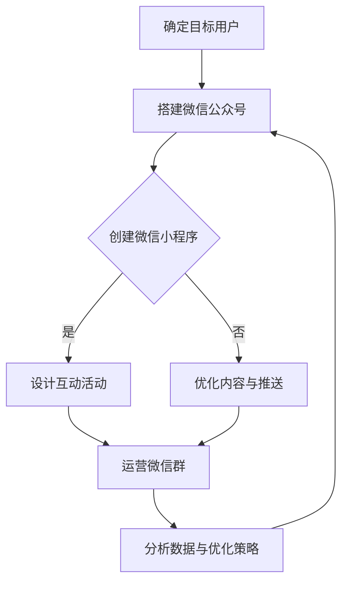

                 

# 文章标题

如何利用微信生态圈构建创业公司的私域流量

> 关键词：微信生态圈、私域流量、创业公司、微信小程序、社交媒体营销、用户增长策略、数据分析、用户互动

> 摘要：本文将探讨如何利用微信生态圈，特别是微信小程序和社交媒体营销功能，来构建创业公司的私域流量。我们将分析微信生态圈的核心组成部分、私域流量的关键特征，以及具体的操作步骤和策略。通过深入剖析和案例分析，帮助创业公司更好地理解和应用微信生态圈的力量，实现用户的持续增长和品牌价值的提升。

## 1. 背景介绍（Background Introduction）

微信作为中国最大的社交平台，其用户规模已经超过了10亿，覆盖了各个年龄层和社会群体。微信不仅提供了一个即时通讯工具，还通过其丰富的生态圈功能，成为了一个集社交、娱乐、购物、服务等多种功能于一体的综合平台。微信生态圈的核心组成部分包括微信小程序、微信公众号、朋友圈、微信群等，这些功能相互关联，为用户提供了丰富的互动体验。

私域流量是指企业拥有并可控的流量，这些流量通常来自于企业自己的用户群体，例如微信公众号、微信小程序等。与公域流量（如搜索引擎、社交媒体平台等）相比，私域流量具有更高的用户粘性和更强的用户互动性。构建私域流量可以帮助创业公司实现用户增长和品牌推广，降低营销成本，提高用户忠诚度。

随着移动互联网的普及和社交媒体的兴起，微信生态圈成为创业公司获取私域流量的重要渠道。微信小程序的推出，更是为企业提供了一个低成本、高效能的营销和客户服务工具。本文将深入探讨如何利用微信生态圈构建私域流量，帮助创业公司实现可持续增长。

## 2. 核心概念与联系（Core Concepts and Connections）

### 2.1 微信生态圈概述

微信生态圈是一个基于微信平台的生态体系，涵盖了多个功能和应用场景。以下是微信生态圈的主要组成部分：

- **微信小程序**：微信小程序是一种不需要下载安装即可使用的应用，用户可以通过微信扫码或搜索直接使用。微信小程序具有广泛的用户基础和便捷的使用体验，是企业实现私域流量的重要工具。

- **微信公众号**：微信公众号是企业发布内容、进行品牌推广和用户互动的主要平台。通过微信公众号，企业可以定期发布文章、推送消息，与用户建立深层次的互动关系。

- **朋友圈**：朋友圈是用户分享生活点滴、互动交流的重要场所。通过朋友圈的分享和互动，企业可以拓展用户群体，增强用户对品牌的认知和好感。

- **微信群**：微信群是用户进行实时交流的小团体，企业可以通过微信群进行精准营销和用户互动，提高用户的参与度和忠诚度。

### 2.2 私域流量的特征

私域流量具有以下几个显著特征：

- **用户粘性高**：私域流量的用户通常对企业有较高的忠诚度和信任度，因为这些用户是企业直接管理的用户，他们更容易与企业建立深层次的互动关系。

- **互动性强**：私域流量允许企业与用户进行实时、个性化的互动，这种互动有助于增强用户对品牌的认知和好感。

- **成本效益高**：与公域流量相比，私域流量通常成本较低，但效果更显著。企业可以通过微信公众号、微信小程序等工具，低成本地获取和维系用户。

- **用户数据可控**：私域流量的用户数据完全由企业掌控，企业可以对这些数据进行深入分析，以优化营销策略和提升用户体验。

### 2.3 微信生态圈与私域流量的联系

微信生态圈为创业公司提供了构建私域流量的丰富工具和资源。企业可以通过以下方式利用微信生态圈构建私域流量：

- **微信公众号**：通过发布高质量的内容和定期推送消息，与用户建立稳定的互动关系，提高用户的参与度和忠诚度。

- **微信小程序**：通过微信小程序提供便捷的服务和产品，吸引用户留存和转化，提升用户的活跃度和购买意愿。

- **朋友圈**：通过朋友圈的分享和互动，拓展用户群体，增强品牌影响力。

- **微信群**：通过微信群进行精准营销和用户互动，提高用户的参与度和忠诚度。

通过上述方式，创业公司可以利用微信生态圈的力量，实现私域流量的有效构建和持续增长。

### 2.4 Mermaid 流程图（Mermaid Flowchart）

以下是一个简化的Mermaid流程图，展示创业公司如何利用微信生态圈构建私域流量的基本流程：



通过以上步骤，企业可以逐步构建起私域流量体系，实现用户增长和品牌价值的提升。

## 3. 核心算法原理 & 具体操作步骤（Core Algorithm Principles and Specific Operational Steps）

### 3.1 微信公众号搭建

微信公众号是企业构建私域流量的基础，以下是一步一步的操作步骤：

1. **注册微信公众号**：首先，需要注册一个微信公众号，选择“服务号”或“订阅号”。
2. **配置账号**：完成注册后，进入微信公众号后台，进行账号的详细配置，包括设置头像、简介、服务范围等。
3. **搭建内容体系**：根据企业目标和用户需求，搭建内容体系，包括文章、图片、视频等多种形式。

### 3.2 微信小程序开发

微信小程序是企业实现产品和服务的重要工具，以下是一步一步的操作步骤：

1. **注册小程序**：在微信小程序官方平台注册小程序，并填写相关信息。
2. **开发与测试**：使用小程序开发工具（如微信开发者工具），编写小程序的代码并进行测试。
3. **发布与运营**：测试通过后，将小程序提交审核，审核通过后即可发布。发布后，根据用户反馈和数据分析，不断优化小程序。

### 3.3 互动活动设计

互动活动是增强用户参与度和忠诚度的有效手段，以下是一步一步的操作步骤：

1. **确定活动目标**：明确活动的目的，如吸粉、促销、品牌推广等。
2. **设计活动内容**：根据目标设计有趣、有吸引力的活动内容，如抽奖、拼团、限时折扣等。
3. **活动推广**：通过微信公众号、朋友圈、微信群等渠道进行推广，吸引用户参与。

### 3.4 用户数据分析与优化策略

用户数据分析是优化营销策略和提高用户留存率的关键，以下是一步一步的操作步骤：

1. **数据收集**：通过微信公众号、微信小程序等渠道收集用户数据，包括用户行为、偏好、反馈等。
2. **数据整理**：对收集到的数据进行整理和分析，提取有价值的信息。
3. **策略优化**：根据数据分析结果，调整内容发布策略、互动活动设计、营销推广方式等。

## 4. 数学模型和公式 & 详细讲解 & 举例说明（Detailed Explanation and Examples of Mathematical Models and Formulas）

### 4.1 用户增长模型

用户增长模型是评估私域流量增长潜力的关键工具，以下是一个简化的用户增长模型：

\[ \text{用户增长量} = f(\text{渠道流量}, \text{转化率}, \text{留存率}) \]

其中，\(\text{渠道流量}\)表示通过不同渠道（如微信公众号、微信小程序等）进入私域流量的用户数量；\(\text{转化率}\)表示进入私域流量的用户中，最终转化为购买或关注的比例；\(\text{留存率}\)表示用户在一段时间内持续活跃的比例。

举例说明：

假设某创业公司的微信公众号渠道每月带来1000个新用户，其中20%的用户关注公众号，10%的用户转化为购买者，留存率为50%。根据上述模型，该公司的月用户增长量为：

\[ \text{用户增长量} = 1000 \times 20\% \times 10\% \times 50\% = 10 \text{人} \]

### 4.2 用户留存模型

用户留存模型是衡量私域流量质量的重要指标，以下是一个简化的用户留存模型：

\[ \text{留存率} = \frac{\text{第n天留存用户数}}{\text{第1天新增用户数}} \]

其中，\(\text{第n天留存用户数}\)表示在第n天仍然活跃的用户数量；\(\text{第1天新增用户数}\)表示第1天新增的用户数量。

举例说明：

假设某创业公司的微信公众号第1天新增用户数为100人，第7天仍有50人活跃，则该公众号的7日留存率为：

\[ \text{留存率} = \frac{50}{100} \times 100\% = 50\% \]

通过以上数学模型和公式，企业可以更好地评估私域流量的增长潜力，制定相应的营销策略，提高用户的留存率和转化率。

## 5. 项目实践：代码实例和详细解释说明（Project Practice: Code Examples and Detailed Explanations）

### 5.1 开发环境搭建

要实现微信小程序和微信公众号的功能，需要搭建相应的开发环境。以下是基本步骤：

1. **安装微信开发者工具**：从微信官方开发者平台下载并安装微信开发者工具。

2. **注册小程序**：在微信开发者工具中注册小程序，填写相关信息，并获取AppID和AppSecret。

3. **配置服务器**：配置小程序的服务器，用于接收和处理用户的请求。可以选择使用云服务器或自己的服务器。

### 5.2 源代码详细实现

以下是微信小程序的一个简单示例，实现一个基本的用户注册和登录功能：

```javascript
// 注册页面逻辑
Page({
  data: {
    username: '',
    password: ''
  },
  // 用户名输入变化时更新数据
  usernameInput: function(e) {
    this.setData({
      username: e.detail.value
    });
  },
  // 密码输入变化时更新数据
  passwordInput: function(e) {
    this.setData({
      password: e.detail.value
    });
  },
  // 注册按钮点击事件
  register: function() {
    // 获取用户输入的用户名和密码
    const username = this.data.username;
    const password = this.data.password;
    // 检查用户输入是否为空
    if (!username || !password) {
      wx.showToast({
        title: '用户名或密码不能为空',
        icon: 'none'
      });
      return;
    }
    // 发送注册请求到服务器
    wx.request({
      url: 'https://example.com/register',
      method: 'POST',
      data: {
        username: username,
        password: password
      },
      success: function(res) {
        // 注册成功，跳转到登录页面
        wx.navigateTo({
          url: '/pages/login'
        });
      },
      fail: function() {
        wx.showToast({
          title: '注册失败',
          icon: 'none'
        });
      }
    });
  }
});

// 登录页面逻辑
Page({
  data: {
    username: '',
    password: ''
  },
  // 用户名输入变化时更新数据
  usernameInput: function(e) {
    this.setData({
      username: e.detail.value
    });
  },
  // 密码输入变化时更新数据
  passwordInput: function(e) {
    this.setData({
      password: e.detail.value
    });
  },
  // 登录按钮点击事件
  login: function() {
    // 获取用户输入的用户名和密码
    const username = this.data.username;
    const password = this.data.password;
    // 检查用户输入是否为空
    if (!username || !password) {
      wx.showToast({
        title: '用户名或密码不能为空',
        icon: 'none'
      });
      return;
    }
    // 发送登录请求到服务器
    wx.request({
      url: 'https://example.com/login',
      method: 'POST',
      data: {
        username: username,
        password: password
      },
      success: function(res) {
        // 登录成功，跳转到主页
        wx.navigateTo({
          url: '/pages/home'
        });
      },
      fail: function() {
        wx.showToast({
          title: '登录失败',
          icon: 'none'
        });
      }
    });
  }
});
```

### 5.3 代码解读与分析

上述代码示例展示了微信小程序中用户注册和登录的基本实现。以下是代码的详细解读：

1. **注册页面**：注册页面包含两个输入框，用于用户输入用户名和密码。用户输入后，通过`usernameInput`和`passwordInput`方法更新页面的数据。

2. **注册按钮**：点击注册按钮时，触发`register`方法。方法中首先检查用户输入是否为空，然后发送一个POST请求到服务器，携带用户名和密码。

3. **服务器响应**：服务器处理注册请求，如果注册成功，返回成功状态码，客户端跳转到登录页面。如果注册失败，返回错误信息，客户端显示提示。

4. **登录页面**：登录页面同样包含用户名和密码输入框，以及登录按钮。点击登录按钮时，触发`login`方法，与服务器进行登录请求。

5. **服务器响应**：服务器处理登录请求，如果登录成功，返回成功状态码，客户端跳转到主页。如果登录失败，返回错误信息，客户端显示提示。

通过以上代码示例，企业可以了解如何利用微信小程序实现基本的用户注册和登录功能，从而为私域流量的构建奠定基础。

### 5.4 运行结果展示

当用户成功注册和登录后，可以在微信小程序中看到相应的提示信息，并跳转到主页。以下是一个简单的运行结果展示：

- **注册成功**：用户在注册页面输入用户名和密码后，点击注册按钮，服务器返回注册成功信息，并在客户端显示提示。


- **登录成功**：用户在登录页面输入用户名和密码后，点击登录按钮，服务器返回登录成功信息，客户端跳转到主页。


通过这些简单的运行结果，企业可以验证微信小程序的功能是否正常，并根据实际情况进行优化和调整。

## 6. 实际应用场景（Practical Application Scenarios）

微信生态圈在私域流量构建中的应用场景非常广泛，以下是一些实际应用场景：

### 6.1 零售电商

零售电商企业可以利用微信小程序和微信公众号，搭建自己的电商商城。通过微信小程序提供便捷的购物体验，通过微信公众号发布新品信息、促销活动等，吸引和留住用户。同时，通过微信群进行社群营销，实现用户的高效互动和转化。

### 6.2 教育培训

教育培训机构可以利用微信生态圈进行课程推广和招生。通过微信公众号发布课程信息、教学视频、学员分享等内容，吸引用户关注。同时，通过微信群进行学员互动和管理，提高学员的参与度和满意度。

### 6.3 健康医疗

健康医疗企业可以利用微信小程序提供在线问诊、挂号预约、健康咨询等服务。通过微信公众号发布健康知识、医疗资讯，吸引用户关注和使用。同时，通过微信群进行用户健康管理，提供个性化的健康建议和医疗服务。

### 6.4 健身运动

健身运动企业可以利用微信生态圈提供在线健身课程、运动指导、健身社群等服务。通过微信小程序提供课程预约、在线直播等功能，吸引用户参与。同时，通过微信公众号发布健身知识、运动技巧，增强用户的互动体验。

通过以上实际应用场景，企业可以根据自身业务特点，灵活运用微信生态圈的功能，实现私域流量的有效构建和用户增长。

## 7. 工具和资源推荐（Tools and Resources Recommendations）

### 7.1 学习资源推荐

- **《微信营销：实战秘籍》**：一本系统介绍微信营销策略和技巧的书籍，适合创业公司和市场营销人员学习。
- **《微信小程序开发实战》**：详细讲解微信小程序开发的技术细节和实践经验，适合开发人员学习。
- **《私域流量实战手册》**：全面介绍私域流量构建、运营和管理的方法和策略，适合企业营销人员学习。

### 7.2 开发工具框架推荐

- **微信开发者工具**：微信官方提供的开发工具，用于开发、测试和发布微信小程序。
- **Taro**：一款多端统一开发框架，支持使用React或Vue等前端技术栈开发微信小程序。
- **uni-app**：一款跨平台开发框架，支持使用Vue或React等前端技术栈开发跨微信、支付宝、百度等多端应用。

### 7.3 相关论文著作推荐

- **《社会化媒体营销：策略与实践》**：探讨社会化媒体营销的理论和实践，适合市场营销研究人员阅读。
- **《大数据营销：策略与应用》**：介绍大数据在营销领域的应用，包括用户分析、精准营销等，适合企业决策者学习。
- **《人工智能营销：技术与应用》**：探讨人工智能在营销领域的应用，包括推荐系统、聊天机器人等，适合技术开发人员阅读。

通过以上工具和资源的推荐，企业可以更好地利用微信生态圈构建私域流量，实现用户的持续增长和品牌价值的提升。

## 8. 总结：未来发展趋势与挑战（Summary: Future Development Trends and Challenges）

微信生态圈作为私域流量的重要渠道，在未来将继续发挥重要作用。随着技术的不断进步和用户需求的多样化，微信生态圈将呈现以下发展趋势：

### 8.1 技术升级

微信生态圈将继续升级其技术能力，包括人工智能、大数据、区块链等，为企业提供更强大的工具和平台。这些技术将帮助创业公司更精准地定位用户、优化营销策略、提升用户体验。

### 8.2 生态开放

微信生态圈将进一步开放，与企业合作打造更加丰富和多样化的应用场景。通过生态开放的策略，微信将吸引更多第三方服务商和开发者，共同构建一个繁荣的生态系统。

### 8.3 社群营销

社群营销将成为私域流量的重要趋势。通过建立和维护社群，企业可以更深入地了解用户需求，实现个性化营销和服务。微信群、微信群聊等社交功能将发挥更大的作用，助力企业提升用户粘性和忠诚度。

### 8.4 数据驱动

数据将成为私域流量运营的核心驱动力。企业将更加注重数据分析，通过数据洞察用户行为、优化营销策略、提升运营效果。数据驱动的运营模式将帮助企业实现精准营销和用户增长。

然而，随着微信生态圈的发展，创业公司也将面临一系列挑战：

### 8.5 竞争加剧

随着越来越多的企业进入微信生态圈，市场竞争将日益激烈。创业公司需要不断创新和优化，以脱颖而出，赢得用户的青睐。

### 8.6 用户隐私保护

随着用户隐私保护意识的提升，微信生态圈将面临更大的挑战。企业需要严格遵守隐私保护法规，确保用户数据的安全和隐私。

### 8.7 技术壁垒

微信生态圈的技术壁垒较高，创业公司需要投入大量资源和精力进行技术研发和团队建设。企业需要具备较强的技术能力，才能在竞争中保持优势。

总之，微信生态圈作为私域流量的重要渠道，将在未来继续发挥重要作用。创业公司需要紧跟发展趋势，应对挑战，不断创新和优化，才能在微信生态圈中脱颖而出，实现可持续增长。

## 9. 附录：常见问题与解答（Appendix: Frequently Asked Questions and Answers）

### 9.1 微信小程序和微信公众号的区别是什么？

微信小程序和微信公众号都是微信生态圈的重要组成部分，但它们有不同的特点和用途。

- **微信小程序**：是一种无需下载安装即可使用的应用，通常用于提供便捷的服务和产品。微信小程序适用于高频、短时、低复杂度的应用场景，如购物、游戏、教育等。

- **微信公众号**：是一种用于发布内容、进行品牌推广和用户互动的平台。微信公众号适用于发布长篇文章、推送消息、建立用户社群等。

### 9.2 如何提高微信小程序的用户留存率？

提高微信小程序的用户留存率，可以从以下几个方面着手：

- **优化用户体验**：确保小程序的界面设计简洁明了，操作流程流畅，提供优质的用户体验。

- **提供个性化服务**：根据用户行为和偏好，提供个性化的内容和推荐，提升用户的满意度和忠诚度。

- **定期互动和活动**：通过定期举办互动活动和促销活动，提高用户的参与度和留存率。

- **数据分析**：通过数据分析了解用户行为和偏好，优化产品功能和运营策略。

### 9.3 如何确保用户数据的安全和隐私？

确保用户数据的安全和隐私，需要从以下几个方面进行：

- **遵守法律法规**：严格遵守国家和地区的隐私保护法律法规，确保用户数据的合法合规使用。

- **数据加密**：对用户数据进行加密存储和传输，防止数据泄露和滥用。

- **用户授权**：在收集和使用用户数据时，明确告知用户数据的使用目的，并获取用户的明确授权。

- **数据安全培训**：对员工进行数据安全培训，提高员工的数据安全意识和能力。

## 10. 扩展阅读 & 参考资料（Extended Reading & Reference Materials）

### 10.1 学习资源推荐

- **《微信小程序开发实战》**：详细讲解微信小程序开发的技术细节和实践经验。
- **《私域流量实战手册》**：全面介绍私域流量构建、运营和管理的方法和策略。
- **《微信营销：实战秘籍》**：系统介绍微信营销策略和技巧。

### 10.2 开发工具框架推荐

- **微信开发者工具**：官方提供的开发工具，用于开发、测试和发布微信小程序。
- **Taro**：多端统一开发框架，支持React和Vue等前端技术栈。
- **uni-app**：跨平台开发框架，支持微信、支付宝、百度等多端应用。

### 10.3 相关论文著作推荐

- **《社会化媒体营销：策略与实践》**：探讨社会化媒体营销的理论和实践。
- **《大数据营销：策略与应用》**：介绍大数据在营销领域的应用。
- **《人工智能营销：技术与应用》**：探讨人工智能在营销领域的应用。

通过以上扩展阅读和参考资料，读者可以更深入地了解微信生态圈和私域流量构建的相关知识，为自己的创业公司提供更多实践指导和理论支持。

### 作者署名

作者：禅与计算机程序设计艺术 / Zen and the Art of Computer Programming

