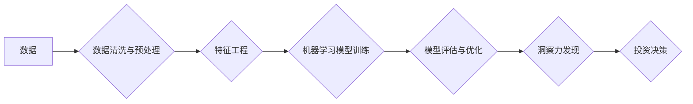

                 

## 理解洞察力的应用：在投资领域的实践探索

> 关键词：人工智能、洞察力、投资、机器学习、数据分析、风险管理、预测模型

## 1. 背景介绍

在当今数据爆炸的时代，投资领域面临着前所未有的机遇和挑战。海量的数据提供了丰富的投资线索，但如何从这些数据中挖掘出有价值的洞察力，并将其转化为实际收益，成为了投资者的关键难题。人工智能（AI）技术的快速发展为投资领域带来了新的希望，其强大的数据分析能力和预测模型，能够帮助投资者更深入地理解市场趋势，识别潜在的投资机会，并有效地降低投资风险。

传统的投资决策往往依赖于经验和主观判断，而AI驱动的洞察力分析则能够提供更客观、更精准的投资建议。通过机器学习算法对历史数据进行训练，AI模型能够识别出人类难以察觉的模式和趋势，并预测未来的市场走势。这使得投资者能够做出更明智的决策，提高投资回报率。

## 2. 核心概念与联系

### 2.1  洞察力

洞察力是指从数据中发现隐藏的模式、趋势和关系，并将其转化为有价值的知识和见解的能力。在投资领域，洞察力可以帮助投资者识别市场机会、评估风险、制定投资策略，最终实现投资目标。

### 2.2  人工智能

人工智能是指模拟人类智能行为的计算机系统。在投资领域，AI技术主要应用于数据分析、风险管理、预测模型等方面。

### 2.3  机器学习

机器学习是人工智能的一个子领域，它通过算法训练模型，使模型能够从数据中学习，并对新数据进行预测或分类。在投资领域，机器学习算法可以用于预测股票价格、识别市场趋势、评估投资风险等。

**核心概念与联系流程图**



## 3. 核心算法原理 & 具体操作步骤

### 3.1  算法原理概述

在投资领域，常用的机器学习算法包括线性回归、逻辑回归、支持向量机、决策树、随机森林、神经网络等。这些算法通过不同的方式学习数据中的模式，并根据学习到的知识对新数据进行预测或分类。

### 3.2  算法步骤详解

1. **数据收集与预处理:** 收集相关投资数据，并进行清洗、转换、标准化等预处理操作，以确保数据质量和算法训练效果。
2. **特征工程:** 从原始数据中提取有价值的特征，这些特征能够更好地反映投资相关的因素，例如股票价格、交易量、公司财务指标等。
3. **模型选择与训练:** 根据投资目标和数据特点选择合适的机器学习算法，并使用训练数据对模型进行训练，使其能够学习数据中的模式。
4. **模型评估与优化:** 使用测试数据评估模型的性能，并根据评估结果对模型参数进行调整，以提高模型的预测精度。
5. **洞察力发现与应用:** 将训练好的模型应用于新的投资数据，并从中发现隐藏的模式和趋势，为投资决策提供支持。

### 3.3  算法优缺点

不同的机器学习算法具有不同的优缺点，需要根据具体应用场景进行选择。例如，线性回归算法简单易懂，但对数据线性关系要求较高；决策树算法能够处理非线性关系，但容易过拟合；神经网络算法能够学习复杂模式，但训练时间长，参数调整复杂。

### 3.4  算法应用领域

机器学习算法在投资领域有着广泛的应用，例如：

* **股票价格预测:** 利用历史股票价格数据训练模型，预测未来股票价格走势。
* **市场趋势分析:** 分析市场数据，识别潜在的市场趋势和投资机会。
* **风险管理:** 评估投资风险，帮助投资者制定风险控制策略。
* **投资组合优化:** 根据投资目标和风险偏好，优化投资组合配置。

## 4. 数学模型和公式 & 详细讲解 & 举例说明

### 4.1  数学模型构建

在投资领域，常用的数学模型包括：

* **资本资产定价模型 (CAPM):** 用于估算资产的预期收益率，并衡量其风险。

$$
E(R_i) = R_f + \beta_i (E(R_m) - R_f)
$$

其中：

* $E(R_i)$ 是资产 i 的预期收益率
* $R_f$ 是无风险利率
* $\beta_i$ 是资产 i 的系统风险
* $E(R_m)$ 是市场预期收益率

* **Black-Scholes 模型:** 用于定价期权合约。

$$
C = S_0 N(d_1) - K e^{-rT} N(d_2)
$$

其中：

* $C$ 是期权合约的当前价格
* $S_0$ 是标的资产的当前价格
* $K$ 是期权合约的执行价格
* $r$ 是无风险利率
* $T$ 是到期时间
* $N(x)$ 是标准正态分布的累积分布函数
* $d_1$ 和 $d_2$ 是 Black-Scholes 公式中的参数

### 4.2  公式推导过程

这些公式的推导过程涉及复杂的微积分和概率论知识，这里不再赘述。

### 4.3  案例分析与讲解

通过将实际投资数据代入上述公式，可以进行定量分析和预测。例如，可以使用 CAPM 模型评估不同股票的风险和收益，并根据风险偏好选择合适的投资组合。可以使用 Black-Scholes 模型估算期权合约的价格，并制定相应的投资策略。

## 5. 项目实践：代码实例和详细解释说明

### 5.1  开发环境搭建

* Python 3.x
* Jupyter Notebook
* NumPy
* Pandas
* Scikit-learn

### 5.2  源代码详细实现

```python
import pandas as pd
from sklearn.linear_model import LinearRegression

# 加载数据
data = pd.read_csv('stock_data.csv')

# 选择特征和目标变量
features = ['open', 'high', 'low', 'volume']
target = 'close'

# 训练模型
model = LinearRegression()
model.fit(data[features], data[target])

# 预测未来价格
future_data = pd.DataFrame({'open': [100], 'high': [105], 'low': [95], 'volume': [1000000]})
predicted_price = model.predict(future_data)

# 打印预测结果
print(f'预测价格: {predicted_price[0]}')
```

### 5.3  代码解读与分析

这段代码演示了如何使用线性回归模型预测股票价格。首先，加载股票数据，然后选择特征和目标变量。接着，使用 `LinearRegression()` 类创建模型，并使用 `fit()` 方法训练模型。最后，使用训练好的模型预测未来价格，并打印结果。

### 5.4  运行结果展示

运行结果将显示预测的未来股票价格。

## 6. 实际应用场景

AI驱动的洞察力分析已在投资领域得到广泛应用，例如：

* **量化投资:** 利用机器学习算法构建自动化投资策略，根据市场数据和模型预测进行交易。
* **风险管理:** 通过分析历史数据和市场趋势，识别潜在的投资风险，并制定相应的风险控制策略。
* **个性化投资建议:** 根据用户的投资目标、风险偏好和财务状况，提供个性化的投资建议。

### 6.4  未来应用展望

随着人工智能技术的不断发展，AI驱动的洞察力分析将在投资领域发挥更重要的作用。未来，我们可能会看到：

* 更精准的预测模型，能够更准确地预测市场趋势和投资机会。
* 更个性化的投资服务，能够满足不同用户的个性化需求。
* 更智能的投资决策系统，能够自动执行投资策略，并根据市场变化进行调整。

## 7. 工具和资源推荐

### 7.1  学习资源推荐

* **书籍:**
    * 《Python机器学习》
    * 《深入理解机器学习》
    * 《投资者的数学》
* **在线课程:**
    * Coursera: 机器学习
    * edX: 投资分析
    * Udemy: Python数据科学

### 7.2  开发工具推荐

* **Python:** 强大的编程语言，广泛应用于数据分析和机器学习。
* **Jupyter Notebook:** 交互式编程环境，方便进行数据分析和模型开发。
* **NumPy:** 用于数值计算的Python库。
* **Pandas:** 用于数据分析和处理的Python库。
* **Scikit-learn:** 机器学习算法库。

### 7.3  相关论文推荐

* **《Artificial Intelligence in Finance》**
* **《Machine Learning for Financial Forecasting》**
* **《Deep Learning for Stock Price Prediction》**

## 8. 总结：未来发展趋势与挑战

### 8.1  研究成果总结

AI驱动的洞察力分析为投资领域带来了新的机遇和挑战。通过机器学习算法，我们可以从海量数据中挖掘出有价值的洞察力，并将其转化为实际收益。

### 8.2  未来发展趋势

未来，AI驱动的洞察力分析将在投资领域发挥更重要的作用。我们将看到更精准的预测模型、更个性化的投资服务、更智能的投资决策系统等。

### 8.3  面临的挑战

AI驱动的洞察力分析也面临着一些挑战，例如：

* 数据质量问题：投资数据往往存在噪声、缺失值等问题，需要进行有效的数据清洗和预处理。
* 模型解释性问题：一些机器学习模型的决策过程难以解释，这可能会导致投资者对模型结果缺乏信任。
* 监管风险：AI驱动的投资决策需要符合相关法律法规，需要制定相应的监管框架。

### 8.4  研究展望

未来，我们需要继续研究如何提高AI驱动的洞察力分析的精度、解释性和安全性，并将其应用于更广泛的投资场景。


## 9. 附录：常见问题与解答

**Q1: 如何选择合适的机器学习算法？**

**A1:** 选择合适的机器学习算法需要根据具体应用场景和数据特点进行考虑。例如，对于线性关系的数据，可以使用线性回归算法；对于非线性关系的数据，可以使用决策树或神经网络算法。

**Q2: 如何评估机器学习模型的性能？**

**A2:** 可以使用准确率、召回率、F1-score等指标评估机器学习模型的性能。

**Q3: 如何处理投资数据中的噪声和缺失值？**

**A3:** 可以使用数据清洗和预处理技术处理投资数据中的噪声和缺失值。例如，可以使用均值填充法处理缺失值，可以使用标准化方法处理噪声数据。


作者：禅与计算机程序设计艺术 / Zen and the Art of Computer Programming 
<end_of_turn>

