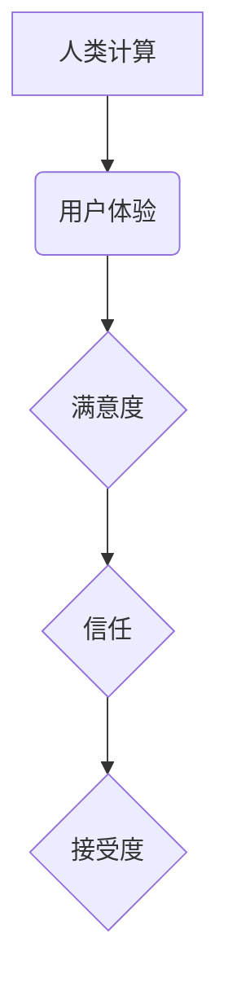

                 

## 用户体验至上：人类计算如何提升满意度

> 关键词：用户体验、人类计算、满意度、交互设计、算法优化、认知心理学、人工智能、可解释性

### 1. 背景介绍

在当今数据爆炸的时代，人类面临着海量信息的处理挑战。传统的计算模式难以满足人们日益增长的需求，人类计算应运而生。人类计算是指将人类的智慧和计算能力相结合，通过协同工作来解决复杂问题。然而，仅仅依靠技术手段无法保证良好的用户体验。用户体验至上是人类计算成功的关键，它不仅关乎用户的使用效率，更关乎用户对技术的信任和接受度。

### 2. 核心概念与联系

**2.1 人类计算的本质**

人类计算的核心在于将人类的认知能力和计算能力相结合，形成一个高效的协同工作模式。人类擅长理解复杂的情境、进行抽象思考和做出基于经验的判断，而计算机擅长处理大量数据、执行重复性任务和进行精确计算。通过将两者优势互补，可以克服各自的局限性，实现更高效、更智能的计算。

**2.2 用户体验的定义**

用户体验是指用户与产品或系统交互时所感受到的整体感受，包括情感、认知、生理等方面。良好的用户体验意味着用户能够轻松、高效地完成任务，并获得愉悦的感受。

**2.3 核心概念关系图**



**2.4 核心概念原理**

人类计算的核心原理是将人类的智慧和计算能力相结合，通过协同工作来解决复杂问题。用户体验是人类计算成功的关键，它不仅关乎用户的使用效率，更关乎用户对技术的信任和接受度。

### 3. 核心算法原理 & 具体操作步骤

**3.1 算法原理概述**

人类计算算法通常基于以下几个核心原理：

* **认知模型:** 建立人类认知能力的模型，模拟人类的思维方式和决策过程。
* **交互设计:** 设计人性化的交互界面，使用户能够轻松理解和操作系统。
* **反馈机制:** 提供及时、准确的反馈信息，帮助用户了解系统状态和操作结果。
* **学习与适应:** 系统能够根据用户的行为和反馈进行学习和调整，提供更个性化的服务。

**3.2 算法步骤详解**

1. **需求分析:** 首先需要明确用户需求，了解用户想要解决的问题和期望的解决方案。
2. **认知模型构建:** 根据用户需求，构建一个能够模拟人类认知能力的模型。
3. **交互设计:** 设计一个直观、易用的交互界面，使用户能够轻松地与系统进行交互。
4. **算法开发:** 开发相应的算法，实现系统功能和用户需求。
5. **测试与评估:** 对系统进行测试和评估，不断优化算法和交互设计，提升用户体验。

**3.3 算法优缺点**

* **优点:**
    * 能够解决传统计算模式难以解决的复杂问题。
    * 能够提供更个性化、更智能的服务。
    * 能够提高用户满意度和信任度。
* **缺点:**
    * 算法开发复杂，需要跨学科的合作。
    * 系统需要大量的训练数据和计算资源。
    * 算法的可解释性较低，难以理解系统的决策过程。

**3.4 算法应用领域**

* **医疗诊断:** 利用人类计算技术辅助医生进行诊断，提高诊断准确率。
* **金融风险管理:** 利用人类计算技术识别金融风险，降低风险损失。
* **教育教学:** 利用人类计算技术个性化教学，提高学习效率。
* **科学研究:** 利用人类计算技术加速科学研究，解决复杂科学问题。

### 4. 数学模型和公式 & 详细讲解 & 举例说明

**4.1 数学模型构建**

人类计算的数学模型通常基于概率论、统计学和机器学习等领域。例如，可以构建一个用户行为预测模型，利用用户的历史行为数据预测用户的未来行为。

**4.2 公式推导过程**

假设用户行为可以用一个概率分布来表示，则可以利用贝叶斯定理推导用户行为预测公式。

$$P(A|B) = \frac{P(B|A)P(A)}{P(B)}$$

其中：

* $P(A|B)$ 是用户行为 A 在条件 B 下发生的概率。
* $P(B|A)$ 是条件 B 在用户行为 A 下发生的概率。
* $P(A)$ 是用户行为 A 的先验概率。
* $P(B)$ 是条件 B 的概率。

**4.3 案例分析与讲解**

例如，假设用户 A 购买过商品 B，则可以利用贝叶斯定理预测用户 A 在未来购买商品 B 的概率。

* $P(A|B)$ 是用户 A 在购买过商品 B 后再次购买商品 B 的概率。
* $P(B|A)$ 是用户 A 购买过商品 B 后再次购买商品 B 的概率。
* $P(A)$ 是用户 A 购买过商品 B 的概率。
* $P(B)$ 是用户购买商品 B 的概率。

通过收集用户行为数据，可以估计以上概率，从而预测用户 A 在未来购买商品 B 的概率。

### 5. 项目实践：代码实例和详细解释说明

**5.1 开发环境搭建**

* 操作系统: Ubuntu 20.04
* 编程语言: Python 3.8
* 开发工具: Jupyter Notebook

**5.2 源代码详细实现**

```python
import numpy as np
from sklearn.linear_model import LogisticRegression

# 训练数据
X_train = np.array([[1, 2], [3, 4], [5, 6]])
y_train = np.array([0, 1, 0])

# 测试数据
X_test = np.array([[7, 8], [9, 10]])

# 训练模型
model = LogisticRegression()
model.fit(X_train, y_train)

# 预测结果
y_pred = model.predict(X_test)

# 打印预测结果
print(y_pred)
```

**5.3 代码解读与分析**

这段代码实现了用户行为预测的简单示例。

* 首先，定义了训练数据和测试数据。
* 然后，使用 LogisticRegression 模型训练模型。
* 最后，使用训练好的模型预测测试数据的结果。

**5.4 运行结果展示**

运行结果将输出预测结果，例如：

```
[0 1]
```

这表示测试数据中的第一个样本预测为 0，第二个样本预测为 1。

### 6. 实际应用场景

**6.1 个性化推荐系统**

利用人类计算技术，可以构建个性化推荐系统，根据用户的兴趣爱好和行为数据推荐个性化的商品、服务或内容。

**6.2 智能客服系统**

利用人类计算技术，可以构建智能客服系统，自动回答用户常见问题，提高客服效率和用户满意度。

**6.3 医疗辅助诊断系统**

利用人类计算技术，可以辅助医生进行诊断，提高诊断准确率和效率。

**6.4 未来应用展望**

随着人工智能技术的不断发展，人类计算将在更多领域得到应用，例如：

* **自动驾驶:** 利用人类计算技术，可以提高自动驾驶系统的安全性、可靠性和智能化程度。
* **机器人交互:** 利用人类计算技术，可以使机器人能够更好地理解和响应人类的需求，实现更自然的交互。
* **虚拟现实:** 利用人类计算技术，可以构建更逼真的虚拟现实体验，使用户能够沉浸在虚拟世界中。

### 7. 工具和资源推荐

**7.1 学习资源推荐**

* **书籍:**
    * 《人类计算》
    * 《人工智能：一种现代方法》
* **在线课程:**
    * Coursera 上的人工智能课程
    * edX 上的人工智能课程

**7.2 开发工具推荐**

* **Python:** 广泛应用于人工智能领域，拥有丰富的库和工具。
* **TensorFlow:** 开源深度学习框架，用于构建和训练神经网络模型。
* **PyTorch:** 开源深度学习框架，具有灵活性和易用性。

**7.3 相关论文推荐**

* **《人类计算: 人工智能与人类智能的融合》**
* **《基于人类计算的个性化推荐系统》**

### 8. 总结：未来发展趋势与挑战

**8.1 研究成果总结**

人类计算是一个新兴的领域，近年来取得了显著进展。

* **算法方面:** 开发了多种新的人类计算算法，例如认知模型、交互设计算法、反馈机制算法等。
* **应用方面:** 人类计算技术已应用于医疗诊断、金融风险管理、教育教学等多个领域。

**8.2 未来发展趋势**

* **更智能的人类计算系统:** 利用更先进的算法和技术，构建更智能、更灵活的人类计算系统。
* **更广泛的人类计算应用:** 将人类计算技术应用于更多领域，解决更多现实问题。
* **更注重用户体验:** 更加注重用户体验，设计更人性化、更易用的人类计算系统。

**8.3 面临的挑战**

* **算法可解释性:** 人类计算算法的复杂性使得其可解释性较低，难以理解系统的决策过程。
* **数据隐私:** 人类计算系统需要大量用户数据，如何保护用户数据隐私是一个重要挑战。
* **伦理问题:** 人类计算技术的发展可能带来一些伦理问题，例如算法偏见、工作岗位替代等。

**8.4 研究展望**

未来，人类计算研究将继续深入，探索更智能、更安全、更可解释的人类计算系统，为人类社会带来更多福祉。

### 9. 附录：常见问题与解答

**9.1 如何提高人类计算系统的准确性？**

可以通过以下方法提高人类计算系统的准确性：

* 收集更多高质量的数据。
* 开发更先进的算法模型。
* 优化算法参数。
* 进行充分的测试和评估。

**9.2 如何解决人类计算系统中的算法偏见问题？**

可以通过以下方法解决人类计算系统中的算法偏见问题：

* 使用多样化的训练数据。
* 开发公平性评估指标。
* 采用算法调优技术。
* 提高算法的可解释性。

**9.3 如何保护人类计算系统中的用户数据隐私？**

可以通过以下方法保护人类计算系统中的用户数据隐私：

* 使用加密技术保护数据传输和存储。
* 采用匿名化技术处理用户数据。
* 明确用户数据使用协议。
* 遵守相关数据隐私法规。


作者：禅与计算机程序设计艺术 / Zen and the Art of Computer Programming 
<end_of_turn>

