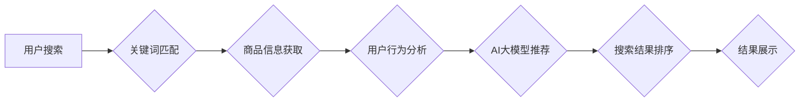

                 

## 电商平台中AI大模型的搜索结果个性化推荐

> 关键词：电商平台、AI大模型、搜索结果个性化、推荐系统、深度学习、Transformer模型、用户行为分析、点击率预估

## 1. 背景介绍

在当今数据爆炸的时代，电商平台面临着海量商品和用户需求的挑战。传统的搜索引擎依靠关键词匹配，难以满足用户个性化的搜索需求。AI大模型的出现为电商平台搜索结果的个性化推荐提供了新的机遇。

AI大模型，特别是基于Transformer架构的模型，具备强大的文本理解和生成能力，能够学习用户行为模式、商品特征和搜索意图，从而提供更精准、更相关的搜索结果。个性化推荐不仅可以提升用户体验，还能提高转化率和用户粘性，成为电商平台的核心竞争力。

## 2. 核心概念与联系

### 2.1 搜索结果个性化推荐

搜索结果个性化推荐是指根据用户的历史行为、偏好、上下文等信息，为用户提供定制化的搜索结果，使其更符合用户的实际需求。

### 2.2 AI大模型

AI大模型是指在海量数据上训练的深度学习模型，具有强大的泛化能力和学习能力。常见的AI大模型包括BERT、GPT、T5等。

### 2.3 电商平台搜索系统

电商平台搜索系统是用户在平台上搜索商品的核心功能。它通常包括以下几个模块：

* **数据采集和预处理:** 收集用户搜索词、商品信息、用户行为数据等，并进行清洗、格式化等预处理。
* **关键词匹配:** 根据用户输入的关键词，匹配平台中的商品信息。
* **排序算法:** 根据商品的相关性、用户偏好等因素，对搜索结果进行排序。
* **结果展示:** 将排序后的搜索结果以列表、卡片等形式展示给用户。

### 2.4 核心架构



## 3. 核心算法原理 & 具体操作步骤

### 3.1 算法原理概述

电商平台搜索结果个性化推荐通常采用基于深度学习的推荐算法，例如协同过滤、内容过滤、混合推荐等。

* **协同过滤:** 基于用户的历史行为和商品的购买记录，预测用户对特定商品的兴趣。
* **内容过滤:** 基于商品的特征和用户偏好的描述，推荐与用户兴趣相符的商品。
* **混合推荐:** 将协同过滤和内容过滤相结合，提高推荐的准确性和多样性。

### 3.2 算法步骤详解

1. **数据收集和预处理:** 收集用户搜索词、商品信息、用户行为数据等，并进行清洗、格式化等预处理。
2. **特征工程:** 将原始数据转换为模型可理解的特征，例如用户年龄、性别、购买历史、商品类别、价格等。
3. **模型训练:** 使用深度学习算法训练推荐模型，例如BERT、GPT等。
4. **模型评估:** 使用测试数据评估模型的性能，例如准确率、召回率、点击率等。
5. **模型部署:** 将训练好的模型部署到线上环境，为用户提供个性化推荐。

### 3.3 算法优缺点

**优点:**

* 能够提供更精准、更相关的推荐结果。
* 能够学习用户的动态变化，提供更个性化的体验。
* 能够挖掘用户隐性需求，推荐更符合用户意图的商品。

**缺点:**

* 需要大量的训练数据，训练成本较高。
* 模型训练和部署需要一定的技术门槛。
* 模型的解释性较差，难以理解模型推荐的原因。

### 3.4 算法应用领域

* **电商平台:** 个性化商品推荐、搜索结果推荐、用户画像分析等。
* **内容平台:** 个性化内容推荐、新闻推荐、视频推荐等。
* **社交媒体:** 个性化好友推荐、兴趣小组推荐、内容推荐等。

## 4. 数学模型和公式 & 详细讲解 & 举例说明

### 4.1 数学模型构建

假设我们有一个电商平台，包含用户集合U，商品集合I，用户对商品的评分集合R。我们的目标是构建一个数学模型，能够预测用户对商品的评分。

我们可以使用协同过滤算法构建一个矩阵分解模型，将用户和商品映射到低维空间，并预测用户对商品的评分。

### 4.2 公式推导过程

矩阵分解模型的目标函数是：

$$
J(\theta_u, \theta_i) = \frac{1}{2} \sum_{(u, i) \in R} (r_{ui} - \theta_u^T \theta_i)^2 + \frac{\lambda}{2} (\theta_u^T \theta_u + \theta_i^T \theta_i)
$$

其中：

* $r_{ui}$ 是用户u对商品i的真实评分。
* $\theta_u$ 是用户u的隐向量。
* $\theta_i$ 是商品i的隐向量。
* $\lambda$ 是正则化参数，用于防止模型过拟合。

### 4.3 案例分析与讲解

假设我们有一个用户u和一个商品i，它们的隐向量分别为$\theta_u$和$\theta_i$。我们可以使用以下公式预测用户u对商品i的评分：

$$
\hat{r}_{ui} = \theta_u^T \theta_i
$$

如果$\theta_u$和$\theta_i$在低维空间中距离较近，则预测的评分$\hat{r}_{ui}$较高，反之则较低。

## 5. 项目实践：代码实例和详细解释说明

### 5.1 开发环境搭建

* Python 3.7+
* TensorFlow 2.0+
* PyTorch 1.0+
* Jupyter Notebook

### 5.2 源代码详细实现

```python
import tensorflow as tf

# 定义模型
class RecommenderModel(tf.keras.Model):
    def __init__(self, num_users, num_items, embedding_dim):
        super(RecommenderModel, self).__init__()
        self.user_embedding = tf.keras.layers.Embedding(num_users, embedding_dim)
        self.item_embedding = tf.keras.layers.Embedding(num_items, embedding_dim)

    def call(self, user_ids, item_ids):
        user_embeddings = self.user_embedding(user_ids)
        item_embeddings = self.item_embedding(item_ids)
        return tf.reduce_sum(user_embeddings * item_embeddings, axis=1)

# 训练模型
model = RecommenderModel(num_users=1000, num_items=10000, embedding_dim=64)
model.compile(optimizer='adam', loss='mse')
model.fit(x=[user_ids, item_ids], y=ratings, epochs=10)

# 预测评分
predictions = model.predict([user_id, item_id])
```

### 5.3 代码解读与分析

* 我们定义了一个`RecommenderModel`类，该类继承自`tf.keras.Model`，实现了推荐模型的基本结构。
* 模型包含两个嵌入层，分别用于将用户ID和商品ID映射到低维空间。
* `call`方法定义了模型的前向传播过程，计算用户和商品的隐向量之间的点积，作为预测评分。
* 我们使用`adam`优化器和均方误差损失函数训练模型。
* `predict`方法用于预测用户对商品的评分。

### 5.4 运行结果展示

训练完成后，我们可以使用模型预测用户对商品的评分，并与真实评分进行比较，评估模型的性能。

## 6. 实际应用场景

### 6.1 个性化商品推荐

电商平台可以根据用户的历史购买记录、浏览记录、收藏记录等信息，使用AI大模型推荐个性化的商品。

### 6.2 搜索结果排序

AI大模型可以学习用户搜索行为模式，对搜索结果进行排序，将更符合用户意图的商品排在前面。

### 6.3 用户画像分析

AI大模型可以分析用户的行为数据，构建用户画像，了解用户的兴趣爱好、消费习惯等信息，为用户提供更精准的营销服务。

### 6.4 未来应用展望

* **多模态推荐:** 将文本、图像、视频等多模态数据融合，提供更丰富的推荐体验。
* **实时个性化推荐:** 基于用户的实时行为，动态调整推荐结果，提供更精准的个性化服务。
* **跨平台推荐:** 将用户行为数据整合，实现跨平台的个性化推荐。

## 7. 工具和资源推荐

### 7.1 学习资源推荐

* **书籍:**
    * Deep Learning by Ian Goodfellow
    * Hands-On Machine Learning with Scikit-Learn, Keras & TensorFlow by Aurélien Géron
* **在线课程:**
    * TensorFlow Tutorials: https://www.tensorflow.org/tutorials
    * PyTorch Tutorials: https://pytorch.org/tutorials/

### 7.2 开发工具推荐

* **TensorFlow:** https://www.tensorflow.org/
* **PyTorch:** https://pytorch.org/
* **Keras:** https://keras.io/

### 7.3 相关论文推荐

* BERT: Pre-training of Deep Bidirectional Transformers for Language Understanding
* GPT-3: Language Models are Few-Shot Learners
* Transformer: Attention Is All You Need

## 8. 总结：未来发展趋势与挑战

### 8.1 研究成果总结

AI大模型在电商平台搜索结果个性化推荐领域取得了显著成果，能够提供更精准、更相关的推荐结果，提升用户体验和商业价值。

### 8.2 未来发展趋势

* **模型规模和能力提升:** 未来AI大模型将更加强大，能够处理更复杂的数据，提供更精准的推荐。
* **多模态融合:** 将文本、图像、视频等多模态数据融合，提供更丰富的推荐体验。
* **个性化程度提升:** 基于用户的实时行为，动态调整推荐结果，提供更精准的个性化服务。

### 8.3 面临的挑战

* **数据隐私和安全:** AI大模型需要大量用户数据进行训练，如何保护用户隐私和数据安全是一个重要挑战。
* **模型解释性和可信度:** AI大模型的决策过程往往难以理解，如何提高模型的解释性和可信度是一个关键问题。
* **算法公平性和可控性:** AI大模型可能存在偏见和歧视，如何确保算法公平性和可控性是一个重要的伦理问题。

### 8.4 研究展望

未来研究将重点关注以下几个方面:

* **开发更安全、更隐私的AI大模型训练方法。**
* **提高模型的解释性和可信度，使其决策过程更加透明。**
* **研究算法公平性和可控性，确保AI大模型的 ethical 使用。**


## 9. 附录：常见问题与解答

**Q1: AI大模型的训练成本很高吗？**

A1: 确实，AI大模型的训练成本较高，需要大量的计算资源和数据。但是，随着硬件技术的进步和开源模型的普及，训练成本正在逐渐降低。

**Q2: 如何评估AI大模型的推荐效果？**

A2: 可以使用多种指标评估AI大模型的推荐效果，例如点击率、转化率、用户满意度等。

**Q3: AI大模型的推荐结果是否会存在偏差？**

A3: AI大模型的推荐结果可能会存在偏差，例如性别、年龄、地域等方面的偏差。因此，需要不断改进算法，确保推荐结果的公平性和公正性。


作者：禅与计算机程序设计艺术 / Zen and the Art of Computer Programming 
<end_of_turn>

