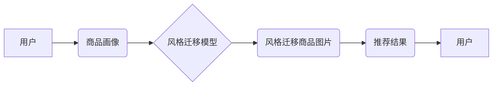

                 

## 电商平台中的图像风格迁移推荐：大模型的创新应用

> 关键词：图像风格迁移、大模型、推荐系统、深度学习、迁移学习、电商平台

## 1. 背景介绍

随着电商平台的蓬勃发展，用户对商品的视觉体验要求越来越高。传统的商品图片往往缺乏个性化和吸引力，难以激发用户的购买欲望。图像风格迁移技术作为一种能够将图像风格进行转换的强大工具，为电商平台提供了新的视觉体验和营销策略。

图像风格迁移技术能够将一张图像的风格迁移到另一张图像上，例如将一张照片的风格迁移到梵高的画作风格上。这种技术在艺术领域已经取得了广泛应用，但在电商领域却相对较新。

电商平台可以利用图像风格迁移技术，为用户提供个性化的商品展示，提升用户体验，并促进商品销售。例如，可以根据用户的喜好，将商品图片迁移到不同的艺术风格上，或者将商品图片迁移到与用户购买历史相关的风格上，从而提高商品的吸引力和推荐效果。

## 2. 核心概念与联系

### 2.1 核心概念

* **图像风格迁移:**  一种将图像的风格从一张图像迁移到另一张图像的技术。
* **深度学习:**  一种机器学习方法，利用多层神经网络来学习数据特征。
* **推荐系统:**  一种根据用户的历史行为和偏好，推荐用户感兴趣的商品或内容的系统。
* **大模型:**  参数量巨大、训练数据量庞大的深度学习模型。

### 2.2 架构关系



## 3. 核心算法原理 & 具体操作步骤

### 3.1 算法原理概述

图像风格迁移算法的核心是利用深度学习模型，将图像的内容和风格进行分离。

常见的图像风格迁移算法包括：

* **Gatys 等人的算法:**  利用卷积神经网络的特征提取能力，将内容图像的内容特征与风格图像的风格特征进行融合，生成风格迁移后的图像。
* **Johnson 等人的算法:**  利用生成对抗网络 (GAN) 的对抗训练机制，生成风格迁移后的图像。

### 3.2 算法步骤详解

以 Gatys 等人的算法为例，其步骤如下：

1. **提取内容特征:**  将内容图像输入到预训练的卷积神经网络中，提取内容图像的特征。
2. **提取风格特征:**  将风格图像输入到预训练的卷积神经网络中，提取风格图像的特征。
3. **计算损失函数:**  定义一个损失函数，用于衡量风格迁移后的图像与目标风格图像的风格差异。
4. **优化图像:**  利用梯度下降算法，优化图像像素，使其风格更接近目标风格图像。

### 3.3 算法优缺点

**优点:**

* 效果显著:  能够生成高质量的风格迁移图像。
* 可定制性强:  可以根据用户的喜好，选择不同的风格图像进行迁移。

**缺点:**

* 计算量大:  训练和运行风格迁移模型需要大量的计算资源。
* 迁移效果不总是理想:  对于一些复杂的图像，风格迁移效果可能不理想。

### 3.4 算法应用领域

* **艺术创作:**  将照片迁移到不同的艺术风格上，创作新的艺术作品。
* **图像编辑:**  修改图像的风格，例如将黑白照片变成彩色照片。
* **游戏开发:**  为游戏场景生成不同的风格效果。
* **电商平台:**  为商品图片生成不同的风格效果，提升用户体验和商品销售。

## 4. 数学模型和公式 & 详细讲解 & 举例说明

### 4.1 数学模型构建

Gatys 等人的算法的核心是利用卷积神经网络的特征提取能力，将内容图像的内容特征与风格图像的风格特征进行融合。

假设：

* $I$ 是内容图像
* $S$ 是风格图像
* $F$ 是预训练的卷积神经网络

则，风格迁移的目标是找到一个新的图像 $I'$，使得：

* $I'$ 的内容特征与 $I$ 相似
* $I'$ 的风格特征与 $S$ 相似

### 4.2 公式推导过程

Gatys 等人的算法定义了两个损失函数：

* **内容损失函数:**  衡量 $I'$ 与 $I$ 的内容特征差异。

$$
L_{content}(I', I) = ||F(I') - F(I)||^2
$$

* **风格损失函数:**  衡量 $I'$ 与 $S$ 的风格特征差异。

$$
L_{style}(I', S) = \sum_{i=1}^{n} \alpha_i ||G_i(I') - G_i(S)||^2
$$

其中：

* $G_i$ 是卷积神经网络的第 $i$ 层特征提取函数
* $\alpha_i$ 是权重系数，用于平衡不同层的风格特征

总损失函数为：

$$
L(I', I, S) = L_{content}(I', I) + \lambda L_{style}(I', S)
$$

其中：

* $\lambda$ 是平衡系数，用于控制内容损失和风格损失的权重

### 4.3 案例分析与讲解

假设我们想要将一张风景照片的风格迁移到梵高的画作风格上。

1. 我们选择一张风景照片作为内容图像 $I$，以及一张梵高的画作作为风格图像 $S$。
2. 我们使用预训练的卷积神经网络 $F$，提取 $I$ 和 $S$ 的特征。
3. 我们定义内容损失函数和风格损失函数，并设置权重系数 $\alpha_i$ 和平衡系数 $\lambda$。
4. 我们利用梯度下降算法，优化图像像素，使其风格更接近梵高的画作风格。

## 5. 项目实践：代码实例和详细解释说明

### 5.1 开发环境搭建

* Python 3.6+
* TensorFlow 或 PyTorch 深度学习框架
* CUDA 和 cuDNN (可选，用于GPU加速)

### 5.2 源代码详细实现

```python
import tensorflow as tf

# 定义内容损失函数
def content_loss(content_image, generated_image):
    content_features = model.layers[content_layer_index].output
    generated_features = model.layers[content_layer_index].output
    return tf.reduce_mean(tf.square(content_features - generated_features))

# 定义风格损失函数
def style_loss(style_image, generated_image):
    style_features = model.layers[style_layer_index].output
    generated_features = model.layers[style_layer_index].output
    return tf.reduce_mean(tf.square(style_features - generated_features))

# 定义总损失函数
def total_loss(content_image, style_image, generated_image):
    return content_loss(content_image, generated_image) + style_loss(style_image, generated_image)

# 训练模型
optimizer = tf.keras.optimizers.Adam(learning_rate=0.01)
for epoch in range(epochs):
    with tf.GradientTape() as tape:
        generated_image = model(content_image)
        loss = total_loss(content_image, style_image, generated_image)
    gradients = tape.gradient(loss, model.trainable_variables)
    optimizer.apply_gradients(zip(gradients, model.trainable_variables))

# 保存生成的图像
generated_image.save("generated_image.jpg")
```

### 5.3 代码解读与分析

* 代码首先定义了内容损失函数、风格损失函数和总损失函数。
* 然后，使用 TensorFlow 的 Adam 优化器训练模型。
* 训练过程中，将内容图像和风格图像作为输入，优化生成图像的像素，使其风格更接近目标风格。
* 最后，保存生成的图像。

### 5.4 运行结果展示

运行代码后，将生成一张风格迁移后的图像，其风格与目标风格图像相似。

## 6. 实际应用场景

### 6.1 商品图片风格迁移

电商平台可以根据用户的喜好，将商品图片迁移到不同的艺术风格上，例如将服装图片迁移到印象派风格上，将家居用品图片迁移到简约风格上，从而提升商品的吸引力和个性化。

### 6.2 个性化推荐

电商平台可以根据用户的购买历史和偏好，将商品图片迁移到与用户相关的风格上，例如将用户购买过运动鞋的商品图片迁移到运动风格上，从而提高推荐效果。

### 6.3 内容营销

电商平台可以利用图像风格迁移技术，为营销活动生成独特的视觉效果，例如将品牌logo迁移到不同的艺术风格上，制作个性化的广告宣传片。

### 6.4 未来应用展望

随着大模型技术的不断发展，图像风格迁移技术将在电商平台的应用场景中得到更广泛的应用，例如：

* **虚拟试衣间:**  利用图像风格迁移技术，将用户的照片与商品图片进行融合，实现虚拟试衣效果。
* **个性化商品设计:**  用户可以根据自己的喜好，将商品图片迁移到不同的风格上，定制个性化的商品。
* **增强现实购物体验:**  利用增强现实技术，将商品图片迁移到用户的真实环境中，提供更沉浸式的购物体验。

## 7. 工具和资源推荐

### 7.1 学习资源推荐

* **论文:**  Gatys 等人的论文《A Neural Algorithm of Artistic Style》
* **博客:**  Deep Learning with Python
* **在线课程:**  Coursera 上的深度学习课程

### 7.2 开发工具推荐

* **TensorFlow:**  开源深度学习框架
* **PyTorch:**  开源深度学习框架
* **Keras:**  高层深度学习API

### 7.3 相关论文推荐

* **《Gatys 等人的论文《A Neural Algorithm of Artistic Style》**
* **《Johnson 等人的论文《Perceptual Losses for Real-Time Style Transfer and Super-Resolution》**
* **《Ulyanov 等人的论文《Texture Synthesis Using Convolutional Neural Networks》**

## 8. 总结：未来发展趋势与挑战

### 8.1 研究成果总结

图像风格迁移技术在电商平台的应用前景广阔，能够提升用户体验，促进商品销售。

### 8.2 未来发展趋势

* **大模型的应用:**  利用大模型，实现更精准、更个性化的风格迁移。
* **实时风格迁移:**  降低计算量，实现实时风格迁移，为用户提供更流畅的体验。
* **多模态风格迁移:**  将图像风格迁移扩展到其他模态，例如音频和视频。

### 8.3 面临的挑战

* **计算资源:**  大模型的训练和运行需要大量的计算资源。
* **风格迁移效果:**  对于一些复杂的图像，风格迁移效果可能不理想。
* **数据标注:**  训练大模型需要大量的标注数据，数据标注成本较高。

### 8.4 研究展望

未来，图像风格迁移技术将继续发展，并应用于更多电商平台的场景，为用户提供更个性化、更丰富的购物体验。


## 9. 附录：常见问题与解答

* **Q:  图像风格迁移技术需要多少计算资源？**

* **A:**  图像风格迁移技术的计算资源需求取决于模型大小和图像分辨率。大模型和高分辨率图像需要更多的计算资源。

* **Q:  图像风格迁移效果如何？**

* **A:**  图像风格迁移效果取决于模型的训练数据和算法的复杂度。一般来说，训练数据越多，算法越复杂，风格迁移效果越好。

* **Q:  如何选择合适的风格图像？**

* **A:**  选择风格图像时，需要考虑目标图像的风格和内容。建议选择与目标图像风格相近的图像。


作者：禅与计算机程序设计艺术 / Zen and the Art of Computer Programming 
<end_of_turn>

