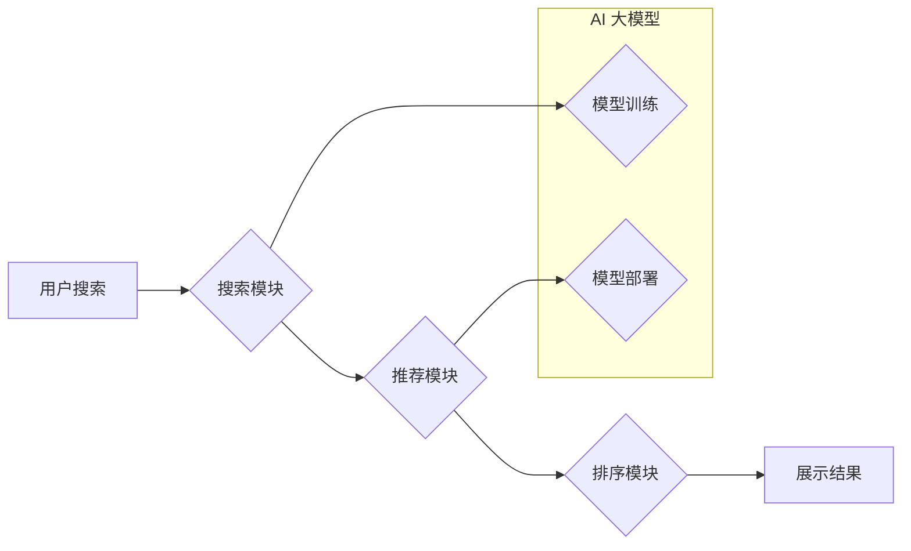

                 

## 电商平台搜索推荐系统的AI 大模型优化：提高系统性能、效率与准确率

> 关键词：电商平台、搜索推荐系统、AI 大模型、模型优化、性能提升、效率提升、准确率提升

## 1. 背景介绍

在当今数据爆炸的时代，电商平台搜索推荐系统已成为用户获取商品信息和完成购买的重要途径。传统的搜索推荐系统主要依赖于规则引擎和基于特征的机器学习算法，但随着用户行为数据的复杂性和海量化，这些方法逐渐难以满足用户个性化需求和平台快速发展的要求。

AI 大模型的出现为电商平台搜索推荐系统带来了新的机遇。其强大的学习能力和泛化能力能够更好地理解用户需求，挖掘商品之间的潜在关联，从而提供更精准、更个性化的推荐结果。然而，AI 大模型的训练和部署也面临着诸多挑战，例如模型规模庞大、训练时间长、计算资源消耗高、推理速度慢等。

因此，如何有效地优化AI 大模型，提高其性能、效率和准确率，是电商平台搜索推荐系统发展的重要课题。

## 2. 核心概念与联系

### 2.1  电商平台搜索推荐系统

电商平台搜索推荐系统旨在帮助用户快速找到所需商品，并根据用户的兴趣和偏好提供个性化的推荐。它通常由以下几个模块组成：

* **搜索模块:** 处理用户搜索词，并返回与搜索词相关的商品列表。
* **推荐模块:** 基于用户的历史行为、浏览记录、购买记录等数据，推荐与用户兴趣相关的商品。
* **排序模块:** 对搜索结果和推荐结果进行排序，将最相关的商品排在前面。
* **展示模块:** 将排序后的结果以用户友好的方式展示给用户。

### 2.2  AI 大模型

AI 大模型是指参数量巨大、训练数据海量、具有强学习能力的深度学习模型。它能够学习复杂的模式和关系，并应用于各种自然语言处理、计算机视觉、语音识别等领域。

### 2.3  模型优化

模型优化是指通过调整模型结构、训练参数、训练数据等方式，提高模型的性能、效率和准确率。

**Mermaid 流程图**



## 3. 核心算法原理 & 具体操作步骤

### 3.1  算法原理概述

在电商平台搜索推荐系统中，常用的AI 大模型包括：

* **Transformer:** 是一种基于注意力机制的深度学习模型，能够捕捉文本序列中的长距离依赖关系，在自然语言处理任务中表现出色。
* **BERT:** 基于Transformer的预训练语言模型，能够理解上下文信息，在搜索推荐任务中可以用于商品描述理解、用户意图识别等。
* **Graph Neural Networks (GNN):** 是一种能够处理图结构数据的深度学习模型，可以用于挖掘商品之间的关联关系，构建商品知识图谱，从而提高推荐的准确率。

### 3.2  算法步骤详解

以Transformer模型为例，其训练步骤如下：

1. **数据预处理:** 将商品信息、用户行为数据等转换为模型可识别的格式。
2. **模型构建:** 根据任务需求，构建Transformer模型架构，包括编码器、解码器等模块。
3. **模型训练:** 使用预训练好的模型参数，结合电商平台的数据进行微调训练，优化模型参数。
4. **模型评估:** 使用测试数据评估模型性能，例如准确率、召回率、NDCG等指标。
5. **模型部署:** 将训练好的模型部署到线上环境，用于实时推荐。

### 3.3  算法优缺点

**Transformer模型:**

* **优点:** 能够捕捉长距离依赖关系，在文本理解和生成任务中表现出色。
* **缺点:** 参数量巨大，训练时间长，计算资源消耗高。

**BERT模型:**

* **优点:** 预训练模型，能够快速适应新的任务，在搜索推荐任务中表现良好。
* **缺点:** 仍然需要进行微调训练，训练数据量较大。

**GNN模型:**

* **优点:** 能够处理图结构数据，挖掘商品之间的关联关系，提高推荐的准确率。
* **缺点:** 对于复杂图结构，模型训练难度较大。

### 3.4  算法应用领域

* **商品推荐:** 根据用户的兴趣和偏好，推荐相关的商品。
* **搜索结果排序:** 对搜索结果进行排序，将最相关的商品排在前面。
* **个性化广告:** 根据用户的兴趣和行为，展示个性化的广告。
* **用户画像构建:** 通过分析用户的行为数据，构建用户的画像，以便更好地理解用户的需求。

## 4. 数学模型和公式 & 详细讲解 & 举例说明

### 4.1  数学模型构建

Transformer模型的核心是注意力机制，其数学模型可以表示为：

$$
Attention(Q, K, V) = softmax(\frac{QK^T}{\sqrt{d_k}})V
$$

其中：

* $Q$: 查询矩阵
* $K$: 键矩阵
* $V$: 值矩阵
* $d_k$: 键向量的维度
* $softmax$: softmax函数

### 4.2  公式推导过程

注意力机制的目的是计算查询向量与键向量的相关性，并根据相关性对值向量进行加权求和。

* $QK^T$: 计算查询向量与键向量的点积，得到一个得分矩阵。
* $\frac{QK^T}{\sqrt{d_k}}$: 对得分矩阵进行缩放，以避免梯度爆炸。
* $softmax$: 对缩放后的得分矩阵进行softmax操作，得到每个键向量的权重。
* $V$: 将权重与值向量相乘，得到最终的输出。

### 4.3  案例分析与讲解

假设我们有一个句子 "我爱吃苹果"，将其转换为词向量表示，得到查询向量 $Q$、键向量 $K$ 和值向量 $V$。

通过注意力机制，我们可以计算每个词与其他词之间的相关性，例如 "我" 与 "爱" 的相关性较高，"爱" 与 "吃" 的相关性也较高。

最终的输出将是每个词的加权平均值，其中权重反映了每个词与其他词的相关性。

## 5. 项目实践：代码实例和详细解释说明

### 5.1  开发环境搭建

* **操作系统:** Ubuntu 20.04
* **Python版本:** 3.8
* **深度学习框架:** TensorFlow 2.x
* **其他依赖库:** numpy, pandas, matplotlib等

### 5.2  源代码详细实现

```python
import tensorflow as tf

# 定义Transformer模型
class Transformer(tf.keras.Model):
    def __init__(self, vocab_size, embedding_dim, num_heads, num_layers):
        super(Transformer, self).__init__()
        self.embedding = tf.keras.layers.Embedding(vocab_size, embedding_dim)
        self.transformer_layers = tf.keras.layers.StackedRNNCells([
            tf.keras.layers.MultiHeadAttention(num_heads=num_heads, key_dim=embedding_dim)
            for _ in range(num_layers)
        ])

    def call(self, inputs):
        # Embedding层将词向量化
        embedded = self.embedding(inputs)
        # Transformer层进行多头注意力机制和前馈网络
        output = self.transformer_layers(embedded)
        return output

# 实例化模型
model = Transformer(vocab_size=10000, embedding_dim=128, num_heads=8, num_layers=6)

# 训练模型
model.compile(optimizer='adam', loss='mse')
model.fit(x_train, y_train, epochs=10)

# 预测结果
predictions = model.predict(x_test)
```

### 5.3  代码解读与分析

* **Embedding层:** 将词转换为稠密的向量表示。
* **Transformer层:** 包含多头注意力机制和前馈网络，用于捕捉文本序列中的长距离依赖关系。
* **训练模型:** 使用Adam优化器和均方误差损失函数训练模型。
* **预测结果:** 使用训练好的模型对测试数据进行预测。

### 5.4  运行结果展示

训练完成后，可以使用测试数据评估模型性能，例如准确率、召回率、NDCG等指标。

## 6. 实际应用场景

### 6.1  电商平台商品推荐

AI 大模型可以根据用户的浏览历史、购买记录、收藏列表等数据，推荐与用户兴趣相关的商品。

### 6.2  搜索结果排序

AI 大模型可以学习用户搜索行为的模式，对搜索结果进行排序，将最相关的商品排在前面。

### 6.3  个性化广告

AI 大模型可以根据用户的兴趣和行为，展示个性化的广告，提高广告点击率和转化率。

### 6.4  未来应用展望

随着AI技术的不断发展，AI大模型在电商平台搜索推荐系统中的应用场景将更加广泛，例如：

* **多模态推荐:** 将文本、图像、视频等多模态数据融合，提供更丰富的推荐结果。
* **实时推荐:** 利用实时数据流，提供更精准、更及时地推荐。
* **个性化服务:** 基于用户的深度理解，提供更个性化的服务体验。

## 7. 工具和资源推荐

### 7.1  学习资源推荐

* **书籍:**
    * 深度学习
    * 自然语言处理
    * Transformer模型详解
* **在线课程:**
    * Coursera
    * edX
    * fast.ai

### 7.2  开发工具推荐

* **深度学习框架:** TensorFlow, PyTorch
* **云计算平台:** AWS, Azure, Google Cloud

### 7.3  相关论文推荐

* Attention Is All You Need
* BERT: Pre-training of Deep Bidirectional Transformers for Language Understanding
* Graph Convolutional Networks

## 8. 总结：未来发展趋势与挑战

### 8.1  研究成果总结

AI 大模型在电商平台搜索推荐系统中的应用取得了显著成果，提高了推荐的准确率、效率和个性化程度。

### 8.2  未来发展趋势

* **模型规模更大:** 参数量更大的模型能够学习更复杂的模式和关系，提高推荐的准确率。
* **训练效率更高:** 更加高效的训练算法和硬件平台能够缩短模型训练时间。
* **多模态融合:** 将文本、图像、视频等多模态数据融合，提供更丰富的推荐结果。
* **个性化定制:** 基于用户的深度理解，提供更个性化的服务体验。

### 8.3  面临的挑战

* **模型可解释性:** AI 大模型的决策过程难以理解，这可能会导致用户对推荐结果的信任度降低。
* **数据隐私:** AI 大模型的训练需要大量用户数据，如何保护用户隐私是一个重要的挑战。
* **模型公平性:** AI 大模型可能会存在偏见，导致推荐结果不公平。

### 8.4  研究展望

未来，研究者将继续探索AI 大模型在电商平台搜索推荐系统中的应用，解决模型可解释性、数据隐私和模型公平性等挑战，为用户提供更智能、更个性化的服务体验。

## 9. 附录：常见问题与解答

* **Q1: 如何选择合适的AI 大模型？**

A1: 选择合适的AI 大模型需要根据具体任务需求、数据规模、计算资源等因素进行综合考虑。

* **Q2: 如何评估AI 大模型的性能？**

A2: 可以使用准确率、召回率、NDCG等指标评估AI 大模型的性能。

* **Q3: 如何解决AI 大模型的训练时间长的问题？**

A3: 可以使用分布式训练、模型压缩等技术来加速模型训练。


作者：禅与计算机程序设计艺术 / Zen and the Art of Computer Programming 
<end_of_turn>

