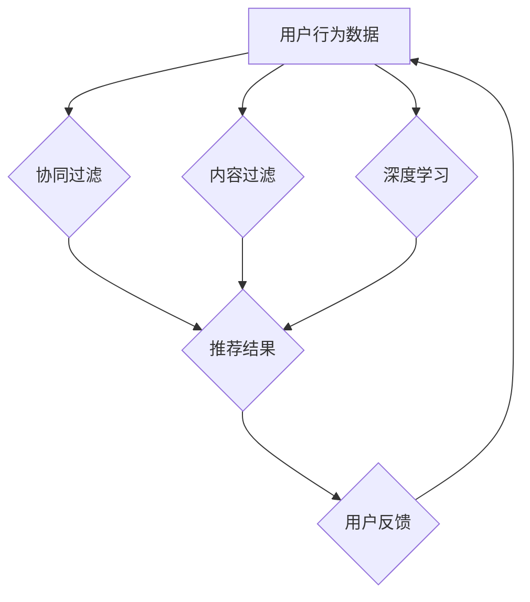

                 

## 电商推荐系统中的多目标优化与权衡

> 关键词：电商推荐系统、多目标优化、权衡、个性化推荐、协同过滤、内容过滤、深度学习、A/B测试

## 1. 背景介绍

在当今数据爆炸的时代，电商平台面临着激烈的竞争压力。如何精准地推荐商品给用户，提升用户体验和转化率，成为电商平台的核心竞争力之一。电商推荐系统作为连接用户和商品的桥梁，扮演着至关重要的角色。传统的推荐系统往往采用单目标优化策略，例如最大化点击率或转化率。然而，现实世界中，用户行为的多样性和复杂性使得单目标优化难以满足电商平台的需求。

多目标优化则试图在多个目标之间找到一个平衡点，以实现更全面的优化。例如，电商推荐系统需要同时考虑用户满意度、商品曝光率、转化率等多个目标。如何权衡这些目标，找到最佳的推荐策略，是电商推荐系统面临的重大挑战。

## 2. 核心概念与联系

### 2.1 多目标优化

多目标优化是指在多个目标函数的约束下，寻找最优解的优化问题。与单目标优化不同，多目标优化需要找到一个 Pareto 最优解，即不存在任何其他解能够同时改善所有目标函数的值。

### 2.2 电商推荐系统

电商推荐系统旨在根据用户的历史行为、偏好和上下文信息，预测用户对商品的兴趣，并推荐相关的商品。常见的推荐算法包括协同过滤、内容过滤和深度学习等。

### 2.3 权衡

在多目标优化中，权衡是指对不同目标函数赋予不同权重，以反映其相对重要性。权重的选择直接影响最终的推荐结果。

**Mermaid 流程图**



## 3. 核心算法原理 & 具体操作步骤

### 3.1 算法原理概述

多目标优化算法旨在找到 Pareto 最优解，即在不损害其他目标的情况下，尽可能优化每个目标函数的值。常见的多目标优化算法包括：

* **NSGA-II (Non-dominated Sorting Genetic Algorithm II)**：一种基于遗传算法的多目标优化算法，通过非支配排序和交叉、变异操作，逐步逼近 Pareto 前沿。
* **MOEA/D (Multiobjective Evolutionary Algorithm based on Decomposition)**：一种基于分解的多目标优化算法，将多个目标函数分解成多个子目标，并分别优化，最终得到 Pareto 最优解。
* **SPEA2 (Strength Pareto Evolutionary Algorithm 2)**：一种基于帕累托支配关系的多目标优化算法，通过计算个体的支配强度，选择更优解进行进化。

### 3.2 算法步骤详解

以 NSGA-II 算法为例，其具体步骤如下：

1. **初始化种群**: 生成一个初始种群，每个个体代表一个可能的推荐策略。
2. **评估适应度**: 对每个个体进行评估，计算其在各个目标函数上的值。
3. **非支配排序**: 根据个体的支配关系，将种群进行非支配排序，将 Pareto 最优解放在前面。
4. **选择**: 从非支配排序的各个层级中选择个体进行交叉和变异操作。
5. **交叉和变异**: 对选中的个体进行交叉和变异操作，生成新的个体。
6. **重复步骤 2-5**: 重复上述步骤，直到达到终止条件，例如最大迭代次数或种群收敛。

### 3.3 算法优缺点

**优点**:

* 能够找到 Pareto 最优解，兼顾多个目标。
* 适应性强，能够处理复杂的多目标优化问题。

**缺点**:

* 计算复杂度高，需要大量的计算资源。
* 找到全局最优解的可能性较低。

### 3.4 算法应用领域

多目标优化算法广泛应用于各个领域，例如：

* **机器学习**: 优化模型参数，提高模型性能。
* **控制系统**: 优化控制策略，提高系统稳定性和性能。
* **金融**: 优化投资组合，最大化收益并最小化风险。
* **电商推荐**: 优化推荐策略，提高用户满意度和转化率。

## 4. 数学模型和公式 & 详细讲解 & 举例说明

### 4.1 数学模型构建

假设电商推荐系统有 $n$ 个用户和 $m$ 个商品，每个用户对每个商品的评分用 $r_{ui}$ 表示，其中 $u \in \{1, 2, ..., n\}$，$i \in \{1, 2, ..., m\}$。

多目标优化模型可以表示为：

$$
\begin{aligned}
\text{目标函数} &= f_1(x) + \lambda_1 f_2(x) \\
\text{约束条件} &= g_1(x) \leq 0, g_2(x) \leq 0, ..., g_k(x) \leq 0
\end{aligned}
$$

其中：

* $x$ 是推荐策略的变量，例如商品排序、推荐数量等。
* $f_1(x)$ 和 $f_2(x)$ 分别是两个目标函数，例如点击率和转化率。
* $\lambda_1$ 是权重系数，用于平衡两个目标函数的重要性。
* $g_1(x), g_2(x), ..., g_k(x)$ 是约束条件，例如推荐商品的预算限制、推荐商品的类别限制等。

### 4.2 公式推导过程

具体的公式推导过程取决于具体的目标函数和约束条件。例如，如果目标函数是点击率和转化率，则可以分别使用以下公式计算：

* 点击率：$CTR = \frac{\text{点击次数}}{\text{展示次数}}$
* 转化率：$CVR = \frac{\text{转化次数}}{\text{点击次数}}$

### 4.3 案例分析与讲解

假设电商平台希望提高用户点击率和转化率，并制定了以下目标函数和约束条件：

* 目标函数：$f_1(x) = CTR$, $f_2(x) = CVR$
* 约束条件：推荐商品数量不超过 10 个

可以使用 NSGA-II 算法进行多目标优化，找到 Pareto 最优解。例如，一个 Pareto 最优解可能是一个推荐策略，该策略能够同时提高点击率和转化率，并且推荐商品数量不超过 10 个。

## 5. 项目实践：代码实例和详细解释说明

### 5.1 开发环境搭建

* Python 3.x
* TensorFlow 或 PyTorch
* Scikit-learn

### 5.2 源代码详细实现

```python
# 导入必要的库
import numpy as np
from sklearn.model_selection import train_test_split
from sklearn.metrics import mean_squared_error

# 定义协同过滤模型
class CollaborativeFiltering:
    def __init__(self, user_item_matrix):
        self.user_item_matrix = user_item_matrix

    def predict(self, user_id, item_id):
        # 使用协同过滤算法预测用户对商品的评分
        # ...

# 定义内容过滤模型
class ContentFiltering:
    def __init__(self, item_feature_matrix):
        self.item_feature_matrix = item_feature_matrix

    def predict(self, user_id, item_id):
        # 使用内容过滤算法预测用户对商品的评分
        # ...

# 定义深度学习模型
class DeepLearningModel:
    def __init__(self):
        # 定义深度学习模型结构
        # ...

    def predict(self, user_id, item_id):
        # 使用深度学习模型预测用户对商品的评分
        # ...

# 加载用户行为数据
user_item_matrix = np.load('user_item_matrix.npy')
item_feature_matrix = np.load('item_feature_matrix.npy')

# 将数据进行训练测试集划分
train_data, test_data = train_test_split(user_item_matrix, test_size=0.2)

# 创建推荐模型
collaborative_filtering = CollaborativeFiltering(train_data)
content_filtering = ContentFiltering(item_feature_matrix)
deep_learning_model = DeepLearningModel()

# 使用模型进行预测
predictions = collaborative_filtering.predict(user_id, item_id) + content_filtering.predict(user_id, item_id) + deep_learning_model.predict(user_id, item_id)

# 计算模型性能
mse = mean_squared_error(test_data, predictions)
print(f'MSE: {mse}')
```

### 5.3 代码解读与分析

代码示例展示了如何使用协同过滤、内容过滤和深度学习模型进行电商推荐。

* 首先，加载用户行为数据和商品特征数据。
* 然后，将数据进行训练测试集划分。
* 接着，创建三个推荐模型，并使用训练数据进行训练。
* 最后，使用模型进行预测，并计算模型性能。

### 5.4 运行结果展示

运行结果会显示模型的 MSE 值，MSE 值越低，模型性能越好。

## 6. 实际应用场景

### 6.1 个性化推荐

多目标优化可以帮助电商平台实现个性化推荐，根据用户的历史行为、偏好和上下文信息，推荐更符合用户需求的商品。

### 6.2 商品曝光率优化

多目标优化可以帮助电商平台优化商品曝光率，提高用户对商品的关注度，从而提升商品销量。

### 6.3 转化率提升

多目标优化可以帮助电商平台提升转化率，鼓励用户完成购买行为，从而提高电商平台的收入。

### 6.4 未来应用展望

随着人工智能技术的不断发展，多目标优化在电商推荐系统中的应用场景将会更加广泛。例如，可以利用多目标优化算法，实现更精准的商品推荐、更有效的广告投放、更个性化的用户体验等。

## 7. 工具和资源推荐

### 7.1 学习资源推荐

* **书籍**:
    * 《多目标优化算法》
    * 《机器学习》
* **在线课程**:
    * Coursera: Multi-Objective Optimization
    * edX: Machine Learning

### 7.2 开发工具推荐

* **Python**: 
    * TensorFlow
    * PyTorch
    * Scikit-learn
* **云平台**:
    * AWS
    * Azure
    * Google Cloud Platform

### 7.3 相关论文推荐

* Deb, K., Pratap, A., Meyarivan, T., & Radcliffe, J. (2002). A fast and elitist multiobjective genetic algorithm: NSGA-II. IEEE transactions on evolutionary computation, 6(2), 182-197.
* Coello Coello, C. A. (2006). Theoretical and practical aspects of multiobjective optimization.

## 8. 总结：未来发展趋势与挑战

### 8.1 研究成果总结

多目标优化在电商推荐系统中的应用取得了显著的成果，能够有效地提高推荐系统的性能，提升用户体验。

### 8.2 未来发展趋势

* **更精准的个性化推荐**: 利用更先进的人工智能技术，例如深度学习和强化学习，实现更精准的个性化推荐。
* **更有效的跨平台推荐**: 将多目标优化应用于跨平台推荐，例如将线上和线下数据进行融合，实现更全面的用户画像。
* **更可解释的推荐模型**: 研究更可解释的多目标优化算法，帮助用户理解推荐结果背后的逻辑，提升用户信任度。

### 8.3 面临的挑战

* **数据质量**: 多目标优化算法依赖于高质量的数据，数据不完整、不准确或存在偏差都会影响推荐结果的准确性。
* **算法复杂度**: 多目标优化算法的计算复杂度较高，需要大量的计算资源和时间。
* **用户隐私**: 多目标优化算法需要收集和分析用户的个人信息，如何保护用户隐私是一个重要的挑战。

### 8.4 研究展望

未来，多目标优化在电商推荐系统中的研究将更加深入，将更加注重算法的效率、可解释性和用户隐私保护。


## 9. 附录：常见问题与解答

**Q1: 多目标优化与单目标优化的区别是什么？**

**A1:** 单目标优化只考虑一个目标函数，而多目标优化则考虑多个目标函数，试图在不损害其他目标的情况下，尽可能优化每个目标函数的值。

**Q2: 如何选择多目标优化算法？**

**A2:** 选择多目标优化算法需要根据具体的问题和数据特点进行选择。例如，对于复杂的多目标优化问题，可以考虑使用 NSGA-II 算法；对于简单的问题，可以考虑使用其他算法，例如 SPEA2 算法。

**Q3: 如何评估多目标优化算法的性能？**

**A3:** 多目标优化算法的性能通常使用 Pareto 前沿和指标如 IGD (Inverted Generational Distance) 和 HV (Hypervolume) 进行评估。

**Q4: 多目标优化算法的计算复杂度如何？**

**A4:** 多目标优化算法的计算复杂度通常较高，需要大量的计算资源和时间。


作者：禅与计算机程序设计艺术 / Zen and the Art of Computer Programming<end_of_turn>

