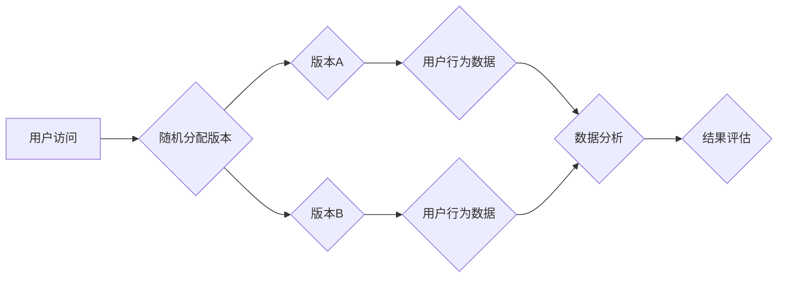

                 

## 电商搜索业务中的AB实验设计与分析

> 关键词：AB测试、电商搜索、推荐算法、用户行为、数据分析、A/B实验设计

## 1. 背景介绍

在当今以电商为核心的数字经济时代，搜索引擎已成为用户获取商品信息和完成购买决策的关键入口。电商平台的搜索业务直接影响着用户体验、转化率和最终的商业成功。为了不断提升搜索引擎的性能，电商平台通常会进行大量的实验和优化。AB测试作为一种常见的优化方法，在电商搜索业务中发挥着至关重要的作用。

AB测试，全称为A/B Testing，是一种比较两种或多种不同版本（A版本和B版本）的效果的实验方法。通过随机将用户分配到不同的版本，并比较其行为差异，可以确定哪种版本更有效。在电商搜索业务中，AB测试可以应用于各种场景，例如：

* **搜索结果排序算法优化：** 比较不同排序算法对用户点击率、转化率的影响。
* **搜索结果页面布局优化：** 比较不同页面布局对用户停留时间、转化率的影响。
* **搜索建议算法优化：** 比较不同建议算法对用户点击率、转化率的影响。
* **搜索结果展示内容优化：** 比较不同展示内容（例如商品图片、价格、评价等）对用户点击率、转化率的影响。

## 2. 核心概念与联系

AB测试的核心概念是随机化和对比。通过随机将用户分配到不同的版本，可以确保实验结果的可靠性，避免人为因素的影响。

**AB测试流程图：**



**AB测试的联系：**

AB测试与推荐算法、用户行为分析、数据分析等领域密切相关。

* **推荐算法：** AB测试可以用于评估不同推荐算法的效果，选择最优的推荐策略。
* **用户行为分析：** AB测试可以帮助我们了解用户在搜索过程中的行为模式，例如点击率、停留时间、转化率等。
* **数据分析：** AB测试需要大量的用户行为数据进行分析，以确定哪个版本更有效。

## 3. 核心算法原理 & 具体操作步骤

### 3.1  算法原理概述

AB测试的核心算法原理是假设检验。通过比较两个版本的实验结果，我们可以判断它们之间的差异是否显著。常用的假设检验方法包括t检验和卡方检验。

* **t检验：** 用于比较两个样本的均值差异是否显著。
* **卡方检验：** 用于比较两个样本的频数分布差异是否显著。

### 3.2  算法步骤详解

**AB测试的具体操作步骤如下：**

1. **定义目标：** 明确AB测试的目标，例如提高点击率、转化率等。
2. **设计实验方案：** 确定A版本和B版本，并制定实验方案，包括用户分组、数据收集、分析方法等。
3. **实施实验：** 将用户随机分配到不同的版本，并收集用户行为数据。
4. **数据分析：** 使用统计方法分析用户行为数据，判断两个版本之间的差异是否显著。
5. **结果评估：** 根据数据分析结果，评估实验的成功与否，并制定后续优化方案。

### 3.3  算法优缺点

**AB测试的优点：**

* **数据驱动：** 基于数据分析，结果更客观、更可靠。
* **易于实施：** 操作步骤简单，易于理解和执行。
* **成本低廉：** 相比其他优化方法，AB测试成本相对较低。

**AB测试的缺点：**

* **时间成本：** 需要一定的时间来收集足够的数据进行分析。
* **样本量问题：** 如果样本量不足，实验结果可能不够准确。
* **A/B测试的局限性：** 无法测试所有可能的方案，只能测试两个版本。

### 3.4  算法应用领域

AB测试广泛应用于电商搜索业务，以及其他互联网领域，例如：

* **网站优化：** 优化网站布局、内容、功能等。
* **营销推广：** 比较不同广告文案、广告位、推广策略的效果。
* **产品开发：** 评估不同产品功能、设计方案的用户接受度。

## 4. 数学模型和公式 & 详细讲解 & 举例说明

### 4.1  数学模型构建

在AB测试中，常用的数学模型是假设检验模型。假设检验模型的基本思想是：

* **零假设：** 两个版本之间没有显著差异。
* **备择假设：** 两个版本之间存在显著差异。

通过收集用户行为数据，我们可以计算两个版本之间的差异，并使用统计方法判断差异是否显著。

### 4.2  公式推导过程

常用的假设检验方法包括t检验和卡方检验。

* **t检验：** 用于比较两个样本的均值差异是否显著。t检验的公式如下：

$$t = \frac{\bar{x}_A - \bar{x}_B}{\sqrt{\frac{s_A^2}{n_A} + \frac{s_B^2}{n_B}}}$$

其中：

* $\bar{x}_A$ 和 $\bar{x}_B$ 分别是A版本和B版本的用户行为指标的均值。
* $s_A^2$ 和 $s_B^2$ 分别是A版本和B版本的用户行为指标的方差。
* $n_A$ 和 $n_B$ 分别是A版本和B版本的用户样本量。

* **卡方检验：** 用于比较两个样本的频数分布差异是否显著。卡方检验的公式如下：

$$\chi^2 = \sum_{i=1}^{k} \frac{(O_i - E_i)^2}{E_i}$$

其中：

* $O_i$ 是观察到的频数。
* $E_i$ 是期望的频数。
* $k$ 是频数类别数。

### 4.3  案例分析与讲解

假设我们想比较两种不同的搜索结果排序算法，A算法和B算法，其目标是提高用户点击率。我们可以进行AB测试，将用户随机分配到A算法和B算法的两个版本，并记录每个用户的点击行为。

通过收集用户行为数据，我们可以计算A算法和B算法的用户点击率，并使用t检验进行假设检验。如果t值大于临界值，则拒绝零假设，认为A算法和B算法之间存在显著差异。

## 5. 项目实践：代码实例和详细解释说明

### 5.1  开发环境搭建

AB测试的开发环境搭建需要以下工具和软件：

* **编程语言：** Python、Java、JavaScript等。
* **数据存储：** MySQL、MongoDB等。
* **数据分析工具：** Spark、Hadoop等。
* **实验平台：** Google Optimize、Optimizely等。

### 5.2  源代码详细实现

以下是一个简单的AB测试代码示例，使用Python语言实现：

```python
import random

# 定义A版本和B版本
version_A = "A"
version_B = "B"

# 用户数据
users = [
    {"id": 1, "version": version_A},
    {"id": 2, "version": version_B},
    {"id": 3, "version": version_A},
    {"id": 4, "version": version_B},
    {"id": 5, "version": version_A},
]

# 随机分配版本
for user in users:
    if random.random() < 0.5:
        user["version"] = version_A
    else:
        user["version"] = version_B

# 分析用户行为数据
# ...

# 评估实验结果
# ...
```

### 5.3  代码解读与分析

这段代码首先定义了A版本和B版本，然后创建了一个用户数据列表。

使用`random.random()`函数随机生成一个0到1之间的随机数，如果随机数小于0.5，则将用户的版本设置为A版本，否则设置为B版本。

最后，代码需要进行用户行为数据的分析和实验结果的评估。

### 5.4  运行结果展示

运行这段代码后，会输出一个包含用户ID和版本信息的列表。

通过分析用户行为数据，我们可以计算A版本和B版本的用户点击率、转化率等指标，并使用统计方法进行假设检验。

## 6. 实际应用场景

### 6.1  电商搜索结果排序优化

电商平台可以利用AB测试比较不同的搜索结果排序算法，例如基于用户历史行为、商品属性、实时热度等排序算法，选择最优的排序策略，提高用户搜索体验和转化率。

### 6.2  电商搜索结果页面布局优化

电商平台可以利用AB测试比较不同的搜索结果页面布局，例如商品展示方式、广告位位置、筛选条件展示等，选择最优的布局方案，提高用户停留时间和转化率。

### 6.3  电商搜索建议算法优化

电商平台可以利用AB测试比较不同的搜索建议算法，例如基于关键词匹配、用户历史行为、商品关联等算法，选择最优的建议算法，提高用户搜索效率和转化率。

### 6.4  未来应用展望

随着人工智能技术的不断发展，AB测试在电商搜索业务中的应用场景将会更加广泛。例如：

* **个性化搜索结果：** 利用用户画像和行为数据，为每个用户提供个性化的搜索结果。
* **智能搜索建议：** 利用自然语言处理和机器学习技术，提供更智能、更精准的搜索建议。
* **实时搜索结果优化：** 利用实时数据流，动态调整搜索结果排序和展示，以满足用户不断变化的需求。

## 7. 工具和资源推荐

### 7.1  学习资源推荐

* **书籍：**

    * 《Lean Analytics》
    * 《The Lean Startup》
    * 《A/B Testing: A Practical Guide》

* **在线课程：**

    * Coursera: A/B Testing
    * Udemy: A/B Testing for Beginners

### 7.2  开发工具推荐

* **Google Optimize:** 免费的AB测试平台，易于使用。
* **Optimizely:** 商业化的AB测试平台，功能更强大。
* **VWO:** 商业化的AB测试平台，提供更深入的数据分析功能。

### 7.3  相关论文推荐

* **A/B Testing: A Practical Guide to Experimentation**
* **The Power of A/B Testing: How to Use Experiments to Improve Your Website**
* **A/B Testing for Machine Learning Models**

## 8. 总结：未来发展趋势与挑战

### 8.1  研究成果总结

AB测试在电商搜索业务中取得了显著的成果，帮助电商平台提高用户体验、转化率和商业成功。

### 8.2  未来发展趋势

未来，AB测试将会更加智能化、自动化和个性化。例如：

* **机器学习驱动的AB测试：** 利用机器学习算法自动分析实验数据，并推荐最优的优化方案。
* **实时AB测试：** 利用实时数据流，动态调整实验方案，以适应用户不断变化的需求。
* **多因素AB测试：** 同时测试多个因素的影响，以获得更全面的优化方案。

### 8.3  面临的挑战

AB测试也面临着一些挑战，例如：

* **数据质量问题：** AB测试需要大量高质量的数据进行分析，如果数据质量不高，实验结果可能不准确。
* **样本量问题：** 如果样本量不足，实验结果可能不够可靠。
* **实验设计问题：** 实验设计需要精心策划，才能获得有效的结果。

### 8.4  研究展望

未来，我们需要继续研究AB测试的理论和方法，开发更智能、更有效的AB测试工具，并探索AB测试在更多领域应用的可能性。


## 9. 附录：常见问题与解答

### 9.1  常见问题

* **AB测试需要多少样本量？**

样本量取决于实验的精度要求和用户群体的规模。一般来说，样本量越大，实验结果越可靠。

* **如何确定AB测试的实验时间？**

实验时间取决于用户行为的周期性和实验目标的复杂度。一般来说，实验时间应足够长，以收集到足够的数据进行分析。

* **如何评估AB测试的成功与否？**

AB测试的成功与否应根据实验目标和数据分析结果进行评估。

### 9.2  解答

* **AB测试需要多少样本量？**

样本量取决于实验的精度要求和用户群体的规模。一般来说，样本量越大，实验结果越可靠。可以使用样本量计算器来估算所需的样本量。

* **如何确定AB测试的实验时间？**

实验时间取决于用户行为的周期性和实验目标的复杂度。一般来说，实验时间应足够长，以收集到足够的数据进行分析。可以使用统计软件来计算所需的实验时间。

* **如何评估AB测试的成功与否？**

AB测试的成功与否应根据实验目标和数据分析结果进行评估。可以使用统计方法进行假设检验，判断两个版本之间是否存在显著差异。


作者：禅与计算机程序设计艺术 / Zen and the Art of Computer Programming 
<end_of_turn>

