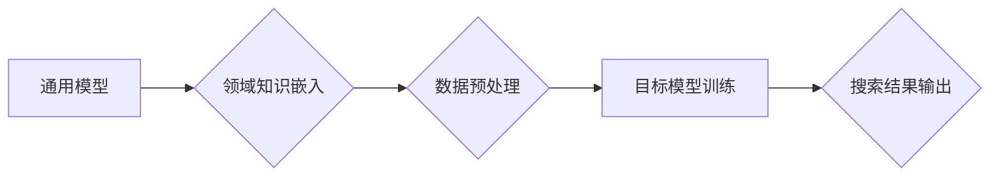

                 

## 电商搜索业务中的领域自适应技术与实践

> 关键词：电商搜索、领域自适应、推荐系统、机器学习、自然语言处理、个性化搜索、信息检索

## 1. 背景介绍

电商平台的搜索引擎是用户获取商品信息和完成购买的核心入口。然而，电商商品种类繁多，用户需求多样，传统的搜索引擎往往难以满足个性化、精准的搜索需求。为了提升用户搜索体验，电商平台需要不断探索新的技术手段，其中领域自适应技术成为一个重要的研究方向。

领域自适应技术是指根据特定领域的知识和语义，对通用搜索模型进行调整和优化，从而提高模型在特定领域的搜索性能。在电商搜索领域，领域自适应技术可以帮助搜索引擎更好地理解用户搜索意图，推荐更相关的商品，提升用户转化率。

## 2. 核心概念与联系

### 2.1 领域自适应的定义

领域自适应是指将预先训练好的通用模型迁移到特定领域，并通过领域知识和数据进行微调，以提高模型在目标领域的性能。

### 2.2 领域自适应的原理

领域自适应的核心思想是利用源域（通用模型训练数据）和目标域（电商搜索数据）之间的知识迁移关系，通过调整模型参数，使模型能够更好地适应目标领域的语义和特征。

### 2.3 领域自适应的架构



**图 1：领域自适应架构**

* 通用模型：预先训练好的通用语言模型，例如BERT、RoBERTa等。
* 领域知识嵌入：将领域知识（例如商品分类、属性、用户行为等）嵌入到模型中，帮助模型理解目标领域的语义。
* 数据预处理：对目标域数据进行清洗、格式化和特征提取，使其能够被模型理解。
* 目标模型训练：利用源域和目标域数据，对通用模型进行微调，训练出适应目标领域的模型。
* 搜索结果输出：根据用户搜索词，利用训练好的目标模型进行搜索，并输出相关商品结果。

## 3. 核心算法原理 & 具体操作步骤

### 3.1 算法原理概述

领域自适应算法的核心是利用源域和目标域之间的知识迁移关系，通过调整模型参数，使模型能够更好地适应目标领域的语义和特征。常用的领域自适应算法包括：

* **迁移学习:** 利用源域模型的预训练知识，对目标域数据进行微调，提高目标域模型的性能。
* **领域自适应训练:** 通过调整模型训练过程中的正则化参数，减少源域和目标域之间的分布差异，提高模型在目标领域的泛化能力。
* **对抗训练:** 利用对抗样本训练模型，提高模型对目标域数据的鲁棒性。

### 3.2 算法步骤详解

**以迁移学习为例，领域自适应算法的具体步骤如下：**

1. **选择合适的通用模型:** 根据电商搜索任务的特点，选择预先训练好的通用语言模型，例如BERT、RoBERTa等。
2. **提取领域知识:** 从电商平台的商品分类、属性、用户行为等数据中提取领域知识，并将其嵌入到模型中。
3. **数据预处理:** 对目标域数据进行清洗、格式化和特征提取，使其能够被模型理解。
4. **微调模型参数:** 利用源域模型的预训练知识和目标域数据，对模型参数进行微调，训练出适应目标领域的模型。
5. **评估模型性能:** 利用测试数据评估模型的性能，并根据评估结果进行模型优化。

### 3.3 算法优缺点

**优点:**

* 能够利用源域模型的预训练知识，提高目标域模型的性能。
* 减少了目标域数据需求，降低了模型训练成本。
* 能够更好地适应目标领域的语义和特征。

**缺点:**

* 需要大量的源域数据和目标域数据。
* 模型训练过程复杂，需要专业的技术人员进行操作。
* 领域知识的提取和嵌入需要一定的经验和技巧。

### 3.4 算法应用领域

领域自适应技术广泛应用于各种领域，例如：

* **电商搜索:** 提升商品推荐的精准度和相关性。
* **医疗诊断:** 提高医疗诊断模型在特定疾病领域的性能。
* **金融风险评估:** 提高金融风险评估模型在特定客户群体的准确率。
* **自然语言理解:** 提高自然语言理解模型在特定领域的语义理解能力。

## 4. 数学模型和公式 & 详细讲解 & 举例说明

### 4.1 数学模型构建

领域自适应的核心是构建一个数学模型，能够描述源域和目标域之间的知识迁移关系。常用的数学模型包括：

* **最大均值差异 (Maximum Mean Discrepancy, MMD):** 用于度量源域和目标域数据分布之间的差异。
* **条件变分自编码器 (Conditional Variational Autoencoder, CVAE):** 用于学习源域和目标域数据的潜在表示，并进行知识迁移。
* **对抗生成网络 (Generative Adversarial Network, GAN):** 用于生成目标域数据，并通过对抗训练提高模型的泛化能力。

### 4.2 公式推导过程

**以 MMD 为例，其公式如下：**

$$MMD(P, Q) = \left\| \mathbb{E}_{x \sim P} \phi(x) - \mathbb{E}_{x \sim Q} \phi(x) \right\|$$

其中：

* $P$ 和 $Q$ 分别表示源域和目标域的数据分布。
* $\phi$ 是一个特征映射函数，将数据映射到一个高维特征空间。
* $\mathbb{E}_{x \sim P} \phi(x)$ 和 $\mathbb{E}_{x \sim Q} \phi(x)$ 分别表示源域和目标域数据在特征空间上的均值。

MMD 的目标是最小化源域和目标域数据在特征空间上的均值差异，从而减少数据分布之间的差异。

### 4.3 案例分析与讲解

假设我们有一个电商平台，需要对商品搜索结果进行领域自适应。我们可以利用 MMD 来度量源域（通用模型训练数据）和目标域（电商平台数据）之间的分布差异。通过调整模型训练过程中的正则化参数，使得模型在训练过程中更加关注目标域数据，从而减少源域和目标域之间的分布差异。

## 5. 项目实践：代码实例和详细解释说明

### 5.1 开发环境搭建

* Python 3.6+
* TensorFlow 2.0+
* PyTorch 1.0+
* NLTK
* SpaCy

### 5.2 源代码详细实现

```python
# 导入必要的库
import tensorflow as tf
from tensorflow.keras.layers import Embedding, Dense, LSTM
from tensorflow.keras.models import Sequential

# 定义模型
model = Sequential()
model.add(Embedding(input_dim=vocab_size, output_dim=embedding_dim))
model.add(LSTM(units=128))
model.add(Dense(units=num_classes, activation='softmax'))

# 编译模型
model.compile(optimizer='adam', loss='categorical_crossentropy', metrics=['accuracy'])

# 训练模型
model.fit(x_train, y_train, epochs=10, batch_size=32)

# 评估模型
loss, accuracy = model.evaluate(x_test, y_test)
print('Loss:', loss)
print('Accuracy:', accuracy)
```

**代码解释:**

* 该代码示例展示了构建一个简单的电商商品搜索模型。
* 模型使用 Embedding 层将商品关键词映射到低维向量空间，LSTM 层捕捉关键词之间的语义关系，Dense 层输出商品类别概率。
* 模型使用 Adam 优化器，交叉熵损失函数，并使用准确率作为评估指标。

### 5.3 代码解读与分析

* 该代码示例展示了构建一个简单的电商商品搜索模型的基本流程。
* 模型结构可以根据实际需求进行调整，例如增加更多的 LSTM 层，使用更复杂的激活函数等。
* 模型训练过程需要根据实际数据情况进行调整，例如调整 epochs、batch_size 等参数。

### 5.4 运行结果展示

* 运行结果包括模型训练过程中的损失值和准确率，以及模型在测试集上的损失值和准确率。
* 通过分析运行结果，可以评估模型的性能，并进行模型优化。

## 6. 实际应用场景

### 6.1 个性化商品推荐

领域自适应技术可以根据用户的搜索历史、浏览记录、购买行为等数据，构建用户的个性化商品推荐模型，推荐更符合用户需求的商品。

### 6.2 智能搜索建议

领域自适应技术可以根据用户的搜索词，预测用户可能想要搜索的商品，并提供智能搜索建议，提高用户搜索效率。

### 6.3 语义理解与搜索

领域自适应技术可以帮助搜索引擎更好地理解用户的搜索意图，即使用户使用模糊或不规范的搜索词，也能找到相关商品。

### 6.4 未来应用展望

随着人工智能技术的不断发展，领域自适应技术在电商搜索领域的应用将更加广泛，例如：

* **多模态搜索:** 将文本、图像、视频等多模态数据融合到搜索引擎中，提供更丰富的搜索结果。
* **跨语言搜索:** 突破语言障碍，实现跨语言的商品搜索。
* **个性化搜索结果排序:** 根据用户的个性化偏好，对搜索结果进行排序，提供更精准的商品推荐。

## 7. 工具和资源推荐

### 7.1 学习资源推荐

* **书籍:**
    * 《深度学习》 - Ian Goodfellow, Yoshua Bengio, Aaron Courville
    * 《自然语言处理》 - Jurafsky, Martin
* **在线课程:**
    * Coursera: Deep Learning Specialization
    * Udacity: Natural Language Processing Nanodegree
* **博客和论坛:**
    * TensorFlow Blog
    * PyTorch Blog
    * Stack Overflow

### 7.2 开发工具推荐

* **TensorFlow:** 开源深度学习框架，支持多种硬件平台。
* **PyTorch:** 开源深度学习框架，以其灵活性和易用性而闻名。
* **Hugging Face Transformers:** 提供预训练的自然语言处理模型，方便进行领域自适应。

### 7.3 相关论文推荐

* **Domain Adaptation for Natural Language Processing: A Survey**
* **Transfer Learning for Natural Language Processing**
* **A Survey on Domain Adaptation in Machine Learning**

## 8. 总结：未来发展趋势与挑战

### 8.1 研究成果总结

领域自适应技术在电商搜索领域取得了显著的成果，能够有效提升搜索引擎的性能，提高用户体验。

### 8.2 未来发展趋势

* **更有效的领域知识嵌入:** 如何更好地将领域知识嵌入到模型中，提高模型的领域适应能力。
* **跨域知识迁移:** 如何实现跨域的知识迁移，例如将通用模型的知识迁移到新的电商领域。
* **动态领域自适应:** 如何实现动态的领域自适应，能够根据用户行为和环境变化实时调整模型参数。

### 8.3 面临的挑战

* **数据获取和标注:** 领域自适应技术需要大量的领域数据进行训练和评估，获取和标注这些数据成本较高。
* **模型复杂度:** 领域自适应模型通常比较复杂，需要专业的技术人员进行开发和维护。
* **解释性和可解释性:** 领域自适应模型的决策过程往往比较复杂，难以解释和理解。

### 8.4 研究展望

未来，领域自适应技术将继续朝着更有效、更智能、更可解释的方向发展，为电商搜索领域带来更多创新和突破。

## 9. 附录：常见问题与解答

**Q1: 领域自适应技术与迁移学习有什么区别？**

**A1:** 领域自适应技术是一种更广泛的概念，包括迁移学习。迁移学习是领域自适应的一种特殊情况，是指将预先训练好的模型迁移到新的领域进行训练。

**Q2: 领域自适应技术需要多少数据才能有效？**

**A2:** 领域自适应技术的所需数据量取决于具体任务和模型复杂度。一般来说，需要比传统机器学习模型更多的目标域数据。

**Q3: 领域自适应技术有哪些应用场景？**

**A3:** 领域自适应技术广泛应用于各种领域，例如电商搜索、医疗诊断、金融风险评估等。

**作者：禅与计算机程序设计艺术 / Zen and the Art of Computer Programming**<end_of_turn>

