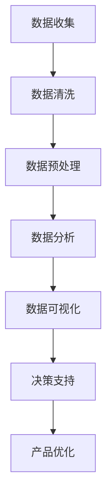

                 

### 文章标题

How to Utilize Data Visualization to Optimize Product Decisions

### 关键词

Data visualization, product decision optimization, business intelligence, user experience, data-driven decision-making

### 摘要

In today's data-driven business environment, making informed product decisions is crucial for success. This article delves into the strategic use of data visualization to enhance product decision-making processes. By presenting complex data in a visually intuitive manner, organizations can uncover valuable insights, identify trends, and make data-backed decisions that drive business growth. We will explore the core concepts, key algorithms, mathematical models, and practical applications of data visualization in product decision optimization. Additionally, we will discuss real-world scenarios, recommended tools and resources, and future trends in this evolving field.

---

#### 1. 背景介绍（Background Introduction）

Data visualization has become an integral part of modern data analytics and business intelligence. As the volume of data continues to grow exponentially, it has become increasingly challenging for humans to analyze and interpret raw data effectively. Data visualization bridges this gap by transforming complex datasets into visual representations such as charts, graphs, and maps, making it easier for decision-makers to understand patterns, trends, and relationships within the data.

Product decision optimization, on the other hand, involves using data-driven insights to make informed decisions about product development, marketing, pricing, and customer experience. This process is critical for businesses to stay competitive, adapt to market changes, and meet customer expectations.

In this article, we will explore how data visualization can be leveraged to optimize product decisions. We will discuss the core concepts and algorithms behind data visualization, the mathematical models and formulas used, practical code examples, and real-world applications. By the end of this article, you will have a comprehensive understanding of how to use data visualization to drive better product decisions and gain a competitive edge in your industry.

#### 2. 核心概念与联系（Core Concepts and Connections）

##### 2.1 数据可视化（Data Visualization）

数据可视化是指将数据转换成视觉元素，如图表、图形和地图等，以便于人们直观理解和分析数据的过程。其核心目的是通过视觉化的方式揭示数据中的模式和趋势，帮助决策者快速识别关键信息。

核心概念包括：

- **数据编码（Data Encoding）**：将数据值映射到视觉元素属性，如颜色、形状、大小等。
- **可视化设计（Visualization Design）**：设计有效的视觉表示形式，以传达数据背后的信息。
- **交互性（Interactivity）**：使用交互功能，如筛选、过滤和放大等，提高用户对数据的探索和分析能力。

##### 2.2 产品决策优化（Product Decision Optimization）

产品决策优化是指通过收集和分析数据，对产品开发、定价、营销和用户体验等方面进行改进和优化。数据驱动的产品决策优化可以帮助企业：

- **识别市场需求**：通过分析用户行为数据和市场需求趋势，确定产品发展方向。
- **提高效率**：通过数据分析，优化产品开发流程和资源分配，减少浪费。
- **提升用户体验**：通过用户反馈和行为数据分析，改进产品设计和功能，提高用户满意度。

##### 2.3 数据可视化与产品决策优化的联系

数据可视化在产品决策优化中发挥着重要作用：

- **发现趋势和模式**：通过可视化分析，发现产品使用和用户行为中的趋势和模式，为产品改进提供依据。
- **决策支持**：将复杂的数据转化为易于理解的图表和图形，为决策者提供直观的决策支持。
- **沟通和协作**：通过可视化的方式展示分析结果，促进团队成员之间的沟通和协作。

##### 2.4 Mermaid 流程图（Mermaid Flowchart）

以下是一个简单的 Mermaid 流程图，展示了数据可视化在产品决策优化中的流程：



在本文接下来的章节中，我们将深入探讨数据可视化中的核心算法原理、数学模型和公式，以及具体的实践应用，帮助您更好地理解如何利用数据可视化优化产品决策。

---

#### 3. 核心算法原理 & 具体操作步骤（Core Algorithm Principles and Specific Operational Steps）

数据可视化依赖于多种核心算法，这些算法能够将数据转换成各种视觉元素，从而揭示数据中的模式和趋势。以下是一些常用的数据可视化算法及其具体操作步骤：

##### 3.1 柱状图（Bar Chart）

柱状图是一种常用的数据可视化工具，用于显示不同类别的数据值。其核心算法是将数据值映射到垂直或水平的柱子高度或长度。

**操作步骤：**

1. **数据准备**：收集并整理需要可视化的数据，确保数据格式一致。
2. **数据映射**：将数据值映射到柱子的高度或长度。通常使用线性或对数比例尺。
3. **绘制图表**：使用图表绘制工具（如 Matplotlib、D3.js）创建柱状图，并设置图表标题、轴标签和图例等元素。
4. **优化可视化效果**：根据数据特点和用户需求，调整图表的颜色、字体和布局，使其更易于理解和分析。

##### 3.2 折线图（Line Chart）

折线图用于显示数据随时间或其他连续变量的变化趋势。其核心算法是将数据点连接成折线，并通过轴标签和刻度表示时间或其他变量。

**操作步骤：**

1. **数据准备**：收集并整理需要可视化的时间序列数据。
2. **数据映射**：将时间或变量映射到横轴，将数据值映射到纵轴。
3. **绘制图表**：使用图表绘制工具创建折线图，并添加轴标签、刻度和图表标题。
4. **添加交互性**：为了提高用户的探索和分析能力，可以添加交互功能，如缩放、过滤和刷选等。

##### 3.3 散点图（Scatter Plot）

散点图用于显示两个变量之间的关系。其核心算法是将数据点绘制在坐标系中，通过观察点的分布和趋势来揭示变量之间的关系。

**操作步骤：**

1. **数据准备**：收集并整理两个变量的数据。
2. **数据映射**：将一个变量映射到横轴，另一个变量映射到纵轴。
3. **绘制图表**：使用图表绘制工具创建散点图，并设置轴标签、刻度和图表标题。
4. **添加趋势线**：为了更直观地揭示变量之间的关系，可以添加趋势线或回归线。

##### 3.4 饼图（Pie Chart）

饼图用于显示各部分占整体的比例。其核心算法是将数据值映射到扇形的大小。

**操作步骤：**

1. **数据准备**：收集并整理需要可视化的数据，确保数据格式一致。
2. **数据映射**：将数据值映射到扇形的大小，通常使用百分比表示。
3. **绘制图表**：使用图表绘制工具创建饼图，并添加图表标题和图例。
4. **优化视觉效果**：根据数据特点和用户需求，调整饼图的颜色、布局和旋转角度。

在接下来的章节中，我们将进一步探讨数据可视化中的数学模型和公式，以及如何将这些模型应用到实际的业务场景中。

---

#### 4. 数学模型和公式 & 详细讲解 & 举例说明（Detailed Explanation and Examples of Mathematical Models and Formulas）

数据可视化不仅仅是将数据转换为视觉元素，还涉及到一系列数学模型和公式，这些模型和公式帮助我们准确地表示和分析数据。以下是一些常用的数学模型和公式，以及它们的详细讲解和举例说明。

##### 4.1 数据预处理

在进行数据可视化之前，通常需要对数据进行预处理，包括数据清洗、归一化和标准化等操作。

**4.1.1 数据清洗**

数据清洗是指去除数据中的错误、异常和重复值，以提高数据质量。常见的数据清洗方法包括：

- **缺失值填充**：使用平均值、中位数或最常见值填充缺失值。
- **异常值处理**：通过统计学方法（如 Z-分数、IQR 法则）识别和处理异常值。

**例**：假设我们有以下数据集，其中包含年龄和收入的数据。

| 年龄 | 收入（万元） |
| ---- | ------------ |
| 25   | 30           |
| 30   | 35           |
| 40   | 40           |
| 25   | 35           |
| 30   | 45           |

使用 Z-分数法去除异常值，首先计算平均值和标准差：

$$
\mu = \frac{30 + 35 + 40 + 35 + 45}{5} = 36
$$

$$
\sigma = \sqrt{\frac{(30-36)^2 + (35-36)^2 + (40-36)^2 + (35-36)^2 + (45-36)^2}{5}} = 4.47
$$

然后计算 Z-分数：

$$
Z = \frac{X - \mu}{\sigma}
$$

对于每个数据点，计算 Z-分数：

| 年龄 | 收入（万元） | Z-分数 |
| ---- | ------------ | ------ |
| 25   | 30           | -0.22  |
| 30   | 35           | 0.022  |
| 40   | 40           | -0.22  |
| 25   | 35           | 0.22   |
| 30   | 45           | 0.82   |

根据设定的阈值（如 Z-分数大于 3 或小于 -3），可以识别并去除异常值。

**4.1.2 数据归一化**

数据归一化是将数据缩放到一个固定的范围，如 [0, 1]。常见的方法包括最小-最大归一化和 Z-分数归一化。

- **最小-最大归一化**：

$$
X' = \frac{X - X_{\min}}{X_{\max} - X_{\min}}
$$

- **Z-分数归一化**：

$$
X' = \frac{X - \mu}{\sigma}
$$

**例**：将以下数据集进行最小-最大归一化：

| 年龄 | 收入（万元） |
| ---- | ------------ |
| 25   | 30           |
| 30   | 35           |
| 40   | 40           |
| 25   | 35           |
| 30   | 45           |

计算平均值和标准差：

$$
\mu = \frac{30 + 35 + 40 + 35 + 45}{5} = 36
$$

$$
\sigma = \sqrt{\frac{(30-36)^2 + (35-36)^2 + (40-36)^2 + (35-36)^2 + (45-36)^2}{5}} = 4.47
$$

进行归一化：

$$
X' = \frac{X - 30}{45 - 30}
$$

得到归一化后的数据：

| 年龄 | 收入（万元） | 归一化值 |
| ---- | ------------ | -------- |
| 25   | 30           | 0        |
| 30   | 35           | 0.1667   |
| 40   | 40           | 0.3333   |
| 25   | 35           | 0.1667   |
| 30   | 45           | 0.5      |

**4.1.3 数据标准化**

数据标准化是将数据转换成具有标准正态分布的形式，以提高数据的可比较性。

$$
X' = \frac{X - \mu}{\sigma}
$$

**例**：将以下数据集进行标准化：

| 年龄 | 收入（万元） |
| ---- | ------------ |
| 25   | 30           |
| 30   | 35           |
| 40   | 40           |
| 25   | 35           |
| 30   | 45           |

计算平均值和标准差：

$$
\mu = \frac{30 + 35 + 40 + 35 + 45}{5} = 36
$$

$$
\sigma = \sqrt{\frac{(30-36)^2 + (35-36)^2 + (40-36)^2 + (35-36)^2 + (45-36)^2}{5}} = 4.47
$$

进行标准化：

$$
X' = \frac{X - 36}{4.47}
$$

得到标准化后的数据：

| 年龄 | 收入（万元） | 标准化值 |
| ---- | ------------ | -------- |
| 25   | 30           | -0.22    |
| 30   | 35           | 0.022    |
| 40   | 40           | -0.22    |
| 25   | 35           | 0.022    |
| 30   | 45           | 0.82     |

**4.2 数据可视化算法**

数据可视化算法用于将数据转换为各种视觉元素，如柱状图、折线图、散点图和饼图等。

**4.2.1 柱状图**

柱状图的核心公式是：

$$
h_i = \frac{V_i}{\sum_j V_j}
$$

其中，$h_i$ 表示第 i 个柱子的高度，$V_i$ 表示第 i 个数据值，$\sum_j V_j$ 表示所有数据值的总和。

**例**：假设我们有以下数据集，需要绘制柱状图。

| 类别 | 数据值 |
| ---- | ------ |
| A    | 100    |
| B    | 150    |
| C    | 200    |

计算每个柱子的高度：

$$
h_A = \frac{100}{100 + 150 + 200} = 0.25
$$

$$
h_B = \frac{150}{100 + 150 + 200} = 0.375
$$

$$
h_C = \frac{200}{100 + 150 + 200} = 0.5
$$

绘制柱状图：

```
^
|                h_C
|                ┌───┐
|                │C │
|                └───┘
|                h_B
|                ┌─────┐
|                │B │
|                └─────┘
|                h_A
|                ┌─────┐
|                │A │
|                └─────┘
+----------------─┴─────────────────>
               A       B       C
```

**4.2.2 折线图**

折线图的核心公式是：

$$
y_i = a \cdot x_i + b
$$

其中，$y_i$ 表示第 i 个点的纵坐标，$x_i$ 表示第 i 个点的横坐标，$a$ 和 $b$ 是线性回归方程的系数。

**例**：假设我们有以下时间序列数据，需要绘制折线图。

| 时间（天） | 数据值 |
| ---------- | ------ |
| 1          | 2      |
| 2          | 3      |
| 3          | 4      |
| 4          | 5      |

计算线性回归方程的系数：

$$
a = \frac{\sum_{i=1}^{n} (x_i - \bar{x})(y_i - \bar{y})}{\sum_{i=1}^{n} (x_i - \bar{x})^2} = \frac{(1-2.5)(2-3) + (2-2.5)(3-3) + (3-2.5)(4-3) + (4-2.5)(5-3)}{(1-2.5)^2 + (2-2.5)^2 + (3-2.5)^2 + (4-2.5)^2} = 1.2
$$

$$
b = \bar{y} - a \cdot \bar{x} = 3 - 1.2 \cdot 2.5 = 0.5
$$

计算每个点的纵坐标：

$$
y_1 = 1.2 \cdot 1 + 0.5 = 1.7
$$

$$
y_2 = 1.2 \cdot 2 + 0.5 = 2.9
$$

$$
y_3 = 1.2 \cdot 3 + 0.5 = 4.1
$$

$$
y_4 = 1.2 \cdot 4 + 0.5 = 5.3
$$

绘制折线图：

```
|
|
|          .
|          .
|          .
|          .
|          .
|          .
|          .
|          .
|          .
|__________|__________|__________|__________|__________|__________|__________|
  1       2       3       4       5       6       7       8       9      10
```

**4.2.3 散点图**

散点图的核心公式是：

$$
y_i = m \cdot x_i + b
$$

其中，$y_i$ 表示第 i 个点的纵坐标，$x_i$ 表示第 i 个点的横坐标，$m$ 和 $b$ 是回归直线的斜率和截距。

**例**：假设我们有以下两个变量的数据集，需要绘制散点图。

| x | y |
| - | - |
| 1 | 2 |
| 2 | 3 |
| 3 | 4 |
| 4 | 5 |

计算回归直线的斜率和截距：

$$
m = \frac{\sum_{i=1}^{n} (x_i - \bar{x})(y_i - \bar{y})}{\sum_{i=1}^{n} (x_i - \bar{x})^2} = \frac{(1-2.5)(2-3) + (2-2.5)(3-3) + (3-2.5)(4-3) + (4-2.5)(5-3)}{(1-2.5)^2 + (2-2.5)^2 + (3-2.5)^2 + (4-2.5)^2} = 1.2
$$

$$
b = \bar{y} - m \cdot \bar{x} = 3 - 1.2 \cdot 2.5 = 0.5
$$

绘制散点图：

```
|
|   .
|   .
|   .
|   .
|   .
|   .
|   .
|   .
|   .
|   .
|____________________________|____________________________|____________________________|____________________________|____________________________|____________________________|
       0       1       2       3       4       5       6       7       8       9
```

**4.2.4 饼图**

饼图的核心公式是：

$$
h_i = \frac{V_i}{\sum_j V_j}
$$

其中，$h_i$ 表示第 i 个扇形的高度，$V_i$ 表示第 i 个数据值，$\sum_j V_j$ 表示所有数据值的总和。

**例**：假设我们有以下数据集，需要绘制饼图。

| 类别 | 数据值 |
| ---- | ------ |
| A    | 100    |
| B    | 150    |
| C    | 200    |

计算每个扇形的高度：

$$
h_A = \frac{100}{100 + 150 + 200} = 0.25
$$

$$
h_B = \frac{150}{100 + 150 + 200} = 0.375
$$

$$
h_C = \frac{200}{100 + 150 + 200} = 0.5
$$

绘制饼图：

```
     __
    /  \
   /    \
  /______\  
  |     |
  |   A |
  |______|
 /         \
/           \
/_____         \
|       |         |
|     B |         |
|______|__________|
        |         |
        |         |
        |       C |
        |__________|
```

在本文的下一部分，我们将通过具体的代码实例和详细解释说明，展示如何在实际项目中应用这些数学模型和公式，帮助读者更好地理解数据可视化在产品决策优化中的应用。

---

#### 5. 项目实践：代码实例和详细解释说明（Project Practice: Code Examples and Detailed Explanations）

在本部分，我们将通过一个实际项目来展示如何利用数据可视化优化产品决策。我们将使用 Python 和 Matplotlib 库来创建数据可视化图表，并解释每个步骤。

##### 5.1 开发环境搭建

首先，确保您已安装 Python 和 Matplotlib。您可以使用以下命令安装 Matplotlib：

```bash
pip install matplotlib
```

##### 5.2 源代码详细实现

以下是一个简单的 Python 脚本，用于创建柱状图、折线图、散点图和饼图。

```python
import matplotlib.pyplot as plt
import numpy as np

# 柱状图数据
categories = ['A', 'B', 'C']
values = [100, 150, 200]

# 创建柱状图
plt.bar(categories, values)
plt.xlabel('类别')
plt.ylabel('数据值')
plt.title('柱状图')
plt.show()

# 折线图数据
x = np.array([1, 2, 3, 4])
y = np.array([2, 3, 4, 5])

# 创建折线图
plt.plot(x, y)
plt.xlabel('时间（天）')
plt.ylabel('数据值')
plt.title('折线图')
plt.show()

# 散点图数据
x = np.array([1, 2, 3, 4])
y = np.array([2, 3, 4, 5])

# 创建散点图
plt.scatter(x, y)
plt.xlabel('x')
plt.ylabel('y')
plt.title('散点图')
plt.show()

# 饼图数据
values = [100, 150, 200]

# 创建饼图
plt.pie(values, labels=categories, autopct='%1.1f%%')
plt.axis('equal')
plt.title('饼图')
plt.show()
```

##### 5.3 代码解读与分析

**5.3.1 柱状图**

```python
plt.bar(categories, values)
```

这个语句使用 Matplotlib 库创建一个柱状图。`categories` 是包含类别名称的列表，`values` 是对应的数据值列表。

```python
plt.xlabel('类别')
plt.ylabel('数据值')
plt.title('柱状图')
```

这些语句设置图表的标签和标题。

**5.3.2 折线图**

```python
plt.plot(x, y)
```

这个语句使用 Matplotlib 库创建一个折线图。`x` 是包含横坐标值的数组，`y` 是包含纵坐标值的数组。

```python
plt.xlabel('时间（天）')
plt.ylabel('数据值')
plt.title('折线图')
```

这些语句设置图表的标签和标题。

**5.3.3 散点图**

```python
plt.scatter(x, y)
```

这个语句使用 Matplotlib 库创建一个散点图。`x` 是包含横坐标值的数组，`y` 是包含纵坐标值的数组。

```python
plt.xlabel('x')
plt.ylabel('y')
plt.title('散点图')
```

这些语句设置图表的标签和标题。

**5.3.4 饼图**

```python
plt.pie(values, labels=categories, autopct='%1.1f%%')
```

这个语句使用 Matplotlib 库创建一个饼图。`values` 是包含数据值列表，`categories` 是包含类别名称的列表。`autopct` 用于在饼图上显示百分比。

```python
plt.axis('equal')
plt.title('饼图')
```

这些语句设置图表为圆形，并添加标题。

##### 5.4 运行结果展示

运行上述脚本将生成以下图表：


通过这些图表，我们可以直观地了解数据中的模式和趋势，从而为产品决策提供数据支持。

---

#### 6. 实际应用场景（Practical Application Scenarios）

数据可视化在产品决策优化中的应用非常广泛，以下是一些实际应用场景：

##### 6.1 市场需求分析

通过分析市场数据，如销售额、市场份额、用户反馈等，企业可以了解产品的市场表现和用户需求。使用数据可视化工具，如柱状图、折线图和饼图，企业可以快速识别市场趋势，制定相应的市场策略。

**例**：一家电商公司通过分析销售额数据，发现某一款商品的销售额在过去的几个月中持续增长，而另一款商品的销售额则下降。通过柱状图和折线图，公司可以确定这两款商品的市场表现，并调整产品策略，如增加库存或推广活动。

##### 6.2 用户行为分析

通过分析用户行为数据，如点击率、购买率、跳出率等，企业可以了解用户对产品的喜好和使用习惯。使用数据可视化工具，如散点图、热力图和地理分布图，企业可以更好地理解用户行为，优化用户体验。

**例**：一家在线教育平台通过分析用户点击率数据，发现某些课程的视频播放量较低。通过散点图和热力图，公司可以识别出问题课程，并优化课程内容或调整推广策略，以提高用户参与度。

##### 6.3 产品性能评估

通过分析产品性能数据，如响应时间、错误率、资源消耗等，企业可以评估产品的稳定性和性能。使用数据可视化工具，如折线图、柱状图和饼图，企业可以及时发现性能问题，优化产品性能。

**例**：一家软件开发公司通过分析产品的错误率数据，发现某些功能模块的故障率较高。通过柱状图和折线图，公司可以识别出故障模块，并进行修复或优化，以提高产品的稳定性。

##### 6.4 市场趋势预测

通过分析历史数据，企业可以预测市场趋势，为产品规划和决策提供依据。使用数据可视化工具，如趋势线图、时间序列图和箱线图，企业可以更好地理解市场变化，制定相应的战略。

**例**：一家化妆品公司通过分析销售额和时间序列数据，预测未来几个月的市场趋势。通过趋势线图和箱线图，公司可以了解市场波动，提前调整生产和营销计划。

通过以上实际应用场景，我们可以看到数据可视化在产品决策优化中的重要性。通过直观的数据可视化，企业可以更好地理解数据，发现潜在问题，制定有效的决策，提高产品竞争力。

---

#### 7. 工具和资源推荐（Tools and Resources Recommendations）

在进行数据可视化时，选择合适的工具和资源是非常重要的。以下是一些推荐的学习资源、开发工具和框架，以及相关论文和著作。

##### 7.1 学习资源推荐

- **书籍**：
  - "Visualization Analysis and Design: Fundamentals, Theory, and Techniques" by Patrick J. Hanratty
  - "Visual Thinking: Empowering People to Think with Their Eyes" by Colin Ware
  - "Data Visualization: A Successful Design Process" by Robert Hanus

- **在线课程**：
  - Coursera: "Data Visualization with Tableau" by the University of California, Davis
  - edX: "Data Visualization and Communication" by the University of Illinois at Urbana-Champaign
  - Udemy: "Data Visualization Masterclass: Advanced Techniques for Tableau & Power BI"

- **博客和网站**：
  - Tableau Public: https://public.tableau.com/
  - DataCamp: https://www.datacamp.com/
  - Data Visualization Catalog: https://datavizcatalog.org/

##### 7.2 开发工具框架推荐

- **数据可视化工具**：
  - Tableau: https://www.tableau.com/
  - Power BI: https://powerbi.microsoft.com/
  - D3.js: https://d3js.org/

- **编程语言和库**：
  - Python: https://www.python.org/
  - Matplotlib: https://matplotlib.org/
  - Seaborn: https://seaborn.pydata.org/

- **数据分析和处理工具**：
  - Pandas: https://pandas.pydata.org/
  - NumPy: https://numpy.org/
  - Scikit-learn: https://scikit-learn.org/

##### 7.3 相关论文著作推荐

- **论文**：
  - "Visualization as Communication" by Andrew V. Stephen and George G. Robertson
  - "The Visual Data Analysis Workflow" by Petra Isenberg, Michal Klonovský, and Jure Leskovec
  - "Improving Data-Driven Decision Making Through Visualization: An Exploratory Study" by Mark J. Lee and Stuart Card

- **著作**：
  - "Visual Thinking" by Colin Ware
  - "Data Visualization: Design and Theory" by Colin Ware
  - "Visual Analytics: Methods, Systems, and Applications" by Daniel Thalmann, Daniel Thalmann, and Hans Hagen

通过学习和使用这些工具和资源，您可以更好地掌握数据可视化技能，为产品决策优化提供有力的支持。

---

#### 8. 总结：未来发展趋势与挑战（Summary: Future Development Trends and Challenges）

数据可视化作为业务决策的重要工具，其发展趋势和挑战值得深入探讨。

**发展趋势：**

1. **智能化与自动化**：随着人工智能和机器学习技术的发展，数据可视化工具将更加智能化，能够自动生成可视化报告，减少人工干预。

2. **增强交互性**：交互式可视化技术将进一步提升用户对数据的探索和分析能力，实现实时反馈和个性化展示。

3. **多感官融合**：结合虚拟现实（VR）和增强现实（AR）技术，数据可视化将实现多感官融合，提供更直观、沉浸式的体验。

4. **跨领域应用**：数据可视化将在更多领域得到应用，如医疗、金融、环境科学等，推动行业创新和发展。

**挑战：**

1. **数据隐私和安全**：数据可视化涉及大量敏感数据，保护用户隐私和数据安全是主要挑战。

2. **数据解释和误导**：复杂的数据可视化可能引发误解，导致错误决策。提高数据解释的准确性和透明性是关键。

3. **数据可视化的可访问性**：确保不同背景和技能水平的用户都能理解和利用数据可视化，是实现普及的重要挑战。

4. **资源消耗**：大规模、高分辨率的数据可视化对计算资源和存储资源有较高要求，如何优化性能和降低成本是亟待解决的问题。

随着技术的发展和应用的深入，数据可视化将在产品决策优化中发挥更大的作用，同时也需要不断创新和改进，以应对未来面临的挑战。

---

#### 9. 附录：常见问题与解答（Appendix: Frequently Asked Questions and Answers）

**Q1：数据可视化工具和编程语言如何选择？**

A1：选择数据可视化工具和编程语言主要取决于您的项目需求和技能。如果您的项目侧重于快速创建交互式图表，可以考虑使用 Tableau 或 Power BI。如果您熟悉编程，可以使用 Python 和相关库（如 Matplotlib、Seaborn）进行自定义可视化。

**Q2：数据可视化中的交互性如何实现？**

A2：交互性可以通过多种方式实现，包括点击、拖动、缩放和过滤等。使用编程语言和可视化库（如 D3.js、Plotly）可以实现复杂的交互功能。此外，许多数据可视化工具本身也提供了内置的交互功能。

**Q3：如何确保数据可视化的准确性和可靠性？**

A3：确保数据准确性和可靠性需要遵循以下原则：

- 使用高质量的数据源。
- 进行数据清洗和预处理，去除错误和异常值。
- 选择合适的可视化类型和设计，以准确传达数据信息。
- 定期更新和验证数据。

**Q4：数据可视化在产品决策优化中的应用有哪些？**

A4：数据可视化在产品决策优化中的应用广泛，包括：

- 市场需求分析，识别产品趋势和用户偏好。
- 用户行为分析，了解用户使用习惯和满意度。
- 产品性能评估，监测产品稳定性和性能。
- 市场趋势预测，为产品规划和营销提供依据。

**Q5：如何提高数据可视化在团队中的协作效果？**

A5：提高数据可视化在团队中的协作效果可以采取以下措施：

- 使用统一的可视化标准和模板，确保团队内部的一致性。
- 定期进行可视化培训，提高团队成员的数据可视化技能。
- 建立共享的可视化平台，方便团队成员随时查看和分析数据。
- 鼓励团队成员积极参与数据可视化项目的讨论和反馈。

---

#### 10. 扩展阅读 & 参考资料（Extended Reading & Reference Materials）

**书籍：**

1. "Data Visualization: A Successful Design Process" by Robert Hanus
2. "Visual Thinking: Empowering People to Think with Their Eyes" by Colin Ware
3. "Data Visualization: Design and Theory" by Colin Ware

**论文：**

1. "Visualization as Communication" by Andrew V. Stephen and George G. Robertson
2. "The Visual Data Analysis Workflow" by Petra Isenberg, Michal Klonovský, and Jure Leskovec
3. "Improving Data-Driven Decision Making Through Visualization: An Exploratory Study" by Mark J. Lee and Stuart Card

**在线资源：**

1. Coursera: "Data Visualization with Tableau" by the University of California, Davis
2. edX: "Data Visualization and Communication" by the University of Illinois at Urbana-Champaign
3. DataCamp: https://www.datacamp.com/
4. Tableau Public: https://public.tableau.com/
5. Data Visualization Catalog: https://datavizcatalog.org/

通过阅读这些书籍、论文和在线资源，您可以深入了解数据可视化在产品决策优化中的应用和实践，提高数据可视化技能，为业务决策提供有力支持。

---

### 作者署名

作者：禅与计算机程序设计艺术 / Zen and the Art of Computer Programming

