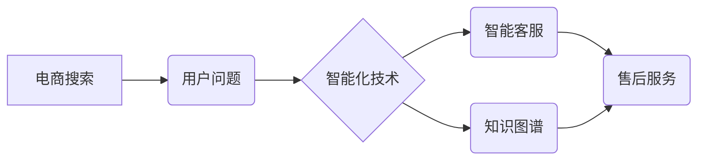

                 

## 电商搜索中的售后服务智能化技术与应用

> 关键词：电商搜索、售后服务、智能化技术、自然语言处理、机器学习、知识图谱、用户体验

## 1. 背景介绍

随着电商行业的蓬勃发展，用户对商品的购买体验越来越重视。传统的售后服务模式往往存在响应速度慢、信息获取困难、服务体验差等问题，难以满足用户日益增长的需求。智能化技术作为一种颠覆性的创新力量，为电商售后服务带来了新的机遇。

智能化售后服务旨在通过人工智能技术，提升售后服务的效率、准确性和用户体验。它可以帮助电商平台解决以下问题：

* **快速响应用户问题:** 智能客服机器人可以24小时在线，快速响应用户咨询，提供即时解决方案。
* **精准匹配用户需求:** 基于用户历史购买记录、浏览行为和反馈信息，智能系统可以精准匹配用户需求，提供个性化的售后服务。
* **自动化处理常见问题:** 智能系统可以自动处理一些常见的问题，例如退换货、物流查询等，减轻人工客服的负担。
* **提升用户满意度:** 智能化售后服务可以提供更便捷、更准确、更个性化的服务体验，提升用户满意度。

## 2. 核心概念与联系

### 2.1 核心概念

* **电商搜索:** 指用户在电商平台上输入关键词或商品信息，搜索相关商品的过程。
* **售后服务:** 指商品售出后，为用户提供相关的服务，例如退换货、维修、咨询等。
* **智能化技术:** 指利用人工智能、机器学习、自然语言处理等技术，实现系统自动学习、决策和执行任务的能力。

### 2.2 架构关系



## 3. 核心算法原理 & 具体操作步骤

### 3.1 算法原理概述

智能化售后服务的核心算法主要包括：

* **自然语言处理 (NLP):** 用于理解用户自然语言的输入，例如文本、语音等。
* **机器学习 (ML):** 用于训练模型，识别用户需求、预测用户行为、自动处理问题等。
* **知识图谱 (KG):** 用于存储和管理商品信息、售后服务规则、用户历史数据等知识，为智能系统提供决策支持。

### 3.2 算法步骤详解

1. **用户提问:** 用户通过文本、语音等方式提出售后服务问题。
2. **自然语言理解:** NLP算法对用户提问进行分析，识别关键词、意图和实体。
3. **知识图谱查询:** 根据用户提问的关键词和意图，KG算法从知识图谱中查询相关信息，例如商品属性、售后服务规则、用户历史记录等。
4. **机器学习决策:** ML模型根据用户提问、知识图谱查询结果和历史数据，预测用户需求，并给出相应的解决方案。
5. **智能回复:** 智能系统根据决策结果，生成文本、语音或其他形式的回复，提供给用户。

### 3.3 算法优缺点

**优点:**

* **提高效率:** 自动化处理常见问题，减轻人工客服负担。
* **提升准确性:** 基于数据分析和机器学习，提供更精准的解决方案。
* **个性化服务:** 根据用户历史数据和行为，提供个性化的售后服务体验。

**缺点:**

* **数据依赖:** 需要大量的数据进行训练，才能保证算法的准确性和可靠性。
* **理解复杂问题:** 对于复杂、模糊的售后问题，智能系统可能难以理解和解决。
* **缺乏情感理解:** 智能系统缺乏情感理解能力，难以提供人性化的服务体验。

### 3.4 算法应用领域

* **电商平台:** 提供智能客服、商品退换货、物流查询等售后服务。
* **金融机构:** 提供智能理财咨询、信用卡服务、贷款申请等售后服务。
* **医疗机构:** 提供智能问诊、预约挂号、药品查询等售后服务。
* **教育机构:** 提供智能答疑、课程辅导、学习资源推荐等售后服务。

## 4. 数学模型和公式 & 详细讲解 & 举例说明

### 4.1 数学模型构建

智能化售后服务系统可以构建一个基于用户需求预测的数学模型，例如：

$$
P(Y|X) = \frac{e^{W^T \cdot X + b}}{ \sum_{k=1}^{K} e^{W^T_k \cdot X + b_k}}
$$

其中：

* $P(Y|X)$ 表示用户需求预测概率，$Y$ 为用户需求类别，$X$ 为用户特征向量。
* $W$ 为权重向量，$b$ 为偏置项。
* $K$ 为用户需求类别总数。

### 4.2 公式推导过程

该公式基于softmax回归模型，用于多分类问题。其核心思想是将用户特征向量映射到每个需求类别的概率空间，并通过softmax函数归一化，得到每个类别对应的概率分布。

### 4.3 案例分析与讲解

假设用户特征向量 $X$ 包含用户年龄、性别、购买历史、浏览记录等信息。

通过训练模型，我们可以得到每个需求类别的权重向量 $W$ 和偏置项 $b$。

当用户提出售后问题时，系统会根据用户的特征向量 $X$ 计算每个需求类别的预测概率 $P(Y|X)$。

例如，如果用户提问“如何退换货？”，系统会预测用户需求类别为“退换货服务”。

## 5. 项目实践：代码实例和详细解释说明

### 5.1 开发环境搭建

* 操作系统: Ubuntu 20.04
* Python 版本: 3.8
* 依赖库: TensorFlow, NLTK, SpaCy, PyTorch

### 5.2 源代码详细实现

```python
# 导入必要的库
import tensorflow as tf
from tensorflow.keras.models import Sequential
from tensorflow.keras.layers import Embedding, LSTM, Dense

# 定义模型结构
model = Sequential()
model.add(Embedding(input_dim=vocab_size, output_dim=embedding_dim))
model.add(LSTM(units=128))
model.add(Dense(units=num_classes, activation='softmax'))

# 编译模型
model.compile(optimizer='adam', loss='sparse_categorical_crossentropy', metrics=['accuracy'])

# 训练模型
model.fit(X_train, y_train, epochs=10, batch_size=32)

# 预测用户需求
prediction = model.predict(X_test)
```

### 5.3 代码解读与分析

* **Embedding层:** 将用户输入的文本序列转换为稠密的向量表示。
* **LSTM层:** 用于捕捉文本序列中的长距离依赖关系。
* **Dense层:** 全连接层，用于将 LSTM 输出映射到用户需求类别概率空间。
* **softmax激活函数:** 将输出值归一化到0到1之间，得到每个类别对应的概率分布。

### 5.4 运行结果展示

训练完成后，可以评估模型的性能，例如准确率、召回率、F1-score等。

## 6. 实际应用场景

### 6.1 电商平台售后服务

* **智能客服机器人:** 回答用户常见问题，例如退换货流程、物流查询、商品信息等。
* **个性化推荐:** 根据用户历史购买记录和售后服务需求，推荐相关商品或服务。
* **自动处理退换货:** 自动审核退换货申请，并安排物流配送。

### 6.2 其他行业应用

* **金融机构:** 提供智能理财咨询、信用卡服务、贷款申请等售后服务。
* **医疗机构:** 提供智能问诊、预约挂号、药品查询等售后服务。
* **教育机构:** 提供智能答疑、课程辅导、学习资源推荐等售后服务。

### 6.4 未来应用展望

随着人工智能技术的不断发展，智能化售后服务将更加智能化、个性化和自动化。

* **多模态交互:** 支持文本、语音、图像等多模态交互，提供更丰富的用户体验。
* **情感识别:** 识别用户的情感状态，提供更人性化的服务。
* **主动服务:** 基于用户行为和数据分析，主动提供预emptive service，例如提醒用户商品保修到期。

## 7. 工具和资源推荐

### 7.1 学习资源推荐

* **书籍:**
    * 《深度学习》
    * 《自然语言处理》
    * 《机器学习实战》
* **在线课程:**
    * Coursera
    * edX
    * Udacity

### 7.2 开发工具推荐

* **Python:** 
* **TensorFlow:** 深度学习框架
* **PyTorch:** 深度学习框架
* **NLTK:** 自然语言处理库
* **SpaCy:** 自然语言处理库

### 7.3 相关论文推荐

* **BERT: Pre-training of Deep Bidirectional Transformers for Language Understanding**
* **Attention Is All You Need**
* **Knowledge Graph Embedding: A Survey**

## 8. 总结：未来发展趋势与挑战

### 8.1 研究成果总结

智能化售后服务技术取得了显著的进展，能够有效提升售后服务的效率、准确性和用户体验。

### 8.2 未来发展趋势

* **更智能化的服务:** 利用更先进的人工智能算法，实现更智能、更个性化的售后服务。
* **多模态交互:** 支持文本、语音、图像等多模态交互，提供更丰富的用户体验。
* **主动服务:** 基于用户行为和数据分析，主动提供预emptive service，例如提醒用户商品保修到期。

### 8.3 面临的挑战

* **数据质量:** 智能化售后服务依赖于高质量的数据，数据标注和清洗工作仍然是一个挑战。
* **模型解释性:** 许多深度学习模型的决策过程难以解释，这可能会导致用户对服务的信任度降低。
* **伦理问题:** 智能化售后服务可能会涉及到用户隐私和数据安全等伦理问题，需要谨慎处理。

### 8.4 研究展望

未来，智能化售后服务技术将继续朝着更智能、更个性化、更安全的方向发展。

## 9. 附录：常见问题与解答

* **Q1: 智能客服机器人可以解决所有售后问题吗？**

* **A1:** 目前，智能客服机器人仍然无法解决所有售后问题，对于复杂、模糊的问题，可能需要人工客服介入。

* **Q2: 智能化售后服务会取代人工客服吗？**

* **A2:** 智能化售后服务可以减轻人工客服的负担，但不会完全取代人工客服。人工客服仍然在一些需要情感理解和复杂问题解决的场景中发挥着重要作用。


作者：禅与计算机程序设计艺术 / Zen and the Art of Computer Programming 
<end_of_turn>

