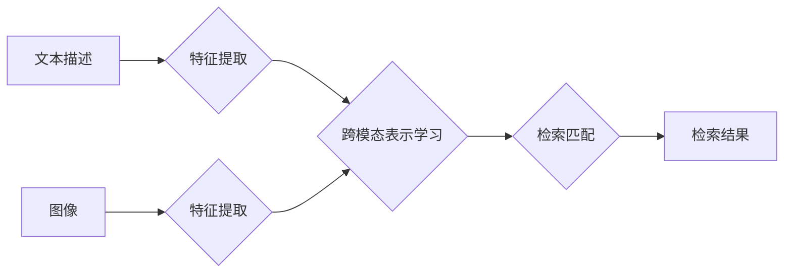

                 

## 电商搜索中的多模态商品检索：跨模态表示对齐技术

> 关键词：多模态检索、跨模态表示对齐、商品检索、电商搜索、深度学习

## 1. 背景介绍

随着电商平台的蓬勃发展，商品检索已成为用户体验的关键环节。传统的文本检索方法难以满足用户多样化的搜索需求，例如用户可能通过图片、语音等多种方式进行商品查询。因此，多模态商品检索应运而生，旨在利用商品的多模态信息（如文本、图像、视频等）进行更精准、更智能的检索。

跨模态表示对齐技术是多模态商品检索的核心技术之一。其目标是将不同模态的商品表示映射到同一个语义空间，使得不同模态的商品信息能够相互理解和匹配。

## 2. 核心概念与联系

### 2.1  多模态商品检索

多模态商品检索是指利用商品的多模态信息（如文本描述、图像、视频等）进行检索的技术。它旨在克服传统文本检索的局限性，提供更丰富的搜索体验。

### 2.2  跨模态表示对齐

跨模态表示对齐是指将不同模态的商品表示映射到同一个语义空间的技术。其目标是使得不同模态的商品信息能够相互理解和匹配。

### 2.3  相关技术

* **深度学习:** 深度学习在多模态表示学习方面取得了显著进展，例如卷积神经网络（CNN）用于图像特征提取，循环神经网络（RNN）用于文本特征提取。
* **注意力机制:** 注意力机制可以帮助模型关注不同模态信息中的关键部分，提高检索的准确性。
* **三元组学习:** 三元组学习可以用于学习商品之间的关系，例如“商品A属于类别B”。

**Mermaid 流程图**



## 3. 核心算法原理 & 具体操作步骤

### 3.1  算法原理概述

跨模态表示对齐技术通常采用以下步骤：

1. **特征提取:** 利用深度学习模型提取不同模态的商品特征。
2. **跨模态表示学习:** 将不同模态的特征映射到同一个语义空间，学习跨模态表示。
3. **检索匹配:** 利用学习到的跨模态表示进行检索匹配，找到与用户查询最相似的商品。

### 3.2  算法步骤详解

1. **文本特征提取:** 使用预训练的语言模型（如BERT、RoBERTa）对商品文本描述进行编码，得到文本特征向量。

2. **图像特征提取:** 使用预训练的图像识别模型（如ResNet、VGG）对商品图像进行编码，得到图像特征向量。

3. **跨模态表示学习:**

   * **共享表示学习:** 使用一个共享的深度学习模型对文本和图像特征进行编码，学习一个共同的语义空间。
   * **对齐学习:** 使用一个专门的跨模态对齐网络，学习将文本和图像特征映射到同一个语义空间。

4. **检索匹配:**

   * **余弦相似度:** 计算用户查询与商品跨模态表示之间的余弦相似度，进行检索匹配。
   * **基于距离的检索:** 计算用户查询与商品跨模态表示之间的距离，进行检索匹配。

### 3.3  算法优缺点

**优点:**

* 能够利用商品的多模态信息进行检索，提高检索的准确性和效率。
* 可以提供更丰富的搜索体验，例如用户可以通过图片搜索商品。

**缺点:**

* 需要大量的训练数据，训练成本较高。
* 跨模态表示学习是一个复杂的任务，需要复杂的模型架构和训练策略。

### 3.4  算法应用领域

* **电商搜索:** 提高商品检索的准确性和效率。
* **图像检索:** 通过图像搜索商品、图片、视频等。
* **多媒体内容分析:** 分析和理解多媒体内容中的语义信息。

## 4. 数学模型和公式 & 详细讲解 & 举例说明

### 4.1  数学模型构建

假设我们有文本描述 $T$ 和图像 $I$ 两个模态的商品信息，我们需要学习一个跨模态表示 $Z$，使得 $Z(T)$ 和 $Z(I)$ 在同一个语义空间中接近。

我们可以使用以下数学模型来构建跨模态表示：

$$
Z(T) = f_T(T)
$$

$$
Z(I) = f_I(I)
$$

其中，$f_T$ 和 $f_I$ 分别是文本和图像特征提取模型，它们将文本描述和图像映射到一个特征空间。

### 4.2  公式推导过程

为了学习跨模态表示，我们需要定义一个损失函数，衡量 $Z(T)$ 和 $Z(I)$ 之间的距离。常用的损失函数包括：

* **欧氏距离:**

$$
L_{euclidean} = ||Z(T) - Z(I)||^2
$$

* **余弦相似度:**

$$
L_{cosine} = 1 - \frac{Z(T) \cdot Z(I)}{||Z(T)|| ||Z(I)||}
$$

其中，$\cdot$ 表示点积，$||\cdot||$ 表示欧几里得范数。

### 4.3  案例分析与讲解

假设我们有一个商品描述为“红色苹果”的商品，对应的图像是一个红色的苹果。我们可以使用上述模型和损失函数来学习跨模态表示。

首先，使用预训练的语言模型对“红色苹果”进行编码，得到文本特征向量 $Z(T)$。然后，使用预训练的图像识别模型对苹果图像进行编码，得到图像特征向量 $Z(I)$。

接下来，我们可以使用欧氏距离或余弦相似度来衡量 $Z(T)$ 和 $Z(I)$ 之间的距离。如果距离较小，则表示这两个表示是相似的，说明模型成功地学习了跨模态表示。

## 5. 项目实践：代码实例和详细解释说明

### 5.1  开发环境搭建

* Python 3.7+
* TensorFlow 2.x 或 PyTorch 1.x
* CUDA 和 cuDNN (可选，用于GPU加速)

### 5.2  源代码详细实现

```python
# 导入必要的库
import tensorflow as tf

# 定义文本特征提取模型
class TextEncoder(tf.keras.Model):
    def __init__(self):
        super(TextEncoder, self).__init__()
        self.bert = tf.keras.applications.BERTModel.from_pretrained('bert-base-uncased')

    def call(self, inputs):
        return self.bert(inputs)[0]

# 定义图像特征提取模型
class ImageEncoder(tf.keras.Model):
    def __init__(self):
        super(ImageEncoder, self).__init__()
        self.resnet = tf.keras.applications.ResNet50(include_top=False, weights='imagenet')

    def call(self, inputs):
        return self.resnet(inputs)

# 定义跨模态对齐网络
class CrossModalAlignment(tf.keras.Model):
    def __init__(self):
        super(CrossModalAlignment, self).__init__()
        self.text_projection = tf.keras.layers.Dense(128)
        self.image_projection = tf.keras.layers.Dense(128)
        self.alignment_layer = tf.keras.layers.Dot(axes=1)

    def call(self, text_features, image_features):
        text_features = self.text_projection(text_features)
        image_features = self.image_projection(image_features)
        alignment_score = self.alignment_layer([text_features, image_features])
        return alignment_score

# 定义损失函数
def cross_modal_loss(text_features, image_features, alignment_score):
    return tf.reduce_mean(tf.square(alignment_score - 1))

# 实例化模型
text_encoder = TextEncoder()
image_encoder = ImageEncoder()
cross_modal_alignment = CrossModalAlignment()

# 训练模型
# ...

```

### 5.3  代码解读与分析

* **文本特征提取模型:** 使用预训练的BERT模型对文本描述进行编码，得到文本特征向量。
* **图像特征提取模型:** 使用预训练的ResNet模型对图像进行编码，得到图像特征向量。
* **跨模态对齐网络:** 使用一个全连接层将文本和图像特征映射到同一个语义空间，并使用点积计算跨模态对齐分数。
* **损失函数:** 使用均方误差损失函数，最小化跨模态对齐分数与1之间的差值。

### 5.4  运行结果展示

* 训练完成后，可以使用模型对新的商品进行跨模态检索。
* 可以通过评估指标（例如MAP、MRR）来评估模型的性能。

## 6. 实际应用场景

### 6.1  电商搜索

* 用户可以通过图片搜索商品，例如上传一张衣服图片，搜索类似的衣服。
* 用户可以通过文本描述和图片组合进行搜索，例如搜索“红色长裙”并上传一张红色长裙的图片。

### 6.2  图像检索

* 通过图片搜索相似的图片，例如搜索一张风景图片，找到其他类似的风景图片。
* 通过图片搜索相关信息，例如搜索一张动物图片，找到该动物的名称、分类、习性等信息。

### 6.3  多媒体内容分析

* 分析视频中的物体和事件，例如识别视频中的人物、车辆、场景等。
* 分析音频中的语音和音乐，例如识别说话者的性别、年龄、情绪等。

### 6.4  未来应用展望

* **更精准的商品推荐:** 基于用户的多模态行为，提供更精准的商品推荐。
* **个性化的购物体验:** 根据用户的喜好和需求，提供个性化的购物体验。
* **增强现实购物:** 利用增强现实技术，将商品虚拟展示在用户家中，帮助用户更好地了解商品。

## 7. 工具和资源推荐

### 7.1  学习资源推荐

* **书籍:**
    * Deep Learning with Python by Francois Chollet
    * Hands-On Machine Learning with Scikit-Learn, Keras & TensorFlow by Aurélien Géron
* **在线课程:**
    * Deep Learning Specialization by Andrew Ng (Coursera)
    * Fast.ai Practical Deep Learning for Coders

### 7.2  开发工具推荐

* **TensorFlow:** https://www.tensorflow.org/
* **PyTorch:** https://pytorch.org/
* **Keras:** https://keras.io/

### 7.3  相关论文推荐

* **Show, Attend and Tell: Neural Image Captioning with Visual Attention** by Xu et al. (2015)
* **Multimodal Deep Learning: A Survey** by Kiela et al. (2018)
* **Cross-Modal Retrieval: A Survey** by Wang et al. (2020)

## 8. 总结：未来发展趋势与挑战

### 8.1  研究成果总结

跨模态表示对齐技术在多模态商品检索领域取得了显著进展，能够有效地利用商品的多模态信息进行检索，提高检索的准确性和效率。

### 8.2  未来发展趋势

* **更强大的模型架构:** 研究更强大的跨模态表示学习模型，例如Transformer-based模型。
* **更丰富的模态信息:** 融合更多模态信息，例如音频、视频等，进行更全面的商品检索。
* **个性化检索:** 基于用户的个性化偏好和需求，提供更个性化的商品检索服务。

### 8.3  面临的挑战

* **数据稀缺:** 跨模态数据往往稀缺，难以训练高质量的模型。
* **模态对齐难:** 不同模态的语义表达方式不同，跨模态对齐仍然是一个挑战。
* **计算成本高:** 训练大型跨模态模型需要大量的计算资源。

### 8.4  研究展望

未来，跨模态表示对齐技术将继续朝着更精准、更智能、更个性化的方向发展，为用户提供更丰富的购物体验。


## 9. 附录：常见问题与解答

**Q1: 跨模态表示对齐技术与传统的文本检索有什么区别？**

**A1:** 传统的文本检索只利用商品的文本描述进行检索，而跨模态表示对齐技术能够利用商品的多模态信息（如文本、图像、视频等），提供更精准、更丰富的检索结果。

**Q2: 如何评估跨模态表示对齐技术的性能？**

**A2:** 常用的评估指标包括MAP（Mean Average Precision）、MRR（Mean Reciprocal Rank）等。

**Q3: 跨模态表示对齐技术有哪些应用场景？**

**A3:** 跨模态表示对齐技术广泛应用于电商搜索、图像检索、多媒体内容分析等领域。


作者：禅与计算机程序设计艺术 / Zen and the Art of Computer Programming 
<end_of_turn>

