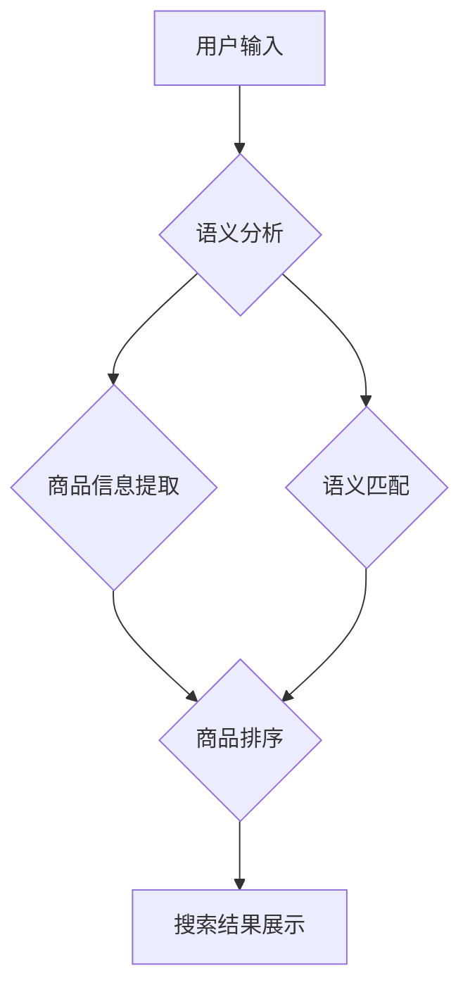

                 

## 电商搜索中的语义匹配与排序技术

> 关键词：语义匹配、排序算法、电商搜索、自然语言处理、信息检索、推荐系统、机器学习

## 1. 背景介绍

电商平台作为现代商业的重要组成部分，其搜索引擎扮演着至关重要的角色。用户通过搜索引擎查找心仪商品，而搜索引擎需要精准理解用户意图，并返回最相关的商品结果。传统的基于关键词匹配的搜索方式往往难以满足用户日益复杂的搜索需求，因为用户搜索词语可能存在歧义、同义词、短语等多种情况。因此，语义匹配与排序技术应运而生，旨在更深入地理解用户意图，提供更精准、更智能的搜索体验。

随着电商平台的规模不断扩大，用户搜索行为日益复杂，搜索引擎面临着新的挑战：

* **海量商品数据**: 电商平台拥有海量商品数据，如何快速高效地检索相关商品成为一个难题。
* **用户搜索行为多样化**: 用户搜索词语可能存在歧义、同义词、短语等多种情况，传统的关键词匹配方式难以准确理解用户意图。
* **个性化需求**: 不同用户的搜索需求和偏好不同，如何提供个性化的搜索结果是一个关键问题。

语义匹配与排序技术能够有效解决这些问题，提升电商平台搜索引擎的性能和用户体验。

## 2. 核心概念与联系

语义匹配与排序技术的核心在于理解用户搜索词语的语义含义，并将其与商品信息进行匹配和排序。

**2.1 语义匹配**

语义匹配是指将两个或多个文本片段进行比较，判断其语义上的相似度。在电商搜索中，语义匹配主要用于理解用户搜索词语的含义，并将其与商品标题、描述、属性等信息进行匹配。

**2.2 排序算法**

排序算法是指根据特定规则对数据进行排序。在电商搜索中，排序算法用于根据用户搜索词语和商品信息的语义相似度，对搜索结果进行排序，并将最相关的商品显示在最前面。

**2.3 核心架构**

电商搜索中的语义匹配与排序技术通常采用以下架构：



**2.3.1 语义分析**

语义分析是指对用户输入的搜索词语进行分析，提取其关键信息，例如关键词、短语、意图等。常用的语义分析技术包括词性标注、依存句法分析、命名实体识别等。

**2.3.2 商品信息提取**

商品信息提取是指从商品数据库中提取与用户搜索词语相关的商品信息，例如商品标题、描述、属性、价格等。

**2.3.3 语义匹配**

语义匹配是指将用户输入的搜索词语与商品信息进行比较，判断其语义上的相似度。常用的语义匹配技术包括词向量模型、文本相似度算法、知识图谱等。

**2.3.4 商品排序**

商品排序是指根据用户搜索词语和商品信息的语义相似度，对搜索结果进行排序，并将最相关的商品显示在最前面。常用的商品排序算法包括BM25、TF-IDF、深度学习排序等。

**2.3.5 搜索结果展示**

搜索结果展示是指将排序后的商品信息以用户易于理解的方式展示出来，例如列表、卡片等。

## 3. 核心算法原理 & 具体操作步骤

### 3.1 算法原理概述

在电商搜索中，语义匹配与排序技术通常采用基于机器学习的算法，例如深度学习排序算法。这些算法能够学习用户搜索行为和商品信息的语义关系，并根据学习到的知识对搜索结果进行排序。

### 3.2 算法步骤详解

**3.2.1 数据预处理**

首先需要对用户搜索词语和商品信息进行预处理，例如去除停用词、词干化、分词等。

**3.2.2 特征提取**

然后需要提取用户搜索词语和商品信息的特征，例如词向量、TF-IDF、商品属性等。

**3.2.3 模型训练**

使用训练数据训练深度学习排序模型，例如深度神经网络、梯度提升树等。

**3.2.4 模型评估**

使用测试数据评估模型的性能，例如准确率、召回率、NDCG等。

**3.2.5 模型部署**

将训练好的模型部署到线上环境，用于对用户搜索请求进行排序。

### 3.3 算法优缺点

**优点:**

* 能够更准确地理解用户搜索意图。
* 能够提供更个性化的搜索结果。
* 能够不断学习和优化，提升搜索引擎的性能。

**缺点:**

* 需要大量的训练数据。
* 模型训练和部署成本较高。
* 对数据质量要求较高。

### 3.4 算法应用领域

语义匹配与排序技术广泛应用于电商搜索、信息检索、推荐系统等领域。

## 4. 数学模型和公式 & 详细讲解 & 举例说明

### 4.1 数学模型构建

在深度学习排序算法中，通常使用以下数学模型：

**4.1.1  点积模型**

点积模型是一种简单的排序模型，它将用户搜索词语和商品信息的特征向量进行点积运算，得到一个得分，然后根据得分对商品进行排序。

$$
score = \mathbf{u} \cdot \mathbf{v}
$$

其中，$\mathbf{u}$ 是用户搜索词语的特征向量，$\mathbf{v}$ 是商品信息的特征向量。

**4.1.2  加权点积模型**

加权点积模型是在点积模型的基础上，对特征向量进行加权，以提高模型的表达能力。

$$
score = \sum_{i=1}^{n} w_i \mathbf{u}_i \cdot \mathbf{v}_i
$$

其中，$w_i$ 是第 $i$ 个特征的权重，$\mathbf{u}_i$ 和 $\mathbf{v}_i$ 分别是用户搜索词语和商品信息的第 $i$ 个特征向量。

**4.1.3  神经网络模型**

神经网络模型是一种更复杂的排序模型，它可以学习用户搜索行为和商品信息的复杂语义关系。

### 4.2 公式推导过程

神经网络模型的公式推导过程比较复杂，这里不再详细展开。

### 4.3 案例分析与讲解

假设用户搜索词语为 "苹果手机"，商品信息包括商品标题 "iPhone 13 Pro"，商品描述 "新款苹果手机，配备 A15 芯片"，商品属性 "品牌: 苹果，型号: iPhone 13 Pro，颜色: 深空灰色"。

使用加权点积模型进行语义匹配，可以根据用户搜索词语和商品信息的特征向量，计算出它们的相似度得分。

## 5. 项目实践：代码实例和详细解释说明

### 5.1 开发环境搭建

* Python 3.x
* TensorFlow 或 PyTorch
* NLTK 或 spaCy

### 5.2 源代码详细实现

```python
# 导入必要的库
import tensorflow as tf

# 定义用户搜索词语和商品信息的特征向量
user_query = tf.constant([0.2, 0.5, 0.3, 0.1])
product_info = tf.constant([0.1, 0.3, 0.6, 0.2])

# 定义加权点积模型
def weighted_dot_product(user_query, product_info, weights):
  return tf.reduce_sum(weights * user_query * product_info)

# 设置权重
weights = tf.constant([0.4, 0.3, 0.2, 0.1])

# 计算相似度得分
score = weighted_dot_product(user_query, product_info, weights)

# 打印相似度得分
print(score)
```

### 5.3 代码解读与分析

* 首先，导入必要的库，例如 TensorFlow。
* 然后，定义用户搜索词语和商品信息的特征向量。
* 定义加权点积模型，该模型将用户搜索词语和商品信息的特征向量进行加权点积运算，得到一个相似度得分。
* 设置权重，每个特征的权重代表其重要性。
* 计算相似度得分，并打印出来。

### 5.4 运行结果展示

运行上述代码，输出的相似度得分代表用户搜索词语 "苹果手机" 与商品信息 "iPhone 13 Pro" 的语义相似度。

## 6. 实际应用场景

语义匹配与排序技术在电商搜索中有着广泛的应用场景：

* **商品搜索**: 理解用户搜索意图，提供更精准的商品搜索结果。
* **个性化推荐**: 根据用户的搜索历史、购买记录等信息，推荐与用户兴趣相关的商品。
* **商品分类**: 根据商品信息，自动将商品分类到不同的类别。
* **商品问答**: 理解用户提出的商品问题，并提供准确的答案。

## 7. 工具和资源推荐

### 7.1 学习资源推荐

* **书籍**:
    * "Information Retrieval: Implementing and Evaluating Search Engines" by Manning, Raghavan, and Schütze
    * "Speech and Language Processing" by Jurafsky and Martin
* **在线课程**:
    * Coursera: Natural Language Processing Specialization
    * edX: Introduction to Natural Language Processing

### 7.2 开发工具推荐

* **Python**: 广泛用于自然语言处理和机器学习开发。
* **TensorFlow**: 开源深度学习框架。
* **PyTorch**: 开源深度学习框架。
* **NLTK**: 自然语言处理工具包。
* **spaCy**: 自然语言处理库。

### 7.3 相关论文推荐

* "Learning to Rank for Information Retrieval" by Andrew Y. Ng
* "BERT: Pre-training of Deep Bidirectional Transformers for Language Understanding" by Jacob Devlin et al.
* "XLNet: Generalized Autoregressive Pretraining for Language Understanding" by Zhilin Yang et al.

## 8. 总结：未来发展趋势与挑战

### 8.1 研究成果总结

语义匹配与排序技术在电商搜索领域取得了显著的成果，能够有效提升搜索引擎的性能和用户体验。

### 8.2 未来发展趋势

* **更深层次的语义理解**: 研究更先进的语义分析技术，例如图神经网络、知识图谱等，能够更深入地理解用户搜索意图和商品信息之间的语义关系。
* **个性化推荐的提升**: 利用用户行为数据和商品信息，进行更精准的个性化推荐。
* **跨语言搜索**: 研究跨语言语义匹配与排序技术，支持多语言搜索。

### 8.3 面临的挑战

* **数据质量**: 语义匹配与排序技术依赖于高质量的数据，数据质量问题会直接影响模型的性能。
* **计算资源**: 训练深度学习模型需要大量的计算资源，成本较高。
* **解释性**: 深度学习模型的决策过程难以解释，这对于电商搜索的透明度和可信度是一个挑战。

### 8.4 研究展望

未来，语义匹配与排序技术将继续朝着更智能、更精准、更个性化的方向发展，为电商平台提供更优质的搜索体验。

## 9. 附录：常见问题与解答

**9.1 如何选择合适的语义匹配算法？**

选择合适的语义匹配算法需要根据具体应用场景和数据特点进行选择。

**9.2 如何提高语义匹配模型的性能？**

提高语义匹配模型的性能可以通过以下方法：

* 使用高质量的数据进行训练。
* 尝试不同的语义匹配算法和模型架构。
* 使用数据增强技术，增加训练数据的规模和多样性。
* 调节模型的超参数。

**9.3 如何解决跨语言语义匹配问题？**

跨语言语义匹配可以使用机器翻译技术将不同语言的文本翻译成同一语言，然后使用传统的语义匹配算法进行匹配。


作者：禅与计算机程序设计艺术 / Zen and the Art of Computer Programming 
<end_of_turn>

