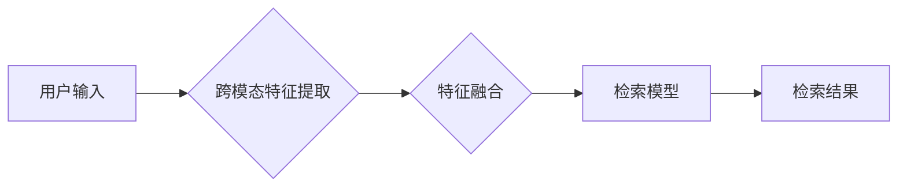

                 

## 电商搜索的跨模态理解与检索：AI大模型的新突破

> 关键词：跨模态理解、电商搜索、AI大模型、检索技术、图像理解、自然语言处理、多模态特征融合

## 1. 背景介绍

电商平台作为现代商业的重要组成部分，其搜索功能直接影响着用户体验和商业转化率。传统的电商搜索主要依赖于文本关键词匹配，难以满足用户日益多样化的搜索需求。随着人工智能技术的快速发展，跨模态理解与检索技术逐渐成为电商搜索领域的新突破口。

跨模态理解是指机器能够理解和处理不同模态数据（如文本、图像、音频等）之间的关系，并从中提取有意义的信息。在电商搜索场景中，跨模态理解可以帮助用户更直观、更精准地表达搜索意图，例如通过图片搜索商品、通过语音描述商品进行检索等。

## 2. 核心概念与联系

**2.1 核心概念**

* **跨模态理解 (Cross-Modal Understanding):** 
    * 能够理解不同模态数据之间的关系，并从中提取有意义的信息。
* **电商搜索 (E-commerce Search):** 
    * 在电商平台上，用户通过输入关键词或其他信息来查找商品的过程。
* **AI大模型 (Large AI Models):** 
    * 训练数据量巨大，参数规模庞大的深度学习模型，具备强大的泛化能力和学习能力。

**2.2 架构图**



**2.3 联系**

跨模态理解与检索技术可以将 AI 大模型应用于电商搜索领域，提升搜索效率和用户体验。

* **用户输入:** 用户可以输入文本关键词、图片、语音等多种模态信息。
* **跨模态特征提取:** 利用 AI 大模型，将不同模态数据转换为统一的特征表示。
* **特征融合:** 将不同模态特征进行融合，构建更完整的商品描述。
* **检索模型:** 基于融合后的特征，使用 AI 大模型进行商品检索。
* **检索结果:** 返回与用户搜索意图最匹配的商品列表。

## 3. 核心算法原理 & 具体操作步骤

**3.1 算法原理概述**

跨模态理解与检索的核心算法原理是将不同模态数据转换为统一的特征表示，并通过特征融合和检索模型进行商品匹配。

* **特征提取:** 利用预训练的 AI 大模型，例如 Vision Transformer (ViT) 和 BERT，分别提取文本和图像的特征表示。
* **特征融合:** 使用多种融合方法，例如加法融合、乘法融合、注意力机制等，将文本和图像特征进行融合，构建更完整的商品描述。
* **检索模型:** 使用基于 Transformer 的检索模型，例如 Dense Passage Retrieval (DPR) 和 ColBERT，对融合后的特征进行检索，并返回与用户搜索意图最匹配的商品列表。

**3.2 算法步骤详解**

1. **数据预处理:** 对文本和图像数据进行预处理，例如文本分词、图像裁剪、尺寸调整等。
2. **特征提取:** 利用预训练的 AI 大模型，分别提取文本和图像的特征表示。
3. **特征融合:** 使用融合方法将文本和图像特征进行融合，构建更完整的商品描述。
4. **检索模型训练:** 使用训练数据对检索模型进行训练，学习商品特征与用户搜索意图之间的映射关系。
5. **检索:** 当用户输入搜索请求时，将请求转换为特征表示，并使用训练好的检索模型进行商品检索。
6. **结果展示:** 返回与用户搜索意图最匹配的商品列表。

**3.3 算法优缺点**

* **优点:**
    * 能够理解用户更复杂的搜索意图。
    * 提升搜索结果的准确性和相关性。
    * 丰富用户搜索体验。
* **缺点:**
    * 训练数据量大，计算资源消耗高。
    * 模型复杂度高，部署成本较高。
    * 跨模态特征融合仍然是一个挑战性问题。

**3.4 算法应用领域**

* **电商搜索:** 通过图片、语音等多种模态数据进行商品检索。
* **内容推荐:** 根据用户浏览历史、兴趣偏好等信息，推荐相关商品或内容。
* **视觉问答:** 通过图像理解，回答用户关于图像的问题。
* **多模态对话:** 基于文本和图像等多种模态数据进行对话交互。

## 4. 数学模型和公式 & 详细讲解 & 举例说明

**4.1 数学模型构建**

跨模态检索模型通常采用基于 Transformer 的架构，例如 DPR 和 ColBERT。这些模型利用注意力机制学习不同模态特征之间的关系，并构建商品的跨模态表示。

**4.2 公式推导过程**

Transformer 模型的核心是注意力机制，其计算公式如下：

$$
Attention(Q, K, V) = \frac{exp(Q \cdot K^T / \sqrt{d_k})}{exp(Q \cdot K^T / \sqrt{d_k})} \cdot V
$$

其中：

* $Q$：查询矩阵
* $K$：键矩阵
* $V$：值矩阵
* $d_k$：键向量的维度

注意力机制可以学习到不同模态特征之间的重要性，并将其融合到商品的跨模态表示中。

**4.3 案例分析与讲解**

假设用户输入一张商品图片和一个文本关键词 "红色T恤"。

* **图像特征提取:** 利用预训练的 ViT 模型提取图片的特征表示。
* **文本特征提取:** 利用预训练的 BERT 模型提取 "红色T恤" 的文本特征表示。
* **特征融合:** 使用注意力机制将图像特征和文本特征进行融合，构建商品的跨模态表示。
* **检索模型:** 使用训练好的 DPR 模型对融合后的特征进行检索，并返回与 "红色T恤" 最匹配的商品列表。

## 5. 项目实践：代码实例和详细解释说明

**5.1 开发环境搭建**

* Python 3.7+
* PyTorch 或 TensorFlow
* CUDA 和 cuDNN

**5.2 源代码详细实现**

```python
# 导入必要的库
import torch
import torch.nn as nn
from transformers import ViTFeatureExtractor, ViTForImageClassification, BertModel

# 定义跨模态特征融合模型
class CrossModalFusionModel(nn.Module):
    def __init__(self, image_model, text_model):
        super(CrossModalFusionModel, self).__init__()
        self.image_model = image_model
        self.text_model = text_model
        self.fusion_layer = nn.Linear(image_model.config.hidden_size + text_model.config.hidden_size, 512)

    def forward(self, image_input, text_input):
        image_features = self.image_model(image_input)
        text_features = self.text_model(text_input)
        fused_features = torch.cat((image_features, text_features), dim=1)
        fused_features = self.fusion_layer(fused_features)
        return fused_features

# 实例化模型
image_model = ViTForImageClassification.from_pretrained("google/vit-base-patch16-224")
text_model = BertModel.from_pretrained("bert-base-uncased")
fusion_model = CrossModalFusionModel(image_model, text_model)

# 输入数据
image_input = ...
text_input = ...

# 获取融合特征
fused_features = fusion_model(image_input, text_input)

# 使用检索模型进行商品检索
```

**5.3 代码解读与分析**

* 代码首先导入必要的库，包括 PyTorch、Transformers 等。
* 然后定义了一个跨模态特征融合模型，该模型包含图像模型、文本模型和融合层。
* 图像模型和文本模型分别使用预训练的 ViT 和 BERT 模型。
* 融合层使用线性层将图像特征和文本特征进行拼接和融合。
* 最后，代码实例化模型，输入数据，获取融合特征，并使用检索模型进行商品检索。

**5.4 运行结果展示**

运行代码后，将返回与用户搜索意图最匹配的商品列表。

## 6. 实际应用场景

**6.1 电商搜索场景**

* **图片搜索:** 用户上传图片，系统根据图片内容检索相似商品。
* **语音搜索:** 用户通过语音描述商品，系统进行语音识别并进行商品检索。
* **多模态搜索:** 用户同时输入图片和文本关键词，系统综合分析多模态信息进行更精准的商品检索。

**6.2 其他应用场景**

* **内容推荐:** 根据用户浏览历史、兴趣偏好等信息，推荐相关商品或内容。
* **视觉问答:** 通过图像理解，回答用户关于图像的问题。
* **多模态对话:** 基于文本和图像等多种模态数据进行对话交互。

**6.3 未来应用展望**

随着 AI 技术的不断发展，跨模态理解与检索技术将在电商搜索领域发挥更重要的作用。未来，我们可以期待：

* 更精准、更智能的商品检索体验。
* 更丰富的搜索方式，例如视频搜索、3D 模型搜索等。
* 更个性化的商品推荐，满足用户多样化的需求。

## 7. 工具和资源推荐

**7.1 学习资源推荐**

* **书籍:**
    * "Deep Learning" by Ian Goodfellow, Yoshua Bengio, and Aaron Courville
    * "Natural Language Processing with Transformers" by Hugging Face
* **课程:**
    * Stanford CS231n: Convolutional Neural Networks for Visual Recognition
    * DeepLearning.AI TensorFlow Specialization

**7.2 开发工具推荐**

* **PyTorch:** 深度学习框架
* **TensorFlow:** 深度学习框架
* **Transformers:** 预训练模型库

**7.3 相关论文推荐**

* "BERT: Pre-training of Deep Bidirectional Transformers for Language Understanding"
* "Vision Transformer"
* "Dense Passage Retrieval for Open-Domain Question Answering"

## 8. 总结：未来发展趋势与挑战

**8.1 研究成果总结**

跨模态理解与检索技术在电商搜索领域取得了显著的进展，能够提升搜索效率和用户体验。

**8.2 未来发展趋势**

* **更强大的 AI 模型:** 训练更大规模、更强大的 AI 模型，提升跨模态理解能力。
* **更有效的特征融合方法:** 研究更有效的特征融合方法，更好地融合不同模态信息。
* **更个性化的搜索体验:** 基于用户行为和偏好，提供更个性化的搜索体验。

**8.3 面临的挑战**

* **跨模态数据标注:** 跨模态数据标注成本高，数据质量难以保证。
* **模型复杂度:** 跨模态模型复杂度高，训练和部署成本较高。
* **数据隐私:** 跨模态数据包含用户隐私信息，需要妥善保护用户隐私。

**8.4 研究展望**

未来，跨模态理解与检索技术将继续发展，为电商搜索领域带来更多创新和突破。


## 9. 附录：常见问题与解答

**9.1 如何选择合适的跨模态特征融合方法？**

选择合适的跨模态特征融合方法取决于具体应用场景和数据特点。常见的融合方法包括加法融合、乘法融合、注意力机制等。

**9.2 如何解决跨模态数据标注问题？**

跨模态数据标注成本高，可以使用数据增强技术、迁移学习等方法来缓解这个问题。

**9.3 如何部署跨模态检索模型？**

可以使用云平台、边缘设备等多种方式部署跨模态检索模型。

作者：禅与计算机程序设计艺术 / Zen and the Art of Computer Programming 


<end_of_turn>

