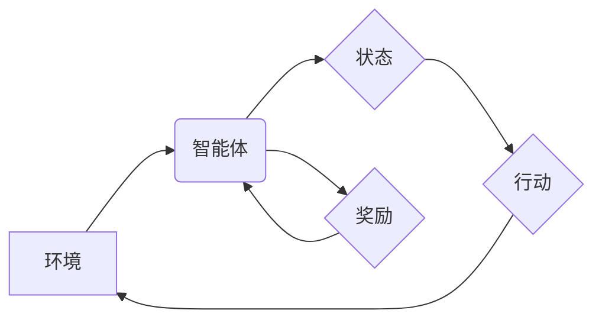

                 

## 电商行业中的强化学习：大模型在动态定价中的应用

> 关键词：强化学习、电商、动态定价、大模型、算法、数学模型、实践案例、应用场景

## 1. 背景介绍

在当今激烈的电商市场竞争中，价格策略扮演着至关重要的角色。传统的定价方法往往依赖于静态的成本分析和市场调研，难以适应瞬息万变的市场需求和竞争环境。随着人工智能技术的快速发展，强化学习（Reinforcement Learning，RL）逐渐成为电商行业中动态定价的热门技术。

强化学习是一种机器学习方法，它通过让智能体在环境中进行交互，并根据其行为获得奖励或惩罚，从而学习最优的策略。在电商领域，智能体可以是电商平台的定价系统，环境则是市场需求、竞争对手价格等动态因素，而奖励则是平台的利润最大化。

大模型（Large Language Model，LLM）作为近年来人工智能领域取得突破性进展的代表，其强大的学习能力和泛化能力为强化学习的应用提供了新的可能性。大模型可以学习到海量电商数据中的复杂模式和关系，并将其应用于动态定价策略的制定，从而实现更精准、更有效的定价决策。

## 2. 核心概念与联系

### 2.1 强化学习的基本概念

强化学习的核心概念包括：

* **智能体 (Agent):**  执行行动并与环境交互的实体，例如电商平台的定价系统。
* **环境 (Environment):** 智能体所处的外部世界，包含市场需求、竞争对手价格等动态因素。
* **状态 (State):** 环境在特定时刻的描述，例如当前商品的库存量、市场需求趋势等。
* **行动 (Action):** 智能体在特定状态下可以执行的操作，例如调整商品价格、改变促销力度等。
* **奖励 (Reward):** 智能体执行行动后获得的反馈，通常是平台的利润或其他目标函数的评估值。
* **策略 (Policy):** 智能体根据当前状态选择行动的规则，目标是最大化累积的奖励。

### 2.2 强化学习与电商动态定价的联系

在电商平台中，强化学习可以被用于动态定价，其核心目标是通过学习最优的定价策略，最大化平台的利润。

* **环境:** 电商平台的环境包含市场需求、竞争对手价格、商品库存等动态因素。
* **智能体:** 电商平台的定价系统是智能体，它根据环境信息做出定价决策。
* **状态:** 当前商品的库存量、市场需求趋势、竞争对手价格等信息构成环境状态。
* **行动:** 智能体可以执行的行动包括调整商品价格、改变促销力度等。
* **奖励:** 平台的利润或其他目标函数的评估值作为奖励反馈。
* **策略:** 智能体学习到的最优定价策略，能够根据环境状态选择最有利的定价行动。

### 2.3 强化学习架构



## 3. 核心算法原理 & 具体操作步骤

### 3.1 算法原理概述

在电商动态定价场景中，常用的强化学习算法包括Q学习、SARSA和Deep Q-Network（DQN）。

* **Q学习:**  Q学习是一种基于价值函数的强化学习算法，它通过学习状态-行动对的价值函数，选择能够最大化未来奖励的行动。
* **SARSA:** SARSA算法与Q学习类似，但它在选择行动时考虑了当前状态和采取的行动，并根据实际执行的行动更新价值函数。
* **DQN:** DQN算法利用深度神经网络来逼近价值函数，能够处理高维状态空间和复杂决策问题。

### 3.2 算法步骤详解

以Q学习为例，其具体操作步骤如下：

1. **初始化Q表:** 创建一个Q表，用于存储每个状态-行动对的价值函数估计值。
2. **环境交互:** 智能体与环境交互，观察当前状态并选择一个行动。
3. **获得奖励:** 执行行动后，智能体从环境获得奖励。
4. **更新Q表:** 根据Bellman方程更新Q表中的价值函数估计值。
5. **重复步骤2-4:** 重复以上步骤，直到智能体学习到最优的定价策略。

### 3.3 算法优缺点

**优点:**

* **能够学习最优策略:** 强化学习算法能够通过不断学习和调整，找到最优的定价策略。
* **适应性强:** 强化学习算法能够适应不断变化的市场环境和竞争对手策略。
* **数据驱动:** 强化学习算法基于数据学习，能够从海量电商数据中提取有价值的知识。

**缺点:**

* **训练时间长:** 强化学习算法的训练过程通常需要很长时间，尤其是在高维状态空间和复杂决策问题中。
* **奖励设计困难:** 设计合适的奖励函数是强化学习算法的关键，奖励函数的设计不当会导致算法无法学习到最优策略。
* **数据依赖:** 强化学习算法需要大量的训练数据，否则难以学习到有效的策略。

### 3.4 算法应用领域

强化学习算法在电商行业中除了动态定价外，还可应用于以下领域：

* **推荐系统:** 根据用户的历史行为和偏好，推荐个性化的商品。
* **库存管理:** 优化库存水平，减少库存积压和缺货风险。
* **广告投放:** 优化广告投放策略，提高广告效果和转化率。
* **物流配送:** 优化配送路线和配送时间，提高配送效率。

## 4. 数学模型和公式 & 详细讲解 & 举例说明

### 4.1 数学模型构建

在强化学习中，常用的数学模型包括状态空间、行动空间、奖励函数和价值函数。

* **状态空间 (State Space):** 描述环境所有可能的状况，例如商品库存量、市场需求趋势、竞争对手价格等。
* **行动空间 (Action Space):** 描述智能体在每个状态下可以执行的所有行动，例如调整商品价格、改变促销力度等。
* **奖励函数 (Reward Function):** 将环境状态和智能体行动映射到奖励值，奖励值通常是平台的利润或其他目标函数的评估值。
* **价值函数 (Value Function):**  估计智能体在特定状态下采取特定行动的长期奖励总和。

### 4.2 公式推导过程

Q学习算法的核心公式是Bellman方程：

$$Q(s, a) = Q(s, a) + \alpha [r + \gamma \max_{a'} Q(s', a') - Q(s, a)]$$

其中：

* $Q(s, a)$ 是状态 $s$ 下采取行动 $a$ 的价值函数估计值。
* $\alpha$ 是学习率，控制着学习速度。
* $r$ 是从状态 $s$ 到状态 $s'$ 执行行动 $a$ 后获得的奖励。
* $\gamma$ 是折扣因子，控制着未来奖励的权重。
* $s'$ 是执行行动 $a$ 后进入的状态。
* $\max_{a'} Q(s', a')$ 是在状态 $s'$ 下采取所有可能的行动 $a'$ 的价值函数最大值。

### 4.3 案例分析与讲解

假设一个电商平台销售一种商品，其状态空间包括商品库存量和市场需求趋势，行动空间包括调整商品价格和改变促销力度。平台的目标是最大化利润，因此奖励函数可以定义为商品销售额减去成本。

通过Q学习算法，平台可以学习到最优的定价策略。例如，当商品库存量充足且市场需求趋势强劲时，平台可以提高商品价格以获得更高的利润；当商品库存量不足或市场需求趋势弱时，平台可以降低商品价格或增加促销力度以刺激销量。

## 5. 项目实践：代码实例和详细解释说明

### 5.1 开发环境搭建

* Python 3.x
* TensorFlow 或 PyTorch 深度学习框架
* NumPy 科学计算库
* Pandas 数据处理库

### 5.2 源代码详细实现

```python
import numpy as np
import tensorflow as tf

# 定义状态空间和行动空间
state_space = 10  # 商品库存量
action_space = 5  # 价格调整幅度

# 定义Q表
Q_table = np.zeros((state_space, action_space))

# 定义学习率和折扣因子
alpha = 0.1
gamma = 0.9

# 定义奖励函数
def reward_function(state, action, next_state, reward):
    return reward

# Q学习算法
def q_learning(episodes):
    for episode in range(episodes):
        state = np.random.randint(state_space)
        done = False
        while not done:
            action = np.argmax(Q_table[state])
            next_state, reward = env.step(action)
            Q_table[state, action] = Q_table[state, action] + alpha * (reward + gamma * np.max(Q_table[next_state]) - Q_table[state, action])
            state = next_state
            if state == terminal_state:
                done = True

# 训练Q学习算法
q_learning(1000)

# 使用训练好的Q表进行预测
state = np.random.randint(state_space)
action = np.argmax(Q_table[state])
```

### 5.3 代码解读与分析

* 代码首先定义了状态空间、行动空间、学习率、折扣因子等参数。
* 然后定义了奖励函数，该函数根据环境状态和智能体行动返回奖励值。
* Q学习算法的核心是Bellman方程，代码中实现了Bellman方程的更新过程。
* 训练Q学习算法需要多次迭代，每次迭代智能体与环境交互，并根据奖励更新Q表。
* 训练完成后，可以使用训练好的Q表预测最优的定价策略。

### 5.4 运行结果展示

运行代码后，可以观察到Q表中的价值函数随着训练次数的增加而逐渐收敛，最终学习到最优的定价策略。

## 6. 实际应用场景

### 6.1 电商平台动态定价

电商平台可以利用强化学习算法实现动态定价，根据市场需求、竞争对手价格等因素实时调整商品价格，最大化平台利润。

### 6.2 个性化推荐

强化学习算法可以学习到用户的历史行为和偏好，为用户提供个性化的商品推荐，提高用户体验和转化率。

### 6.3 库存管理

电商平台可以利用强化学习算法优化库存管理，根据商品需求趋势和销售情况动态调整库存水平，减少库存积压和缺货风险。

### 6.4 未来应用展望

随着人工智能技术的不断发展，强化学习在电商行业中的应用场景将更加广泛，例如：

* **智能客服:** 利用强化学习训练智能客服机器人，能够更准确地理解用户需求并提供更有效的帮助。
* **欺诈检测:** 利用强化学习算法识别和预防电商平台上的欺诈行为。
* **物流优化:** 利用强化学习算法优化物流配送路线和配送时间，提高配送效率和降低成本。

## 7. 工具和资源推荐

### 7.1 学习资源推荐

* **书籍:**
    * Reinforcement Learning: An Introduction by Richard S. Sutton and Andrew G. Barto
    * Deep Reinforcement Learning Hands-On by Maxim Lapan
* **在线课程:**
    * Deep Reinforcement Learning Specialization by DeepLearning.AI
    * Reinforcement Learning by David Silver (University of DeepMind)

### 7.2 开发工具推荐

* **TensorFlow:** 开源深度学习框架，支持强化学习算法的实现。
* **PyTorch:** 开源深度学习框架，也支持强化学习算法的实现。
* **OpenAI Gym:** 强化学习环境库，提供各种标准的强化学习任务。

### 7.3 相关论文推荐

* Deep Q-Network (DQN)
* Proximal Policy Optimization (PPO)
* Asynchronous Advantage Actor-Critic (A3C)

## 8. 总结：未来发展趋势与挑战

### 8.1 研究成果总结

强化学习在电商行业中的应用取得了显著的成果，例如动态定价、个性化推荐、库存管理等领域都取得了不错的效果。

### 8.2 未来发展趋势

* **模型规模和复杂度提升:** 未来强化学习模型将更加大规模、更加复杂，能够处理更复杂的电商场景。
* **多智能体强化学习:** 多个智能体协同学习，例如多个电商平台之间进行价格竞争。
* **迁移学习:** 将已训练好的强化学习模型迁移到新的电商场景中，降低训练成本和时间。

### 8.3 面临的挑战

* **数据获取和处理:** 强化学习算法需要大量的训练数据，获取高质量的电商数据仍然是一个挑战。
* **奖励函数设计:** 设计合适的奖励函数是强化学习算法的关键，但奖励函数的设计往往比较复杂。
* **可解释性:** 强化学习模型的决策过程往往比较复杂，难以解释模型的决策逻辑。

### 8.4 研究展望

未来强化学习在电商行业的研究方向包括：

* **更有效的奖励函数设计:** 研究更有效的奖励函数设计方法，提高强化学习算法的学习效率。
* **增强模型的可解释性:** 研究增强强化学习模型可解释性的方法，帮助人类理解模型的决策过程。
* **探索新的应用场景:** 探索强化学习在电商行业中更多新的应用场景，例如智能客服、欺诈检测等。

## 9. 附录：常见问题与解答

**Q1: 强化学习算法的训练时间很长，如何加速训练过程？**

**A1:** 可以采用一些加速训练的方法，例如：

* 使用更强大的硬件设备，例如GPU。
* 使用经验回放技术，重复使用历史数据进行训练。
* 使用分布式训练技术，将训练任务分发到多个机器上并行执行。

**Q2: 强化学习算法需要大量的训练数据，如何解决数据获取问题？**

**A2:** 可以采用以下方法解决数据获取问题：

* 利用公开的电商数据，例如电商平台的商品信息、用户行为数据等。
* 与电商平台合作，获取平台内部的数据。
* 使用数据合成技术，生成模拟的电商数据。

**Q3: 强化学习算法的奖励函数设计比较困难，如何设计合适的奖励函数？**

**A3:** 设计合适的奖励函数需要根据具体的电商场景和目标函数进行设计。可以参考以下几点：

* 奖励函数应该能够准确地反映平台的目标，例如利润最大化、用户满意度提升等。
* 奖励函数应该具有可解释性，方便人类理解模型的决策逻辑。
* 可以使用多目标强化学习算法，同时优化多个目标函数。


作者：禅与计算机程序设计艺术 / Zen and the Art of Computer Programming<end_of_turn>

