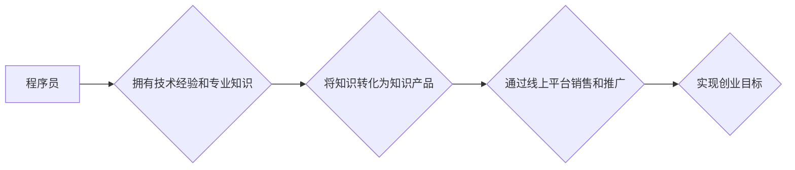

                 

## 知识付费与程序员创业的结合点

> 关键词：知识付费、程序员创业、技术分享、在线教育、社区建设、内容创作、商业模式、技术趋势、市场需求

## 1. 背景介绍

近年来，互联网技术蓬勃发展，知识经济时代加速到来。程序员作为科技创新的核心力量，拥有丰富的技术经验和专业知识。与此同时，知识付费模式也逐渐成为一种主流的商业模式，为程序员提供了新的创业机会。

程序员创业的传统模式主要依靠开发软件产品或提供技术服务。然而，随着市场竞争的加剧，单纯依靠产品或服务难以获得持续的成功。知识付费模式的出现，为程序员提供了新的思路和途径，可以将自身的技术经验和专业知识转化为有价值的知识产品，并通过线上平台进行销售和推广。

## 2. 核心概念与联系

### 2.1 知识付费

知识付费是指通过付费的方式获取知识、技能或服务的商业模式。它以知识为核心，将知识的生产者和消费者连接起来，实现知识的流通和价值实现。

### 2.2 程序员创业

程序员创业是指程序员利用自身的技术能力和经验，创办自己的技术公司或项目，并通过提供软件产品、技术服务或其他相关业务获得收益。

**知识付费与程序员创业的结合点在于：**程序员可以通过知识付费模式将自身的技术经验和专业知识转化为知识产品，并通过线上平台进行销售和推广，从而实现创业目标。

**Mermaid 流程图：**



## 3. 核心算法原理 & 具体操作步骤

### 3.1 算法原理概述

知识付费模式的成功离不开有效的算法和技术支撑。其中，推荐算法、内容分发算法和用户画像算法等都是关键技术。

* **推荐算法:** 根据用户的兴趣、行为和偏好，推荐相关的知识产品，提高用户获取信息效率。
* **内容分发算法:** 根据内容的质量、热度和用户反馈，优化内容的展示顺序，提高用户参与度。
* **用户画像算法:** 通过分析用户的行为数据，构建用户画像，精准定位目标用户群体，提高知识产品的精准度。

### 3.2 算法步骤详解

**推荐算法步骤:**

1. **数据收集:** 收集用户的行为数据，例如浏览记录、购买记录、评论记录等。
2. **特征提取:** 从用户行为数据中提取特征，例如用户喜欢的主题、学习习惯、消费水平等。
3. **模型训练:** 利用机器学习算法，训练推荐模型，建立用户与知识产品的关联关系。
4. **推荐结果生成:** 根据用户的特征和模型预测，生成个性化的知识产品推荐列表。

**内容分发算法步骤:**

1. **内容采集:** 收集平台上的所有知识产品信息，包括标题、内容、标签、作者等。
2. **内容分析:** 对知识产品内容进行分析，提取关键词、主题、情感等信息。
3. **用户行为分析:** 分析用户的浏览记录、点赞记录、评论记录等行为数据。
4. **排序算法:** 根据内容质量、热度、用户反馈等因素，对知识产品进行排序，生成不同类型的推荐列表。

**用户画像算法步骤:**

1. **数据收集:** 收集用户的基本信息、行为数据、社交数据等。
2. **数据清洗:** 对收集到的数据进行清洗和处理，去除无效数据和重复数据。
3. **特征工程:** 从原始数据中提取特征，例如用户年龄、性别、职业、兴趣爱好、学习习惯等。
4. **模型训练:** 利用机器学习算法，训练用户画像模型，构建用户画像。

### 3.3 算法优缺点

**推荐算法:**

* **优点:** 可以根据用户的个性化需求，推荐更精准的知识产品，提高用户体验。
* **缺点:** 需要大量的用户数据进行训练，算法模型的准确性依赖于数据质量。

**内容分发算法:**

* **优点:** 可以根据内容的质量和热度，优化内容的展示顺序，提高用户参与度。
* **缺点:** 需要不断调整算法参数，以适应用户的变化需求。

**用户画像算法:**

* **优点:** 可以精准定位目标用户群体，提高知识产品的精准度。
* **缺点:** 需要收集和分析大量的用户数据，存在用户隐私保护的风险。

### 3.4 算法应用领域

推荐算法、内容分发算法和用户画像算法广泛应用于电商、社交媒体、在线教育等领域。在知识付费领域，这些算法可以帮助平台更好地推荐知识产品、优化内容展示和精准定位目标用户群体。

## 4. 数学模型和公式 & 详细讲解 & 举例说明

### 4.1 数学模型构建

**推荐算法的数学模型:**

推荐算法通常采用协同过滤算法或内容过滤算法。协同过滤算法基于用户的历史行为数据，预测用户对未知物品的喜好。内容过滤算法基于物品的特征信息，推荐与用户兴趣相符的物品。

**协同过滤算法的数学模型:**

$$
r_{ui} = \alpha \cdot \overline{r_u} + (1-\alpha) \cdot \frac{\sum_{v \in N(u)} r_{uv} \cdot s_{uv}}{\sum_{v \in N(u)} s_{uv}}
$$

其中：

* $r_{ui}$: 用户 $u$ 对物品 $i$ 的评分
* $\overline{r_u}$: 用户 $u$ 的平均评分
* $N(u)$: 与用户 $u$ 有过交互的物品集合
* $r_{uv}$: 用户 $u$ 对物品 $v$ 的评分
* $s_{uv}$: 用户 $u$ 和物品 $v$ 的相似度

**内容过滤算法的数学模型:**

$$
score(u, i) = \sum_{f \in F} w_f \cdot \text{similarity}(c_{uf}, c_{if})
$$

其中：

* $score(u, i)$: 用户 $u$ 对物品 $i$ 的评分
* $F$: 物品特征集合
* $w_f$: 特征 $f$ 的权重
* $c_{uf}$: 用户 $u$ 的特征向量
* $c_{if}$: 物品 $i$ 的特征向量
* $\text{similarity}(c_{uf}, c_{if})$: 用户 $u$ 的特征向量与物品 $i$ 的特征向量的相似度

### 4.2 公式推导过程

上述公式的推导过程涉及到线性代数、概率统计和机器学习等方面的知识。

### 4.3 案例分析与讲解

**案例:**

假设有一个在线教育平台，平台上有大量的课程和用户。平台希望通过推荐算法，推荐用户感兴趣的课程。

**分析:**

平台可以收集用户的学习记录、课程评价等数据，并利用协同过滤算法或内容过滤算法，构建推荐模型。例如，如果用户 $A$ 和用户 $B$ 都学习了课程 $X$，并且对课程 $X$ 的评价都很高，那么平台可以推测用户 $A$ 也可能对课程 $Y$ 感兴趣，因为用户 $B$ 也学习了课程 $Y$，并且对课程 $Y$ 的评价也很高。

## 5. 项目实践：代码实例和详细解释说明

### 5.1 开发环境搭建

* **操作系统:** Ubuntu 20.04 LTS
* **编程语言:** Python 3.8
* **开发工具:** VS Code
* **库依赖:** pandas, numpy, scikit-learn

### 5.2 源代码详细实现

```python
import pandas as pd
from sklearn.metrics.pairwise import cosine_similarity

# 加载用户-课程交互数据
data = pd.read_csv("user_course_interaction.csv")

# 构建用户-课程评分矩阵
user_course_rating = data.pivot_table(index="user_id", columns="course_id", values="rating")

# 计算用户-课程评分矩阵的余弦相似度
user_similarity = cosine_similarity(user_course_rating)

# 获取用户 A 的 ID
user_a_id = 1

# 获取用户 A 与其他用户的相似度
user_a_similarity = user_similarity[user_a_id]

# 找到与用户 A 相似度最高的 N 个用户
top_n_similar_users = user_a_similarity.argsort()[-5:][::-1]

# 获取相似用户喜欢的课程
similar_users_courses = user_course_rating.iloc[top_n_similar_users].mean()

# 推荐给用户 A 的课程
recommended_courses = similar_users_courses.sort_values(ascending=False)

# 打印推荐结果
print(f"推荐给用户 {user_a_id} 的课程:")
print(recommended_courses)
```

### 5.3 代码解读与分析

* **数据加载:** 代码首先加载用户-课程交互数据，并构建用户-课程评分矩阵。
* **相似度计算:** 利用余弦相似度算法计算用户之间的相似度。
* **相似用户筛选:** 根据用户 A 的 ID，获取与用户 A 相似度最高的 N 个用户。
* **课程推荐:** 获取相似用户喜欢的课程，并推荐给用户 A。

### 5.4 运行结果展示

运行代码后，会输出一个包含推荐课程的列表。

## 6. 实际应用场景

### 6.1 在线教育平台

在线教育平台可以利用知识付费模式，将课程内容转化为知识产品，并通过推荐算法和内容分发算法，精准推荐课程给用户。

### 6.2 技术博客和社区

技术博客和社区可以将技术文章、代码示例和学习资源转化为知识产品，并通过付费订阅或会员制度，为用户提供更优质的学习体验。

### 6.3 个人知识分享

程序员可以利用知识付费平台，分享自己的技术经验和专业知识，并通过出售课程、电子书或在线咨询等方式，实现个人知识变现。

### 6.4 未来应用展望

随着人工智能技术的发展，知识付费模式将更加智能化和个性化。未来，知识付费平台将更加注重用户体验，提供更精准的推荐、更丰富的学习资源和更便捷的学习方式。

## 7. 工具和资源推荐

### 7.1 学习资源推荐

* **Coursera:** https://www.coursera.org/
* **edX:** https://www.edx.org/
* **Udemy:** https://www.udemy.com/

### 7.2 开发工具推荐

* **Python:** https://www.python.org/
* **Pandas:** https://pandas.pydata.org/
* **Scikit-learn:** https://scikit-learn.org/stable/

### 7.3 相关论文推荐

* **Collaborative Filtering for Implicit Feedback Datasets**
* **Content-Based Recommendation Systems**
* **Hybrid Recommender Systems**

## 8. 总结：未来发展趋势与挑战

### 8.1 研究成果总结

知识付费模式为程序员创业提供了新的思路和途径，并推动了人工智能技术在教育领域的应用。

### 8.2 未来发展趋势

* **个性化推荐:** 利用人工智能技术，提供更加个性化的知识推荐。
* **沉浸式学习:** 利用虚拟现实和增强现实技术，打造更加沉浸式的学习体验。
* **元宇宙学习:** 在元宇宙环境中，构建更加交互性和沉浸性的学习场景。

### 8.3 面临的挑战

* **数据安全:** 知识付费平台需要保障用户数据的安全和隐私。
* **内容质量:** 知识付费平台需要保证知识产品的质量和权威性。
* **商业模式创新:** 知识付费平台需要不断探索新的商业模式，以实现可持续发展。

### 8.4 研究展望

未来，知识付费模式将更加智能化、个性化和沉浸式，并与其他新兴技术融合，为用户提供更加优质的学习体验。


## 9. 附录：常见问题与解答

**Q1: 如何选择合适的知识付费平台？**

**A1:** 选择知识付费平台时，需要考虑平台的知名度、用户规模、课程质量、收费标准和服务保障等因素。

**Q2: 如何打造优质的知识产品？**

**A2:** 打造优质的知识产品需要注重内容的原创性、实用性和价值性。

**Q3: 如何推广自己的知识产品？**

**A3:** 可以通过社交媒体、博客、论坛等渠道推广自己的知识产品。


作者：禅与计算机程序设计艺术 / Zen and the Art of Computer Programming 
<end_of_turn>

