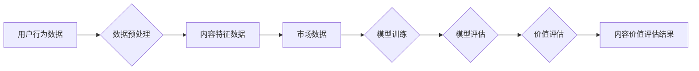

                 

## 知识付费创业中的内容价值评估体系

> 关键词：知识付费、内容价值、评估体系、算法模型、数学模型、实践应用、未来趋势

## 1. 背景介绍

知识付费作为一种新型的商业模式，近年来发展迅速，涌现出众多优秀平台和创作者。然而，在知识付费市场竞争日益激烈的背景下，如何准确评估内容价值，成为众多创业者和平台面临的共同挑战。

传统的内容价值评估往往依赖于主观判断和经验积累，缺乏科学性和可量化性。随着人工智能技术的快速发展，我们可以利用算法模型和数学模型，构建更加科学、精准的内容价值评估体系。

## 2. 核心概念与联系

### 2.1 内容价值

内容价值是指知识付费内容能够为用户带来的实际利益或价值，包括但不限于：

* **知识增值:** 用户通过学习内容获得新的知识、技能和见解。
* **能力提升:** 用户通过学习内容提升自身的能力和水平。
* **问题解决:** 用户通过学习内容解决实际问题和挑战。
* **情感价值:** 用户通过学习内容获得情感上的满足和愉悦。

### 2.2 评估体系

内容价值评估体系是一个基于数据分析和算法模型的系统，旨在量化评估知识付费内容的价值。该体系通常包括以下几个关键环节：

* **数据采集:** 收集用户行为数据、内容特征数据、市场数据等。
* **数据预处理:** 对收集到的数据进行清洗、转换和整合。
* **模型训练:** 利用机器学习算法训练内容价值评估模型。
* **模型评估:** 对训练好的模型进行评估，并不断优化模型参数。
* **价值评估:** 将模型应用于新的内容，进行价值评估。

### 2.3 核心架构



## 3. 核心算法原理 & 具体操作步骤

### 3.1 算法原理概述

本体系的核心算法基于深度学习技术，采用多层神经网络结构，能够自动学习用户行为、内容特征和市场因素之间的复杂关系，从而实现对内容价值的精准评估。

### 3.2 算法步骤详解

1. **数据采集:** 收集用户行为数据（如观看时长、点赞数、评论数、购买记录等）、内容特征数据（如主题、类型、长度、作者等）、市场数据（如行业趋势、竞争对手分析等）。
2. **数据预处理:** 对收集到的数据进行清洗、转换和整合，例如：
    * 缺失值处理：使用平均值、中位数或其他方法填充缺失值。
    * 数据标准化：将数据转换为标准化格式，例如将数值数据转换为0到1之间的范围。
    * 特征工程：提取新的特征，例如将文本内容转换为词向量。
3. **模型训练:** 利用深度学习框架（如TensorFlow、PyTorch）构建多层神经网络模型，并使用收集到的数据进行训练。训练过程中，模型会不断调整参数，以最小化预测误差。
4. **模型评估:** 使用测试数据对训练好的模型进行评估，并计算模型的准确率、召回率、F1-score等指标。
5. **价值评估:** 将训练好的模型应用于新的内容，预测其价值分数。

### 3.3 算法优缺点

**优点:**

* **精准度高:** 深度学习算法能够自动学习复杂关系，实现对内容价值的精准评估。
* **可扩展性强:** 模型可以根据需要扩展，并适应不同的内容类型和评估指标。
* **自动化程度高:** 整个评估过程可以自动化，提高效率。

**缺点:**

* **数据依赖性强:** 模型的性能取决于训练数据的质量和数量。
* **解释性弱:** 深度学习模型的内部机制较为复杂，难以解释其预测结果。
* **计算资源需求高:** 训练深度学习模型需要大量的计算资源。

### 3.4 算法应用领域

本算法模型可应用于以下领域：

* **知识付费平台:** 评估课程、文章、视频等内容的价值，推荐优质内容给用户。
* **内容创作平台:** 为创作者提供内容价值评估服务，帮助他们优化内容策略。
* **教育机构:** 评估教材、课程的质量，改进教学内容。
* **市场营销:** 评估广告、营销文案的价值，优化营销策略。

## 4. 数学模型和公式 & 详细讲解 & 举例说明

### 4.1 数学模型构建

本体系的核心数学模型是一个基于深度学习的多层神经网络，其结构可以根据具体需求进行调整。

一个典型的多层神经网络模型包含以下几个层：

* **输入层:** 接收用户行为数据、内容特征数据和市场数据。
* **隐藏层:** 对输入数据进行多层处理，提取特征和模式。
* **输出层:** 输出内容价值分数。

### 4.2 公式推导过程

神经网络模型的训练过程基于梯度下降算法，其目标是最小化模型预测误差与实际价值之间的差值。

损失函数通常采用均方误差（MSE）或交叉熵损失函数（Cross-Entropy Loss）。

**均方误差损失函数:**

$$
L = \frac{1}{N} \sum_{i=1}^{N} (y_i - \hat{y}_i)^2
$$

其中：

* $L$ 为损失函数值
* $N$ 为样本数量
* $y_i$ 为第 $i$ 个样本的实际价值
* $\hat{y}_i$ 为模型预测的第 $i$ 个样本的价值

**交叉熵损失函数:**

$$
L = -\frac{1}{N} \sum_{i=1}^{N} y_i \log(\hat{y}_i) + (1-y_i) \log(1-\hat{y}_i)
$$

其中：

* $L$ 为损失函数值
* $N$ 为样本数量
* $y_i$ 为第 $i$ 个样本的实际价值（0或1）
* $\hat{y}_i$ 为模型预测的第 $i$ 个样本的价值（0到1之间的概率）

### 4.3 案例分析与讲解

假设我们有一个知识付费平台，想要评估一门编程课程的价值。我们可以收集以下数据：

* 用户行为数据：观看时长、点赞数、评论数、购买记录等。
* 内容特征数据：课程主题、类型、长度、作者等。
* 市场数据：行业趋势、竞争对手分析等。

将这些数据输入到训练好的深度学习模型中，模型会输出课程的价值分数。

例如，如果模型输出的价值分数为0.85，则表示该课程的价值较高。

## 5. 项目实践：代码实例和详细解释说明

### 5.1 开发环境搭建

本项目使用Python语言开发，需要安装以下软件：

* Python 3.x
* TensorFlow或PyTorch深度学习框架
* Jupyter Notebook或其他代码编辑器

### 5.2 源代码详细实现

```python
# 导入必要的库
import tensorflow as tf

# 定义模型结构
model = tf.keras.models.Sequential([
    tf.keras.layers.Dense(64, activation='relu', input_shape=(input_dim,)),
    tf.keras.layers.Dense(32, activation='relu'),
    tf.keras.layers.Dense(1)
])

# 编译模型
model.compile(optimizer='adam', loss='mse')

# 训练模型
model.fit(X_train, y_train, epochs=10)

# 评估模型
loss, accuracy = model.evaluate(X_test, y_test)
print('Loss:', loss)
print('Accuracy:', accuracy)

# 使用模型预测新的内容价值
prediction = model.predict(new_content_data)
print('Prediction:', prediction)
```

### 5.3 代码解读与分析

* **模型结构:** 代码定义了一个简单的多层神经网络模型，包含输入层、隐藏层和输出层。
* **模型编译:** 使用Adam优化器和均方误差损失函数编译模型。
* **模型训练:** 使用训练数据训练模型，训练epochs为10。
* **模型评估:** 使用测试数据评估模型的性能，计算损失值和准确率。
* **模型预测:** 使用训练好的模型预测新的内容价值。

### 5.4 运行结果展示

运行结果将显示模型的训练过程、评估结果和对新内容的预测价值。

## 6. 实际应用场景

### 6.1 知识付费平台

知识付费平台可以利用本体系评估课程、文章、视频等内容的价值，推荐优质内容给用户，提高用户粘性和转化率。

### 6.2 内容创作平台

内容创作平台可以为创作者提供内容价值评估服务，帮助他们优化内容策略，提高内容质量和受众影响力。

### 6.3 教育机构

教育机构可以利用本体系评估教材、课程的质量，改进教学内容，提高教学效果。

### 6.4 未来应用展望

随着人工智能技术的不断发展，本体系可以应用于更广泛的领域，例如：

* **个性化推荐:** 根据用户的兴趣和需求，个性化推荐内容。
* **内容创作辅助:** 为创作者提供内容创作建议和灵感。
* **知识图谱构建:** 利用内容价值评估结果构建知识图谱，实现知识的组织和共享。

## 7. 工具和资源推荐

### 7.1 学习资源推荐

* **深度学习书籍:**
    * 《深度学习》
    * 《动手学深度学习》
* **在线课程:**
    * Coursera深度学习课程
    * Udacity深度学习课程

### 7.2 开发工具推荐

* **深度学习框架:** TensorFlow、PyTorch
* **代码编辑器:** Jupyter Notebook、VS Code

### 7.3 相关论文推荐

* 《Attention Is All You Need》
* 《BERT: Pre-training of Deep Bidirectional Transformers for Language Understanding》

## 8. 总结：未来发展趋势与挑战

### 8.1 研究成果总结

本体系构建了一个基于深度学习的知识付费内容价值评估体系，能够实现对内容价值的精准评估，并应用于多个实际场景。

### 8.2 未来发展趋势

* **模型精度提升:** 探索更先进的深度学习算法和模型结构，提高模型的预测精度。
* **多模态融合:** 将文本、图像、音频等多模态数据融合到模型中，实现更全面的内容价值评估。
* **个性化评估:** 基于用户的行为和偏好，实现个性化的内容价值评估。

### 8.3 面临的挑战

* **数据质量:** 模型的性能取决于训练数据的质量和数量，需要不断收集和清洗高质量的数据。
* **解释性:** 深度学习模型的内部机制较为复杂，难以解释其预测结果，需要探索更可解释的模型。
* **伦理问题:** 内容价值评估可能会存在主观性和偏见，需要关注伦理问题，确保评估结果公平公正。

### 8.4 研究展望

未来将继续研究和完善知识付费内容价值评估体系，使其更加精准、智能和可解释，为知识付费行业的发展提供更强大的技术支撑。

## 9. 附录：常见问题与解答

### 9.1 如何选择合适的深度学习模型？

选择合适的深度学习模型需要根据具体任务和数据特点进行选择。常见的模型包括多层感知机（MLP）、卷积神经网络（CNN）、循环神经网络（RNN）等。

### 9.2 如何处理缺失数据？

常见的处理缺失数据的办法包括：删除缺失数据、使用平均值、中位数或其他方法填充缺失值。

### 9.3 如何评估模型的性能？

常用的模型性能评估指标包括准确率、召回率、F1-score、AUC等。

### 9.4 如何防止模型过拟合？

常用的防止模型过拟合的方法包括：

* 使用正则化技术
* 使用交叉验证
* 减少模型复杂度

### 9.5 如何解释模型的预测结果？

解释深度学习模型的预测结果是一个开放性问题，目前还没有完美的解决方案。一些常用的方法包括：

* 使用可视化技术
* 使用特征重要性分析
* 使用局部解释方法


作者：禅与计算机程序设计艺术 / Zen and the Art of Computer Programming 
<end_of_turn>

