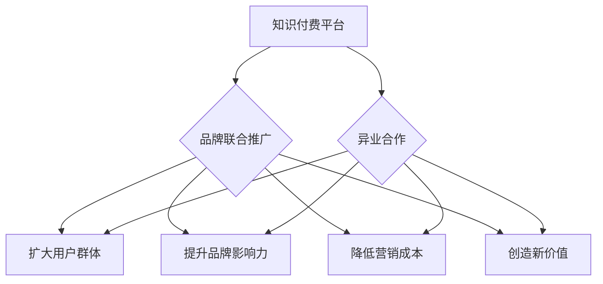

                 

## 知识付费赚钱的品牌联合推广与异业合作策略

> 关键词：知识付费、品牌联合推广、异业合作、合作策略、市场营销、内容运营、商业模式

## 1. 背景介绍

知识付费已成为近年来互联网行业发展的新趋势，其核心是将知识、技能、经验等价值转化为可交易的商品或服务。随着互联网普及和用户对知识的需求不断增长，知识付费市场规模持续扩大，涌现出众多成功案例。然而，知识付费市场竞争日益激烈，单打独斗难以获得持续发展。品牌联合推广和异业合作成为知识付费平台和创作者拓展市场、提升品牌影响力、增加收入的重要策略。

## 2. 核心概念与联系

### 2.1 品牌联合推广

品牌联合推广是指两个或多个品牌共同合作，利用各自的资源和优势，共同推广产品或服务，实现资源共享、互利共赢的目标。

### 2.2 异业合作

异业合作是指不同行业、不同业务模式的企业或个人之间建立合作关系，共同开发市场、共享资源、互补优势，实现共同发展。

**品牌联合推广与异业合作的联系**

品牌联合推广和异业合作都是一种合作模式，旨在通过资源整合和优势互补，实现共同目标。在知识付费领域，品牌联合推广和异业合作可以帮助知识付费平台和创作者：

* **拓展用户群体:** 通过合作，可以触达对方的用户群体，扩大知识付费产品的受众范围。
* **提升品牌影响力:** 与知名品牌合作，可以提升知识付费平台和创作者的品牌知名度和美誉度。
* **降低营销成本:** 通过资源共享，可以降低知识付费产品的推广成本。
* **创造新的价值:** 通过合作，可以开发新的知识付费产品或服务，满足用户多样化的需求。

**Mermaid 流程图**



## 3. 核心算法原理 & 具体操作步骤

### 3.1 算法原理概述

品牌联合推广和异业合作的成功关键在于找到合适的合作对象和制定有效的合作策略。

* **合作对象选择:** 

需要考虑合作对象的行业、目标用户、品牌形象、资源优势等因素，选择与自身业务模式和目标用户群体相匹配的合作对象。

* **合作策略制定:** 

需要根据合作对象的资源优势和自身需求，制定具体的合作方案，例如联合推广活动、资源共享、产品捆绑销售等。

### 3.2 算法步骤详解

1. **市场调研:** 

对目标用户群体、竞争对手、市场趋势等进行深入调研，了解知识付费市场的发展现状和用户需求。

2. **合作对象筛选:** 

根据市场调研结果，筛选潜在的合作对象，并进行初步的沟通和评估。

3. **合作方案设计:** 

根据合作对象的资源优势和自身需求，设计具体的合作方案，明确合作目标、合作内容、合作方式、收益分配等关键要素。

4. **合作协议签订:** 

双方达成合作意向后，签订正式的合作协议，明确合作双方权利义务和风险责任。

5. **合作执行:** 

双方按照合作协议内容，共同执行合作方案，定期进行沟通和评估，及时调整合作策略。

6. **合作成果评估:** 

合作结束后，对合作成果进行评估，分析合作效果，总结经验教训，为未来合作提供参考。

### 3.3 算法优缺点

**优点:**

* 能够有效拓展用户群体，提升品牌影响力。
* 能够降低营销成本，提高资源利用效率。
* 能够创造新的价值，满足用户多样化的需求。

**缺点:**

* 需要投入一定的时间和精力进行合作谈判和管理。
* 需要与合作对象进行充分的沟通和协调，避免利益冲突。
* 需要对合作对象的资质和信誉进行严格的评估，避免合作风险。

### 3.4 算法应用领域

品牌联合推广和异业合作的应用领域非常广泛，在知识付费领域，可以应用于以下场景：

* **知识付费平台与教育机构合作:** 

知识付费平台可以与教育机构合作，提供在线课程、培训服务等，满足用户对教育的需求。

* **知识付费平台与企业合作:** 

知识付费平台可以与企业合作，提供员工培训、技能提升等服务，帮助企业提升员工素质和竞争力。

* **知识付费平台与媒体平台合作:** 

知识付费平台可以与媒体平台合作，进行联合推广活动，扩大知识付费产品的曝光度。

## 4. 数学模型和公式 & 详细讲解 & 举例说明

### 4.1 数学模型构建

品牌联合推广和异业合作的成功可以看作是一个优化问题，目标是最大化合作带来的收益，同时最小化合作带来的风险。

我们可以构建一个数学模型来描述这个优化问题：

$$
\text{目标函数: }  \text{收益} - \text{风险}
$$

其中：

* **收益:**  由合作带来的收入增长、品牌影响力提升、用户增长等因素决定。
* **风险:** 由合作带来的潜在损失、品牌形象损害、用户流失等因素决定。

### 4.2 公式推导过程

为了量化收益和风险，我们可以使用以下公式：

* **收益:**  $$
\text{收益} = \alpha \times \text{收入增长} + \beta \times \text{品牌影响力提升} + \gamma \times \text{用户增长}
$$

其中：

* $\alpha$, $\beta$, $\gamma$ 为权重系数，用于衡量不同收益因素的重要性。

* **风险:** $$
\text{风险} = \delta \times \text{潜在损失} + \epsilon \times \text{品牌形象损害} + \zeta \times \text{用户流失}
$$

其中：

* $\delta$, $\epsilon$, $\zeta$ 为权重系数，用于衡量不同风险因素的重要性。

### 4.3 案例分析与讲解

假设一个知识付费平台与一家教育机构合作，推出在线课程。

* **收益:** 

课程收入增长、平台品牌影响力提升、用户增长。

* **风险:** 

课程质量问题导致用户流失、品牌形象受损。

通过分析合作带来的收益和风险，平台可以制定相应的合作策略，例如：

* **提高课程质量:** 

邀请知名专家授课、提供优质的学习资源、建立完善的售后服务体系。

* **加强品牌宣传:** 

联合推广活动、媒体合作、用户口碑营销。

* **制定合理的收益分配方案:** 

确保双方利益共享，共同发展。

## 5. 项目实践：代码实例和详细解释说明

### 5.1 开发环境搭建

* **操作系统:**  Windows/macOS/Linux
* **编程语言:**  Python
* **开发工具:**  VS Code/PyCharm
* **数据库:**  MySQL/PostgreSQL

### 5.2 源代码详细实现

```python
# 知识付费平台与教育机构合作案例

class KnowledgePlatform:
    def __init__(self, name, user_base):
        self.name = name
        self.user_base = user_base

    def promote_course(self, education_institution, course_name):
        print(f"{self.name} 与 {education_institution.name} 联合推广课程：{course_name}")

class EducationInstitution:
    def __init__(self, name, course_catalog):
        self.name = name
        self.course_catalog = course_catalog

    def provide_course(self, course_name):
        print(f"{self.name} 提供课程：{course_name}")

# 实例化知识付费平台和教育机构
platform = KnowledgePlatform("知识星球", 10000)
institution = EducationInstitution("学堂在线", ["Python编程", "数据分析"])

# 联合推广课程
platform.promote_course(institution, "Python编程")
institution.provide_course("Python编程")
```

### 5.3 代码解读与分析

* **类定义:**  代码定义了两个类：`KnowledgePlatform` 和 `EducationInstitution`，分别代表知识付费平台和教育机构。
* **属性:**  每个类都有自己的属性，例如平台名称、用户数量、机构名称、课程目录等。
* **方法:**  每个类都有自己的方法，例如平台的 `promote_course` 方法，机构的 `provide_course` 方法等。
* **实例化:**  代码实例化了两个对象，分别代表知识付费平台和教育机构。
* **方法调用:**  代码调用了平台和机构的方法，模拟了联合推广课程的场景。

### 5.4 运行结果展示

```
知识星球 与 学堂在线 联合推广课程：Python编程
学堂在线 提供课程：Python编程
```

## 6. 实际应用场景

### 6.1 案例分析

* **网易云课堂与高校合作:**  网易云课堂与高校合作，推出线上课程，利用高校的教学资源和师资力量，吸引更多用户。
* **腾讯课堂与企业合作:**  腾讯课堂与企业合作，提供员工培训课程，帮助企业提升员工技能和竞争力。
* **知乎与专家合作:**  知乎与专家合作，推出付费专栏，提供专业知识和 insights，吸引付费用户。

### 6.2 未来应用展望

随着知识付费市场的发展，品牌联合推广和异业合作将更加广泛地应用于以下场景：

* **跨界合作:**  不同行业、不同领域之间的合作，例如教育机构与科技公司合作，开发融合教育和科技的知识付费产品。
* **个性化定制:**  根据用户的需求和喜好，定制个性化的知识付费产品，例如针对不同职业、不同年龄段的用户，提供个性化的培训课程。
* **虚拟现实和增强现实:**  利用虚拟现实和增强现实技术，打造沉浸式的知识付费体验，例如虚拟课堂、虚拟实验室等。

## 7. 工具和资源推荐

### 7.1 学习资源推荐

* **书籍:**  《知识付费商业模式》、《互联网营销》、《品牌管理》
* **在线课程:**  Coursera、Udemy、edX
* **博客和网站:**  TechCrunch、VentureBeat、MarketingProfs

### 7.2 开发工具推荐

* **编程语言:**  Python、Java、JavaScript
* **开发框架:**  Django、Flask、React、Angular
* **数据库:**  MySQL、PostgreSQL、MongoDB

### 7.3 相关论文推荐

* **品牌联合推广:**  "Brand Alliances: A Review and Research Agenda"
* **异业合作:**  "Strategic Alliances: An Overview"
* **知识付费:**  "The Rise of Knowledge as a Commodity: Implications for Education and the Future of Work"

## 8. 总结：未来发展趋势与挑战

### 8.1 研究成果总结

品牌联合推广和异业合作是知识付费平台和创作者拓展市场、提升品牌影响力、增加收入的重要策略。通过找到合适的合作对象和制定有效的合作方案，可以实现资源共享、互利共赢的目标。

### 8.2 未来发展趋势

* **更加细分的合作模式:**  根据不同用户的需求和喜好，开发更加细分的合作模式，例如针对不同职业、不同年龄段的用户，提供个性化的培训课程。
* **跨界合作的增多:**  不同行业、不同领域之间的合作将更加广泛，例如教育机构与科技公司合作，开发融合教育和科技的知识付费产品。
* **技术驱动的创新:**  利用虚拟现实和增强现实技术，打造沉浸式的知识付费体验，例如虚拟课堂、虚拟实验室等。

### 8.3 面临的挑战

* **合作风险:**  需要对合作对象的资质和信誉进行严格的评估，避免合作风险。
* **利益分配:**  需要制定合理的收益分配方案，确保双方利益共享，共同发展。
* **用户体验:**  需要不断提升用户体验，才能吸引和留住用户。

### 8.4 研究展望

未来研究可以关注以下几个方面：

* **品牌联合推广和异业合作的评估指标体系:**  建立更加科学、合理的评估指标体系，能够更加准确地衡量合作效果。
* **不同合作模式的优劣分析:**  对不同合作模式进行深入分析，找到最适合知识付费平台和创作者的合作模式。
* **技术驱动的知识付费创新:**  探索利用人工智能、大数据等技术，打造更加智能化、个性化的知识付费体验。

## 9. 附录：常见问题与解答

**Q1: 如何选择合适的合作对象？**

A1:  需要根据自身业务模式和目标用户群体，选择与自身资源和需求相匹配的合作对象。

**Q2: 如何制定有效的合作方案？**

A2:  需要明确合作目标、合作内容、合作方式、收益分配等关键要素，并进行充分的沟通和协商。

**Q3: 如何评估合作效果？**

A3:  可以根据预设的指标体系，例如收入增长、品牌影响力提升、用户增长等，评估合作效果。


作者：禅与计算机程序设计艺术 / Zen and the Art of Computer Programming 
<end_of_turn>

