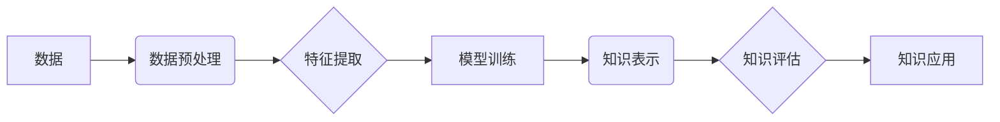

                 

## 知识发现引擎与人类认知极限的突破

> 关键词：知识发现引擎、机器学习、深度学习、自然语言处理、数据挖掘、认知科学、人工智能、人类认知极限

## 1. 背景介绍

人类文明的进步离不开对知识的不断发现和积累。从古至今，人类一直在探索如何更有效地获取、组织和利用知识。随着信息时代的到来，海量数据涌现，传统知识发现方法已难以应对。知识发现引擎应运而生，它利用机器学习、深度学习等人工智能技术，从海量数据中挖掘出隐藏的知识和模式，帮助人类突破认知极限，洞察世界奥秘。

## 2. 核心概念与联系

**2.1 知识发现引擎**

知识发现引擎是一种能够从数据中自动发现、提取和解释有价值知识的系统。它通常由以下几个核心模块组成：

* **数据预处理模块:** 对原始数据进行清洗、转换和格式化，使其适合后续分析。
* **特征提取模块:** 从数据中提取关键特征，用于后续模型训练和知识发现。
* **模型训练模块:** 利用机器学习算法训练模型，学习数据中的模式和规律。
* **知识表示模块:** 将发现的知识以可理解的形式表示出来，例如规则、图谱、文本等。
* **知识评估模块:** 对发现的知识进行评估和验证，确保其准确性和可靠性。

**2.2 人类认知极限**

人类认知能力有限，受限于记忆、注意力、推理等方面的限制。面对海量数据，人类难以有效地发现其中的隐藏知识。知识发现引擎可以帮助人类克服这些认知极限，扩展人类的知觉范围。

**2.3 核心概念架构**



## 3. 核心算法原理 & 具体操作步骤

**3.1 算法原理概述**

知识发现引擎通常采用机器学习算法，例如监督学习、无监督学习和半监督学习。

* **监督学习:** 利用标记数据训练模型，预测未知数据类别或属性。
* **无监督学习:** 从未标记数据中发现模式和结构。
* **半监督学习:** 利用少量标记数据和大量未标记数据训练模型。

**3.2 算法步骤详解**

1. **数据收集和预处理:** 收集相关数据，并进行清洗、转换和格式化。
2. **特征工程:** 从数据中提取关键特征，用于模型训练。
3. **模型选择和训练:** 选择合适的机器学习算法，并根据训练数据训练模型。
4. **模型评估和优化:** 对模型进行评估，并根据评估结果进行调整和优化。
5. **知识提取和表示:** 利用训练好的模型，从数据中提取知识，并将其以可理解的形式表示出来。

**3.3 算法优缺点**

* **优点:** 能够自动发现隐藏的知识，提高知识发现效率。
* **缺点:** 需要大量数据进行训练，对数据质量要求较高。

**3.4 算法应用领域**

* **商业智能:** 从销售数据中发现客户行为模式，优化营销策略。
* **医疗诊断:** 从患者数据中发现疾病特征，辅助医生诊断。
* **金融风险管理:** 从交易数据中发现风险模式，降低金融风险。
* **科学研究:** 从实验数据中发现科学规律，推动科学发展。

## 4. 数学模型和公式 & 详细讲解 & 举例说明

**4.1 数学模型构建**

知识发现引擎通常采用概率模型或统计模型来描述数据和知识之间的关系。例如，可以使用贝叶斯网络、隐马尔可夫模型等模型来表示知识图谱或文本语义。

**4.2 公式推导过程**

例如，贝叶斯网络中的条件概率公式可以表示为：

$$P(A|B) = \frac{P(B|A)P(A)}{P(B)}$$

其中：

* $P(A|B)$ 是在已知事件 B 发生的情况下，事件 A 发生的概率。
* $P(B|A)$ 是在已知事件 A 发生的情况下，事件 B 发生的概率。
* $P(A)$ 是事件 A 发生的概率。
* $P(B)$ 是事件 B 发生的概率。

**4.3 案例分析与讲解**

例如，在文本分类任务中，可以使用朴素贝叶斯算法来构建一个概率模型。该模型假设每个特征独立地对分类结果产生影响。根据训练数据，可以计算出每个特征在不同类别文本中的出现概率，然后利用贝叶斯公式计算出文本属于不同类别的概率。

## 5. 项目实践：代码实例和详细解释说明

**5.1 开发环境搭建**

* Python 3.x
* Jupyter Notebook
* scikit-learn
* TensorFlow/PyTorch

**5.2 源代码详细实现**

```python
from sklearn.model_selection import train_test_split
from sklearn.naive_bayes import MultinomialNB
from sklearn.metrics import accuracy_score

# 加载数据
data = ...

# 分割训练集和测试集
X_train, X_test, y_train, y_test = train_test_split(data[:, :-1], data[:, -1], test_size=0.2)

# 创建朴素贝叶斯模型
model = MultinomialNB()

# 训练模型
model.fit(X_train, y_train)

# 预测测试集结果
y_pred = model.predict(X_test)

# 计算准确率
accuracy = accuracy_score(y_test, y_pred)
print(f"准确率: {accuracy}")
```

**5.3 代码解读与分析**

* 使用 scikit-learn 库加载数据、分割训练集和测试集、创建朴素贝叶斯模型、训练模型和评估模型性能。
* 朴素贝叶斯算法是一种基于贝叶斯定理的分类算法，假设特征之间相互独立。

**5.4 运行结果展示**

运行代码后，会输出模型的准确率。

## 6. 实际应用场景

**6.1 商业智能**

* **客户行为分析:** 从客户购买记录、浏览历史等数据中发现客户行为模式，例如购买偏好、消费习惯等，帮助企业制定个性化营销策略。
* **市场趋势预测:** 从市场数据中发现产品需求趋势、竞争对手动态等，帮助企业制定产品策略和市场营销计划。

**6.2 医疗诊断**

* **疾病诊断辅助:** 从患者病历、检查结果等数据中发现疾病特征，辅助医生进行诊断。
* **药物研发:** 从生物数据中发现药物作用机制、潜在药物靶点等，加速药物研发过程。

**6.3 金融风险管理**

* **欺诈检测:** 从交易数据中发现异常交易模式，识别欺诈行为。
* **信用风险评估:** 从客户信用记录等数据中评估客户信用风险，降低贷款风险。

**6.4 未来应用展望**

* **个性化教育:** 根据学生的学习情况和兴趣爱好，提供个性化的学习内容和教学方法。
* **智能制造:** 利用知识发现引擎优化生产流程、预测设备故障等，提高制造效率和产品质量。
* **科学发现:** 从海量科研数据中发现新的科学规律和知识，推动科学发展。

## 7. 工具和资源推荐

**7.1 学习资源推荐**

* **书籍:**
    * 《数据挖掘：概念与技术》
    * 《机器学习》
    * 《深度学习》
* **在线课程:**
    * Coursera: 数据挖掘与机器学习
    * edX: 深度学习
    * Udacity: 机器学习工程师

**7.2 开发工具推荐**

* **Python:** 广泛应用于数据挖掘和机器学习领域，拥有丰富的库和工具。
* **scikit-learn:** Python 的机器学习库，提供各种算法和工具。
* **TensorFlow/PyTorch:** 深度学习框架，用于训练和部署深度学习模型。

**7.3 相关论文推荐**

* 《A Survey of Transfer Learning》
* 《Deep Learning》
* 《Knowledge Discovery and Data Mining》

## 8. 总结：未来发展趋势与挑战

**8.1 研究成果总结**

知识发现引擎在各个领域取得了显著成果，例如商业智能、医疗诊断、金融风险管理等。

**8.2 未来发展趋势**

* **更强大的模型:** 研究更强大的深度学习模型，例如 Transformer、BERT 等，提高知识发现的准确性和效率。
* **更丰富的知识表示:** 研究更丰富的知识表示形式，例如图谱、知识图谱等，更好地表达知识之间的关系。
* **更智能的交互:** 研究更智能的知识发现引擎，能够理解人类自然语言，并提供更直观、易懂的知识呈现方式。

**8.3 面临的挑战**

* **数据质量:** 知识发现引擎对数据质量要求较高，需要解决数据清洗、预处理等问题。
* **算法解释性:** 许多深度学习模型的决策过程难以解释，需要研究更可解释的算法。
* **知识可信度:** 发现的知识需要进行验证和评估，确保其准确性和可靠性。

**8.4 研究展望**

未来，知识发现引擎将继续朝着更智能、更强大、更可解释的方向发展，为人类社会带来更多价值。


## 9. 附录：常见问题与解答

**9.1 如何选择合适的知识发现算法？**

选择合适的知识发现算法需要根据具体任务和数据特点进行选择。例如，对于分类任务，可以考虑朴素贝叶斯、支持向量机等算法；对于聚类任务，可以考虑k-means、层次聚类等算法。

**9.2 如何评估知识发现引擎的性能？**

知识发现引擎的性能可以根据具体任务进行评估。例如，对于分类任务，可以使用准确率、召回率、F1-score 等指标进行评估；对于聚类任务，可以使用轮廓系数、Silhouette score 等指标进行评估。

**9.3 如何解决数据质量问题？**

数据质量问题是知识发现引擎面临的挑战之一。可以采用以下方法解决数据质量问题：

* 数据清洗：删除重复数据、错误数据等。
* 数据转换：将数据转换为统一格式。
* 数据标准化：将数据进行归一化处理。


作者：禅与计算机程序设计艺术 / Zen and the Art of Computer Programming 
<end_of_turn>

