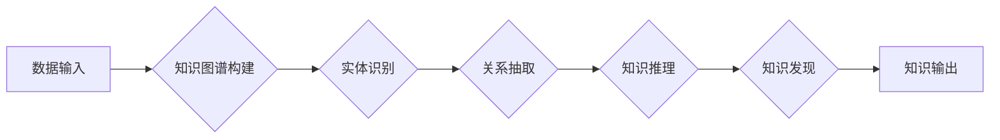

                 

## 知识发现引擎：人类认知的新纪元

> 关键词：知识图谱、机器学习、深度学习、自然语言处理、知识推理、知识发现、人工智能

### 1. 背景介绍

人类文明的进步离不开对知识的不断发现、积累和应用。从古至今，人类一直在探索如何更有效地获取、组织和利用知识。随着信息技术的飞速发展，海量数据涌现，传统的知识发现方法已难以应对。知识发现引擎应运而生，它利用人工智能技术，从海量数据中挖掘隐藏的知识，为人类认知带来新的突破。

传统的知识发现方法主要依赖于人工干预，需要专家进行数据清洗、特征提取、规则定义等操作，效率低下且难以扩展。而知识发现引擎则通过机器学习、深度学习等算法，自动学习数据模式和关系，无需人工干预即可发现隐藏的知识。

### 2. 核心概念与联系

**2.1 知识图谱**

知识图谱是一种结构化的知识表示形式，它将知识表示为实体和关系的网络结构。实体代表现实世界中的事物，关系代表事物之间的联系。知识图谱可以有效地组织和存储知识，并为知识推理和查询提供基础。

**2.2 机器学习**

机器学习是人工智能领域的重要分支，它通过算法训练模型，使模型能够从数据中学习规律，并对新数据进行预测或分类。机器学习算法可以用于知识发现引擎中的各种任务，例如实体识别、关系抽取、知识链接等。

**2.3 深度学习**

深度学习是机器学习的子领域，它利用多层神经网络模拟人类大脑的学习过程。深度学习算法能够学习更复杂的知识表示，并取得更优的性能。

**2.4 自然语言处理**

自然语言处理（NLP）是人工智能领域的重要分支，它致力于使计算机能够理解和处理人类语言。NLP技术可以用于知识发现引擎中的文本数据分析，例如文本分类、主题提取、关系抽取等。

**2.5 知识推理**

知识推理是指根据已有的知识，推导出新的知识的过程。知识发现引擎可以利用知识图谱和推理算法，从已有的知识中推导出新的结论，发现隐藏的知识关系。

**2.6 知识发现**

知识发现是指从海量数据中挖掘隐藏的知识的过程。知识发现引擎通过机器学习、深度学习、自然语言处理等技术，从数据中发现模式、关系和趋势，并将其转化为可理解的知识。

**2.7 人工智能**

人工智能（AI）是模拟和扩展人类智能的计算机科学领域。知识发现引擎是人工智能的重要应用之一，它利用人工智能技术，帮助人类更有效地发现和利用知识。

**Mermaid 流程图**



### 3. 核心算法原理 & 具体操作步骤

**3.1 算法原理概述**

知识发现引擎的核心算法通常基于机器学习和深度学习技术。这些算法可以自动学习数据模式和关系，并进行知识表示和推理。常见的算法包括：

* **图神经网络 (GNN)**：用于学习知识图谱中的实体和关系表示，并进行知识推理和预测。
* **深度信念网络 (DBN)**：用于从文本数据中提取特征和主题，并进行知识发现。
* **循环神经网络 (RNN)**：用于处理序列数据，例如文本和时间序列，并进行知识发现。

**3.2 算法步骤详解**

1. **数据预处理**: 对原始数据进行清洗、格式化和转换，使其适合算法训练。
2. **特征提取**: 从数据中提取有用的特征，例如实体、关系、文本内容等。
3. **模型训练**: 使用机器学习或深度学习算法，训练模型以学习数据模式和关系。
4. **知识表示**: 将训练好的模型应用于新的数据，进行知识表示，例如构建知识图谱。
5. **知识推理**: 利用知识图谱和推理算法，从已有的知识中推导出新的结论。
6. **知识输出**: 将发现的知识以可理解的形式输出，例如文本报告、可视化图表等。

**3.3 算法优缺点**

* **优点**: 自动化知识发现，提高效率和准确性；能够处理海量数据；发现隐藏的知识关系。
* **缺点**: 需要大量数据进行训练；算法复杂度高；解释性较差。

**3.4 算法应用领域**

* **科学研究**: 从科研论文和实验数据中发现新的科学规律。
* **商业分析**: 从市场数据和客户行为数据中发现商业机会。
* **医疗诊断**: 从患者病历和医学文献中发现疾病诊断线索。
* **教育教学**: 从学习数据和教学资源中发现个性化学习路径。

### 4. 数学模型和公式 & 详细讲解 & 举例说明

**4.1 数学模型构建**

知识发现引擎的数学模型通常基于图论、概率论和统计学。

* **图论**: 用于表示知识图谱中的实体和关系。
* **概率论**: 用于计算实体和关系之间的概率关系。
* **统计学**: 用于分析数据分布和模式。

**4.2 公式推导过程**

例如，在知识链接任务中，可以使用概率模型来计算实体对之间的链接概率。假设实体A和实体B之间存在一个关系R，则链接概率可以表示为：

$$P(R(A,B)) = \frac{e^{w_R \cdot f(A,B)}}{\sum_{r \in R} e^{w_r \cdot f(A,B)}}$$

其中：

* $w_R$ 是关系R的权重。
* $f(A,B)$ 是实体A和实体B的特征向量。

**4.3 案例分析与讲解**

假设我们有一个知识图谱，包含实体“苹果”和“香蕉”，以及关系“颜色”。我们可以使用上述公式计算“苹果”和“香蕉”之间“颜色”关系的链接概率。如果我们知道“苹果”的颜色是红色，“香蕉”的颜色是黄色，我们可以根据这些特征计算出“颜色”关系的链接概率。

### 5. 项目实践：代码实例和详细解释说明

**5.1 开发环境搭建**

* Python 3.x
* TensorFlow 或 PyTorch
* Jupyter Notebook

**5.2 源代码详细实现**

```python
import tensorflow as tf

# 定义模型结构
model = tf.keras.Sequential([
    tf.keras.layers.Embedding(input_dim=10000, output_dim=128),
    tf.keras.layers.LSTM(units=64),
    tf.keras.layers.Dense(units=1, activation='sigmoid')
])

# 编译模型
model.compile(optimizer='adam', loss='binary_crossentropy', metrics=['accuracy'])

# 训练模型
model.fit(x_train, y_train, epochs=10)

# 预测结果
predictions = model.predict(x_test)
```

**5.3 代码解读与分析**

* 该代码示例展示了使用深度学习模型进行知识链接预测的简单实现。
* 模型结构包括嵌入层、LSTM层和全连接层。
* 嵌入层将实体表示为向量。
* LSTM层用于处理实体之间的关系。
* 全连接层输出实体对之间链接的概率。

**5.4 运行结果展示**

训练完成后，可以使用模型预测新的实体对之间的链接概率。

### 6. 实际应用场景

**6.1 科学研究**

* 从科研论文中发现新的研究方向和合作机会。
* 从实验数据中发现新的科学规律和现象。

**6.2 商业分析**

* 从市场数据中发现新的市场趋势和客户需求。
* 从客户行为数据中发现新的营销策略和产品开发方向。

**6.3 医疗诊断**

* 从患者病历中发现潜在的疾病诊断线索。
* 从医学文献中发现新的治疗方案和药物研发方向。

**6.4 未来应用展望**

* 人工智能辅助决策
* 个性化教育
* 智能城市建设
* 科学发现加速

### 7. 工具和资源推荐

**7.1 学习资源推荐**

* **书籍**:
    * 《深度学习》
    * 《图神经网络》
    * 《自然语言处理》
* **在线课程**:
    * Coursera
    * edX
    * Udacity

**7.2 开发工具推荐**

* **Python**: 广泛用于机器学习和深度学习开发。
* **TensorFlow**: 开源深度学习框架。
* **PyTorch**: 开源深度学习框架。
* **Neo4j**: 图数据库。

**7.3 相关论文推荐**

* 《Knowledge Graph Embedding: A Survey》
* 《Graph Convolutional Networks for Web-Scale Recommender Systems》
* 《Attention Is All You Need》

### 8. 总结：未来发展趋势与挑战

**8.1 研究成果总结**

知识发现引擎在人工智能领域取得了显著进展，能够有效地从海量数据中发现隐藏的知识。

**8.2 未来发展趋势**

* **更强大的算法**: 开发更强大的机器学习和深度学习算法，提高知识发现的准确性和效率。
* **更丰富的知识表示**: 探索更丰富的知识表示形式，例如多模态知识图谱和动态知识图谱。
* **更智能的推理**: 开发更智能的知识推理算法，能够进行更复杂的知识推导和解释。
* **更广泛的应用**: 将知识发现引擎应用于更多领域，例如医疗、教育、金融等。

**8.3 面临的挑战**

* **数据质量**: 知识发现引擎依赖于高质量的数据，而现实世界的数据往往存在噪声、不完整和矛盾等问题。
* **算法解释性**: 许多机器学习和深度学习算法的决策过程难以解释，这使得知识发现的结果难以被理解和信任。
* **知识可视化**: 如何将发现的知识以可理解的方式呈现给人类，是知识发现引擎面临的另一个挑战。

**8.4 研究展望**

未来，知识发现引擎将继续朝着更智能、更强大、更广泛的方向发展，为人类认知带来新的突破。


### 9. 附录：常见问题与解答

**9.1 如何选择合适的知识发现引擎？**

选择合适的知识发现引擎需要根据具体应用场景和需求进行评估。需要考虑以下因素：

* 数据类型和规模
* 知识发现任务类型
* 算法性能和效率
* 开发成本和维护成本

**9.2 如何评估知识发现引擎的性能？**

知识发现引擎的性能可以评估以下指标：

* 准确率
* 召回率
* F1-score
* 运行时间

**9.3 如何解决知识发现引擎的数据质量问题？**

可以采用以下方法解决数据质量问题：

* 数据清洗：去除数据中的噪声、重复和错误信息。
* 数据标准化：将数据转换为统一的格式。
* 数据验证：使用规则或人工验证数据质量。


作者：禅与计算机程序设计艺术 / Zen and the Art of Computer Programming 
<end_of_turn>

