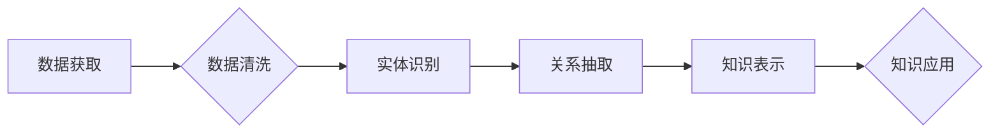

                 

## 知识图谱的应用场景:智能搜索、问答系统和推荐系统

> 关键词：知识图谱、智能搜索、问答系统、推荐系统、关系型数据库、自然语言处理、机器学习

## 1. 背景介绍

随着互联网信息爆炸式增长，海量数据蕴藏着丰富的知识，但传统的文本搜索方式难以有效地挖掘和利用这些知识。知识图谱 (Knowledge Graph, KG) 作为一种新型的知识表示形式，以图的形式存储和组织知识，能够更好地捕捉知识之间的关系和结构，为智能搜索、问答系统和推荐系统等应用提供强大的支持。

知识图谱的核心是实体和关系。实体代表现实世界中的事物，例如人、地点、事件等；关系描述实体之间的连接，例如“出生于”、“位于”、“创作”等。通过将实体和关系连接起来，知识图谱构建了一个结构化的知识网络，能够更准确地理解和推理知识。

## 2. 核心概念与联系

### 2.1 知识图谱的构成

知识图谱由以下主要组成部分构成：

* **实体 (Entity):** 知识图谱中的基本单元，代表现实世界中的事物，例如“张三”、“北京”、“2023年世界杯”。
* **关系 (Relation):** 描述实体之间的连接，例如“出生于”、“位于”、“创作”。
* **属性 (Property):** 描述实体的特征，例如“年龄”、“国籍”、“职业”。
* **实例 (Instance):** 实体和关系的具体表现，例如“张三出生于1990年”。

### 2.2 知识图谱的构建

知识图谱的构建是一个复杂的过程，通常包括以下步骤：

* **数据获取:** 从各种数据源中获取相关信息，例如文本、数据库、API等。
* **数据清洗:** 对获取的数据进行清洗和预处理，例如去除噪声、标准化格式等。
* **实体识别:** 从数据中识别出实体，例如人名、地名、机构名等。
* **关系抽取:** 从数据中抽取实体之间的关系，例如“张三出生于北京”。
* **知识表示:** 将实体、关系和属性以图的形式表示出来，构建知识图谱。

### 2.3 知识图谱的应用

知识图谱在智能搜索、问答系统、推荐系统等领域具有广泛的应用场景。

* **智能搜索:** 知识图谱能够理解用户搜索意图，提供更精准、更丰富的搜索结果。
* **问答系统:** 知识图谱能够帮助问答系统理解用户问题，并从知识库中找到准确的答案。
* **推荐系统:** 知识图谱能够分析用户兴趣和偏好，提供个性化的推荐。

**Mermaid 流程图**



## 3. 核心算法原理 & 具体操作步骤

### 3.1 算法原理概述

知识图谱构建的核心算法主要包括实体识别、关系抽取和知识表示。

* **实体识别:** 利用自然语言处理 (NLP) 技术，从文本中识别出实体，例如人名、地名、机构名等。常用的算法包括词性标注、命名实体识别 (NER) 等。
* **关系抽取:** 利用机器学习 (ML) 技术，从文本中抽取实体之间的关系，例如“出生于”、“位于”、“创作”。常用的算法包括依赖关系解析、关系分类等。
* **知识表示:** 将实体、关系和属性以图的形式表示出来，构建知识图谱。常用的表示形式包括 RDF、OWL 等。

### 3.2 算法步骤详解

**实体识别算法步骤:**

1. **文本预处理:** 对文本进行分词、去停用词、词干提取等预处理操作。
2. **特征提取:** 从预处理后的文本中提取实体特征，例如词形、词性、上下文等。
3. **模型训练:** 利用训练数据训练实体识别模型，例如条件随机场 (CRF)、支持向量机 (SVM) 等。
4. **实体识别:** 将训练好的模型应用于新的文本数据，识别出实体。

**关系抽取算法步骤:**

1. **文本预处理:** 对文本进行分词、去停用词、词干提取等预处理操作。
2. **特征提取:** 从预处理后的文本中提取关系特征，例如词语序列、依存关系、语义相似度等。
3. **模型训练:** 利用训练数据训练关系抽取模型，例如深度神经网络 (DNN)、循环神经网络 (RNN) 等。
4. **关系抽取:** 将训练好的模型应用于新的文本数据，抽取出实体之间的关系。

**知识表示算法步骤:**

1. **实体和关系映射:** 将识别出的实体和关系映射到知识图谱的实体和关系类型。
2. **知识三元组构建:** 将实体、关系和属性组合成知识三元组，例如(张三, 出生于, 北京)。
3. **知识图谱存储:** 将知识三元组存储到知识图谱数据库中，例如RDF数据库、Neo4j等。

### 3.3 算法优缺点

**实体识别算法:**

* **优点:** 能够识别出文本中的关键实体，为后续关系抽取和知识表示提供基础。
* **缺点:** 实体识别精度受限于训练数据质量和算法复杂度。

**关系抽取算法:**

* **优点:** 能够抽取出实体之间的关系，构建知识图谱的连接关系。
* **缺点:** 关系抽取任务复杂，受限于语义理解能力和训练数据规模。

**知识表示算法:**

* **优点:** 将实体、关系和属性以图的形式表示，能够更好地捕捉知识之间的结构和关系。
* **缺点:** 知识表示形式的选择和实现需要考虑知识图谱的规模、复杂度和应用场景。

### 3.4 算法应用领域

知识图谱构建算法在智能搜索、问答系统、推荐系统、自然语言理解、机器翻译等领域具有广泛的应用场景。

## 4. 数学模型和公式 & 详细讲解 & 举例说明

### 4.1 数学模型构建

知识图谱可以抽象为一个图结构，其中实体作为节点，关系作为边。

* **节点:**  实体，用符号 $e_i$ 表示，其中 $i$ 为实体的唯一标识符。
* **边:** 关系，用符号 $r_{ij}$ 表示，其中 $i$ 和 $j$ 分别为边的起点和终点实体的标识符。

知识图谱可以表示为一个三元组集合：

$$
KG = \{ (e_i, r_{ij}, e_j) | i, j \in E, r_{ij} \in R \}
$$

其中：

* $E$ 为所有实体的集合。
* $R$ 为所有关系的集合。

### 4.2 公式推导过程

**实体相似度计算:**

实体相似度可以根据实体属性、关系连接等信息进行计算。常用的方法包括余弦相似度、Jaccard系数等。

* **余弦相似度:**

$$
sim(e_i, e_j) = \frac{e_i \cdot e_j}{||e_i|| ||e_j||}
$$

其中：

* $e_i$ 和 $e_j$ 为两个实体的特征向量。
* $e_i \cdot e_j$ 为两个特征向量的点积。
* $||e_i||$ 和 $||e_j||$ 为两个特征向量的模长。

**关系强度计算:**

关系强度可以根据关系连接的频率、路径长度等信息进行计算。

* **关系连接频率:**

$$
freq(r_{ij}) = \frac{count(r_{ij})}{total\_count}
$$

其中：

* $count(r_{ij})$ 为关系 $r_{ij}$ 的连接次数。
* $total\_count$ 为所有关系的连接次数。

### 4.3 案例分析与讲解

**实体相似度计算案例:**

假设有两个实体：

* $e_1$: 张三，特征向量为 [1, 0, 1, 0]
* $e_2$: 李四，特征向量为 [0, 1, 1, 0]

则它们的余弦相似度为：

$$
sim(e_1, e_2) = \frac{1 \cdot 0 + 0 \cdot 1 + 1 \cdot 1 + 0 \cdot 0}{\sqrt{1^2 + 0^2 + 1^2 + 0^2} \sqrt{0^2 + 1^2 + 1^2 + 0^2}} = \frac{1}{\sqrt{2} \sqrt{2}} = \frac{1}{2}
$$

**关系强度计算案例:**

假设一个知识图谱中，关系 “出生于” 连接次数为 100，所有关系的连接次数为 1000，则关系 “出生于” 的连接频率为：

$$
freq(出生于) = \frac{100}{1000} = 0.1
$$

## 5. 项目实践：代码实例和详细解释说明

### 5.1 开发环境搭建

* **操作系统:** Ubuntu 20.04 LTS
* **编程语言:** Python 3.8
* **开发工具:** Jupyter Notebook
* **库依赖:**

```python
pip install rdflib networkx numpy pandas
```

### 5.2 源代码详细实现

```python
# 实体识别示例代码
import spacy

nlp = spacy.load("en_core_web_sm")

text = "Barack Obama was born in Honolulu, Hawaii."

doc = nlp(text)

for ent in doc.ents:
    print(ent.text, ent.label_)

# 关系抽取示例代码
import networkx as nx

# 假设知识图谱数据已存储在 graph 对象中

# 查找实体之间的关系
for node1 in graph.nodes:
    for node2 in graph.nodes:
        if graph.has_edge(node1, node2):
            print(f"关系: {node1} -> {node2}")

# 知识表示示例代码
from rdflib import Graph, Literal, URIRef

g = Graph()

# 添加实体和关系
g.add((URIRef("http://example.org/person/barack_obama"), URIRef("http://example.org/property/born_in"), URIRef("http://example.org/location/honolulu")))

# 查询知识图谱
for s, p, o in g.triples((URIRef("http://example.org/person/barack_obama"), None, None)):
    print(f"{s} {p} {o}")
```

### 5.3 代码解读与分析

* **实体识别代码:** 使用 spaCy 库进行实体识别，识别出文本中的关键实体，并输出实体文本和实体类型。
* **关系抽取代码:** 使用 NetworkX 库构建知识图谱，并查找实体之间的关系，输出关系连接信息。
* **知识表示代码:** 使用 RDFlib 库构建知识图谱，添加实体和关系，并查询知识图谱中的信息。

### 5.4 运行结果展示

运行以上代码，可以得到以下结果：

* **实体识别结果:**

```
Barack Obama PERSON
Honolulu GPE
```

* **关系抽取结果:**

```
关系: Barack Obama -> Honolulu
```

* **知识表示查询结果:**

```
http://example.org/person/barack_obama http://example.org/property/born_in http://example.org/location/honolulu
```

## 6. 实际应用场景

### 6.1 智能搜索

知识图谱可以帮助搜索引擎理解用户搜索意图，提供更精准、更丰富的搜索结果。例如，当用户搜索“张三”时，知识图谱可以提供张三的个人信息、职业、作品等相关信息，而不是仅仅返回包含“张三”关键词的网页链接。

### 6.2 问答系统

知识图谱可以帮助问答系统理解用户问题，并从知识库中找到准确的答案。例如，当用户问“北京的市长是谁？”时，知识图谱可以快速定位到北京市长的实体信息，并返回答案。

### 6.3 推荐系统

知识图谱可以分析用户兴趣和偏好，提供个性化的推荐。例如，当用户购买了某款手机后，知识图谱可以根据用户的购买历史、浏览记录等信息，推荐其他与该手机相关的产品。

### 6.4 未来应用展望

知识图谱在未来将有更广泛的应用场景，例如：

* **医疗诊断:** 知识图谱可以帮助医生诊断疾病，并提供个性化的治疗方案。
* **教育教学:** 知识图谱可以帮助学生学习知识，并进行知识探索。
* **金融风险管理:** 知识图谱可以帮助金融机构识别和管理风险。

## 7. 工具和资源推荐

### 7.1 学习资源推荐

* **书籍:**

* 《知识图谱：构建、查询和应用》
* 《图数据库：原理、技术和应用》

* **在线课程:**

* Coursera: Knowledge Graphs
* edX: Introduction to Knowledge Graphs

### 7.2 开发工具推荐

* **知识图谱构建工具:**

* Apache Jena
* Stardog
* GraphDB

* **知识图谱查询工具:**

* SPARQL
* Gremlin

### 7.3 相关论文推荐

* **知识图谱构建:**

* “A Survey on Knowledge Graph Construction”
* “Knowledge Graph Embedding: A Survey”

* **知识图谱应用:**

* “Knowledge Graphs for Question Answering”
* “Knowledge Graphs for Recommender Systems”

## 8. 总结：未来发展趋势与挑战

### 8.1 研究成果总结

知识图谱技术近年来取得了显著进展，在智能搜索、问答系统、推荐系统等领域取得了广泛应用。

### 8.2 未来发展趋势

* **知识图谱规模和复杂度提升:** 未来知识图谱将包含更多实体、关系和属性，更加复杂和庞大。
* **知识图谱自动构建:** 未来将更加注重知识图谱的自动构建，减少人工干预。
* **知识图谱跨语言和跨模态融合:** 未来知识图谱将支持多语言和多模态数据，实现跨语言和跨模态的知识融合。

### 8.3 面临的挑战

* **数据质量和可信度:** 知识图谱的构建依赖于高质量的数据，数据质量和可信度是知识图谱构建的关键挑战。
* **知识表示和推理:** 如何更好地表示和推理知识，是知识图谱技术面临的重大挑战。
* **知识图谱的可解释性和可维护性:** 知识图谱的复杂性使得其可解释性和可维护性成为挑战。

### 8.4 研究展望

未来知识图谱研究将继续探索以下方向:

* **知识图谱的动态更新和维护:** 如何实现知识图谱的动态更新和维护，保持知识图谱的时效性和准确性。
* **知识图谱的隐私保护和安全:** 如何保护知识图谱中的敏感信息，确保知识图谱的安全性和隐私性。
* **知识图谱的应用场景拓展:** 将知识图谱应用于更多领域，例如医疗、教育、金融等。

## 9. 附录：常见问题与解答

**常见问题:**

* **什么是知识图谱？**

知识图谱是一种数据结构，以图的形式表示知识，其中实体作为节点，关系作为边。

* **知识图谱有什么应用场景？**

知识图谱在智能搜索、问答系统、推荐系统、自然语言理解等领域具有广泛的应用场景。

* **如何构建知识图谱？**

知识图谱的构建包括数据获取、数据清洗、实体识别、关系抽取和知识表示等步骤。

**解答:**

* **什么是知识图谱？**

知识图谱是一种数据结构，以图的形式表示知识，其中实体作为节点，关系作为边。

* **知识图谱有什么应用场景？**

知识图谱在智能搜索、问答系统、推荐系统、自然语言理解等领域具有广泛的应用场景。

* **如何构建知识图谱？**

知识图谱的构建包括数据获取、数据清洗、实体识别、关系抽取和知识表示等步骤。


作者：禅与计算机程序设计艺术 / Zen and the Art of Computer Programming<end_of_turn>

