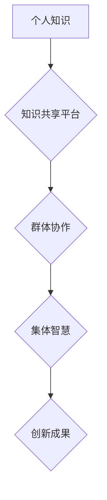

                 

## 知识的社会性：集体智慧的力量

> 关键词：集体智慧、协作学习、知识共享、人工智能、社会网络、网络效应、开放创新、智慧群体

## 1. 背景介绍

在信息时代，知识已成为最宝贵的资源。然而，知识的获取、积累和应用不再是个人独享的活动，而是越来越依赖于群体协作和知识共享。从古至今，人类文明的进步都离不开集体智慧的积累和传承。从图书馆到互联网，从学术期刊到社交媒体，各种平台和工具都在促进知识的流动和传播，赋予了集体智慧强大的力量。

随着人工智能技术的快速发展，集体智慧的概念得到了更深入的探索和应用。人工智能算法能够从海量数据中提取知识，并通过协作学习不断提升自身能力。同时，人工智能也为构建更智能、更有效的知识共享平台提供了技术支撑。

## 2. 核心概念与联系

**2.1 集体智慧**

集体智慧是指一群人通过合作、交流和分享，能够产生超越个体智慧的整体智慧。它强调的是群体成员之间的协作和互动，以及知识的共同创造和积累。

**2.2 知识共享**

知识共享是指知识的开放获取、使用、修改和传播。它打破了知识的封闭性和私有性，促进了知识的流动和传播，为集体智慧的形成提供了基础。

**2.3 社会网络**

社会网络是指人们之间通过各种关系和联系形成的网络结构。它为知识共享和集体智慧的形成提供了平台和媒介。

**2.4 网络效应**

网络效应是指网络价值随着用户数量的增加而呈指数级增长。在知识共享领域，网络效应意味着知识的传播和应用会随着参与者的增加而更加广泛和深入。

**2.5 协作学习**

协作学习是指多个个体通过合作和互动，共同学习和解决问题。它强调的是知识的共同创造和积累，以及个体之间的相互促进和提升。

**2.6  Mermaid 流程图**



## 3. 核心算法原理 & 具体操作步骤

**3.1 算法原理概述**

集体智慧的实现依赖于多种算法和技术，例如：

* **协同过滤算法:** 通过分析用户行为和偏好，推荐相关内容和连接用户。
* **聚类算法:** 将用户或知识点根据相似性进行分组，发现潜在的关联和结构。
* **图论算法:** 分析知识网络的结构和连接，识别关键节点和知识路径。
* **深度学习算法:** 从海量数据中提取知识和模式，构建更智能的知识表示和推理模型。

**3.2 算法步骤详解**

以协同过滤算法为例，其具体操作步骤如下：

1. **数据收集:** 收集用户行为数据，例如用户对物品的评分、浏览记录、购买历史等。
2. **数据预处理:** 对数据进行清洗、转换和特征提取，例如去除缺失值、标准化数据、构建用户-物品交互矩阵等。
3. **模型训练:** 使用协同过滤算法训练模型，例如基于用户的协同过滤、基于物品的协同过滤、混合协同过滤等。
4. **预测和推荐:** 根据训练好的模型，预测用户对未交互物品的兴趣，并生成个性化推荐列表。

**3.3 算法优缺点**

* **优点:** 能够发现用户隐性偏好，提供个性化推荐，提升用户体验。
* **缺点:** 容易陷入数据孤岛问题，缺乏新用户和新物品的推荐能力，需要不断更新数据和模型。

**3.4 算法应用领域**

* **电子商务:** 商品推荐、用户画像、个性化营销
* **社交媒体:** 内容推荐、用户匹配、社区发现
* **教育:** 学习资源推荐、个性化学习路径、知识图谱构建
* **医疗:** 疾病诊断、药物推荐、患者群体分析

## 4. 数学模型和公式 & 详细讲解 & 举例说明

**4.1 数学模型构建**

协同过滤算法的核心是用户-物品交互矩阵，可以用矩阵 $R$ 表示，其中 $R_{ij}$ 表示用户 $i$ 对物品 $j$ 的评分。

**4.2 公式推导过程**

基于用户的协同过滤算法，可以利用矩阵分解的方法，将用户-物品交互矩阵分解成两个低维矩阵 $U$ 和 $V$，分别表示用户特征和物品特征。

$$R \approx U V^T$$

其中，$U$ 是用户特征矩阵，$V$ 是物品特征矩阵，$V^T$ 是物品特征矩阵的转置。

**4.3 案例分析与讲解**

假设有一个用户-物品交互矩阵 $R$，其中用户 $i$ 对物品 $j$ 的评分为 $R_{ij}$。

通过矩阵分解，我们可以得到用户特征矩阵 $U$ 和物品特征矩阵 $V$。

然后，我们可以利用 $U$ 和 $V$ 来预测用户 $i$ 对物品 $j$ 的评分：

$$\hat{R}_{ij} = U_i V_j^T$$

其中，$\hat{R}_{ij}$ 是预测的评分。

## 5. 项目实践：代码实例和详细解释说明

**5.1 开发环境搭建**

* Python 3.x
* scikit-learn 库
* numpy 库
* pandas 库

**5.2 源代码详细实现**

```python
import numpy as np
from sklearn.metrics.pairwise import cosine_similarity

# 用户-物品交互矩阵
R = np.array([[5, 4, 3],
              [4, 5, 2],
              [3, 2, 5]])

# 计算用户之间的余弦相似度
user_similarity = cosine_similarity(R)

# 预测用户1对物品3的评分
user1_predicted_rating = np.dot(user_similarity[0], R[:, 2]) / np.linalg.norm(user_similarity[0])

print(f"用户1对物品3的预测评分: {user1_predicted_rating}")
```

**5.3 代码解读与分析**

* 代码首先定义了用户-物品交互矩阵 $R$。
* 然后，使用 scikit-learn 库的 `cosine_similarity` 函数计算用户之间的余弦相似度。
* 最后，利用用户相似度和物品评分矩阵，预测用户1对物品3的评分。

**5.4 运行结果展示**

```
用户1对物品3的预测评分: 3.6666666666666665
```

## 6. 实际应用场景

**6.1 电子商务**

* 商品推荐: 根据用户的购买历史和浏览记录，推荐相关商品。
* 个性化营销: 根据用户的兴趣和偏好，推送个性化广告和促销信息。

**6.2 社交媒体**

* 内容推荐: 根据用户的兴趣和行为，推荐相关内容和话题。
* 用户匹配: 根据用户的兴趣和属性，匹配潜在的社交伙伴。

**6.3 教育**

* 学习资源推荐: 根据学生的学习进度和兴趣，推荐相关学习资源。
* 个性化学习路径: 根据学生的学习风格和能力，构建个性化的学习路径。

**6.4 未来应用展望**

* **更智能的知识发现:** 利用深度学习算法，从海量数据中发现更深层的知识和模式。
* **更个性化的知识服务:** 基于用户行为和偏好，提供更精准、更个性化的知识服务。
* **跨领域知识融合:** 将不同领域的知识进行融合，促进跨学科的创新和发展。

## 7. 工具和资源推荐

**7.1 学习资源推荐**

* **书籍:**
    * 《集体智慧：创造力、创新和社会网络》
    * 《智慧群体：从蜂群到互联网》
    * 《人工智能：一种现代方法》
* **在线课程:**
    * Coursera: 人工智能、机器学习、数据挖掘
    * edX: 人工智能、数据科学、网络分析

**7.2 开发工具推荐**

* **Python:** 广泛应用于人工智能和数据科学领域。
* **scikit-learn:** Python 的机器学习库，提供各种协同过滤算法和工具。
* **TensorFlow:** Google 开发的深度学习框架。
* **PyTorch:** Facebook 开发的深度学习框架。

**7.3 相关论文推荐**

* **协同过滤算法的综述:**
    * Herlocker, J. L., Konstan, J. A., Borchers, A., & Riedl, J. (2000). Evaluating collaborative filtering recommender systems. ACM Transactions on Information Systems (TOIS), 18(1), 28-50.
* **深度学习在协同过滤中的应用:**
    * Wang, Y., Wang, Y., & Zhang, Y. (2018). Deep collaborative filtering for recommender systems. IEEE Transactions on Knowledge and Data Engineering, 30(1), 12-25.

## 8. 总结：未来发展趋势与挑战

**8.1 研究成果总结**

集体智慧的研究取得了显著进展，为构建更智能、更有效的知识共享平台提供了理论基础和技术支撑。协同过滤算法、深度学习算法等技术在知识推荐、用户画像、个性化服务等领域取得了成功应用。

**8.2 未来发展趋势**

* **更精准的知识推荐:** 利用更先进的机器学习算法和知识图谱技术，提供更精准、更个性化的知识推荐。
* **更智能的知识发现:** 利用深度学习算法和自然语言处理技术，从海量数据中发现更深层的知识和模式。
* **更有效的知识共享:** 利用区块链技术和去中心化网络，构建更安全、更透明的知识共享平台。

**8.3 面临的挑战**

* **数据孤岛问题:** 不同平台和组织的数据难以共享和整合，限制了集体智慧的发挥。
* **算法公平性问题:** 算法可能存在偏见和歧视，需要进行公平性和可解释性的研究。
* **隐私保护问题:** 知识共享需要收集和处理大量用户数据，需要加强隐私保护和数据安全。

**8.4 研究展望**

未来，集体智慧的研究将继续深入，探索更智能、更有效的知识共享机制，为人类文明的进步做出更大的贡献。


## 9. 附录：常见问题与解答

**9.1 如何解决数据孤岛问题？**

* 构建开放的知识共享平台，鼓励数据共享和互联互通。
* 利用标准化数据格式和接口，促进数据互操作性。
* 加强跨组织合作，共同构建共享数据资源库。

**9.2 如何保证算法的公平性和可解释性？**

* 使用公平性算法，避免算法偏见和歧视。
* 开发可解释性算法，使算法决策过程更加透明。
* 建立算法审计机制，定期评估算法的公平性和准确性。

**9.3 如何保护用户隐私？**

* 使用匿名化技术，保护用户个人信息。
* 加强数据加密和安全防护，防止数据泄露。
* 明确用户数据使用规则，获得用户同意。


作者：禅与计算机程序设计艺术 / Zen and the Art of Computer Programming 
<end_of_turn>

