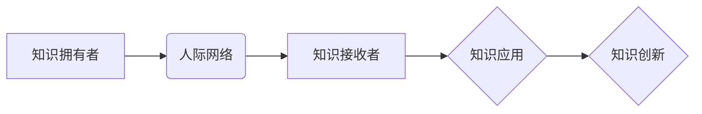

                 

## 知识的社会资本：人际网络中的信息流动

> 关键词：知识共享、人际网络、信息流动、社会资本、知识经济、网络效应

## 1. 背景介绍

在当今信息爆炸的时代，知识已成为最宝贵的资源。知识的获取、传播和应用，对于个人、组织和社会的发展都至关重要。而人际网络作为一种重要的社会结构，为知识的流动提供了广阔的平台。

传统上，知识的传播主要依赖于书本、期刊、会议等形式，效率相对较低。随着互联网和社交媒体的兴起，人际网络的规模和密度不断扩大，知识的传播速度和范围也得到了显著提升。

## 2. 核心概念与联系

### 2.1  知识共享

知识共享是指个人或组织将知识公开、免费地传播给其他人，以促进知识的积累和创新。它可以采取多种形式，例如：

* **开源软件：** 开发者将软件代码公开发布，允许他人免费使用、修改和分发。
* **在线课程：** 教育机构和个人将课程内容在线发布，供公众免费学习。
* **知识库：** 组织或个人建立在线知识库，收集和整理各种知识资源，供他人共享。

### 2.2  人际网络

人际网络是指个体之间相互联系形成的社会关系网络。它可以是线上网络，也可以是线下社交圈。人际网络中的节点代表个体，边代表个体之间的关系。

### 2.3  社会资本

社会资本是指个体或组织通过人际关系所积累的资源和优势。它包括：

* **信任：** 人际网络中的信任关系可以促进知识共享和合作。
* **信息：** 人际网络可以为个体提供各种信息资源，包括专业知识、市场信息和社会动态。
* **支持：** 人际网络可以为个体提供情感支持、资源支持和机会支持。

### 2.4  信息流动

信息流动是指信息在人际网络中传播的过程。它受多种因素影响，例如：

* **网络结构：** 网络的规模、密度和连接方式都会影响信息流动的速度和范围。
* **个体行为：** 个体的知识水平、信息需求和社交行为都会影响信息流动的方向和效率。
* **社会环境：** 社会文化、制度环境和技术环境都会影响信息流动的模式和效果。

**Mermaid 流程图**



## 3. 核心算法原理 & 具体操作步骤

### 3.1  算法原理概述

在人际网络中，信息流动的效率和效果受到网络结构和个体行为的影响。为了更好地理解和预测信息流动的规律，我们可以利用一些算法模型进行分析。

例如，**PageRank算法**可以用来衡量网络中节点的重要性，即节点的信息传播能力。该算法基于以下原理：

* 每个节点都拥有一个PageRank值，初始值均为1。
* 当一个节点被其他节点链接时，其PageRank值会增加。
* PageRank值会随着时间推移不断更新，最终趋于稳定。

### 3.2  算法步骤详解

PageRank算法的具体步骤如下：

1. **初始化：** 为每个节点赋予初始PageRank值，通常为1。
2. **迭代计算：** 对于每个节点，计算其PageRank值，公式如下：

$$PR(A) = (1-d) + d \sum_{B \in \text{in}(A)} \frac{PR(B)}{C(B)}$$

其中：

* $PR(A)$ 是节点A的PageRank值。
* $d$ 是阻尼系数，通常取值为0.85，表示一部分用户在每次跳转时会随机跳转到其他页面。
* $in(A)$ 是指向节点A的链接集合。
* $PR(B)$ 是节点B的PageRank值。
* $C(B)$ 是节点B的出度，即指向其他节点的链接数。

3. **更新PageRank值：** 将计算出的PageRank值更新到每个节点。
4. **重复迭代：** 重复步骤2和3，直到PageRank值趋于稳定。

### 3.3  算法优缺点

**优点：**

* 能够有效地衡量网络中节点的重要性。
* 算法原理简单易懂，易于实现。

**缺点：**

* 无法完全反映现实世界中节点的重要性，例如，一些新节点可能没有链接，但其信息价值很高。
* 算法对网络结构的假设较为简单，无法处理复杂网络结构。

### 3.4  算法应用领域

PageRank算法广泛应用于：

* **搜索引擎排名：** Google搜索引擎利用PageRank算法来衡量网页的重要性，并将其作为网页排名的一部分。
* **社交网络分析：** 分析社交网络中用户的重要性，例如，识别关键意见领袖。
* **推荐系统：** 推荐用户可能感兴趣的内容，例如，推荐用户可能喜欢的商品或文章。

## 4. 数学模型和公式 & 详细讲解 & 举例说明

### 4.1  数学模型构建

我们可以用一个图论模型来描述人际网络中的信息流动。

* **节点：** 代表个体或组织。
* **边：** 代表个体或组织之间的关系，例如，朋友关系、同事关系、合作关系等。

信息流动的过程可以看作是节点之间信息的传递。我们可以用以下公式来描述信息流动的速度：

$$F = \frac{K \cdot N}{D}$$

其中：

* $F$ 是信息流动的速度。
* $K$ 是网络中的知识共享强度，例如，个体分享信息的频率和数量。
* $N$ 是网络中的节点数量。
* $D$ 是网络中的信息传播阻力，例如，信息过滤、社会偏见等。

### 4.2  公式推导过程

该公式的推导过程如下：

* 信息流动的速度与知识共享强度成正比，因为知识共享强度越高，信息传播的速度越快。
* 信息流动的速度与网络规模成正比，因为网络规模越大，信息传播的路径越多，速度越快。
* 信息流动的速度与信息传播阻力成反比，因为信息传播阻力越大，信息传播的速度越慢。

### 4.3  案例分析与讲解

例如，在一个学术研究领域的人际网络中，

* $K$ 可以表示研究人员发表论文的频率和合作次数。
* $N$ 可以表示该领域的研究人员数量。
* $D$ 可以表示学术界的信息过滤机制，例如，同行评审、学术期刊的选刊标准等。

如果研究人员发表论文的频率和合作次数较高，网络规模较大，而学术界的信息过滤机制较弱，那么该领域的知识流动速度就会更快。

## 5. 项目实践：代码实例和详细解释说明

### 5.1  开发环境搭建

为了实现人际网络中的信息流动分析，我们可以使用Python语言和一些相关的库，例如：

* **NetworkX：** 用于构建和分析网络图。
* **Scikit-learn：** 用于机器学习算法的实现。
* **Matplotlib：** 用于数据可视化。

### 5.2  源代码详细实现

```python
import networkx as nx
import matplotlib.pyplot as plt

# 创建人际网络图
G = nx.Graph()
G.add_edges_from([(1, 2), (1, 3), (2, 3), (2, 4), (3, 5)])

# 计算节点的PageRank值
pagerank = nx.pagerank(G)

# 绘制网络图
nx.draw(G, with_labels=True)
plt.show()

# 打印节点的PageRank值
print(pagerank)
```

### 5.3  代码解读与分析

这段代码首先创建了一个简单的网络图，然后使用NetworkX库的pagerank函数计算每个节点的PageRank值。最后，使用Matplotlib库绘制网络图，并打印每个节点的PageRank值。

### 5.4  运行结果展示

运行这段代码后，会生成一个网络图，每个节点的大小代表其PageRank值的大小。

## 6. 实际应用场景

### 6.1  知识管理

企业可以利用人际网络分析来了解员工之间的知识流动情况，并制定相应的知识管理策略。例如，可以识别关键知识拥有者，建立知识共享平台，促进知识传播。

### 6.2  市场营销

企业可以利用人际网络分析来了解消费者之间的信息传播情况，并制定相应的市场营销策略。例如，可以识别关键意见领袖，进行精准营销，提高营销效果。

### 6.3  社会影响力分析

研究人员可以利用人际网络分析来研究社会影响力，例如，分析政治运动、社会运动和流行文化的传播路径。

### 6.4  未来应用展望

随着互联网和社交媒体的不断发展，人际网络的规模和复杂度将不断提高。未来，人际网络分析将应用于更广泛的领域，例如：

* **个性化教育：** 根据学生的学习情况和兴趣，提供个性化的学习资源和学习路径。
* **精准医疗：** 根据患者的基因信息和生活习惯，提供个性化的医疗方案。
* **城市规划：** 分析城市居民的出行模式和生活习惯，优化城市交通和公共服务。

## 7. 工具和资源推荐

### 7.1  学习资源推荐

* **书：**

    * 《网络科学：基础与应用》
    * 《社会网络分析》
    * 《人际网络中的信息流动》

* **网站：**

    * NetworkX官方网站：https://networkx.org/
    * Gephi：https://gephi.org/
    * UCINET：https://www.analytictech.com/ucinet/

### 7.2  开发工具推荐

* **Python：** 作为一种功能强大且易于学习的编程语言，Python非常适合进行网络分析。
* **NetworkX：** Python的网络分析库，提供丰富的网络图操作和分析功能。
* **Gephi：** 一个开源的网络可视化和分析软件，可以处理大型网络数据。

### 7.3  相关论文推荐

* **Barabási, A.-L. (2005). The origin of bursts and heavy tails in human dynamics. Nature, 435(7041), 207-211.**
* **Watts, D. J., & Strogatz, S. H. (1998). Collective dynamics of 'small-world' networks. Nature, 393(6684), 440-442.**
* **Newman, M. E. J. (2003). The structure and function of complex networks. SIAM review, 45(2), 167-256.**

## 8. 总结：未来发展趋势与挑战

### 8.1  研究成果总结

近年来，人际网络分析取得了显著进展，为我们理解社会现象、预测社会趋势提供了新的视角。

### 8.2  未来发展趋势

未来，人际网络分析将朝着以下方向发展：

* **更复杂网络的分析：** 随着网络规模和复杂度的不断提高，我们需要开发更强大的算法和工具来分析复杂网络。
* **多模态网络分析：** 人际网络不仅仅是节点之间的关系，还包含各种各样的信息，例如，文本信息、图像信息、视频信息等。未来，我们需要开发能够处理多模态网络的分析方法。
* **动态网络分析：** 人际网络是动态变化的，我们需要开发能够捕捉网络动态变化的方法。

### 8.3  面临的挑战

人际网络分析也面临着一些挑战：

* **数据获取和隐私保护：** 人际网络数据通常是敏感信息，我们需要确保数据获取和使用符合伦理和法律规范。
* **算法的解释性和可解释性：** 许多网络分析算法是黑箱模型，难以解释其结果，这限制了算法的应用。
* **跨学科合作：** 人际网络分析是一个跨学科领域，需要社会科学家、计算机科学家、统计学家等多学科专家合作才能取得突破。

### 8.4  研究展望

尽管面临挑战，但人际网络分析仍然是一个充满希望的领域。随着技术的进步和跨学科合作的加强，我们相信人际网络分析将在未来发挥越来越重要的作用，帮助我们更好地理解社会、预测社会趋势，并为社会发展做出贡献。

## 9. 附录：常见问题与解答

**1. 人际网络分析的应用领域有哪些？**

人际网络分析的应用领域非常广泛，包括：

* 知识管理
* 市场营销
* 社会影响力分析
* 教育
* 医疗
* 城市规划

**2. 如何构建人际网络图？**

构建人际网络图需要确定网络中的节点和边。节点可以代表个体或组织，边可以代表个体或组织之间的关系。可以使用各种方法收集网络数据，例如，问卷调查、社交媒体数据、网络日志等。

**3. 如何分析人际网络图？**

可以使用各种算法和工具来分析人际网络图，例如：

* **PageRank算法：** 用于衡量节点的重要性。
* **社区发现算法：** 用于发现网络中的社区结构。
* **网络拓扑分析：** 用于分析网络的结构特征，例如，网络的度分布、路径长度等。

**4. 人际网络分析的伦理问题有哪些？**

人际网络分析涉及到个人隐私和数据安全问题，需要谨慎处理。

* **数据获取和使用：** 确保数据获取和使用符合伦理和法律规范。
* **数据匿名化：** 尽可能匿名化个人数据，保护个人隐私。
* **算法透明度：** 提高算法的透明度，让用户了解算法是如何工作的。


作者：禅与计算机程序设计艺术 / Zen and the Art of Computer Programming<end_of_turn>

