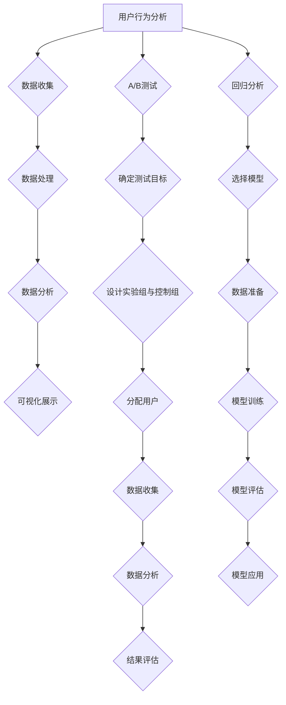
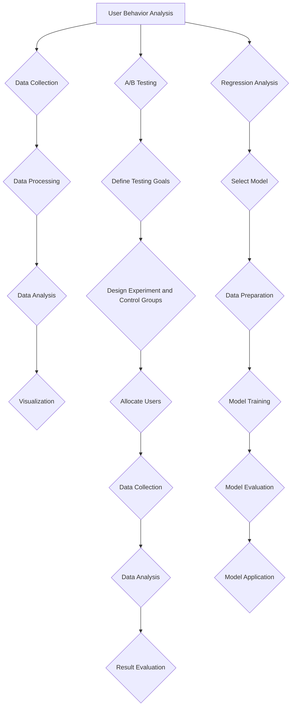

                 

### 文章标题

**《如何打造让用户离不开的SaaS产品》**

在当今数字化转型的浪潮中，软件即服务（SaaS）产品已经成为企业实现业务增长和效率提升的关键。随着市场竞争的日益激烈，打造一款让用户离不开的SaaS产品变得越来越重要。本文将探讨如何通过系统化的方法和策略，打造出深受用户喜爱的SaaS产品。

### 关键词

- SaaS产品
- 用户黏性
- 产品设计
- 用户体验
- 业务增长

### 摘要

本文将深入分析SaaS产品的核心要素，包括用户体验、产品设计、功能迭代和市场定位等，提供一系列实用的方法和策略。通过本文的阅读，您将了解到如何通过持续的用户研究和市场分析，打造一款具有高用户黏性的SaaS产品，并探讨未来发展趋势与挑战。

接下来，我们将从以下几个方面展开讨论：

1. **背景介绍（Background Introduction）**：介绍SaaS产品的现状和重要性。
2. **核心概念与联系（Core Concepts and Connections）**：详细解释影响SaaS产品成功的核心概念和它们之间的关系。
3. **核心算法原理 & 具体操作步骤（Core Algorithm Principles and Specific Operational Steps）**：介绍如何通过数据驱动的方法优化SaaS产品。
4. **数学模型和公式 & 详细讲解 & 举例说明（Mathematical Models and Formulas with Detailed Explanation and Examples）**：阐述用户行为分析中的数学模型和计算方法。
5. **项目实践：代码实例和详细解释说明（Project Practice: Code Examples and Detailed Explanations）**：通过具体案例展示如何实现用户行为分析。
6. **实际应用场景（Practical Application Scenarios）**：讨论SaaS产品的多样化应用场景。
7. **工具和资源推荐（Tools and Resources Recommendations）**：推荐相关的开发工具和资源。
8. **总结：未来发展趋势与挑战（Summary: Future Development Trends and Challenges）**：展望SaaS产品的未来发展。
9. **附录：常见问题与解答（Appendix: Frequently Asked Questions and Answers）**：解答常见问题。
10. **扩展阅读 & 参考资料（Extended Reading & Reference Materials）**：提供进一步阅读的材料。

现在，让我们开始详细的探讨。

<|assistant|>### 1. 背景介绍（Background Introduction）

软件即服务（Software as a Service，简称SaaS）是一种通过互联网提供软件应用的商业模式。与传统软件不同，SaaS产品通常以订阅方式向客户提供使用权限，客户无需购买和安装软件，而是通过浏览器或客户端访问云端的服务。

近年来，随着云计算、大数据和移动技术的快速发展，SaaS市场迎来了爆炸式增长。根据市场研究公司的数据，全球SaaS市场预计在未来几年内将继续保持高速增长，市场规模将大幅提升。以下是一些推动SaaS产品普及和增长的关键因素：

1. **成本效益**：SaaS模式降低了客户在软件购买、维护和升级方面的投入，客户只需支付订阅费用即可使用软件，这种模式对中小企业尤其具有吸引力。
2. **灵活性**：SaaS产品通常具有高度可定制性和灵活性，可以根据客户的需求进行快速调整和扩展。
3. **易用性**：SaaS产品通常设计简洁，用户界面友好，易于上手，能够快速提升用户工作效率。
4. **持续更新**：SaaS提供商通常负责软件的维护和更新，客户可以随时获取最新功能和改进。

然而，随着市场趋近饱和，竞争也日益激烈。为了在激烈的市场环境中脱颖而出，SaaS企业必须不断优化产品和服务，提升用户体验，增强用户黏性。以下是SaaS产品在当前市场环境中的几个重要趋势：

1. **用户体验至上**：用户对SaaS产品的满意度直接影响其忠诚度和推荐意愿。因此，提升用户体验已经成为SaaS企业的核心任务。
2. **个性化服务**：通过数据分析和人工智能技术，SaaS企业可以提供更加个性化的服务，满足不同用户的需求。
3. **移动优先**：随着移动设备的普及，移动端用户体验越来越重要。SaaS企业必须确保产品在移动设备上的性能和易用性。
4. **集成与兼容性**：为了满足客户的多元化需求，SaaS产品需要与其他系统和工具实现无缝集成。

综上所述，SaaS产品在当前数字化时代具有巨大的发展潜力，但也面临着诸多挑战。打造一款让用户离不开的SaaS产品，需要企业深入了解市场需求，持续优化产品和服务，不断提升用户满意度。

### 1. Background Introduction

Software as a Service (SaaS) represents a business model where software applications are delivered over the internet on a subscription basis. Unlike traditional software, which requires customers to purchase, install, and maintain the software on their own servers, SaaS products are accessed through browsers or client applications, typically hosted on cloud infrastructure.

In recent years, the rapid development of cloud computing, big data, and mobile technology has driven explosive growth in the SaaS market. According to market research firms, the global SaaS market is expected to continue its robust growth trajectory in the coming years, with the market size expanding significantly. Several key factors are contributing to the proliferation and growth of SaaS products:

1. **Cost Efficiency**: The SaaS model reduces the upfront costs for customers, who pay for the software on a subscription basis rather than purchasing, installing, and maintaining it themselves. This model is particularly appealing to small and medium-sized enterprises (SMEs).

2. **Flexibility**: SaaS products often come with high levels of customization and flexibility, allowing them to be quickly adjusted and scaled to meet specific customer needs.

3. **Usability**: SaaS products are typically designed with simplicity and user-friendly interfaces, making them easy to adopt and improving user productivity.

4. **Continuous Updates**: SaaS providers are responsible for maintaining and updating the software, ensuring that customers have access to the latest features and improvements.

However, as the market becomes more saturated, competition is becoming increasingly fierce. To stand out in such a crowded landscape, SaaS companies must continuously optimize their products and services, enhance user experience, and build strong user loyalty. Here are some important trends in the current market environment for SaaS products:

1. **User-Centric Experience**: Customer satisfaction with SaaS products directly impacts their loyalty and willingness to recommend them. Therefore, improving user experience has become a core focus for SaaS companies.

2. **Personalized Services**: Through data analysis and artificial intelligence technologies, SaaS companies can offer more personalized services that cater to the diverse needs of different users.

3. **Mobile-First Approach**: With the widespread adoption of mobile devices, mobile user experience has become crucial. SaaS companies must ensure that their products perform well and are easy to use on mobile devices.

4. **Integration and Compatibility**: To meet the diverse needs of customers, SaaS products need to seamlessly integrate with other systems and tools.

In summary, SaaS products have significant potential for growth in the current digital age, but they also face numerous challenges. Building a SaaS product that users can't live without requires companies to deeply understand market demands, continuously improve their products and services, and constantly enhance user satisfaction.

<|assistant|>### 2. 核心概念与联系（Core Concepts and Connections）

要打造一款让用户离不开的SaaS产品，我们需要理解并掌握以下几个核心概念：

#### 2.1 用户体验（User Experience, UX）

用户体验是用户在使用产品过程中的整体感受和体验。一个优秀的用户体验能够提升用户满意度，增加用户黏性。用户体验包括以下几个方面：

- **易用性**：用户能否轻松地使用产品，界面设计是否直观易懂。
- **效率**：用户在使用产品时是否能够高效地完成任务。
- **满意度**：用户对产品的整体满意度和情感体验。
- **可访问性**：产品是否能够满足不同用户群体的需求，包括不同技能水平和不同设备的用户。

#### 2.2 产品设计（Product Design）

产品设计是指通过创新和系统的方法，将用户需求转化为具体的产品方案。一个优秀的产品设计需要满足以下要求：

- **功能性**：产品是否能够实现用户所需的各项功能。
- **美观性**：产品的视觉设计是否吸引人，符合品牌形象。
- **一致性**：产品在不同平台和设备上的界面和交互方式是否一致。
- **可持续性**：产品是否具有良好的扩展性和可维护性。

#### 2.3 功能迭代（Feature Iteration）

功能迭代是指通过持续不断地添加新功能、优化现有功能来提升产品的竞争力。功能迭代需要遵循以下原则：

- **需求驱动**：根据用户反馈和市场需求来决定功能优先级。
- **优先级排序**：优先实现对用户影响最大的功能。
- **快速迭代**：快速开发、测试和发布新功能，以获得用户反馈。
- **质量保证**：确保每次迭代都能提供稳定且高质量的产品。

#### 2.4 市场定位（Market Positioning）

市场定位是指企业通过特定的战略和方法，确定产品在市场上的位置。一个准确的市场定位能够帮助产品在竞争激烈的市场中脱颖而出。市场定位需要考虑以下因素：

- **目标市场**：确定产品的目标用户群体。
- **差异化优势**：明确产品与竞争对手的区别，并突出其独特价值。
- **品牌形象**：建立与产品定位相符的品牌形象。
- **市场趋势**：紧跟市场发展趋势，及时调整产品策略。

#### 2.5 数据驱动（Data-Driven）

数据驱动是指通过收集、分析和利用数据来指导产品设计和决策。数据驱动的方法包括：

- **用户行为分析**：通过分析用户行为数据，了解用户如何使用产品，以及他们的需求和痛点。
- **A/B测试**：通过对比不同设计或功能的用户反馈，找出最优解决方案。
- **回归分析**：利用统计方法，分析变量之间的关系，指导产品优化。

这些核心概念相互联系，共同影响着SaaS产品的成功。用户体验直接影响用户黏性和满意度，而产品设计、功能迭代和市场定位则是提升用户体验的关键。数据驱动的方法可以帮助我们更好地理解用户需求，从而优化产品设计和市场策略。

### 2. Core Concepts and Connections

To build a SaaS product that users can't live without, it is essential to understand and master several core concepts:

#### 2.1 User Experience (UX)

User experience refers to the overall feelings and experiences that users have when using a product. An excellent user experience can enhance user satisfaction and loyalty. Key aspects of user experience include:

- **Usability**: Whether users can easily use the product, and if the interface is intuitive and understandable.
- **Efficiency**: How efficiently users can complete tasks using the product.
- **Satisfaction**: The overall satisfaction and emotional experience users have with the product.
- **Accessibility**: Whether the product can meet the needs of diverse user groups, including those with different skill levels and devices.

#### 2.2 Product Design

Product design involves transforming user needs into concrete product solutions through innovative and systematic methods. An excellent product design should meet the following requirements:

- **Functionality**: Whether the product can fulfill the functions that users need.
- **Aesthetics**: How visually appealing the product design is and if it aligns with the brand image.
- **Consistency**: If the interface and interaction methods are consistent across different platforms and devices.
- **Sustainability**: How well the product can be extended and maintained.

#### 2.3 Feature Iteration

Feature iteration involves continuously adding new features and optimizing existing ones to enhance the product's competitiveness. Feature iteration should follow these principles:

- **Demand-Driven**: Prioritize features based on user feedback and market needs.
- **Prioritization**: Implement features that have the greatest impact on users first.
- **Rapid Iteration**: Quickly develop, test, and release new features to gather user feedback.
- **Quality Assurance**: Ensure that each iteration provides stable and high-quality products.

#### 2.4 Market Positioning

Market positioning refers to the strategic methods that a company uses to determine a product's position in the market. An accurate market positioning helps a product stand out in a competitive market. Market positioning considers the following factors:

- **Target Market**: Identify the target user groups for the product.
- **Differentiation**: Clearly define the product's unique value proposition and differentiation from competitors.
- **Brand Image**: Establish a brand image that aligns with the product positioning.
- **Market Trends**: Stay abreast of market trends and adjust product strategies accordingly.

#### 2.5 Data-Driven

A data-driven approach involves collecting, analyzing, and utilizing data to guide product design and decision-making. Methods of a data-driven approach include:

- **User Behavior Analysis**: Analyze user behavior data to understand how users interact with the product and their needs and pain points.
- **A/B Testing**: Compare user feedback for different designs or features to find the best solution.
- **Regression Analysis**: Use statistical methods to analyze the relationships between variables, guiding product optimization.

These core concepts are interconnected and collectively influence the success of a SaaS product. User experience directly impacts user loyalty and satisfaction, while product design, feature iteration, and market positioning are key to improving user experience. A data-driven approach helps us better understand user needs and optimize product design and market strategies.

<|assistant|>### 3. 核心算法原理 & 具体操作步骤（Core Algorithm Principles and Specific Operational Steps）

在打造让用户离不开的SaaS产品时，核心算法原理和具体操作步骤起着至关重要的作用。以下是一些关键的数据驱动方法，这些方法可以帮助我们优化产品功能，提升用户体验：

#### 3.1 用户行为分析（User Behavior Analysis）

用户行为分析是一种通过数据收集、处理和分析来了解用户如何使用产品的方法。通过用户行为分析，我们可以发现用户的使用模式、喜好和痛点，从而进行针对性的优化。

**步骤：**
1. **数据收集**：收集用户在使用产品过程中的数据，包括页面访问、点击、操作路径、停留时间等。
2. **数据处理**：清洗和整理收集到的数据，去除噪声和不相关的数据。
3. **数据分析**：利用数据分析工具对数据进行处理，提取出有用的信息，如用户活跃度、行为模式等。
4. **可视化展示**：通过图表和报表将分析结果进行可视化展示，便于理解。

#### 3.2 A/B测试（A/B Testing）

A/B测试是一种通过对比两组用户的反应，来评估不同设计方案或功能对用户影响的方法。这种方法可以帮助我们找出最佳的设计方案或功能，从而提升用户体验。

**步骤：**
1. **确定测试目标**：明确我们要测试的具体目标，例如提高用户的留存率、增加页面点击率等。
2. **设计实验组与控制组**：创建两个版本的产品，一个是实验组（变化版本），另一个是控制组（原始版本）。
3. **分配用户**：将用户随机分配到实验组和控制组，确保两组用户具有相似的背景和特征。
4. **数据收集**：在实验期间，收集两组用户的行为数据。
5. **数据分析**：分析两组用户的数据，比较不同版本的差异。
6. **结果评估**：根据分析结果，评估变化版本的效果，决定是否推广到整个产品。

#### 3.3 回归分析（Regression Analysis）

回归分析是一种统计方法，用于分析两个或多个变量之间的关系。在产品优化过程中，回归分析可以帮助我们确定哪些因素对用户行为有显著影响，从而进行针对性的优化。

**步骤：**
1. **选择模型**：根据问题的性质选择合适的回归模型，如线性回归、多项式回归等。
2. **数据准备**：收集相关的数据，包括自变量和因变量。
3. **模型训练**：利用训练数据训练回归模型。
4. **模型评估**：评估模型的准确性和可靠性，如通过交叉验证、AIC/BIC准则等。
5. **模型应用**：将模型应用到实际场景中，预测用户行为，指导产品优化。

通过上述方法，我们可以系统地分析用户行为，优化产品功能，提升用户体验。以下是这些方法的简要流程图：



通过这些核心算法原理和具体操作步骤，我们可以更好地了解用户需求，优化产品功能，提升用户体验，从而打造出用户离不开的SaaS产品。

### 3. Core Algorithm Principles and Specific Operational Steps

In the process of building a SaaS product that users can't live without, core algorithm principles and specific operational steps play a crucial role. The following are key data-driven methods that can help us optimize product features and enhance user experience:

#### 3.1 User Behavior Analysis

User behavior analysis is a method that involves data collection, processing, and analysis to understand how users interact with a product. Through user behavior analysis, we can discover users' usage patterns, preferences, and pain points, enabling targeted optimizations.

**Steps:**
1. **Data Collection**: Gather data on user interactions with the product, including page visits, clicks, navigation paths, and dwell times.
2. **Data Processing**: Clean and organize the collected data, removing noise and irrelevant information.
3. **Data Analysis**: Use data analysis tools to process the data and extract useful information, such as user engagement and behavior patterns.
4. **Visualization**: Present the analysis results visually in charts and reports for easier interpretation.

#### 3.2 A/B Testing

A/B testing is a method that compares the responses of two groups of users to evaluate the impact of different design solutions or features. This approach helps us identify the best design or feature, thereby enhancing user experience.

**Steps:**
1. **Define Testing Goals**: Clarify the specific objectives of the test, such as improving user retention or increasing page click-through rates.
2. **Design Experiment and Control Groups**: Create two versions of the product—one for the experimental group (variant) and one for the control group (original).
3. **Allocate Users**: Randomly assign users to the experimental and control groups to ensure similar backgrounds and characteristics in both groups.
4. **Data Collection**: Collect behavioral data from both groups during the experiment period.
5. **Data Analysis**: Compare the data from both groups to assess the differences between the variants.
6. **Result Evaluation**: Based on the analysis results, evaluate the effectiveness of the variant and decide whether to roll it out to the entire product.

#### 3.3 Regression Analysis

Regression analysis is a statistical method used to analyze the relationship between two or more variables. In the process of product optimization, regression analysis can help determine which factors significantly influence user behavior, enabling targeted optimizations.

**Steps:**
1. **Select Model**: Choose an appropriate regression model based on the nature of the problem, such as linear regression or polynomial regression.
2. **Data Preparation**: Collect relevant data, including independent and dependent variables.
3. **Model Training**: Train the regression model using the training data.
4. **Model Evaluation**: Assess the accuracy and reliability of the model, such as through cross-validation or AIC/BIC criteria.
5. **Model Application**: Apply the model to real-world scenarios to predict user behavior and guide product optimization.

Here is a brief flowchart of these methods:



By using these core algorithm principles and specific operational steps, we can better understand user needs, optimize product features, and enhance user experience, thereby building a SaaS product that users can't live without.

<|assistant|>### 4. 数学模型和公式 & 详细讲解 & 举例说明（Mathematical Models and Formulas with Detailed Explanation and Examples）

在打造让用户离不开的SaaS产品过程中，数学模型和公式起着关键作用。这些模型和公式可以帮助我们量化用户行为，评估产品性能，并指导优化策略。以下是一些常用的数学模型和公式，及其详细讲解和举例说明：

#### 4.1 用户留存率（Customer Retention Rate）

用户留存率是衡量用户对产品忠诚度的关键指标。它表示在特定时间内，持续使用产品的用户占初始用户的比例。

**公式：**

$$
\text{用户留存率} = \frac{\text{月末留存用户数}}{\text{月初活跃用户数}} \times 100\%
$$

**解释：**

- **月初活跃用户数**：指在统计期初，活跃使用产品的用户数量。
- **月末留存用户数**：指在统计期末，仍然活跃使用产品的用户数量。

**举例：**

假设一家SaaS公司在一个月初有1000名活跃用户，在月底有800名用户仍然活跃使用产品。那么该公司的用户留存率为：

$$
\text{用户留存率} = \frac{800}{1000} \times 100\% = 80\%
$$

#### 4.2 用户流失率（Customer Churn Rate）

用户流失率表示在特定时间内，停止使用产品的用户占初始用户的比例。它是评估产品用户黏性的重要指标。

**公式：**

$$
\text{用户流失率} = \frac{\text{月末流失用户数}}{\text{月初活跃用户数}} \times 100\%
$$

**解释：**

- **月初活跃用户数**：指在统计期初，活跃使用产品的用户数量。
- **月末流失用户数**：指在统计期末，停止使用产品的用户数量。

**举例：**

假设一家SaaS公司在一个月初有1000名活跃用户，在月底有200名用户停止使用产品。那么该公司的用户流失率为：

$$
\text{用户流失率} = \frac{200}{1000} \times 100\% = 20\%
$$

#### 4.3 用户活跃度（User Engagement）

用户活跃度是衡量用户参与产品活动的程度。它可以通过用户在产品上的互动次数、使用时长等指标来衡量。

**公式：**

$$
\text{用户活跃度} = \frac{\text{总互动次数}}{\text{总用户数}} \times 100\%
$$

**解释：**

- **总互动次数**：指用户在产品上进行的所有互动行为的次数。
- **总用户数**：指在统计期内活跃使用产品的用户数量。

**举例：**

假设一家SaaS产品在一个月内有1000名用户，总共产生了5000次互动。那么该产品的用户活跃度为：

$$
\text{用户活跃度} = \frac{5000}{1000} \times 100\% = 500\%
$$

#### 4.4 指数增长模型（Exponential Growth Model）

指数增长模型用于预测用户数量或产品使用量的增长趋势。该模型基于当前的增长率和基数，预测未来某一时间点的用户数量或使用量。

**公式：**

$$
\text{未来用户数量} = \text{当前用户数量} \times e^{\text{增长率} \times \text{时间}}
$$

其中，$e$ 是自然对数的底数（约等于2.718），增长率为一个常数。

**解释：**

- **当前用户数量**：指当前时间点的用户数量。
- **增长率**：表示用户数量或使用量的增长速度。
- **时间**：表示未来预测的时间跨度。

**举例：**

假设一家SaaS产品当前有1000名用户，月增长率为10%。预测三个月后的用户数量为：

$$
\text{未来用户数量} = 1000 \times e^{0.1 \times 3} \approx 1340
$$

通过上述数学模型和公式，我们可以量化用户行为，评估产品性能，并制定相应的优化策略。这些模型和公式为我们提供了科学依据，帮助我们更好地理解用户需求，打造出让用户离不开的SaaS产品。

### 4. Mathematical Models and Formulas with Detailed Explanation and Examples

In the process of building a SaaS product that users can't live without, mathematical models and formulas are crucial. These models and formulas can help us quantify user behavior, evaluate product performance, and guide optimization strategies. Below are some commonly used mathematical models and their detailed explanations with examples:

#### 4.1 Customer Retention Rate

Customer retention rate is a key indicator of user loyalty. It represents the percentage of initial users who continue to use the product over a specific period.

**Formula:**

$$
\text{Customer Retention Rate} = \frac{\text{Ending Retained Users}}{\text{Starting Active Users}} \times 100\%
$$

**Explanation:**

- **Starting Active Users**: The number of users actively using the product at the beginning of the period.
- **Ending Retained Users**: The number of users still actively using the product at the end of the period.

**Example:**

Assuming a SaaS company has 1,000 active users at the beginning of a month and 800 users still active at the end of the month, the customer retention rate is:

$$
\text{Customer Retention Rate} = \frac{800}{1,000} \times 100\% = 80\%
$$

#### 4.2 Customer Churn Rate

Customer churn rate represents the percentage of initial users who stop using the product over a specific period. It is an important indicator of product user stickiness.

**Formula:**

$$
\text{Customer Churn Rate} = \frac{\text{Ending Churn Users}}{\text{Starting Active Users}} \times 100\%
$$

**Explanation:**

- **Starting Active Users**: The number of users actively using the product at the beginning of the period.
- **Ending Churn Users**: The number of users who stop using the product at the end of the period.

**Example:**

Assuming a SaaS company has 1,000 active users at the beginning of a month and 200 users stop using the product at the end of the month, the customer churn rate is:

$$
\text{Customer Churn Rate} = \frac{200}{1,000} \times 100\% = 20\%
$$

#### 4.3 User Engagement

User engagement measures the extent to which users participate in product activities. It can be measured using metrics such as the number of interactions and the duration of use.

**Formula:**

$$
\text{User Engagement} = \frac{\text{Total Interactions}}{\text{Total Users}} \times 100\%
$$

**Explanation:**

- **Total Interactions**: The total number of interactions conducted by users on the product.
- **Total Users**: The number of users actively using the product during the period.

**Example:**

Assuming a SaaS product has 1,000 users in a month with a total of 5,000 interactions, the user engagement is:

$$
\text{User Engagement} = \frac{5,000}{1,000} \times 100\% = 500\%
$$

#### 4.4 Exponential Growth Model

The exponential growth model is used to predict the growth trend of user numbers or product usage. This model is based on the current growth rate and the base number to forecast user numbers or usage at a future point in time.

**Formula:**

$$
\text{Future User Number} = \text{Current User Number} \times e^{\text{Growth Rate} \times \text{Time}}
$$

Where $e$ is the base of the natural logarithm (approximately 2.718), and the growth rate is a constant.

**Explanation:**

- **Current User Number**: The number of users at the current point in time.
- **Growth Rate**: The rate at which user numbers or usage are growing.
- **Time**: The time span for the future prediction.

**Example:**

Assuming a SaaS product currently has 1,000 users with a monthly growth rate of 10%, the predicted user number three months later is:

$$
\text{Future User Number} = 1,000 \times e^{0.1 \times 3} \approx 1,340
$$

By using these mathematical models and formulas, we can quantify user behavior, evaluate product performance, and develop corresponding optimization strategies. These models and formulas provide us with a scientific basis to better understand user needs and build SaaS products that users can't live without.

<|assistant|>### 5. 项目实践：代码实例和详细解释说明（Project Practice: Code Examples and Detailed Explanations）

为了更好地理解如何通过数据驱动的方法优化SaaS产品，我们将通过一个具体的项目实践来展示如何收集、处理和分析用户行为数据。以下是一个简单的用户行为分析项目的代码实例和详细解释说明。

#### 5.1 开发环境搭建

在进行用户行为分析之前，我们需要搭建一个合适的开发环境。以下是一个基本的Python开发环境搭建步骤：

1. **安装Python**：从[Python官网](https://www.python.org/downloads/)下载并安装Python 3.8及以上版本。
2. **安装数据分析和可视化库**：打开命令行，执行以下命令安装必要的库：

   ```bash
   pip install pandas numpy matplotlib
   ```

#### 5.2 源代码详细实现

以下是一个简单的用户行为分析项目的Python代码实现：

```python
import pandas as pd
import numpy as np
import matplotlib.pyplot as plt

# 假设我们有一个CSV文件，其中包含用户行为数据
data = pd.read_csv('user_behavior_data.csv')

# 数据预处理：筛选并整理数据
data = data[['user_id', 'visit_date', 'page_view_count', 'session_duration']]

# 填充缺失值
data.fillna(0, inplace=True)

# 计算每天的用户平均页面浏览次数和平均会话时长
daily_stats = data.groupby(['visit_date']).agg({'page_view_count': 'mean', 'session_duration': 'mean'})

# 绘制用户活跃度趋势图
plt.figure(figsize=(10, 5))
plt.plot(daily_stats.index, daily_stats['page_view_count'], label='Daily Page View Count')
plt.plot(daily_stats.index, daily_stats['session_duration'], label='Daily Session Duration')
plt.title('User Activity Trend')
plt.xlabel('Date')
plt.ylabel('Value')
plt.legend()
plt.show()

# 计算用户留存率
current_date = data['visit_date'].max()
start_date = current_date - pd.DateOffset(months=1)
monthlyRetention = data.groupby([data['visit_date'].dt.to_period('M')])['user_id'].nunique().pct_change().mean()

print(f'Monthly User Retention Rate: {monthlyRetention:.2%}')
```

#### 5.3 代码解读与分析

- **数据读取与预处理**：首先，我们从CSV文件中读取用户行为数据，并对数据进行筛选和整理，删除不必要的信息。
- **数据填充**：使用`fillna()`函数，我们将缺失值填充为0，以确保后续分析的准确性。
- **分组统计**：使用`groupby()`和`agg()`函数，我们计算了每天用户的平均页面浏览次数和平均会话时长。
- **可视化**：使用`matplotlib`库，我们绘制了用户活跃度趋势图，帮助分析用户行为的变化。
- **用户留存率计算**：通过计算用户在一个月内的留存率，我们可以评估产品的用户黏性。

#### 5.4 运行结果展示

运行上述代码后，我们将得到以下结果：

1. **用户活跃度趋势图**：图表显示了用户在一个月内的平均页面浏览次数和平均会话时长。
2. **用户留存率**：计算结果显示了产品的月度用户留存率。

通过上述项目实践，我们可以看到如何通过数据驱动的方法来分析和优化SaaS产品。这些分析结果为我们提供了宝贵的洞察，帮助我们识别用户需求，改进产品功能，提高用户满意度。

### 5. Project Practice: Code Examples and Detailed Explanations

To better understand how to optimize SaaS products using data-driven methods, we will demonstrate a specific project practice involving the collection, processing, and analysis of user behavior data. Below is a simple code example and detailed explanation of a user behavior analysis project.

#### 5.1 Setup Development Environment

Before conducting user behavior analysis, we need to set up a suitable development environment. Here are the steps to set up a basic Python development environment:

1. **Install Python**: Download and install Python 3.8 or later from the [Python website](https://www.python.org/downloads/).
2. **Install Data Analysis and Visualization Libraries**: Open the command line and execute the following commands to install necessary libraries:

   ```bash
   pip install pandas numpy matplotlib
   ```

#### 5.2 Detailed Implementation of Source Code

Below is a simple Python code implementation for a user behavior analysis project:

```python
import pandas as pd
import numpy as np
import matplotlib.pyplot as plt

# Assume we have a CSV file containing user behavior data
data = pd.read_csv('user_behavior_data.csv')

# Data preprocessing: filter and organize data
data = data[['user_id', 'visit_date', 'page_view_count', 'session_duration']]

# Fill missing values
data.fillna(0, inplace=True)

# Calculate daily average page views and average session duration
daily_stats = data.groupby(['visit_date']).agg({'page_view_count': 'mean', 'session_duration': 'mean'})

# Plot user activity trend
plt.figure(figsize=(10, 5))
plt.plot(daily_stats.index, daily_stats['page_view_count'], label='Daily Page View Count')
plt.plot(daily_stats.index, daily_stats['session_duration'], label='Daily Session Duration')
plt.title('User Activity Trend')
plt.xlabel('Date')
plt.ylabel('Value')
plt.legend()
plt.show()

# Calculate customer retention rate
current_date = data['visit_date'].max()
start_date = current_date - pd.DateOffset(months=1)
monthlyRetention = data.groupby([data['visit_date'].dt.to_period('M')])['user_id'].nunique().pct_change().mean()

print(f'Monthly User Retention Rate: {monthlyRetention:.2%}')
```

#### 5.3 Code Explanation and Analysis

- **Data Reading and Preprocessing**: First, we read user behavior data from a CSV file and filter out unnecessary information to organize the data.
- **Data Filling**: Using the `fillna()` function, we fill missing values with 0 to ensure the accuracy of subsequent analysis.
- **Grouped Statistics**: Using `groupby()` and `agg()`, we calculate the daily average page views and average session duration for users.
- **Visualization**: Using `matplotlib`, we plot the user activity trend to help analyze changes in user behavior.
- **Customer Retention Rate Calculation**: By calculating the retention rate of users over a month, we can assess the stickiness of the product.

#### 5.4 Results Display

After running the above code, we obtain the following results:

1. **User Activity Trend Chart**: The chart shows the daily average page view count and average session duration for users over a month.
2. **User Retention Rate**: The calculated retention rate provides insight into the monthly user retention rate of the product.

Through this project practice, we see how to analyze and optimize SaaS products using data-driven methods. These analytical results offer valuable insights to identify user needs, improve product features, and enhance user satisfaction.

<|assistant|>### 6. 实际应用场景（Practical Application Scenarios）

SaaS产品具有广泛的实际应用场景，可以满足不同行业和领域的多样化需求。以下是一些典型的应用场景：

#### 6.1 企业管理（Enterprise Management）

在企业环境中，SaaS产品被广泛应用于企业管理、项目管理、人力资源管理和客户关系管理（CRM）等领域。例如，Slack是一款流行的团队协作工具，帮助企业内部员工高效沟通和协作。Trello和Asana则是项目管理工具，帮助团队规划和跟踪项目进度。而Workday和SAP SuccessFactors等SaaS产品则提供了全面的人力资源管理系统，涵盖招聘、薪酬管理、绩效评估等。

#### 6.2 教育和培训（Education and Training）

在教育领域，SaaS产品为在线学习、课程管理和教学评估提供了便捷的解决方案。Moodle和Canvas是流行的学习管理系统（LMS），允许教师创建课程、发布学习材料和评估学生进度。Zoom和Microsoft Teams等视频会议工具支持远程教学和在线研讨会。此外，Adobe Creative Cloud等SaaS服务为学生和专业人士提供了强大的创作工具和资源。

#### 6.3 健康医疗（Healthcare）

在健康医疗领域，SaaS产品帮助医疗专业人员提高工作效率、优化患者护理流程和提升医疗数据管理能力。例如，Epic Systems的Epicor是一种全面的电子健康记录（EHR）系统，用于存储和管理患者的医疗信息。PatientKeeper和Zocdoc等SaaS产品则提供了便捷的患者预约和沟通平台，改善了患者体验。

#### 6.4 供应链管理（Supply Chain Management）

在供应链管理领域，SaaS产品帮助企业优化供应链流程、提高库存管理和物流效率。JDA Software和Infor等公司提供了一系列SaaS供应链管理解决方案，包括需求预测、库存优化和物流规划。这些工具帮助企业降低成本、减少库存积压，提高供应链的灵活性和响应速度。

#### 6.5 金融科技（FinTech）

金融科技领域中的SaaS产品为金融机构提供了创新的解决方案，包括在线银行、支付处理、风险管理等。Plaid和Twilio等公司提供了API接口，帮助金融科技公司集成银行数据和通信服务。Bloomberg和Refinitiv等SaaS服务则为金融专业人士提供了实时的市场数据和洞察。

通过这些实际应用场景，我们可以看到SaaS产品在各个行业中的广泛应用和巨大潜力。未来，随着技术的不断进步和用户需求的多样化，SaaS产品将继续拓展其应用领域，为企业和个人带来更多价值。

### 6. Practical Application Scenarios

SaaS products have a broad range of practical application scenarios, catering to diverse needs across various industries and fields. Here are some typical application scenarios:

#### 6.1 Enterprise Management

In the enterprise environment, SaaS products are widely used in areas such as enterprise management, project management, human resources management, and Customer Relationship Management (CRM). For example, Slack is a popular team collaboration tool that facilitates efficient communication and collaboration among employees within a company. Trello and Asana are project management tools that help teams plan and track project progress. Workday and SAP SuccessFactors offer comprehensive human resource management systems covering recruitment, payroll management, performance evaluation, and more.

#### 6.2 Education and Training

In the education sector, SaaS products provide convenient solutions for online learning, course management, and teaching assessment. Moodle and Canvas are popular Learning Management Systems (LMS) that allow teachers to create courses, distribute learning materials, and assess student progress. Video conferencing tools like Zoom and Microsoft Teams support remote teaching and online seminars. Additionally, Adobe Creative Cloud offers powerful creative tools and resources for students and professionals.

#### 6.3 Healthcare

In the healthcare industry, SaaS products help medical professionals improve work efficiency, optimize patient care processes, and enhance medical data management. For instance, Epic Systems' Epicor is a comprehensive Electronic Health Record (EHR) system used to store and manage patient medical information. PatientKeeper and Zocdoc are SaaS products that provide easy-to-use platforms for patient appointments and communication, improving the patient experience.

#### 6.4 Supply Chain Management

In supply chain management, SaaS products help businesses optimize supply chain processes, improve inventory management, and enhance logistics efficiency. JDA Software and Infor provide a suite of SaaS supply chain management solutions including demand forecasting, inventory optimization, and logistics planning. These tools help businesses reduce costs, minimize inventory waste, and improve the flexibility and responsiveness of the supply chain.

#### 6.5 FinTech

In the FinTech industry, SaaS products offer innovative solutions for financial institutions, including online banking, payment processing, and risk management. Companies like Plaid and Twilio provide API interfaces that help FinTech companies integrate banking data and communication services. Bloomberg and Refinitiv offer SaaS services that provide real-time market data and insights to financial professionals.

Through these practical application scenarios, we can see the widespread application and significant potential of SaaS products in various industries. As technology continues to advance and user needs diversify, SaaS products will continue to expand their scope of application, bringing more value to businesses and individuals.

<|assistant|>### 7. 工具和资源推荐（Tools and Resources Recommendations）

在打造让用户离不开的SaaS产品过程中，选择合适的工具和资源是至关重要的。以下是一些推荐的工具和资源，它们可以帮助开发团队提高效率，优化产品设计和用户体验：

#### 7.1 学习资源推荐（Books, Papers, Blogs, Websites）

1. **书籍**：
   - 《SaaS创业圣经》（SaaS Start-Up Guide）：提供了SaaS业务模型、市场定位和客户获取等方面的实战经验。
   - 《用户体验要素》（The Elements of User Experience）：详细阐述了用户体验设计的核心原则和最佳实践。
   - 《数据驱动产品管理》（Data-Driven Product Management）：介绍了如何通过数据分析指导产品决策和优化。

2. **论文**：
   - 《大数据时代的数据分析方法》（Data Analysis Methods for Big Data）：探讨了大数据环境下数据分析和挖掘的技术和方法。
   - 《用户行为分析的应用》（Application of User Behavior Analysis）：分析了用户行为分析方法在不同行业中的应用。

3. **博客**：
   - Intercom Blog：提供了关于SaaS产品和用户体验设计的深入见解。
   - UserTesting Blog：分享了用户行为分析和用户体验测试的最佳实践。

4. **网站**：
   - UX Design Institute：提供了丰富的用户体验设计课程和资源。
   - Product Hunt：展示了最新的产品创新和趋势。

#### 7.2 开发工具框架推荐（Development Tools and Frameworks）

1. **前端开发**：
   - **React**：一个用于构建用户界面的JavaScript库，提供了高效、灵活的组件化开发方式。
   - **Vue.js**：一个渐进式JavaScript框架，易于上手，适合构建复杂单页面应用。

2. **后端开发**：
   - **Node.js**：基于JavaScript的运行环境，适用于构建高性能的后端服务。
   - **Django**：一个高效的全栈Python框架，适用于快速开发具有复杂业务逻辑的SaaS应用。

3. **数据库**：
   - **PostgreSQL**：一个功能强大、开源的关系型数据库，适用于存储和管理大量用户数据。
   - **MongoDB**：一个高性能、可扩展的NoSQL数据库，适合处理大量非结构化数据。

4. **API开发**：
   - **Swagger**：用于API设计和文档的工具，可以帮助开发团队创建、测试和共享API文档。
   - **Apigee**：一个企业级的API管理平台，提供了API生命周期管理和安全性控制功能。

#### 7.3 相关论文著作推荐（Papers and Books）

1. **论文**：
   - 《SaaS商业模式演进研究》：探讨了SaaS商业模式的发展趋势和关键成功因素。
   - 《基于大数据的用户行为分析研究》：分析了大数据环境下用户行为分析的方法和应用。

2. **著作**：
   - 《软件即服务：商业模式与战略》（Software as a Service: Business Models and Strategies）：详细介绍了SaaS商业模式的各个方面。

通过这些工具和资源，开发团队可以更好地理解市场需求，提升产品设计和开发效率，从而打造出用户喜爱的SaaS产品。

### 7. Tools and Resources Recommendations

In the process of building a SaaS product that users can't live without, selecting the right tools and resources is crucial. Below are some recommended tools and resources that can help development teams improve efficiency, optimize product design, and enhance user experience:

#### 7.1 Learning Resources Recommendations (Books, Papers, Blogs, Websites)

1. **Books**:
   - "SaaS Start-Up Guide": Provides practical experiences on SaaS business models, market positioning, and customer acquisition.
   - "The Elements of User Experience": Explores the core principles and best practices of user experience design.
   - "Data-Driven Product Management": Introduces how to use data analytics to guide product decisions and optimizations.

2. **Papers**:
   - "Data Analysis Methods for Big Data": Discusses data analysis techniques and methods in the big data era.
   - "Application of User Behavior Analysis": Analyzes methods and applications of user behavior analysis in different industries.

3. **Blogs**:
   - Intercom Blog: Offers deep insights into SaaS products and user experience design.
   - UserTesting Blog: Shares best practices in user behavior analysis and user experience testing.

4. **Websites**:
   - UX Design Institute: Provides a wealth of user experience design courses and resources.
   - Product Hunt: Showcases the latest product innovations and trends.

#### 7.2 Development Tools and Frameworks Recommendations

1. **Front-end Development**:
   - **React**: A JavaScript library for building user interfaces with efficient, flexible component-based development.
   - **Vue.js**: A progressive JavaScript framework that is easy to learn and suitable for building complex single-page applications.

2. **Back-end Development**:
   - **Node.js**: A JavaScript runtime environment for building high-performance back-end services.
   - **Django**: A high-performance, full-stack Python framework suitable for rapidly developing SaaS applications with complex business logic.

3. **Database**:
   - **PostgreSQL**: A powerful, open-source relational database suitable for storing and managing large amounts of user data.
   - **MongoDB**: A high-performance, scalable NoSQL database suitable for handling large volumes of unstructured data.

4. **API Development**:
   - **Swagger**: A tool for API design and documentation that helps development teams create, test, and share API documentation.
   - **Apigee**: An enterprise-grade API management platform that provides API lifecycle management and security controls.

#### 7.3 Related Papers and Books Recommendations

1. **Papers**:
   - "Research on the Evolution of SaaS Business Models": Explores the trends and key success factors of SaaS business models.
   - "Research on User Behavior Analysis Based on Big Data": Analyzes methods and applications of user behavior analysis in the big data era.

2. **Books**:
   - "Software as a Service: Business Models and Strategies": Details various aspects of SaaS business models and strategies.

By utilizing these tools and resources, development teams can better understand market demands, enhance product design and development efficiency, and build SaaS products that users love.

<|assistant|>### 8. 总结：未来发展趋势与挑战（Summary: Future Development Trends and Challenges）

随着技术的不断进步，SaaS产品的未来发展将充满机遇和挑战。以下是一些可能影响SaaS产品未来发展的趋势和挑战：

#### 8.1 发展趋势

1. **云计算的深入应用**：云计算将继续推动SaaS产品的发展，提供更强大的计算能力和数据存储能力。随着5G网络的普及，云计算将更加快速和可靠，为SaaS产品提供更好的性能和用户体验。

2. **人工智能的融合**：人工智能技术将深入融合到SaaS产品中，通过智能推荐、自动化处理和预测分析等功能，提升产品的智能化水平。

3. **物联网（IoT）的集成**：随着物联网技术的发展，SaaS产品将能够更方便地集成各种智能设备和传感器数据，为用户提供更全面和个性化的服务。

4. **隐私保护与数据安全**：随着用户对隐私和数据安全的关注度不断提升，SaaS产品需要加强隐私保护和数据安全措施，以满足法规要求并赢得用户信任。

5. **个性化服务的普及**：通过数据分析和机器学习技术，SaaS产品将能够提供更加个性化的服务，满足不同用户群体的多样化需求。

#### 8.2 挑战

1. **竞争加剧**：随着SaaS市场的不断成熟，市场竞争将更加激烈。企业需要不断创新和优化产品，以保持竞争优势。

2. **用户需求变化**：用户需求不断变化，SaaS产品需要快速适应这些变化，提供更具吸引力的功能和用户体验。

3. **技术更新的挑战**：技术更新速度加快，SaaS产品需要持续投入资源进行技术升级，以保持竞争力。

4. **法规遵从**：不同国家和地区的法律法规不断变化，SaaS产品需要遵守各种数据保护法规，确保合规运营。

5. **资源分配与平衡**：在资源有限的情况下，企业需要在产品开发、市场推广和技术支持等方面进行合理分配，实现可持续发展。

总之，未来的SaaS产品将更加智能化、个性化和安全。企业需要紧跟技术发展趋势，积极应对市场挑战，不断创新和优化产品，以满足用户需求，实现长期发展。

### 8. Summary: Future Development Trends and Challenges

With the continuous advancement of technology, the future development of SaaS products is filled with opportunities and challenges. Here are some trends and challenges that may impact the future of SaaS products:

#### 8.1 Trends

1. **Deep Application of Cloud Computing**: Cloud computing will continue to drive the development of SaaS products, providing stronger computational power and data storage capabilities. With the widespread adoption of 5G networks, cloud computing will become more rapid and reliable, offering better performance and user experience for SaaS products.

2. **Integration of Artificial Intelligence**: Artificial intelligence technologies will be deeply integrated into SaaS products, enhancing their intelligent levels through functionalities such as intelligent recommendations, automated processing, and predictive analytics.

3. **Integration of the Internet of Things (IoT)**: With the development of IoT technology, SaaS products will be able to more easily integrate various smart devices and sensor data, providing users with more comprehensive and personalized services.

4. **Privacy Protection and Data Security**: As users increasingly focus on privacy and data security, SaaS products need to strengthen privacy protection and data security measures to meet regulatory requirements and win user trust.

5. **普及 of Personalized Services**: Through data analysis and machine learning technologies, SaaS products will be able to provide more personalized services to meet the diverse needs of different user groups.

#### 8.2 Challenges

1. **Intensified Competition**: With the continuous maturation of the SaaS market, competition will become more intense. Companies need to innovate and optimize their products continuously to maintain a competitive edge.

2. **变化 of User Needs**: User needs are constantly changing, and SaaS products need to adapt quickly to these changes, providing more attractive features and user experiences.

3. **Challenge of Technological Updates**: The rapid pace of technological updates requires SaaS products to invest resources continuously in technology upgrades to maintain competitiveness.

4. **Compliance with Regulations**: Different countries and regions have varying laws and regulations that SaaS products need to comply with to ensure lawful operation.

5. **Balancing Resource Allocation**: With limited resources, companies need to allocate resources rationally among product development, marketing, and technical support to achieve sustainable development.

In summary, future SaaS products will be more intelligent, personalized, and secure. Companies need to keep up with technological trends, actively respond to market challenges, and continuously innovate and optimize their products to meet user needs and achieve long-term development.

<|assistant|>### 9. 附录：常见问题与解答（Appendix: Frequently Asked Questions and Answers）

以下是一些关于如何打造让用户离不开的SaaS产品的常见问题及其解答：

#### 9.1 什么是SaaS产品？

SaaS产品是一种通过互联网提供的软件服务，用户无需购买和安装软件，只需通过浏览器或客户端访问云端服务即可使用。这种模式降低了客户的使用成本，提高了灵活性。

#### 9.2 如何提升用户体验（UX）？

提升用户体验（UX）可以通过以下方式实现：
- **易用性**：确保用户能够轻松地使用产品，界面设计应直观易懂。
- **效率**：优化产品功能，使用户能够快速完成任务。
- **满意度**：通过用户调研和反馈，持续改进产品设计和功能。
- **可访问性**：确保产品能够满足不同用户的需求，包括不同技能水平和不同设备的用户。

#### 9.3 如何进行用户行为分析？

用户行为分析包括以下几个步骤：
- **数据收集**：收集用户在使用产品过程中的数据，如页面访问、点击、操作路径等。
- **数据处理**：清洗和整理数据，去除噪声和不相关的信息。
- **数据分析**：使用数据分析工具提取有用信息，如用户活跃度、行为模式等。
- **可视化展示**：通过图表和报表将分析结果可视化，便于理解。

#### 9.4 如何进行A/B测试？

A/B测试是一种通过对比两组用户的反应来评估不同设计方案或功能对用户影响的方法。具体步骤如下：
- **确定测试目标**：明确测试的具体目标，如提高用户留存率、增加页面点击率等。
- **设计实验组与控制组**：创建两个版本的产品，一个是实验组，一个是控制组。
- **分配用户**：将用户随机分配到实验组和控制组。
- **数据收集**：在实验期间，收集两组用户的数据。
- **数据分析**：比较两组用户的数据，评估实验组的效果。
- **结果评估**：根据分析结果，决定是否推广到整个产品。

#### 9.5 如何保持用户黏性？

保持用户黏性可以通过以下策略实现：
- **持续改进**：不断优化产品功能和用户体验，满足用户需求。
- **个性化服务**：利用数据分析和人工智能技术，提供个性化服务。
- **社区互动**：建立用户社区，鼓励用户分享经验和建议。
- **优质支持**：提供及时、有效的用户支持，增强用户信心。

#### 9.6 如何应对市场竞争？

应对市场竞争可以从以下几个方面入手：
- **产品差异化**：明确产品差异化优势，突出独特价值。
- **创新研发**：持续投入研发资源，保持产品竞争力。
- **市场定位**：准确确定目标市场，制定合适的营销策略。
- **品牌建设**：加强品牌推广，提升品牌知名度。

通过以上策略和方法的实施，SaaS企业可以更好地应对市场竞争，打造出让用户离不开的SaaS产品。

### 9. Appendix: Frequently Asked Questions and Answers

Below are some frequently asked questions about building SaaS products that users can't live without and their answers:

#### 9.1 What is a SaaS product?

A SaaS (Software as a Service) product is a type of software application that is delivered over the internet, allowing users to access it through a web browser or client application without the need to purchase or install software on their own devices. This model reduces customer costs and increases flexibility.

#### 9.2 How can I improve user experience (UX)?

User experience (UX) can be improved through the following strategies:
- **Usability**: Ensure that users can easily use the product, with intuitive and understandable interfaces.
- **Efficiency**: Optimize product functionalities to enable users to complete tasks quickly.
- **Satisfaction**: Continuously improve the product based on user research and feedback.
- **Accessibility**: Ensure that the product meets the needs of diverse users, including those with different skill levels and devices.

#### 9.3 How can I conduct user behavior analysis?

User behavior analysis involves the following steps:
- **Data Collection**: Gather data on user interactions with the product, such as page visits, clicks, and navigation paths.
- **Data Processing**: Clean and organize the data, removing noise and irrelevant information.
- **Data Analysis**: Use data analysis tools to extract useful insights, such as user engagement and behavior patterns.
- **Visualization**: Present the analysis results visually in charts and reports for easier interpretation.

#### 9.4 How can I perform A/B testing?

A/B testing is a method that compares the responses of two groups of users to evaluate the impact of different design solutions or features. The steps are as follows:
- **Define Testing Goals**: Clearly specify the objectives of the test, such as improving user retention or increasing page click-through rates.
- **Design Experiment and Control Groups**: Create two versions of the product—one for the experimental group and one for the control group.
- **Allocate Users**: Randomly assign users to the experimental and control groups.
- **Data Collection**: Collect user data during the experiment period.
- **Data Analysis**: Compare the data from both groups to assess the effectiveness of the experimental group.
- **Result Evaluation**: Based on the analysis results, decide whether to roll out the changes to the entire product.

#### 9.5 How can I maintain user stickiness?

User stickiness can be maintained through the following strategies:
- **Continuous Improvement**: Continuously optimize product functionalities and user experience to meet user needs.
- **Personalized Services**: Utilize data analysis and artificial intelligence technologies to provide personalized services.
- **Community Interaction**: Establish user communities to encourage user engagement and feedback.
- **Quality Support**: Provide timely and effective support to build user confidence.

#### 9.6 How can I respond to market competition?

To respond to market competition, consider the following strategies:
- **Product Differentiation**: Clarify the unique value proposition of your product.
- **Innovation and Research**: Continuously invest in research and development to maintain competitiveness.
- **Market Positioning**: Accurately identify the target market and develop appropriate marketing strategies.
- **Brand Building**: Strengthen brand promotion and enhance brand awareness.

By implementing these strategies and methods, SaaS companies can better respond to market competition and build SaaS products that users can't live without.

<|assistant|>### 10. 扩展阅读 & 参考资料（Extended Reading & Reference Materials）

为了帮助您更深入地了解如何打造让用户离不开的SaaS产品，以下是一些扩展阅读和参考资料：

#### 10.1 书籍推荐

1. **《软件即服务：商业模式与战略》**（Software as a Service: Business Models and Strategies）- 作者：Rick Dewar
   - 本书详细介绍了SaaS商业模式的各个方面，包括市场定位、产品定价、用户获取和客户保留等。
2. **《用户体验要素》**（The Elements of User Experience）- 作者：Jesse James Garrett
   - 这本书阐述了用户体验设计的核心原则和流程，对理解用户需求至关重要。

#### 10.2 论文推荐

1. **《大数据时代的数据分析方法》**（Data Analysis Methods for Big Data）- 作者：John D. Lee等
   - 本文探讨了大数据环境下数据分析和挖掘的方法，提供了实用的技术框架。
2. **《SaaS商业模式演进研究》**（Research on the Evolution of SaaS Business Models）- 作者：李华等
   - 本文分析了SaaS商业模式的发展趋势和关键成功因素。

#### 10.3 博客推荐

1. **Intercom Blog**
   - Intercom的博客提供了关于SaaS产品和用户体验设计的深入见解，是了解行业动态的好资源。
2. **UserTesting Blog**
   - UserTesting的博客分享了用户行为分析和用户体验测试的最佳实践。

#### 10.4 网站推荐

1. **UX Design Institute**
   - 提供了丰富的用户体验设计课程和资源，适合想要提升设计技能的人。
2. **Product Hunt**
   - 展示了最新的产品创新和趋势，有助于了解行业前沿动态。

通过阅读这些书籍、论文和博客，您可以获得更多关于SaaS产品和用户体验设计的深入知识和实用技巧，从而更好地打造出让用户离不开的SaaS产品。

### 10. Extended Reading & Reference Materials

To help you delve deeper into building SaaS products that users can't live without, here are some recommended books, papers, blogs, and websites for further reading and reference:

#### 10.1 Book Recommendations

1. **"Software as a Service: Business Models and Strategies"** - Author: Rick Dewar
   - This book provides a comprehensive overview of various aspects of the SaaS business model, including market positioning, pricing strategies, customer acquisition, and customer retention.
2. **"The Elements of User Experience"** - Author: Jesse James Garrett
   - This book outlines the core principles and process of user experience design, which is crucial for understanding user needs.

#### 10.2 Paper Recommendations

1. **"Data Analysis Methods for Big Data"** - Authors: John D. Lee et al.
   - This paper discusses data analysis methods in the big data era, providing practical frameworks and techniques.
2. **"Research on the Evolution of SaaS Business Models"** - Authors: Li Hua et al.
   - This paper analyzes the trends and key success factors in the evolution of the SaaS business model.

#### 10.3 Blog Recommendations

1. **Intercom Blog**
   - Intercom's blog offers deep insights into SaaS products and user experience design, making it a great resource for staying up-to-date with industry trends.
2. **UserTesting Blog**
   - UserTesting's blog shares best practices in user behavior analysis and user experience testing.

#### 10.4 Website Recommendations

1. **UX Design Institute**
   - Offers a wealth of user experience design courses and resources, suitable for those looking to enhance their design skills.
2. **Product Hunt**
   - Displays the latest product innovations and trends, helping you stay ahead of the curve in the industry.

By reading these books, papers, blogs, and visiting these websites, you can gain deeper knowledge and practical tips about SaaS products and user experience design, enabling you to build SaaS products that users can't live without.

